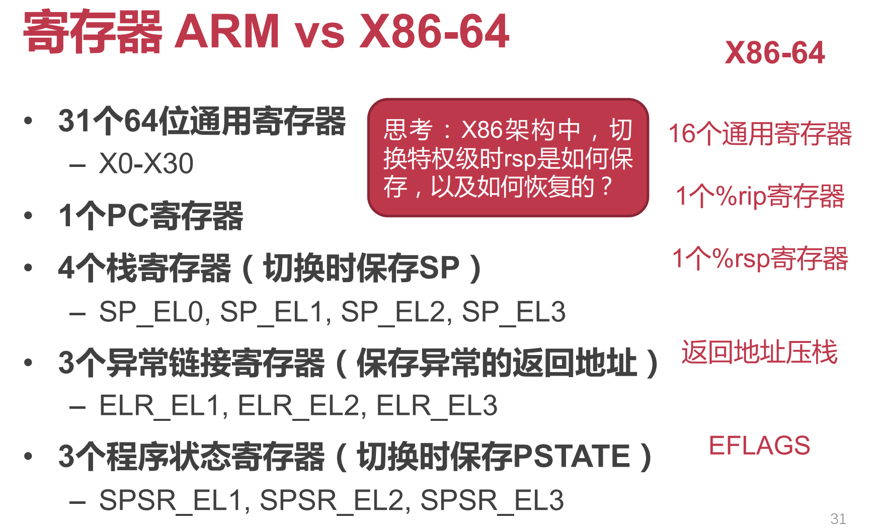
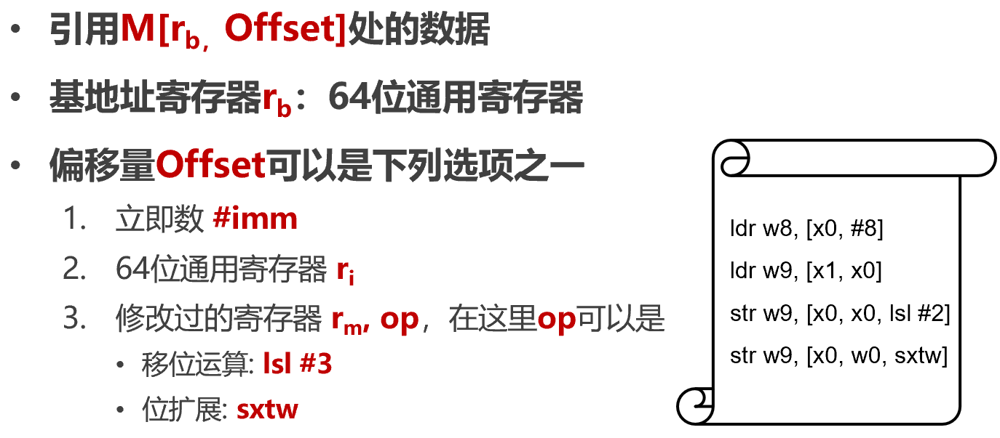
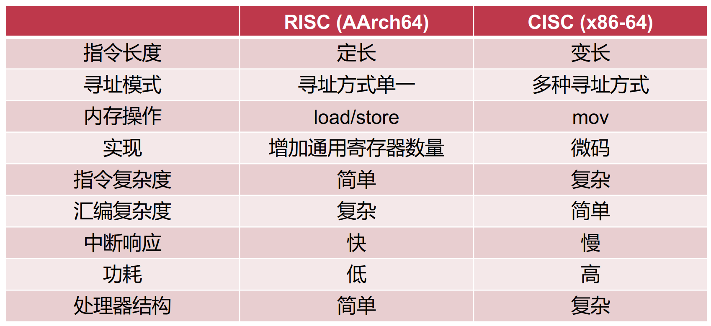

[TOC]

# ARM

ARMv4T、ARMv5TE：Thumb 16位指令集（对于嵌入式系统，内存小，可以用16位指令代码使得占用空间更小）

## AArch64（ARM architecture 64）

- PC（64-bit）指向**当前**执行的指令
- 指令长度相同 (RISC, **32-bit**)
- PC 会被跳转指令修改：B, BL, BX, BLX

### 寄存器

使用更多寄存器，以精简指令设计

SP（stack pointer），ELR（exception linkage register），SPSR（saved program state register）

**为什么4个栈寄存器，却只有3个异常链接寄存器？**

上一层出问题会给下一层处理（如用户态出错会给内核态处理）！因此异常链接寄存器只需要3个

**X86 中切换特权级（用户态内核态间切换）时候 rsp 如何保存，如何恢复？**

将 rsp 压栈，要恢复的时候从栈取出

### 寻址模式：基地址加偏移量

lsl #Num：移位运算（左移Num位，相当于乘以2的Num次方），用于如数组索引访存等

#### 寻址模式是表示内存地址的表达式

- 基地址模式（索引寻址）[rb]
- 基地址加偏移量模式（偏移量寻址）[rb, offset]
- 前索引寻址（寻址操作前更新基地址）[rb, offset]!           rb += Offset; **寻址**M[rb]
- 后索引寻址（寻址操作后更新基地址）[rb], offset           **寻址**M[rb]; rb += Offset

### 函数调用（caller 调用 callee）

#### 指令

- `bl label`     直接调用，调用函数

- `blr Rn`     间接调用，调用函数指针

#### 功能

- 将**返回地址**存储在**链接寄存器**LR (x30寄存器的别名，LR: Link Register)

- 跳转到被调用者的**入口地址**

### 特权级对比（Exception Level）

#### X86-64

- **Non-root（非虚拟化模式） :** Ring 3：Guest app，Ring 0：Guest OS

- **Root（虚拟化模式）**：Ring 3：App，Ring 0：Hypervisor

#### ARM（特权级：异常级别）

- EL0：跑应用程序
- EL1：跑操作系统
- EL2：跑虚拟机监控器
- EL3：负责普通世界与安全世界中的切换

AArch64 架构中，特权级被称为异常级别（Exception Level，EL），四个异常级别分别为 EL0、EL1、EL2、EL3，其中 EL3 为最高异常级别，常用于安全监控器（Secure Monitor），EL2 其次，常用于虚拟机监控器（Hypervisor），EL1 是内核常用的异常级别，也就是通常所说的内核态，EL0 是最低异常级别，也就是通常所说的用户态。

### 系统状态寄存器、系统控制寄存器等见PPT

### 地址翻译

NS：None secure

### 内存空间

#### X86-64

CR3：进程页表基地址

#### ARM

TTBR0_EL1：用户态页表基地址

TTBR1_EL1：内核态页表基地址

- 用户态和内核态之间地址隔离（使用不同的页表，切换时如果只有一个保存基地址寄存器，开销很大）

### 输入/输出

MMIO (Memory-mapped IO)

- 将IO设备地址映射到物理内存的特殊地址段，和访问内存使用相同的指令（复用ldr和str指令）
- 但是行为与内存不完全一样，会有副作用

PIO（Port IO）

- IO设备具有独立地址空间
- 使用特殊指令（如x86的in/out指令）

# RISC vs CISC

## RISC

- 固定长度指令格式
- 更多的通用寄存器
- Load/store 结构
- 简化寻址方式

## CISC

- 微码：实际上也会先转换为RISC指令（微码）才能在CPU上跑，而不是直接把CISC指令给CPU
