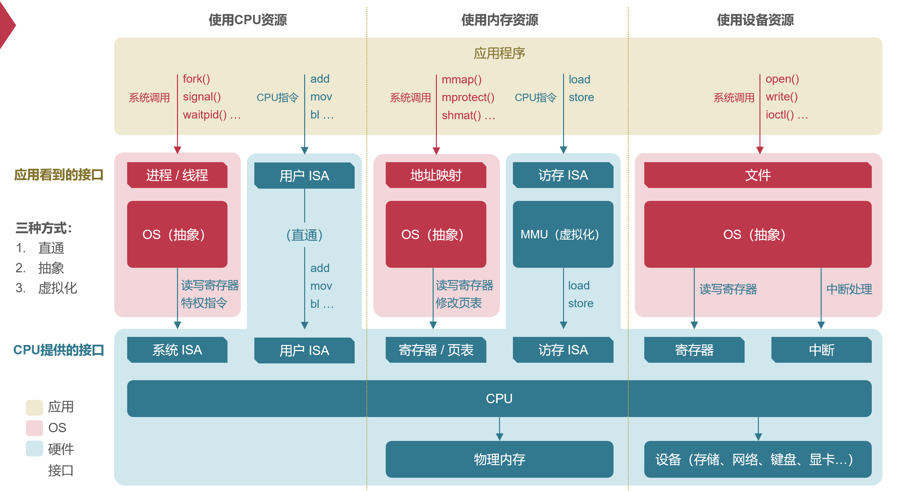
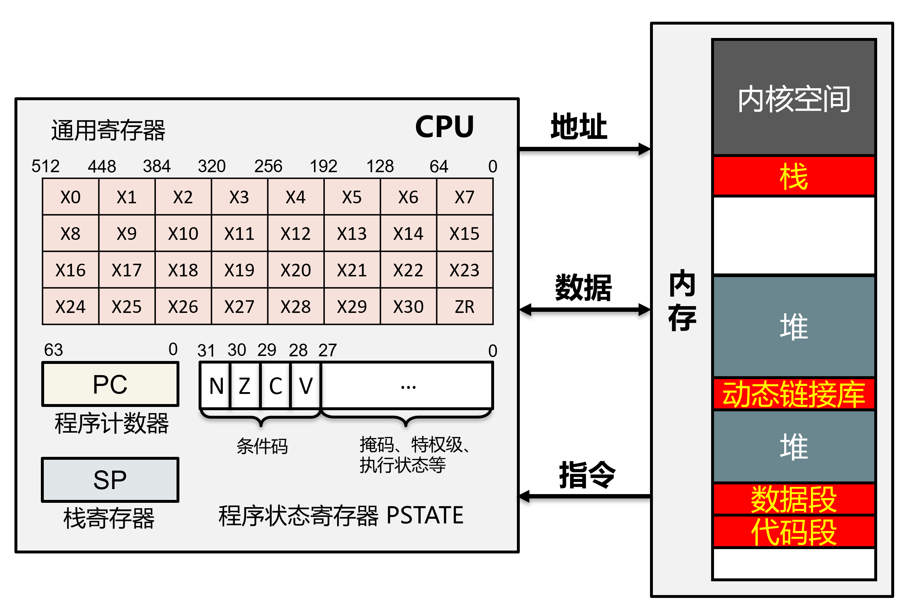
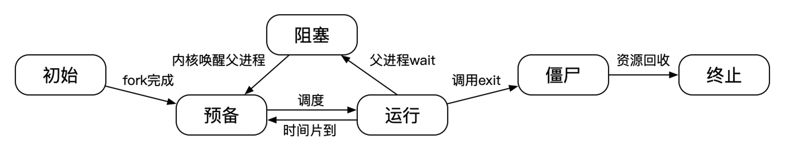

# 期末回顾

# 不同操作系统架构

简要结构（DOS），宏内核（Linux），微内核，外核，多内核

# 虚拟内存管理

成功把 `use` 和 `malloc` 分开的抽象设计

- VMA：VM Area
- `mmap`：将内存接口和文件接口进行转换
  - 本质上是一种方法，希望将新接口和旧接口打通

`kernel_merge_service`：内核自动把小页 merge 成大页

# 物理内存管理

DMA 访问物理地址

- 伙伴系统（buddy system）
- SLUB机制
- Swap与页替换策略
  - Thrashing Problem（换页策略不好导致的频繁换入换出）

# 进程与调度

**处理器上下文**

一个进程对曾经执行到什么状态的“记忆”

**进程的生命周期**

**进程的结构**

- 很多个 `process_ctx`：对应 CPU 的上下文，一个线程应该有一个，一个进程里面有多个
- 一个 `vmspace`：对应内存相应的虚拟地址空间，一个进程应该只有一个，多个线程共享

**进程的内核态执行：内核栈**

**调度**

MLFQ

# IPC

迁移线程：一个线程对应多个进程

# 同步

- 互斥锁：保证**互斥访问**
- 条件变量：提供**睡眠/唤醒**
  - 高频切换（拿锁换锁）还不如使用 busy loop，否则每次唤醒/睡眠开销很大
- 信号量：**资源**管理
- 读写锁：**区分读者**提高并行度

# 文件系统与崩溃一致性

FAT不支持硬链接：文件名存储在了文件的元数据里

# 设备与I/O

# 系统虚拟化

# 操作系统安全

侧信道攻击（无串通）和隐秘信道（串通）