# 操作系统 OS

硬件和应用之间的软件层

## 操作系统为应用提供的一些服务


## 操作系统对应用的管理


# 操作系统结构

**设计原则：策略与机制的分离**

- 策略（Policy）：要做什么 —— 相对动态

- 机制（Mechanism）：该怎么做 —— 相对静态

操作系统可仅通过调整策略来适应不同应用的需求

## 宏内核（Monolithic Kernel）：如 UNIX/Linux、Free BSD

整个系统分为内核与应用两层

- 内核：运行在特权级，集中控制所有计算资源
- 应用：运行在非特权级，受内核管理，使用内核服务
- 其间通过系统调用交互


## 微内核（Micro-Kernel）：如 Mach、L4、seL4、QNX、Google Fuchsia

**设计原则：最小化内核功能**

- 将单个功能从内核拆分出来，移到用户态，称为"服务"（Server）
- 内核仅保留极少功能，为这些服务提供通信（如进程间通信 IPC）等基础能力
- 在用户模块之间，使用消息传递机制通信


**性能较差：内核中的模块交互由函数调用变成了进程间通信**

## 混合内核架构：如 macOS / iOS、Windows NT

宏内核与微内核的结合

- 将需要性能的模块重新放回内核态
- macOS / iOS：Mach微内核 + BSD 4.3 + 系统框架
- Windows NT：微内核 + 内核态的系统服务 + 系统框架

## 外核+库OS（Exokernel **+** LibOS）

- 过度的硬件资源抽象会带来较大的性能损失
- 操作系统提供的硬件资源抽象是针对所有应用的通用抽象，对于一些具体的应用而言这些抽象往往不是最优的选择

**由应用来尽可能控制对硬件资源的抽象（应用可以选择最合适的库OS）。**

内核态：Exokernel（管理应用）【只负责实现硬件资源在多个库OS之间的多路复用，并管理这些库OS实例的生命周期】

用户态：libOS（服务应用）【封装了硬件的抽象，并与应用直接连接；开发者可以选择已有的适合的库OS，或选择自己开发】

- OS无抽象，能在理论上提供最优性能

### 外核架构（Exokernel）

**设计原则：将管理与保护分离**

- 不提供硬件抽象
- 不管理资源，只管理应用（负责将计算资源与应用的绑定，以及资源的回收；保证多个应用之间的隔离）

> 功能：
>
> 追踪计算资源的拥有权：安全绑定（Secure binding）
>
> ​	允许某个LibOS访问某些计算资源（如物理内存），并防止这些计算资源被其他LibOS访问
>
> 保证资源的保护：显式回收（Visible revocation）
>
> ​	显式告知应用资源的分配情况，应用在租期结束之前主动归还资源
>
> 回收对资源的访问权：中止协议（Abort protocol）
>
> ​	若应用不归还资源，则强制中止

### 库OS（LibOS）

- 策略与机制分离：将对硬件的抽象以库的形式提供
- 高度定制化：不同应用可使用不同的LibOS，或完全自定义
- 更高性能：LibOS与应用其他代码之间通过函数调用直接交互


## 单内核（Unikernel）

- 可以看做虚拟化环境下的LibOS
  - 每个虚拟机只使用内核态
  - 内核态中只运行一个应用+LibOS
  - 通过虚拟化层实现不同实例间的隔离

- 适合容器应用场景
  - 每个容器就是一个虚拟机
  - 每个容器运行定制的LibOS以提高性能

## 多内核/复内核（Multikernel）

将一个众核系统看成是由多个独立处理器核通过网络互联而成的分布式系统

思路

- 默认的状态是划分而不是共享
- 维持多份状态的copy而不是共享一份状态
- 显式的核间通信机制（提供一层基于进程间通信的抽象，从而避免处理器核之间通过共享内存进行隐式共享）

设计

- 在每个core上运行一个小内核（包括CPU、GPU等）
- OS整体是一个分布式系统
- 应用程序依然运行在OS之上


## 不同操作系统架构的对比


性能：外核＞宏内核＞微内核

**微内核与外核区别**

微内核：服务各个应用共享；内核中模块的交互由函数调用变为IPC

外核：一个库OS管理并直接服务于一个应用；系统调用又变回函数调用


# ARM

ARMv4T、ARMv5TE：Thumb 16位指令集（对于嵌入式系统，内存小，可以用16位指令代码使得占用空间更小）

## AArch64（ARM architecture 64）

- PC（64-bit）指向**当前**执行的指令
- 指令长度相同 (RISC, **32-bit**)
- PC 会被跳转指令修改：B, BL, BX, BLX

### 寄存器

使用更多寄存器，以精简指令设计


SP（stack pointer），ELR（exception linkage register），SPSR（saved program state register）

**为什么4个栈寄存器，却只有3个异常链接寄存器？**

上一层出问题会给下一层处理（如用户态出错会给内核态处理）！因此异常链接寄存器只需要3个

**X86 中切换特权级（用户态内核态间切换）时候 rsp 如何保存，如何恢复？**

将 rsp 压栈，要恢复的时候从栈取出

### 寻址模式：基地址加偏移量


lsl #Num：移位运算（左移Num位，相当于乘以2的Num次方），用于如数组索引访存等

#### 寻址模式是表示内存地址的表达式

- 基地址模式（索引寻址）[rb]
- 基地址加偏移量模式（偏移量寻址）[rb, offset]
- 前索引寻址（寻址操作前更新基地址）[rb, offset]!           rb += Offset; **寻址**M[rb]
- 后索引寻址（寻址操作后更新基地址）[rb], offset           **寻址**M[rb]; rb += Offset

### 函数调用（caller 调用 callee）

#### 指令

- `bl label`     直接调用，调用函数

- `blr Rn`     间接调用，调用函数指针

#### 功能

- 将**返回地址**存储在**链接寄存器**LR (x30寄存器的别名，LR: Link Register)

- 跳转到被调用者的**入口地址**

### 特权级对比（Exception Level）

#### X86-64

- **Non-root（非虚拟化模式） :** Ring 3：Guest app，Ring 0：Guest OS

- **Root（虚拟化模式）**：Ring 3：App，Ring 0：Hypervisor

#### ARM（特权级：异常级别）

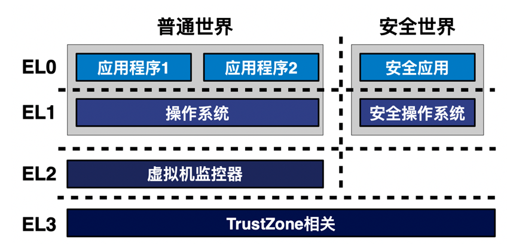

- EL0：跑应用程序
- EL1：跑操作系统
- EL2：跑虚拟机监控器
- EL3：负责普通世界与安全世界中的切换

AArch64 架构中，特权级被称为异常级别（Exception Level，EL），四个异常级别分别为 EL0、EL1、EL2、EL3，其中 EL3 为最高异常级别，常用于安全监控器（Secure Monitor），EL2 其次，常用于虚拟机监控器（Hypervisor），EL1 是内核常用的异常级别，也就是通常所说的内核态，EL0 是最低异常级别，也就是通常所说的用户态。

### 系统状态寄存器、系统控制寄存器等见PPT

### 地址翻译

NS：None secure

### 内存空间

#### X86-64

CR3：进程页表基地址

#### ARM

TTBR0_EL1：用户态页表基地址

TTBR1_EL1：内核态页表基地址

- 用户态和内核态之间地址隔离（使用不同的页表，切换时如果只有一个保存基地址寄存器，开销很大）

### 输入/输出

MMIO (Memory-mapped IO)

- 将IO设备地址映射到物理内存的特殊地址段，和访问内存使用相同的指令（复用ldr和str指令）
- 但是行为与内存不完全一样，会有副作用

PIO（Port IO）

- IO设备具有独立地址空间
- 使用特殊指令（如x86的in/out指令）

# RISC vs CISC


## RISC

- 固定长度指令格式
- 更多的通用寄存器
- Load/store 结构
- 简化寻址方式

## CISC

- 微码：实际上也会先转换为RISC指令（微码）才能在CPU上跑，而不是直接把CISC指令给CPU


# 中断、异常与系统调用

CPU执行逻辑：以PC值位地址从内存中获取一条指令并执行；但是执行过程中可能发生“异常”情况

希望尽量减少的切换：进程切换，用户态和内核态的切换......（对用户态而言这些切换并没有收益！只有开销）

## ARM的异常

- 同步异常：指令执行出现错误，比如除零或缺页
- 异步异常：外部设备触发中断

在ARM中这两种情况都叫做异常（与x86区分），都会导致CPU陷入内核态，并根据异常向量表找到对应的处理函数来执行；处理函数执行完后，执行流需要恢复到之前被打断的地方继续运行

## 操作系统对异常的处理

1. 对异常向量表的设置（CPU上电后立即执行，是系统初始化的主要工作之一；在开启中断和启动第一个应用之前）
2. 实现对不同异常（中断）的处理函数
   - 处理应用程序出错的情况（如除零、缺页）
   - 特殊的同步异常：系统调用（应用主动触发）
   - 外部设备的中断（收取网络包、获取键盘输入）

**内核自己运行出错怎么办？**

可恢复的：直接处理；不可恢复的：crush dump（留下遗言之后崩溃）


### 异常向量表

操作系统预先在一张表中准备好不同类型的异常处理函数（基地址存储在VBAR_EL1寄存器；处理器在异常发生时自动跳转到对应位置）

### 异常处理函数

- 运行在内核态：不受限制访问所有资源
- 处理器将异常类型存储在指定寄存器中（ESR_EL1），表明发生了哪种异常
- 异常处理函数根据异常类型执行不同逻辑
- 完成异常处理后
  - 回到发生异常时正在执行/下一条指令
  - 结束当前进程

### AArch64中断处理

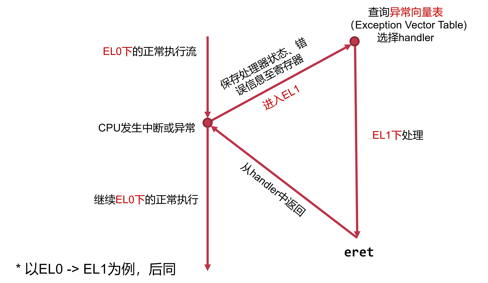

### ChCore异常处理

**ChCore异常向量表配置**

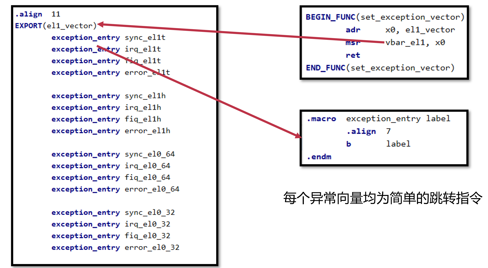

**ChCore异常处理**

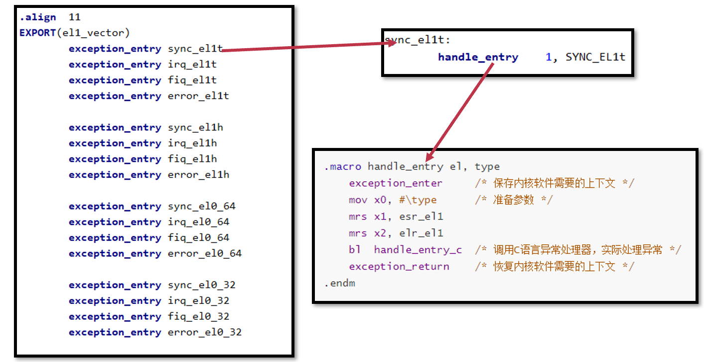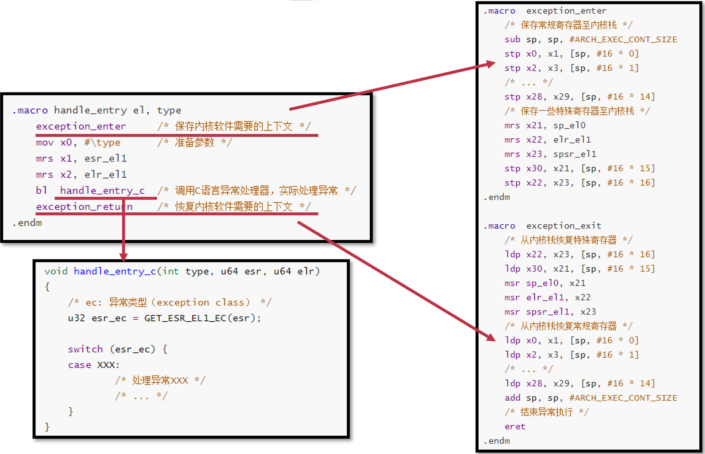

**ChCore的中断处理与时钟响应**


## 内核态与用户态的切换

### 处理器在切换过程中的任务

1. 将发生异常事件的指令地址保存在ELR_EL1中
2. 将异常事件的原因保存在ESR_EL1
   - 例如，是执行svc指令导致的，还是访存缺页导致的
3. 将处理器的当前状态（即PSTATE）保存在SPSR_EL1
4. 将引发缺页异常的内存地址保存在FAR_EL1
5. 栈寄存器不再使用SP_EL0（用户态栈寄存器），开始使用SP_EL1
   - 内核态栈寄存器，需要由操作系统提前设置
6. 修改PSTATE寄存器中的特权级标志位，设置为内核态
7. 找到异常处理函数的入口地址，并将该地址写入PC，开始运行操作系统
   - 根据VBAR_EL1寄存器中保存的异常向量表基地址，以及发生异常事件的类型确定

**操作系统为何不能直接使用应用程序在用户态的栈？**

用户态不可信，避免用户态在栈中恶意插入代码等，导致内核态出现问题

### 操作系统在切换过程中的任务

- 主要任务：将属于应用程序的 CPU 状态保存到内存中
  - 用于之后恢复应用程序继续运行
- 应用程序需要保存的运行状态称为处理器上下文
  - 处理器上下文（Processor Context）：应用程序在完成切换后恢复执行所需的最小处理器状态集合
  - 处理器上下文中的寄存器具体包括：通用寄存器 X0-X30；特殊寄存器，主要包括PC、SP和PSTATE；系统寄存器，包括页表基地址寄存器等

## 系统调用

`svc`（supervisor call）：从用户态进入内核态

`eret`：从内核态返回到用户态

参数传递：最多允许8个参数（x0-x7寄存器），x8用于存放系统调用编号，调用者保存的寄存器在用户态保存

返回值：存放在x0寄存器中

**内核自己能够调用 syscall 吗？**

可以，不需要换栈，直接调对应的处理函数就行

**为什么还要存放系统调用的编号，而不直接放到异常向量表里面？**

硬件无关：操作系统具体实现多少个系统调用与处理器无关，处理器只负责提供对应机制

额外开销：通过编号获取系统调用基地址，进行跳转

**寄存器参数放不下怎么办？**

内存传参：将参数放在内存中，将指针放在寄存器中传给内核，内核通过指针访问相关参数

- 指针指向内核区域，不安全
- 指针指向的区域被swap-out，导致内核访问的时候出现page fault
- 指针指向未映射区域，导致segmentation fault

**如何验证传过来指针的合法性（用户态恶意攻击）？**

检查判断是否在最大的VMA（通过mmap创建的虚拟内存空间）

### 优化：syscall 能否不要下陷（Trap）

#### vDSO（virtual dynamic shared object）

系统调用的时延不可忽略（尤其是在频繁调用的部分，比如 `gettimeofday()` ）；想要降低时延，希望不要用户态到内核态的模式切换（没有这种切换就不需要保存和恢复状态）

- 内核定义：在编译时作为内核的一部分
- 用户态运行：共享内存（将对应函数代码加载到一块与应用共享的内存页，这个页称为vDSO），用户态可读（只读），内核态可写（更新对应值）【类似生产者-消费者模式】

#### Flex-SC（flexible system call scheduling with exception-less system calls）

目的：进一步降低系统调用的时延（同时切换后内核态也污染了用户态本来用的cache），希望在不切换状态的情况下实现系统调用

思想：syscall的时候并不直接切换到内核，而是把所有syscall的参数放到一个和内核共享的页里面；内核通过共享页上的参数执行对应syscall，并把返回结果写在共享页上返回给用户

方式：新的syscall机制

- 引入 system call page，用户和内核共享
- 用户线程可以将系统调用请求参数 push 到 system call page（用户写）
- 内核态线程到 system call page pull 系统调用请求（内核读，内核写返回值）
- Exception-less syscall：将系统调用的调用和执行解耦，可以分不到不同的CPU核并行处理
- 一次性可以等很多系统调用堆积之后，再一次性让内核态线程 pull，实现批处理
- 用户和内核线程可以运行在不同CPU核上，没有切换带来的开销

适合的应用：如Apache服务器适合；同步调用变成异步调用，适合系统调用多的情况，可以提升吞吐量，不适合对时延敏感的应用

缺点：优化之后用户和内核线程在两个核（原本在同一个核，相互切换），内存访问时**对于 L1 L2 cache（cpu private）的利用变差**（本来 page 中参数刚放进缓存就被取出来，现在必须在page的level，因为cache不共用）；甚至如果在不同CPU的不同核上，就更大的读写内存开销，很难利用cache

# 系统初始化

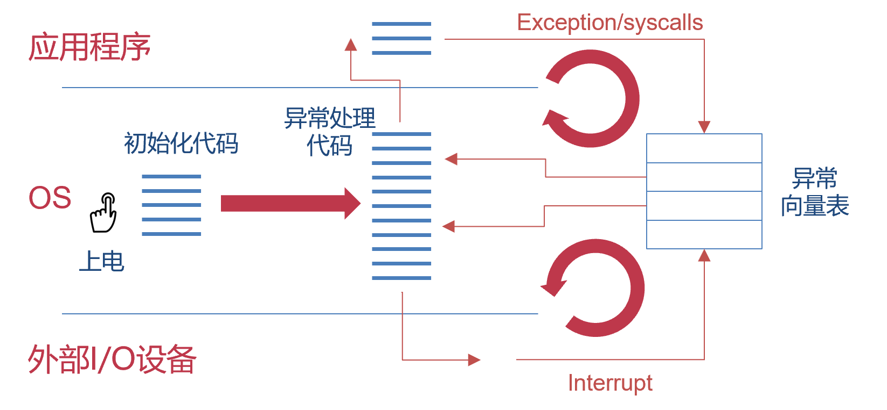

syscall 的本质：应用程序想要完成一些事情但是没有权限，需要**请求操作系统帮助**才能完成

## 计算机启动


## 内核启动的2个主要任务

- 任务-1：配置页表并开启虚拟内存机制，允许使用虚拟地址
  - 页表究竟改如何具体配置？
  - 难点：开启地址翻译的前一行指令使用物理地址，开启后立即使用虚拟地址，前后如何衔接？

- 任务2：配置异常向量表并打开中断，允许双循环
  - 异常向量表如何配置？
  - 打开后，异常处理的指令流如何流动？

## 内核代码的加载和运行

**需要用一段代码去初始化CPU，CPU在初始化之前运行不了代码**

树莓派上使用GPU（不需要自己初始化自己，开机后自己设置好，不需要软件代码初始化）先去运行第一行代码（GPU是树莓派自己做的，所以可以自己定义一套初始化流程；CPU是使用别人厂商的，那就需要用代码初始化）

### 入口函数位置

CPU从预定义的**RAM地址**读取第一行代码，由硬件厂商决定（树莓派：32位为0x8000，64位为0x80000，x86：0x7C00）

## ChCore 启动代码

- 设置CPU异常级别为EL1
- 设置初始化时的简单页表，并开启虚拟内存机制
  - TTBR0_EL1：虚拟地址 = 物理地址
  - TTBR1_EL1：虚拟地址 = 物理地址 + OFFSET
- 设置异常向量表
  - 每一个异常向量表项跳转到对应的异常处理函数
  - 处理异常前保存进程上下文、返回进程前恢复其上下文

**两个涉及到的目录：boot和kernel**

- boot目录：编译后放在 .init 段（可读可执行，只运行一次，可以在启动后被抛掉，节省一点点内存），低地址范围（有时也叫bootloader，再次注意不要混淆）
- kernel目录：编译后放在 .text 段（可读可执行），高地址范围

**PPT相关代码注解**

.lds.in 中的 . 表示当前“位置”地址，随着代码往里面添加，. 的值不断增大

寄存器名字中包含 _ELx 对应寄存器只能够在ELx的权限级下被访问

**初始化栈之前怎么bl和eret？**

- **ARM中只调用一层函数不需要栈（返回地址存寄存器LR，link register x30）**，当然多层调用中前面寄存器里放不下的函数返回地址进栈即可

**为什么调用C函数之前要设置栈**

- C不管这个函数是初始化还是在跑内核，因此函数调用时候会正常进行压栈（调用者被调用者保存寄存器等），为了调用C必须先初始化栈，也即在此之后就可以抛弃汇编

**start_kernel物理内存中实际上紧邻init（低地址），为什么可以跳到高地址段执行它？**

因为这之间完成了MMU物理地址到虚拟地址的转换（页表初始化）；物理空间中实际上离得很近，只是虚拟内存空间中两者地址相差比较大

### 页表初始化

- 对于ARM来说，整个虚拟地址空间中间是不用的（其实只用到了48-bit的地址，即16个0开头的地址和16个1开头的地址）
- TTBR1_EL1（16个1开头的地址的翻译）和TTBR0_EL1（16个0开头的地址的翻译）（页表基地址，显然只有内核能够访问页表基地址寄存器，故都是EL1）

**PPT相关代码注解**

boot_ttbr0_l0（l0代表第0级页表）

初始化部分：零级页表指向一级，一级指向二级

2M页的for循环：设置二级页表（2M大页，初始化时把所有内存都映射进来再说，之后再变成4K；也因此不需要初始化L3页表）

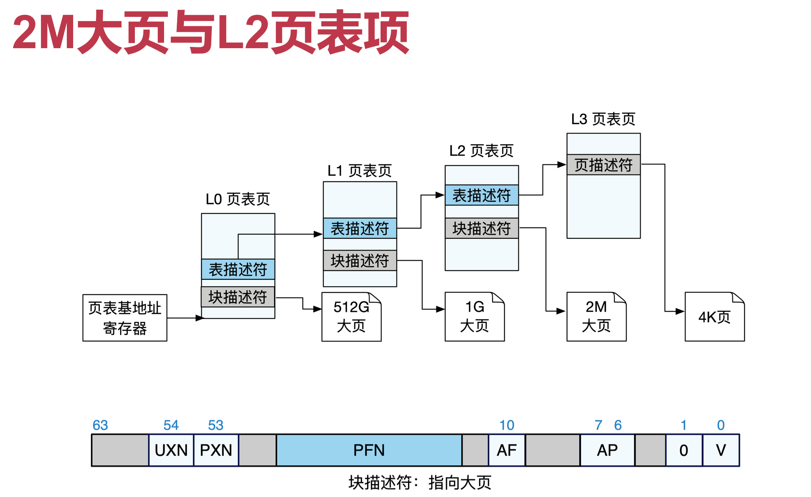

**映射设备地址时，为什么要设置DEVICE_MEMORY位（使其变为non-cachable）？**

- non-cachable：CPU访问内存时候不过cache，直接访问内存（对于volatile关键词）
- 设备内存：对应的memory不是真的memory，而是设备上的寄存器（在X86中有两个地址，一种是IO总线地址，另一种就是在物理内存上的地址），只不过是把这块的物理地址空间映射过去
- 这部分物理内存上的地址（对应设备上的寄存器）自己会变化（设备修改），如访问设备的时候需要轮询一个bit看其是否ready，那这个bit是设备修改，肯定不能存在缓存里，存在缓存就没有人改了

**设备内存和物理内存的区别？**

物理地址空间：设备地址（最顶部）和物理内存（从0开始）都会用到物理地址；也即即使你自己加内存条，也很可能因为原本物理地址空间顶上（再往上走）有设备地址，而无法扩展内存


设置TTBR1页表（高地址使用）：把TTBR1设置成和TTBR0一样的位置（映射到同样的物理地址区域），用不同的虚拟地址可以访问同一块物理地址

最终物理地址空间从0开始到物理内存区域结束，映射到低地址，映射到高地址（一块内存映射到两个地址）

页表设置后，开始翻译（enable 页表）


**尚未使用页表到打开页表后地址经过MMU翻译，为什么开启地址翻译的前一行指令使用物理地址，开启后立即使用虚拟地址，前后如何衔接？**

因为最底下这部分蓝色的物理内存地址和虚拟内存地址是一样的；PC的值加4之后，不管翻译还是不翻译，出来的地址结果都是一样的

### 异常向量表的初始化

el1_vector 异常向量表 中 调 syscall_table

## 内核启动前：BIOS（Basic Input/Output System）

BIOS负责计算机上电到内核开始运行（小芯片；许多PC都有这个硬件；嵌入式设备基本没有），通常保存在主板的只读内存（ROM）中，CPU负责执行BIOS（x86 CPU在reset后，PC固定指向0xFFFF0，0xFFFF0就是BIOS的物理地址，也就知道了BIOS在哪里）

- 上电后，开始执行BIOS ROM中的代码
  - 找到第一个可启动设备（如第一块磁盘），将可启动设备的第一个块（512字节，即MBR）加载到内存0x7c00中，跳转到bootloader的内存地址（物理地址0x7c00）并继续执行
- bootloader 开始执行
  - 将内核的二进制文件从启动设备加载到内存中（若内核文件是压缩包，则对其进行解压），跳转到（解压后的）内核加载地址（物理地址）并继续执行
- 内核代码开始执行

上电自检（POST，Power-On Self-Test）：BIOS程序首先检查，计算机硬件能否满足运行的基本条件；如果硬件出现问题，主板会发出不同含义的蜂鸣，启动中止。

主引导记录（MBR，Master Boot Record）：磁盘的0柱面0磁头0扇区称为主引导扇区（磁盘的第一块）；一个磁盘只能分四个主分区；包括三部分（主引导程序，硬盘分区表DPT，硬盘有效标志）

EFI / UEFI：Intel提出取代BIOS interface（为CPU提供软件配套）

## 两种启动的对比

- 定制化的主板（常见的ARM开发板，通常不再扩展其他设备）：树莓派等；初始化时有哪些硬件设备等都是知道的，一般厂商提供私有固件BSP（board support package）完成

- 通用的主板（常见如PC，通常需要再插入其他设备）：系统配置情况在开机的时候是不知道的，需要在启动的时候加入探测看看有哪些设备


# 虚拟内存

如何让OS与不同的应用程序（多用户多程序）都高效又安全地使用物理内存资源？

分时复用物理内存资源的话，切换时将全部内存写入磁盘开销太高；同时使用，各占一部分物理内存的话缺乏安全性和隔离性。

- IBM 360的内存隔离：Protection Key
  - 物理内存的旁边放了一组寄存器（内存被划分为2KB内存块，每个内存块有一个4-bit的key，保存在寄存器中）
  - 每一个进程也对应一个key，进程只能访问与其key一样的内存块！

**希望让应用看不见物理地址**（应用会因为其他应用的加载而受到影响；一旦物理地址范围确定，很难使用更大范围的内存，扩展性差；安全性上，应用可以通过自身内存地址猜测其他应用的位置）

**优势**

- 高效使用物理内存（资源有限）
- 简化内存管理（每个进程看到的是统一的线性地址空间，不用担心别的进程在干什么）
- 更强的隔离性和更细粒度的权限控制

## 虚拟地址

- 地址翻译（物理地址可以不连续，但是在虚拟地址中可以体现为连续）
- 支持隔离（不同进程虚拟地址空间不同）

## 虚拟内存的组织：分段与分页

### 分段


- 翻译时一个虚拟地址（段内地址）需要加上起始地址（根据段号找到）得到物理地址
- 每个进程都可包含代码段、数据段等，与进程自身的内存布局相匹配

**分段机制问题**

- 本段长度有限制
- 对物理内存有连续性要求（如堆和栈），需要预留空间
  - 内存利用率低（外部和内部碎片）

### 分页


粒度恒定的分段机制

- 页表包含多个页表项，存储物理页的页号（虚拟页号为索引）
- 物理内存离散分配，大大降低对物理内存的连续性要求，减少碎片

## ARM64 的页表格式

### 多级页表

- 有效压缩页表的大小
- 允许页表中出现空洞（某级页表中的某条目为空，那么该条目对应的下一级页表无需存在；应用程序的虚拟地址空间大部分都未分配）

**多级页表什么时候不如单级页表**

占满的时候。前面几级页表都浪费了，并且查找的时候很慢。

### AARCH64 体系结构下4级页表


### 虚拟地址解析

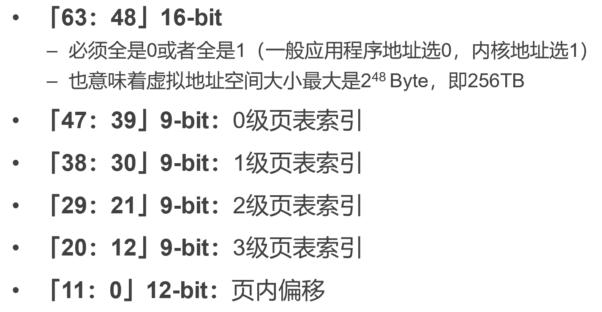

### 页表基地址寄存器


### Level 3 页表项


### Level 0，Level 1，Level 2 页表项


**什么时候应该用大页？**

大数据的场景，更少的TLB miss

## TLB：地址翻译的加速器，页表的cache（不是页表页传统数据通路走的那个内存的cache）

- TLB位于CPU内部，是**页表的缓存**
  - Translation Lookaside Buffer
  - 缓存了虚拟页号到物理页号的映射关系
  - **有限数目**的TLB缓存项

- 在地址翻译过程中，MMU首先查询TLB
  - TLB命中，则不再查询页表 （**fast** **path**）
  - TLB未命中，再查询页表

TLB一个一个查，非常慢

TLB难以再提升性能！随着内存越来越大（页表也随之变大），出现与内存不match的情况（两者性能变大斜率不一致！）

### TLB清空：TLB Flush

切换进程（虚拟地址空间变化，页表也会相应换掉）的时候就要清空TLB；在现有知识体系下，内核和用户态之间发生切换不需要清空TLB（内核和应用程序在同一个地址空间里面，地址空间没有发生变化）

- TLB 使用虚拟地址索引
  - 当OS切换页表时需要全部刷掉
- AARCH64上内核和应用程序使用不同的页表
  - 分别存在TTBR0_EL1和TTBR1_EL1
  - 系统调用过程不用切换
- x86_64上只有唯一的基地址寄存器
  - 内核映射到应用页表的高地址
  - 避免系统调用时TLB清空的开销

#### 降低TLB清空导致的开销

- 新的硬件特性ASID（Address Space ID）：OS为不同进程分配8或16位的ASID，将其填写在TTBR0_EL1的高位。TLB每一项头上也加上ASID。在切换进程的时候就不需要清空TLB（同一个虚拟地址不同进程，ASID不一样；使用TLB条目时候检查ASID是否匹配）
  - 缺点：如果有8位，只能256个进程

> **注意：TLB是页表映射的cache，和页表内存页的cache（通常说的缓存）完全不一样！！！**

**OS修改页表后，需要刷掉其它核的TLB吗？**

如果别的核和当前核跑的同一个进程的不同线程（并且属于这个页表），要刷

**OS如何知道需要刷掉哪些核的TLB？**

操作系统要知道进程调度信息（当前改的页表属于哪个进程，看看别的核有没有跑这个进程）

**OS如何刷掉其它核的TLB？**

- x86_64: 发送IPI（CPU核向别的CPU核发出的中断）中断某个核，通知它主动清空

- AARCH64: 可在local CPU上清空其它核TLB
  - 调用的ARM指令：TLBI ASIDE1IS

**内存和CPU一定是CPU缓存中的数据更新吗（内存比CPU的数据更新的模式）？**

- 磁盘（外设）直接修改内存（如DMA，磁盘直接访问DRAM），此时就不经过CPU（CPU对此磁盘改了内存不知情），内存的cache（在CPU中）就失效了
- DMA对应的memory应当设置为non-cacheable，也即不让其被缓存！显然这会导致频繁读写时性能不高（因为没有cache导致），可以通过将这块non-cacheable的内存拷贝到cacheable的内存部分（不会多出拷贝的操作，因为总之需要进行copy to user，应用程序用这块内存不可能访存到在OS中的地址空间）来解决

- DMA在OS中通常是特定的一块内存（比cache更新）；DMA常常用作和IO设备交互的memory


## 虚拟内存：段和VMA

**应用程序有自己独立的虚拟地址空间，那直接拿指针一点一点遍历自己的地址空间，可以做到吗？**

不能。虽然是自己的虚拟地址空间，但并不是应用程序都能直接用，会存在空洞！！！除了代码段和栈等，其它必须要先malloc声明某一段虚拟地址区域自己要用，才能访问。

- OS采用**段**来管理虚拟地址
  - 段内连续，段与段之间非连续
  - 合法虚拟地址段：代码、（只读）数据、堆、栈
  - 非法虚拟地址段：未映射（一旦访问，则触发segfault）

**为什么要使用段来管理？**

因为段的数量比页要少很多，通常每一段都有相同的属性，比如只读、可执行等等，可简化管理

**malloc的时候不会真的分配物理地址！只有VMA发生变化；页表不会发生变化**

### <u>VMA：合法虚拟地址信息的记录方式</u>（OS记录应用程序已分配的虚拟内存端）

- 记录应用程序已分配的虚拟内存区域
  - 在Linux中对应 vm_area_struct（VMA）结构体


#### VMA是如何添加的

- 途径1: OS在创建应用程序时分配（数据（对应ELF段），代码（对应ELF段），栈（初始无内容））
- 途径2: 应用程序主动向OS发出请求
  - `brk()`（扩大、缩小**堆**区域）：可选策略，OS也可以在创建应用时分配初始的堆VMA；**并不是让OS给堆分配更多的物理内存资源！只是虚拟内存地址空间**
  - `mmap()` ：申请一段空的虚拟内存区域，申请映射文件数据的虚拟内存区域（把文件整体映射到内存的某个区域，这样读这个文件就不需要read，write这样的syscall，而直接像访问内存一样访问这个文件即可；匿名映射即指不需要这样一个文件的存在，也可以做这种映射）

- 用户态的malloc会改变VMA
  - 通常是调用brk，在堆中分配新的内存
  - 部分实现也可以调用mmap，由应用管理多个VMA

#### mmap：分配一段虚拟内存区域


该操作并**没有做任何物理内存的分配**！！整个系统里唯一变化的是VMA。访问该新区域会出发page fault，并填充页表。

**VMA和页表是否冗余？**

不冗余。VMA记录的这块区域不一定有页表映射！（VMA覆盖面更大）。如果用立即映射，VMA和页表覆盖范围一致，此时VMA唯一的作用可能仅仅是快速判断。如果是延迟映射，就很需要！

#### <u>页表填写策略</u>

**操作系统何时为应用程序填写页表？**

- **<u>立即映射</u>**：每个虚拟页都对应了一个物理内存页

- **<u>延迟映射</u>/按需调页（Demand Paging）**：有些虚拟页不对应任何物理内存页

  - 对应的数据在磁盘上

  - 没有对应的数据（初始化为0）（如 `mmap` 凭空映射一块区域）

  - 可以节约内存资源，但是缺页异常会导致访问延迟增加

    - 如何取得平衡？

      应用程序访存具有时空局部性（Locality）

      在缺页异常处理函数中采用预取（Prefetching）机制（猜测locality，多取并初始化一些页）

      即节约内存又能减少缺页异常次数

#### mmap的流程

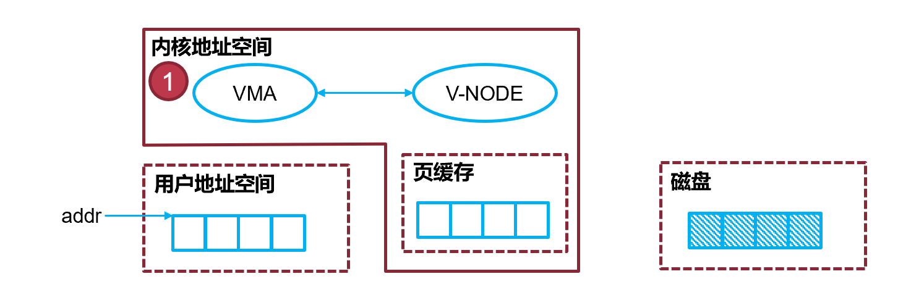

调用mmap映射文件时，内核中会为mmap的区域创建一个vma，并且将对应标识文件的内核对象V-NODE与这个vma绑定。此时这块区域的页表中并没有对应任何物理页。

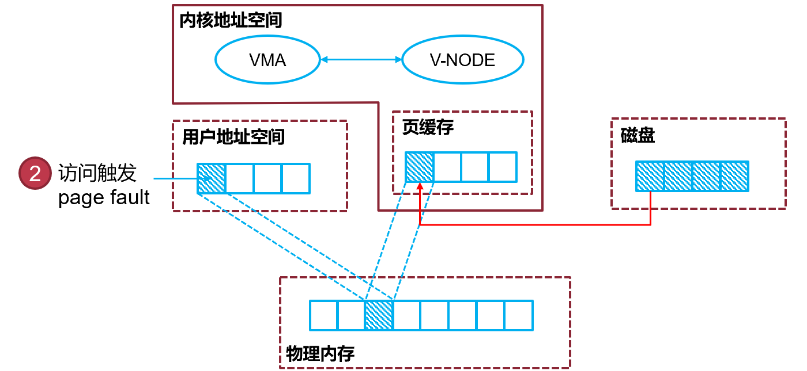

当访问这块内存时，会触发 page fault，内核会检查 fault 地址，发现其对应的 vma 绑定了一个 v-node，就会从磁盘读取对应的页内容到页缓存，并将页缓存与用户地址空间的内容映射到同一个物理页。


对于mmap内存区域的写会直接修改页缓存中的内容。

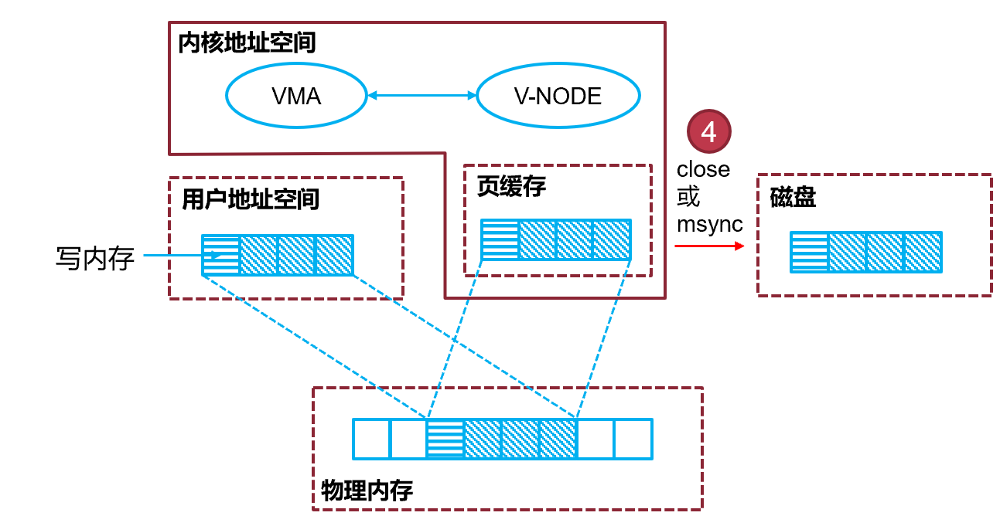

当文件被关闭或调用msync时，页缓存中修改的数据会被刷回磁盘。

- Prefault
  - 每次 page fault 载入连续的多个页，减少 fault 次数
- MAP_POPULATE
  - 通过一个包含 MAP_POPULATE 的 flags 参数，可以在调用 mmap 时就预取所有的页，此后访问不会 fault

#### 缺页异常（Page Fault）

- CPU的控制流转移
  - CPU陷入内核，找到并运行相应的异常处理函数（handler）
  - OS提前注册缺页异常处理函数

- x86_64
  - 异常号 #PF （13），错误地址存放在CR2寄存器

- AARCH64
  - 触发（通用的）同步异常（8）
  - 根据ESR信息判断是否缺页，错误地址存放在FAR_EL1（作用类似于x86中的CR2）

##### 缺页异常的三种可能

1. 访问非法虚拟地址【非法】
2. 按需分配（尚未分配真正的物理页）【合法】
3. 内存页数据被换出到磁盘上【合法】

> 用VMA来区分。第一种，不在VMA区域；第二种和第三种，在VMA区域

> 区分后两种的思路是：
>
> 记住有哪些页被换出，比如hash表可以解决。
>
> 更简单的方法：通过页表项某些位是否为NULL进行区分。（OS自己定义规则：NULL代表非法，非NULL代表swap）

**2与3如何区分？**

在页表项PTE中设一位来表示

**如何判断缺页异常的合法性？**

不落在VMA区域，则为非法


**mmap匿名映射与文件映射的区别是什么？**

匿名映射的背后没有文件

没有backup file，内存的初始值从哪里来？0

**如果OS仅采用立即映射，还需要VMA么？**

VMA记录的信息和页表记录的信息有何不同？

VMA只记录虚拟地址的范围，而页表还记录了和物理地址的映射

**demand-paging是否可通过网络来实现？**

如果都通过网络，本地是否还需要磁盘？

可以通过网络，不需要磁盘，实现无盘工作站（现代网卡可以做到比磁盘快，因而相较于放到本地的磁盘，更愿意放到远端机器的内存中)

**什么时候会修改页表？**

1. 触发page fault的时候（比如demand paging的时候，此时不需要flush TLB，是添加条目）
2. 换页的时候（删除某条目，需要flush TLB）
3. 删除一个进程的时候，页表项都会被删掉

## 虚拟内存的扩展功能

- 共享内存
  - 节约内存，如共享库
  - 进程通信，传递数据
- 写时拷贝（copy-on-write）
  - 实现
    - 修改页表项权限
    - 在缺页时拷贝与恢复
  - 如fork时（可以节约物理内存，并且性能加速）
- 内存去重
  - OS做，对用户态透明
  - 在内存中扫描找相同内容的物理页面，并执行去重合并
  - 同一块内存映射到不同虚拟地址空间
- 内存压缩
  - 内存不足时，将不大使用的内存压缩/放到硬盘中

**什么情况可以不用虚拟内存**

- 物理内存足够多，远远大于应用程序需求（没必要再有这些额外的开销）
- 在目前的64位地址下，其实可以做到随便分配，为每一个应用程序分足够大的地址空间，并且不重叠
- 如果只用物理内存，不适合多用户，适合单用户

**如果不依靠 MMU，是否有可以替换虚拟内存的方法？**

- 基于高级语言实现多个同一个地址空间内运行实例的隔离

- 基于编译器插桩实现多个运行实例的隔离（访问的时候检查，是不是分配给自己的地址空间）

# 物理内存管理

OS职责：分配物理内存资源

引入虚拟内存后，物理内存分配主要在以下四个场景出现：

1. 用户态应用程序触发on-demand paging（延迟映射）时
   - 此时内核需要分配物理内存页，映射到对应的虚拟页
2. 内核自己申请内存并使用时
   - 如用于内核自身的数据结构，通常通过 `kmalloc()` 完成
3. 内核申请用于设备的DMA缓存时
   - DMA缓存通常需要连续的物理页（一般而言设备没有页表，只能直接访问物理内存；因为MMU在CPU中，设备自己并没有MMU，也即无法进行地址翻译）
4. 发生换页（swapping）时（物理内存不够）
   - 通过磁盘来扩展物理内存的容量


- 应用调用malloc，如果不是立即映射，唯一改动的是VMA，虚拟地址对应的页表项没有发生变化，valid bit可能依然是0
- 如何找到物理页，就需要物理内存的管理！
  - `alloc_page()` 简单分配物理页面的实现
    - 分配时，通过bitmap查找空闲物理页，并在bitmap中标记非空闲
    - 回收时，在bitmap中，把对应的物理页标记成空闲

> 没有被使用 ≠ 没有被映射 （可能被内核映射）

物理内存分配需求：需要能够分配连续的4K物理页（如大页、场景-3DMA）

## 内存碎片（外部碎片与内部碎片）

### 物理内存分配器指标

1. 资源利用率
2. 分配性能

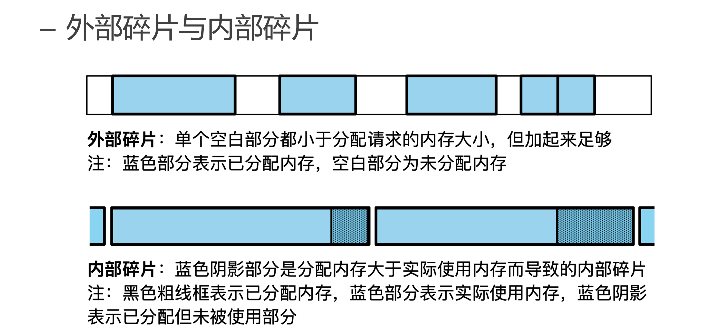

## 伙伴系统（buddy system）：以页为粒度的物理内存管理（最细的粒度就是一页 4K）


合适的大小是 16K，因此首先查找第2条（2^2）空闲链表，如果链表不为空， 则可以直接从链表头取出空闲块进行分配。但是，在这个例子中，该链表为空， 分配器就会依次向存储更大块的链表去查找。由于第 3 条链表不为空，分配器就从该链表头取出空闲块（32K）进行分裂操作，从而获得两个 16K 大小的 块，将其中一个用于服务请求（这里不再需要继续向下分裂），另一个依然作为空闲块插入到第 2 条链表中。若再接收到一个大小为 8K 的分配请求，分配器则会直接从第 1 条链表中取出空闲块服务请求。之后，继续接收到一个大小为 4K 的分配请求，分配器则会取出第 2 条链表中大小为 16K 的空闲块进行连续分裂，从而服务请求。释放块的过程与分配块的过程相反，**分配器首先找到被释放的块的伙伴块，如果伙伴块处于非空闲状态，则将被释放的块直接插入对应大小的空闲链表中，即完成释放；如果伙伴块处于空闲状态，则将它们两个块进行合并，当成一个完整的块释放，并重复该过程。**

### 如何定位伙伴块

**高效地找到伙伴块**

- 互为伙伴的两个块的物理地址**仅有一位**不同，而且块的**大小决定**是哪一位

**例如：**

- 块A（0-8K）和块B（8-16K）互为伙伴块

- 块A和B的物理地址分别是 0x0 和 0x2000

- 仅有第13位不同，块大小是8K（213）


- 分配物理页/连续物理页（2^n），直接映射物理页物理地址与虚拟地址
- 大大提升资源利用率，可以把外部碎片程度降低（不能保证完全没有！）

### 性能

分配 `O(1)`：在链表数组中直接找，找到就分配；否则需要split，复杂度会稍高一些

合并 `O(logn)`：最坏情况应该需要从底到顶

### 代码实现见PPT

## 映射与使用（细节及图见 2023.3.7 视频）

> 映射 ≠ 使用

- 用户态：物理内存一旦map了，一定被use；use了，不一定map了
- 内核态：物理内存map了，不一定use

一块物理内存可能有多个虚拟地址（映射了，但是没有真的使用！）

内核在任何时刻都能访问所有的memory（都映射了，但是有很多地方没有用）

> triple fault：内核触发 page fault 嵌套三次之后就会 panic（人为规定）

## SLAB/SLUB/SLOB**：**细粒度内存管理（内核自己数据结构等要内存的时候用，而不是用户态）

目标：**快速分配小内存对象**（内核中数据结构大小远小于4K，如VMA），为上层内核的 `kmalloc()` 接口提供实现

### SLUB 分配器

**观察：**操作系统频繁分配的对象大小相对比较固定（make the common things fast）

**思想：**

- **从伙伴系统获得大块内存**（可以是4K，8K等等，名为slab）
- 对每份大块内存进一步细分成固定大小的小块内存进行管理
- 块的大小通常是 2^n 个字节（一般来说，3 ⩽ n < 12）
- 也可为特定数据结构增加特殊大小的块，从而减小内部碎片（如经常分配60字节大小的数据结构，就增加60字节大小的块）

**设计：**不同字节大小的资源池（分不同大小如 32字节，64字节，128字节，......的池，每个池中有很多该大小的块）

- 只分配固定大小块

- 对于每个固定块大小，SLUB 分配器都会使用独立的内存资源池进行分配

- 采用 **best fit** 定位资源池
  - 从全部空闲内存块中找出能满足要求
     且大小最小的空闲内存块

**初始化：**把从伙伴系统得到的大的连续物理页（4K或更大）**划分成若干等份**（slot）

**空闲链表（next_free）：**当分配时直接分配一个空闲slot

**如何区分是否空闲？**采用空闲链表（直接在 free 的内存块里面放指针 next_free，指向下一个空闲的块；刚好利用了空闲块的区域）

**分配：**分配N字节时，首先找到大小最合适的SLAB，取走Next_Free指向的第一个；释放时直接放回Next_Free后

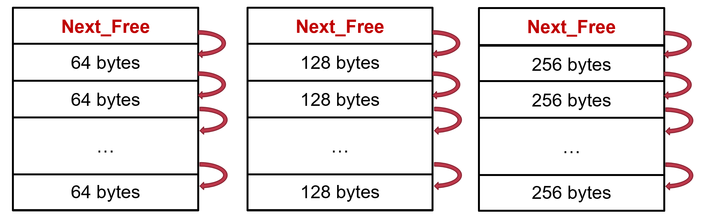

**释放：**

**释放时如何找到Next_Free？**

SLAB大小是固定的，因此可以根据object地址计算SLAB起始地址

ADDR & ~(SLAB_SIZE-1)

**上述方法在kfree(addr)接口下可行吗？**

问题：没有size信息，无法判断addr是被slab分配的，还是伙伴系统分配的

解决方法：在物理页结构体中记录所属slab信息

**新增SLAB：**

**当64字节slot的SLAB已经分配完怎么办？**

再从伙伴系统分配一个SLAB（初始化成64字节的）

**以前的64字节slot的SLAB有一些被释放掉，新分配的一边还没有用完，之后再malloc应该从哪分配？**


- current：当前正在使用的SLAB在什么地方（分配内存时从此处分配）
- partial：指向Next_Slab链表（current所有都被分配完之后，对应SLAB会被挪到partial，partial会从里面选一个有被释放空间的SLAB挪到current；partial也都全满了就从buddy system要一个新的；partial里面某一个全是free的，就还给伙伴系统）

**优势：**

1.减少内部碎片（可根据开发需求额外增加特殊大小）

2.分配效率高（常数时间）：分配与释放的时间复杂度 O(1)

## 突破物理内存容量限制（换页）

### 换页 Swapping（mechanism）

- **换页的基本思想**
  - 用磁盘作为物理内存的补充，且对上层应用透明
  - 应用对虚拟内存的使用，不受物理内存大小限制

- **如何实现**
  - 磁盘上划分专门的Swap分区，或专门的Swap文件
  - 在处理缺页异常时，触发物理内存页的换入换出


**导致缺页异常的三种可能**

1. 访问非法虚拟地址【非法】
2. 按需分配（尚未分配真正的物理页）【合法】
3. 内存页数据被换出到磁盘上【合法】

**OS如何区分？**

- 利用VMA区分是否为合法虚拟地址（合法缺页异常）【1与2、3】

- 利用页表项内容区分是按需分配还是需要换入【2与3】
  - 通过页表项 PTE（64bit）
    - Valid bit：第一位为0，硬件知道是 page fault
    - 加一个 is_swap bit（是否是换页）
    - 后面放在磁盘中的地址（剩下62个bit）


<u>**应用进程地址空间中的虚拟页可能存在四种状态**</u><u>（应用进程访问某虚拟页时，操作系统会分别做什么）</u>

1. 未分配（seg fault）
2. 已分配但尚未为其分配物理页（page fault，调用 alloc_page 从伙伴系统分配物理内存页）
3. 已分配且映射到物理页（直接访问）
4. 已分配但对应物理页被换出（换入，之后再访问）

**何时进行换出操作**

- 当用完所有物理页后，再按需换出
  - 回顾：alloc_page，通过伙伴系统进行内存分配
  - 问题：当内存资源紧张时，大部分物理页分配操作都需要触发换出，造成分配时延高

- 设立阈值，在空闲的物理页数量低于阈值时，操作系统择机（如系统空闲时） 换出部分页，直到空闲页数量超过阈值
  - Linux Watermark：高水位线、低水位线、 最小水位线

**<u>应用程序malloc之后，给它分配了多少内存？</u>**

没有分配！只有访问之后才会分配！！但是实际场景下可能会分配一些（接着估计就是memset等别的操作）


#### 换页机制的代价

- 优势：突破物理内存容量限制
- 劣势：缺页异常+磁盘操作导致访问延迟增加

**如何取得平衡？**

- 预取机制 （Prefetching），预测接卸来进程要使用的页，提前换入；在缺页异常处理函数中，根据应用程序访存具有的空间本地性进行预取

### 换页策略（policy）：如何选择哪个页会被换出

- **OPT 最优策略：**优先换出未来最长时间内不会再访问的页面（先知，不可能实现，用于做性能对比的基准）

- **FIFO 策略（先进先出）：**操作系统维护一个队列用于记录换入内存的物理页号，每换入一个物理页就把其页号加到队尾，因此最先换进的物理页号总是处于队头位置

  - Belady’s Anomaly：FIFO 带来的问题，硬件资源（物理页数量）变多，某些情况下性能可能会变差！！

- **Second Chance 策略**（FIFO 策略的一种改进版本，多一条命）：为每一个物理页号维护一个访问标志位。如果访问的页面号已经处在队列中，则置上其访问标志位。换页时查看队头：1）无标志则换出；2）有标志则去除并放入队尾，继续寻找

  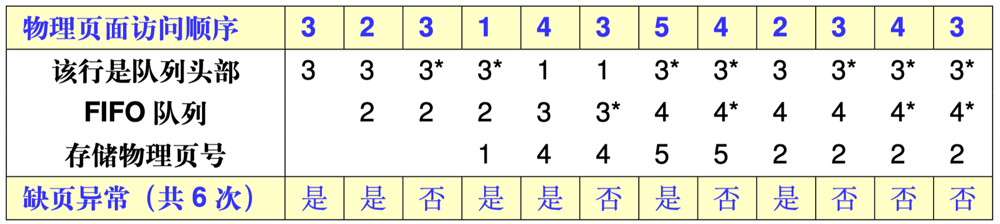

- **LRU 策略（踢走最不常用的）**（很难实现）：OS维护一个链表，在每次内存访问后，OS把刚刚访问的内存页调整到链表尾端；每次都选择换出位于链表头部的页面

  

  缺点-1：对于特定的序列，效果可能非常差，如循环访问内存

  缺点-2：需要排序的内存页可能非常多，导致很高的额外负载

- **时钟算法策略**（LRU 平替）：精准的LRU策略难以实现，时钟算法硬件友好

  - 物理页环形排列（类似时钟）
    - 为每个物理页维护一个访问位
    - 当物理页被访问时， 把访问位设成T
    - OS依次（如顺时针）查看每个页的“访问位”
      - 如果是T，则置成F
      - 如果是F，则驱逐该页
  - 每个**物理页**需要有一个“访问位”
    - MMU在页表项里面为**虚拟页**打上“访问位”
    - 回顾：页表项中的Access Flag
  - 实现（想要把物理页踢走，直接看物理地址）
    - OS在描述物理页的结构体里面记录页表项位置（如何根据物理页找到对应PTE？）
      - 当物理页被填写到某张页表中时，把页表项的位置记录在元数据中（在Linux中称为“反向映射”：**reverse** **mapping**）（是一个list，可能有很多PTE映射到对应物理页）
      - 根据物理页对应的页表项中的“访问位”判断是否驱逐
      - 驱逐某页时应该清空其对应的大部分页表项（例如共享内存）

#### 替换策略评价标准

- 缺页发生的概率 （参照理想但不能实现的OPT策略）

- 策略本身的性能开销

  - 如何高效地记录物理页的使用情况？

    页表项中Access（CPU在读内存的时候写一次页表项PTE，即会写一次内存）/Dirty Bits 

### 颠簸现象 Thrashing Problem

- 直接原因：**过于频繁的缺页异常**（物理内存总需求过大）**<u>（如果经常被使用的内存页被换走，会导致其频繁的刚换进又换出）</u>**

- 大部分 CPU 时间都被用来处理缺页异常
  - 等待缓慢的磁盘 I/O 操作
  - 仅剩小部分的时间用于执行真正有意义的工作

- 调度器造成问题加剧
  - 等待磁盘 I/O导致CPU利用率下降
  - 调度器载入更多的进程以期提高CPU利用率
  - 触发更多的缺页异常、进一步降低CPU利用率、导致连锁反应

### 工作集模型（有效避免Thrashing）

统计一段时间访问的内存都是哪些，猜测下一段时间也是用这一段内存；看这一块的使用频繁程度，换页的时候要么全部留下，要么一起换走

- 一个进程在时间t的工作集W(t, x)：
  - 其在时间段（t - x, t)内使用的内存页集合
  - 也被视为其在未来（下一个x时间内）会访问的页集合
  - 如果希望进程能够顺利进展，则需要将该集合保持在内存中
- 工作集模型：All-or-nothing
  - 进程工作集要么都在内存中，要么全都换出
  - 避免thrashing，提高系统整体性能表现


# 进程、线程与纤程（协程）

## 进程

**进程是计算机程序运行时的抽象**

- 静态部分：程序运行需要的代码和数据
- 动态部分：程序运行期间的状态（程序计数器、堆、栈……）
- **进程具有独立的虚拟地址空间**，每个进程都具有“独占全部内存”的假象
- 内核中同样包含内核栈和内核代码、数据

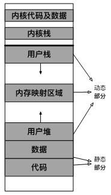

### 进程控制块（PCB，process control block）：户口本

如何表示进程（元数据），包括：

- 独立的虚拟地址空间（进程的标志性特征）
- 独立的执行上下文（表明进程具有独立的执行能力）

> 进程控制块存储在内核态，因为它由内核管理，不应被用户态的程序访问

### 进程管理（管理进程生命周期）

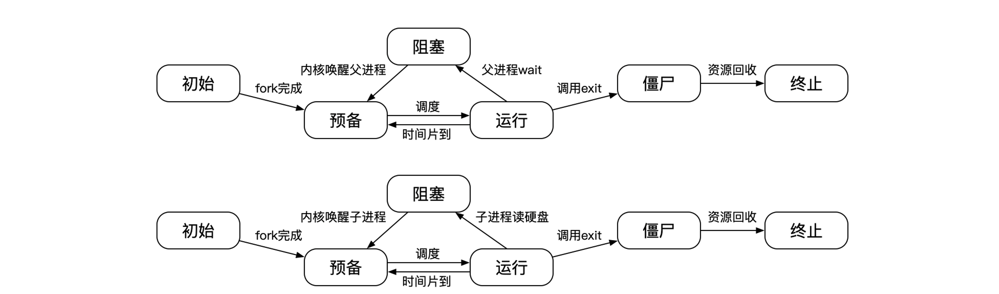

- 预备：随时可以被调度运行的状态
- 调度：调度器从预备的list中挑选进程来运行，对应进程转为运行状态
- exit：运行中的进程调用exit，变为zombie（僵尸态）
- wait：进程想要一些资源，但是此刻尚不能满足，进入阻塞状态等一段时间，直到有资源了再恢复为预备状态
- 时间片到：来了一个时钟中断，内核态看当前进程运行的时间是否用完，用完了就从预备队列list里面出一个进程出来执行

**预备队列会不会有空的情况？**

不会，会在队列中放一个 idle 进程。没有可调用的预备进程时，会调用到 idle process（第一个进程启动之前也调用该process），其只运行一行代码 hlt（让CPU进入低功耗，之后CPU什么都不干，直到下一个中断到来）

### 进程创建：fork()

语义：为调用进程创建一个一模一样的新进程（调用进程为**父进程**，新进程为**子进程**）

fork后的两个进程均为独立进程（拥有不同的进程id；可以并行执行，互不干扰（除非使用特定的接口）；父进程和子进程会共享部分数据结构（内存、文件等））

#### 进程树与进程组

进程树：任何进程来自于其父进程（fork出来） → 进程之间的关系构成树状结构

进程组：一个进程和它的所有子进程（子进程默认与父进程属于同一个进程组）

一个进程父进程被kill，子进程还在，其会被挂到第一个进程（init）上

#### fork实现的优化：写时拷贝（Copy-On-Write）

基本思路：**只拷贝内存映射，不拷贝实际内存**

**早期fork直接将父进程拷贝一份**

- 性能差：时间随占用内存增加而增加
- 无用功：fork之后如果调用exec，拷贝的内存就作废了

#### 优缺点

- fork的优点
  - 接口非常简洁
  - 将进程“创建”和“执行”（exec）解耦，提高了灵活度
  - 刻画了进程之间的内在关系（进程树、进程组）
- fork的缺点
  - 完全拷贝过于粗暴（不如clone）【fork后直接exec，很多操作会白做，如创建新进程会复制页表，复制内存等】
  - 性能差、可扩展性差（不如vfork和spawn）
  - 不可组合性 (例如：fork() + pthread())

Win上创建进程的实现：`create_process(...)`

#### fork 的替代接口

思路：把常见的和 fork 一起用的调用组合在一起（只用调一次syscall）；减少 fork 冗余，重复，不必要的工作

- vfork：类似于fork，但让父子进程共享同一地址空间。连映射都不需要拷贝，性能更好，但是只能用在”fork + exec”的场景中
- posix_spawn：相当于fork + exec
- clone：fork的“进阶版”，可以选择性地不拷贝内存

### 进程的执行：exec

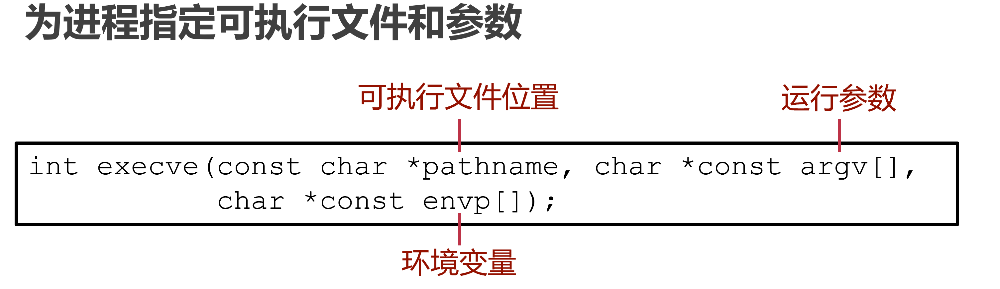

通常在fork之后调用（exec在载入可执行文件后会重置地址空间）

## 线程：更加轻量级的运行时抽象

希望一个应用能够去用多核！

**为什么需要线程？**

- 创建进程的开销太大
  - 包括了数据、代码、堆、栈等
- 进程的隔离性过强
  - 进程间交互：可以通过进程间通信（IPC），但开销较大
- 进程内部无法支持并行

**线程只包含运行时的状态**

- 静态部分由**进程**提供
- 包括了执行所需的**最小**状态（主要是寄存器和栈）

**一个进程可以包含多个线程**

- 每个线程共享同一地址空间（方便数据共享和交互）
- 允许进程内并行


<u>进程是资源分配的单位，线程是调度的单位</u>

**一个进程的多线程可以在不同处理器核上同时执行**

### 多线程进程的地址空间（标准认知）

- 每个线程拥有自己的栈
- 内核中也有为线程准备的内核栈（每个线程有自己的内核栈）
- 其它区域各个线程共享（数据、代码、堆……）

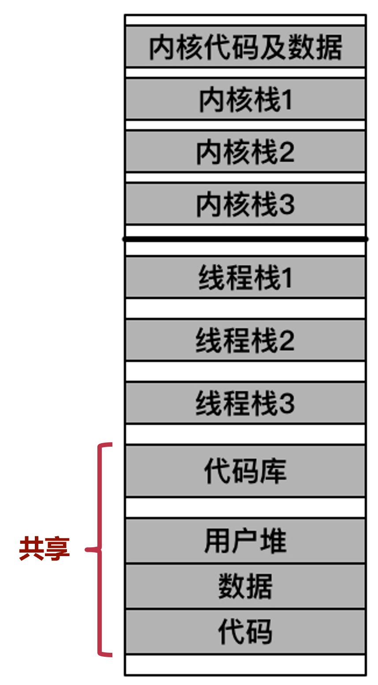

### 用户态线程与内核态线程

- 根据线程是否受内核管理，可以将线程分为两类
  - 内核态线程：内核可见，受内核管理（每一个线程对应一个内核栈）
  - 用户态线程：内核不可见，不受内核直接管理
- 内核态线程
  - 由内核创建，线程相关信息存放在内核中
- 用户态线程（纤程/协程）
  - 在应用态创建，线程相关信息主要存放在应用数据中

### 线程模型

**线程模型表示了用户态线程与内核态线程之间的联系**

- 一对一模型：一个用户态线程对应一个内核态线程（99%是此种）
- 多对一模型：多个用户态线程对应一个内核态线程（为了模仿内核提供的线程的调度模式造出来的概念）
- 多对多模型：多个用户态线程对应多个内核态线程


### 线程的相关数据结构：TCB（thread control block），户口本

一对一模型的TCB可以分为两部分

- 内核态：与PCB结构类似
  - Linux中进程与线程使用的是同一种数据结构（task_struct）
  - 上下文切换中会使用
- 应用态：可以由线程库定义
  - Linux：pthread结构体
  - Windows：TIB（Thread Information Block）
  - 可以认为是内核TCB的扩展

### 线程本地存储（TLS，Thread Local Storage）

**不同线程可能会执行相同的代码**

线程不具有独立的地址空间，多线程共享代码段

**问题：对于全局变量，不同线程可能需要不同的拷贝**

举例：用于标明系统调用错误的errno

**线程独立的数据（不希望被其它线程访问）**

- 考虑放到自己的栈上？
- 使用 TLS

#### TLS 细节

- **线程库允许定义每个线程独有的数据**
  - __thread int id; 会为每个线程定义一个独有的id变量
- **每个线程的TLS结构相似**
  - 可通过TCB索引
- **TLS寻址模式：基地址＋偏移量（编译器实现）**
  - 对于某一个特定的数据，偏移量对于所有的 thread 都是一样的；但是每一个 thread TLS这一部分的基地址是不一样的，也因此会访问到不一样的地方！！（和虚函数有点类似）
  - X86: 段页式 (基地址在fs寄存器) 
  - AArch64: 特殊寄存器tpidr_el0

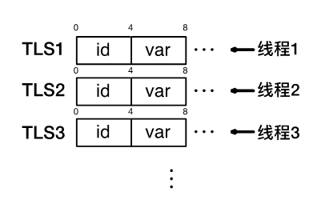

**在多线程的进程里面调用 fork，出来的进程是多线程的还是单线程的？如一个进程有三个线程，<u>其中一个线程</u>调用了 fork（不可能这些线程同时调 fork）**

调用fork的这个线程会进入内核态，内核会COW出一个页表，新fork出来的进程PC值指向fork的下一行，继续往下执行；此过程中另外两个线程原来的线程栈还在当前新进程的地址空间里，但是没有人用！新进程的内核栈只有一个！也即只 fork 了一个线程！

**多线程进程，希望fork出来也是一个多线程的进程，应该怎么办？**

- 把三个线程先整合为一个线程（用户态），调用fork（内核态）得到一个进程中的一个线程，之后再从一个线程变为三个线程（用户态）
- 三合一：三个 thread 的状态保存在内存里，让其中两个 thread join 和 exit
- 一变三：新线程调用 pthread_create 并恢复其状态

### 线程的基本操作：以pthreads为例

- 创建：`pthread_create`
  - 内核态：创建相应的内核态线程及内核栈
  - 应用态：创建TCB、应用栈和TLS（和原来进程共享一个地址空间）
- 合并：`pthread_join`
  - 等待另一线程执行完成，并获取其执行结果
  - 可以认为是fork的“逆向操作”
- 退出：`pthread_exit`
  - 可设置返回值（会被pthread_join获取）
- 暂停：`pthread_yield`
  - 立即暂停执行，出让CPU资源给其它线程
  - 好处：可以帮助调度器做出更优的决策

## 上下文切换

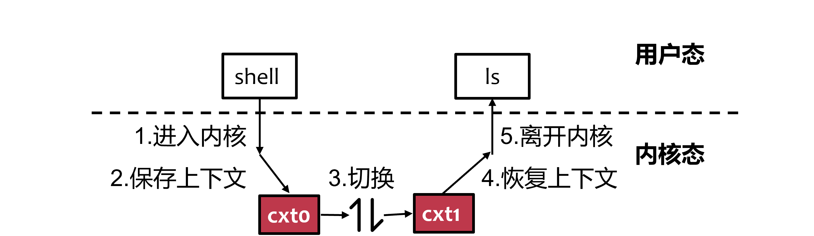

### 进程上下文的组成（AArch64）

**进程上下文需要包含哪些内容？**

- 常规寄存器：X0-X30
- 程序计数器（PC）： 保存在ELR_EL1（用户态进入内核态时保存PC）
- 栈指针：SP_EL0
- CPU状态（如条件码）：保存在SPSR_EL1

**为什么进程上下文只需要保存寄存器信息，而不用保存内存？**

因为内存的数据不会因为切换而消失（不主动覆盖它就不会消失），但寄存器只有一组

### 进程的内核态执行：切换到内核态（1）

AArch64提供了**硬件支持**，使进程切换到内核态执行

- 状态（PSTATE）写入SPSR_EL1
- 栈指针寄存器切换到SP_EL1
- PC移动到内核异常向量表中（将PC修改为异常向量表中对应的系统调用代码位置，之后执行对应代码）
- PC值写入ELR_EL1
- 运行状态切换到内核态EL1


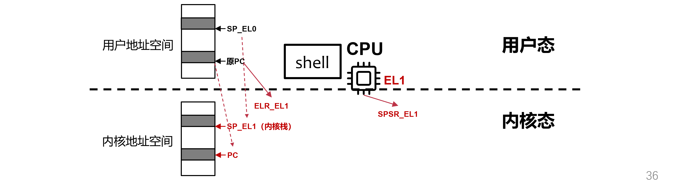

### 用户态/内核态切换时的处理器状态变化

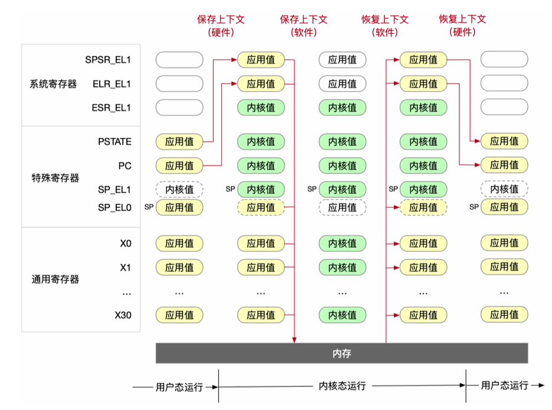

### 处理器在切换过程中的任务

1. 将发生异常事件的指令地址保存在ELR_EL1中

2. 将异常事件的原因保存在ESR_EL1

   例如，是执行svc指令导致的，还是访存缺页导致的

3. 将处理器的当前状态（即PSTATE）保存在SPSR_EL1

4. 将引发缺页异常的内存地址保存在FAR_EL1

5. 栈寄存器不再使用SP_EL0（用户态栈寄存器），开始使用SP_EL1

   内核态栈寄存器，需要由操作系统提前设置

6. 修改PSTATE寄存器中的特权级标志位，设置为内核态

7. 找到异常处理函数的入口地址，并将该地址写入PC，开始运行操作系统

   根据VBAR_EL1寄存器中保存的异常向量表基地址，以及发生异常事件的类型确定

### 进程的内核态执行：内核栈

应用程序调用syscall到内核的时候，内核栈是空的；syscall即将返回用户态之前，内核栈也是空的！（栈里面之所以要存东西，是因为执行的时候被切走，切回来的时候要恢复状态）

**为什么内核自己需要有一个栈？**

- 进程在内核中依然执行代码，有读写临时数据的需求
- 进程在用户态和内核态的数据应该相互隔离，增强安全性

安全性问题举例：

某一个线程的内核正在用（写）一块栈所在的内存区域（包括返回地址），之后同一个进程的不同的另一个线程（有权限访问上述内存区域，rw），可以修改那个内存区域的内容（比如返回地址）。而此时在内核态的线程执行流就会被控制！

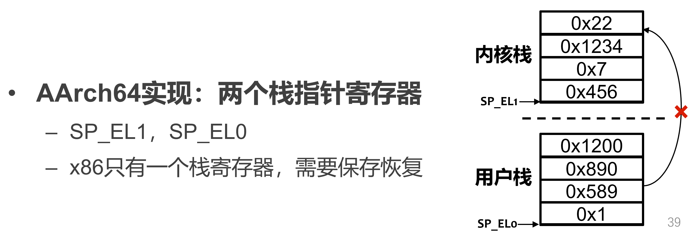

- x86下用户态到内核，需要保存栈寄存器内容（存内存中），并把栈寄存器中改为内核栈顶
- AArch64中则因为有两个栈指针寄存器，在内核/用户态切换间不需要另外保存栈寄存器，节省了内存写！

### 进程的内核态执行：返回用户态（5）

进入内核态的“逆过程”，AArch64同样提供了硬件支持（直接重设PC，少了对原来PC值的保存，原因见下）

- SPSR_EL1重设到CPU PSTATE
- 栈指针寄存器切换到SP_EL0
- ELR_EL1重设到PC寄存器中
- 运行状态切换到用户态EL0

**调用syscall进到内核，内核栈是空的，PC的值和进来的异常原因相关（exception，page fault，中断......），回去时内核栈也空了，PC的值也不重要（不需要保存，下次进来肯定是依据触发异常的原因决定进到哪个位置，和上次出内核的位置无关！）**

> 内核的状态都保存在内核自己 `kalloc` 出的内存里面；内核上下文（内核栈指针，PC等）不需要保存

### 内核/用户态切换与上下文切换（2，4）

- 不同进程地址空间不同，使用的寄存器值也不同（如PC）
- 但是**寄存器只有一个！**直接恢复会导致错误
- 解决方法：保存**上下文**（寄存器）到内存，用于之后恢复

### 上下文与其他内核数据结构

- 与进程相关的三种内核数据结构：PCB、上下文、内核栈
- PCB保存指向上下文的引用（process_ctx）
- 上下文的位置**固定**在内核栈底部

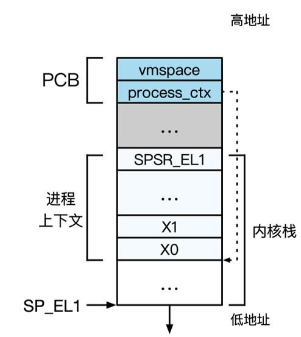

#### 上下文保存（ChCore为例）

- 进入内核后调用exception_enter完成（将各寄存器逐一放入内核栈中）
- 上下文保存的“逆过程”：调用exception_exit完成（从内核栈读取出各寄存器，并清空内核栈，最后调用eret）

### 切换过程（3）


- 关键1:如何切换到p1的地址空间？
- 关键2:如何切换到已经存储的p1上下文并进行恢复？

#### 步骤1：地址空间的切换

AArch64的地址空间管理

- 内核与用户态地址空间分开管理（使用两个寄存器）
- 用户地址空间独有，内核地址空间共享
- 因此，只需要实现用户地址空间切换即可

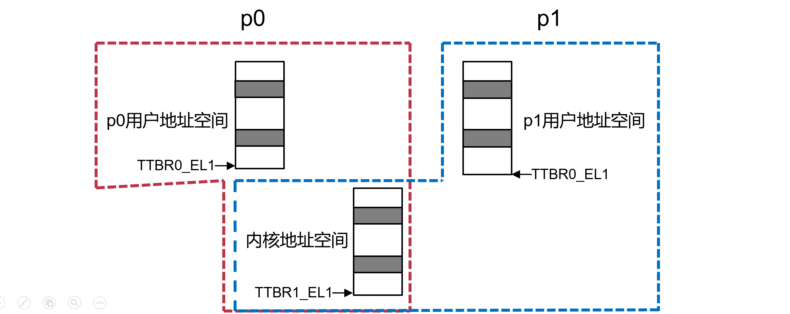

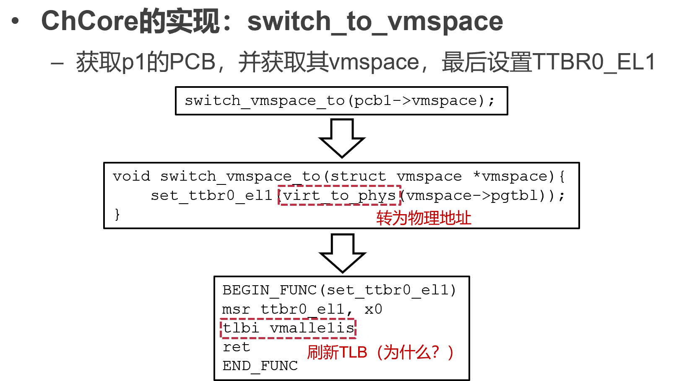

virt to phys：减偏移量即可

tlbi：刷掉TLB

#### 步骤2：如何切换到p1的上下文？

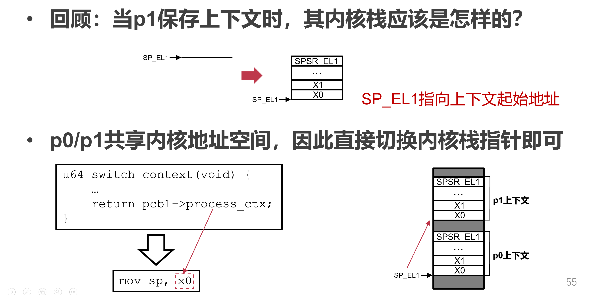

SP_EL1内核栈指针从原本的上下文（刚刚存对应的寄存器）变为要切换到的上下文（要 restore 对应的寄存器）

### 总结：上下文切换栈变化全过程

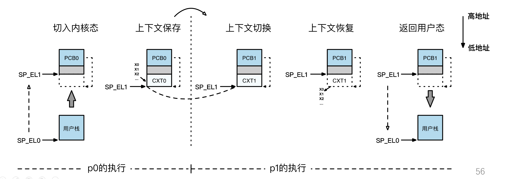

- **共涉及两次权限等级切换、三次栈切换**
- **内核栈的切换是线程切换执行的“分界点”**

## 纤程（协程，用户态线程）

**一对一线程模型的局限：**性能不够，开销大

- **复杂应用：对调度存在更多需求**
  - 生产者消费者模型：生产者完成后，消费者最好马上被调度
  - 内核调度器的信息不足，无法完成及时调度
- **“短命”线程：执行时间亚毫秒级（如处理web请求）**
  - 内核线程初始化时间较长，造成执行开销
  - 线程上下文切换频繁，开销较大

### 纤程好处

**比线程更加轻量级的运行时抽象**（内核看不到纤程的切换）

- 不单独对应内核线程
- 一个内核线程可以对应多个纤程（多对一）

**纤程的优点**

- 不需要创建内核线程，开销小
- 上下文切换快（不需要进入内核）
- 允许用户态自主调度，有助于做出更优的调度决策

### Linux对于纤程的支持：ucontext

每个ucontext可以看作一个用户态线程

- makecontext：创建新的ucontext
- setcontext：纤程上下文切换
- getcontext：保存当前的ucontext

#### 案例

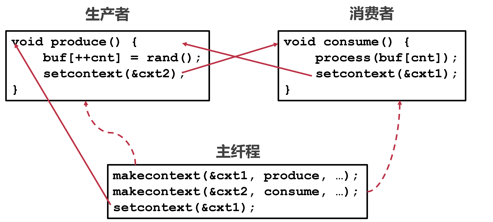

**和直接 `produce()` 与 `consume()` 函数互相调用有什么区别**

函数调用是一层一层在栈里面嵌套，而纤程是模拟上下文切换（直接改栈）

### 纤程优势

- **纤程切换及时**
  - 当生产者完成任务后，可直接用户态切换到消费者
  - 对该线程来说是最优调度（内核调度器和难做到）
- **高效上下文切换**
  - 切换不进入内核态，开销小
  - 即时频繁切换也不会造成过大开销


# 处理器调度

系统中的任务数远多于处理器数，怎么使用少量处理器运行很多任务（线程、单线程进程）？

## 进程\线程调度

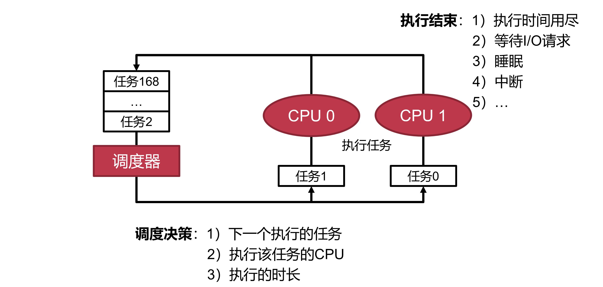

调度器运行在每个CPU上

2) 执行该任务的CPU：涉及负载均衡

3) 执行时长（时间片长度）：编译时确定的 linux 中时间片有 1ms（desktop版本，响应速度快） 和 10ms（server）；执行时执行的时长还会在此基础上进行微调

## 调度：协调对资源的使用请求

对于不同场景，调度的主要目标不同：

- 批处理系统：高吞吐量
- 交互式系统：低响应时间
- 网络服务器：可扩展性
- 移动设备：低能耗
- 实时系统：实时性

**调度的共有目标：**

- **高资源利用率**
- **多任务公平性**
- **低调度开销**

调度器的目标：

- **降低周转时间：**任务第一次进入系统到执行结束的时间
- **降低响应时间：**任务第一次进入系统到第一次给用户输出的时间
- **实时性：**在任务的截止时间内完成任务
- **公平性：**每个任务都应该有机会执行，不能饿死
- **开销低：**调度器是为了优化系统，而非制造性能BUG
- **可扩展：**随着任务数量增加，仍能正常工作

调度的挑战：

- 缺少信息（没有**先知**）
  - 工作场景动态变化
- 线程/任务间的复杂交互
- 调度目标多样性
  - 不同的系统可能关注不一样的调度指标
- 许多方面存在取舍
  - 调度开销 V.S. 调度效果
  - 优先级 V.S. 公平
  - 能耗 V.S. 性能

## 调度指标

**周转时间：**任务第一次进入系统到执行结束的时间（进入到退出）

**响应时间：**任务第一次进入系统到第一次给用户输出的时间（进入到响应/任务开始被执行，响应时不一定退出）

公平性，实时性，开销，可扩展

## 经典调度 Classical Scheduling

### First Come First Served（FCFS）

先到先得

**问题：**平均周转、响应时间过长

### Shortest Job First（SJF）

短任务优先

**优势：**平均周转时间短

**问题：**

1）不公平，任务饿死

2）平均响应时间过长

3)  依赖对于任务的先验知识（预知任务执行时间）

### 抢占式调度 Preemptive Scheduling

每次任务执行一定时间后会被切换到下一任务，而非执行至终止（通过定时触发的时钟中断实现）

### 时间片轮转 Round Robin（RR）

每次任务执行一定时间后会被切换到下一任务，每个任务时间片一致

**轮询：**公平、平均响应时间短

**问题：**牺牲周转时间

对于交互式要求很高的场景合适

**什么情况下RR的周转时间问题最为明显？**

如果每个任务的执行时间差不多相同

**时间片长短应该如何确定？**

时间片过长的话，RR会退化为FCFS

时间片过短的话，在真实场景中调度开销会变大

## 优先级调度 Priority Scheduling

操作系统中的任务重要性是不同的（系统/用户，前台/后台......），优先级用于确保重要的任务被优先调度

### 多级队列 Multi-Level Queue (MLQ)

1）维护多个队列，每个对应静态设置好的优先级（如 I/O 密集型和 CPU 密集型）

2）高优先级的任务优先执行

3）同优先级内使用Round Robin调度（也可使用其他调度策略）

依赖对于任务的先验知识，需要预知任务是否为I/O密集型任务

### 优先级的选取

**问题1：低资源利用率，多种资源（如CPU和I/O）没有同时利用起来**

有些任务是 I/O intensive，需要去访问磁盘，这类任务一开始的时候用一下CPU，之后就开始等硬盘；CPU希望能先调用 I/O intensive 的任务，在这些任务等待磁盘的时候，就可以服务那些别的 CPU intensive 的任务；否则如果先 CPU intensive 任务，I/O 就没有被利用起来，闲置。

**问题2：优先级反转（高、低优先级任务都需要独占共享资源，低优先任务占用资源 -> 高优先级任务被阻塞）**

独占通过信号量，互斥锁等实现

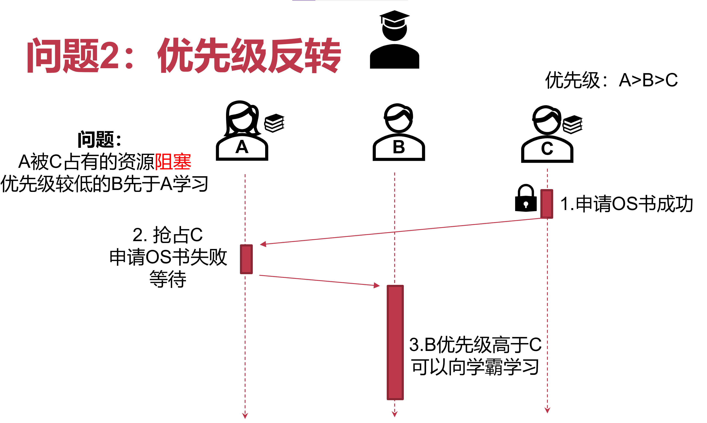

A 与 C 都需要独占某一共享资源，但是此时 C 在执行，那么高优先级的 A 抢占 C 时会因为共享资源被 C 占用而失败；但是此时如果优先级在 A 与 C 之间的 B 进场，由于 B 与 C 之间没有共享资源的冲突，同时 B 的优先级比 C 高，B 就能抢占成功开始执行，形成 B 优先于 A 执行的局面（但是 A 优先级高于 B）

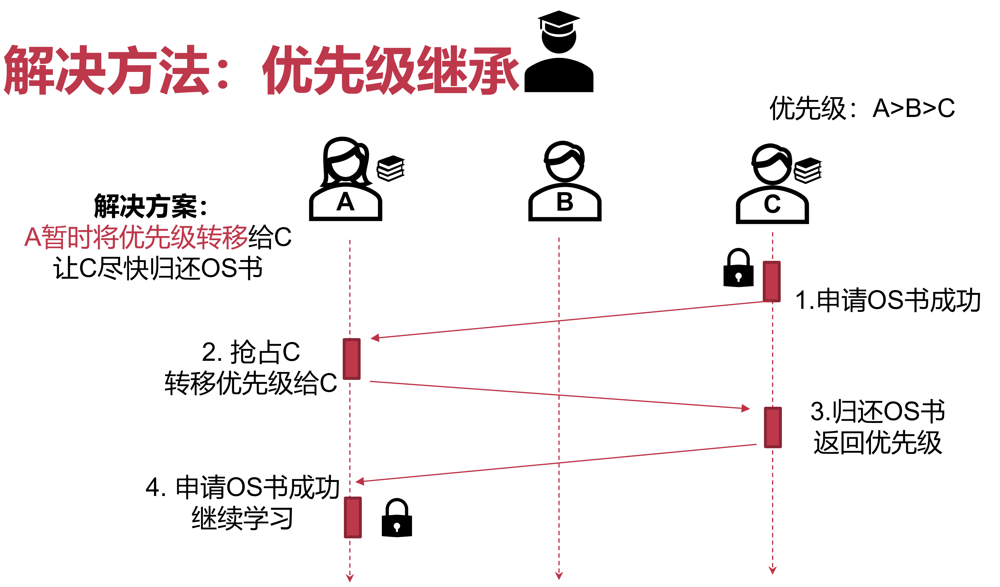

A 把自己的优先级暂时给到 C，这样 B 就抢占不了了（这样 B 优先级会比 C 低）

**什么样的任务应该有高优先级？**

- I/O绑定的任务：有些任务是 I/O intensive，需要去访问磁盘，这类任务一开始的时候用一下CPU，之后就开始等硬盘；CPU希望能先调用 I/O intensive 的任务，在这些任务等待磁盘的时候，就可以服务那些别的 CPU intensive 的任务
  - 为了更高的资源利用率
- 用户主动设置的重要任务
- 时延要求极高（必须在短时间内完成）的任务
- 等待时间过长的任务
  - 为了公平性

**广义层面的优先级调度**

本质上FCFS的优先级是任务的到达顺序，SJF的优先级是任务的完成时间短，RR则没有优先级概念（或者说所有任务优先级相同）

> linux 中优先级体现为 nice（+20 到 -20）：越nice（值越大），优先级越低

## 多级反馈队列 Multi-Level Feedback Queue（MLFQ）

静态优先级的问题：低优先级任务饥饿（被高优先级任务阻塞，长时间无法执行）

**实现任务优先级的动态调整**（操作系统中的工作场景是动态变化的）

无需先验知识，通过动态分析任务运行历史，总结任务特征（但是如果工作场景变化频繁，效果会很差）

### 基本算法

**规则 1：**优先级高的任务会抢占优先级低的任务（同MLQ）

**规则 2：**每个任务会被分配时间片，优先级相同的两个任务使用时间片轮转（同MLQ）

**规则 3：**任务被创建时，**假设该任务是短任务**（用一点CPU就会主动放掉的），为它分配最高优先级

**规则 4a：**一个任务时间片耗尽后，它的优先级会被降低一级

**规则 4b：**如果一个任务在时间片耗尽前放弃CPU，那么它的优先级不变；任务重新执行时，会被分配新的时间片

- 对于长任务：MLFQ会逐渐降低它的优先级，并将它视为长任务
- 对于短任务：它会很快执行完
- 对于I/O密集型任务：它会在时间片执行完以前放弃CPU，MLFQ保持它的优先级不变即可

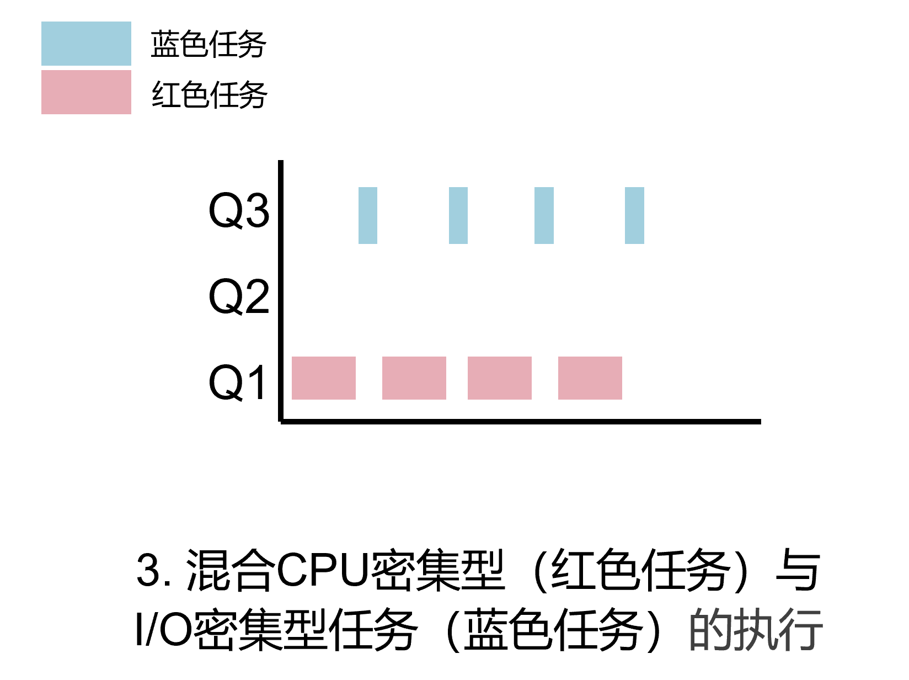

#### **基本算法的问题**

- 长任务饥饿：过多的短任务、I/O密集型任务可能占用所有CPU时间
- 任务特征可能动态变化：CPU密集型任务变成交互式任务，…
- 无法应对抢占CPU时间的攻击

##### **定时优先级提升（解决长任务饥饿和任务特征动态变化方案）**

**规则 5:** <u>在某个时间段S后，将系统中所有任务优先级升为最高</u>

- 效果1：避免长任务饿死
  - 所有任务的优先级会定时地提升最高
  - 最高级队列采用RR，长任务一定会被调度到
- 效果2：针对任务特征动态变化的场景
  - MLFQ会定时地重新审视每个任务


**为什么要提升全部的优先级，而不随机挑选几个提升？**

万一有的任务运气不好，一直没有被提升（需要保证随机算法覆盖到所有任务，复杂性高）

##### **更准确地记录执行时间（应对抢占CPU时间的攻击）**

- 恶意任务在时间片用完前发起I/O请求
- 避免MLFQ将该任务的优先级降低，并且每次重新执行时间片会被重置
  - 几乎独占CPU！

**规则** **4:** <u>一个任务时间片耗尽后（无论它期间放弃了多次CPU，它的时间片不会被重置），它的优先级会被降低一级</u>

**更新策略**

- 记录每个任务在当前优先级使用的时间片
- 当累计一个完整时间片被用完后，降低其优先级

### 参数调试

- 优先级队列的数量
- 不同队列的时间片长短应当不同（时间片最高优先级应该短，最低优先级应该长）
- 定时优先级提升的时间间隔

### 总结

- 通过观察任务的历史执行，动态确定任务优先级
  - 无需任务的先验知识
- 同时达到了周转时间和响应时间两方面的要求
  - 对于短任务，周转时间指标近似于SJF
  - 对于交互式任务，响应时间指标近似于RR
- 可以避免长任务的饿死
- 许多著名系统的调度器是基于MLFQ实现的，如BSD, Solaris, Windows NT 和后续Windows操作系统

## 公平共享调度 Fair-Share Scheduling

### ticket

方法：使用“ticket”表示任务的份额

ticket：每个任务对应的份额

T ：ticket的总量

> 任务A：ticket 20，任务B：ticket 30，任务C：ticket 50，则A:B:C占用的CPU执行时间 20:30:50

### 彩票调度（Lottery Scheduling）

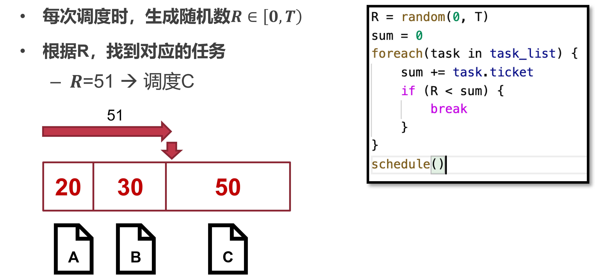

原理就是调度T次时（时间足够长），每个任务被调度次数的期望 == 该任务的份额

> 伪随机！可能会出现不可控情况，即短时间内某一任务持续被调度，别的任务短时间内starvation

### 步幅调度（Stride Scheduling）

将 ticket 转换为 stride（先找所有 ticket 的最小公倍数 MaxStride，再用这个数除以每个 ticket 得到 stride）

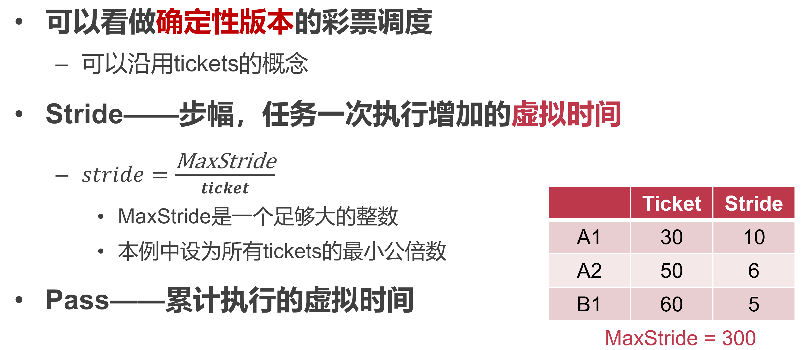

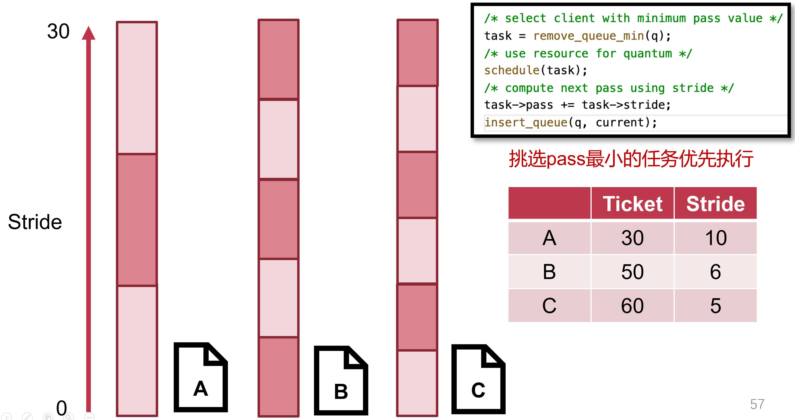

stride 就相当于“虚拟”的时间，每次挑累计执行的虚拟时间（累计 stride）最少的跑

每个任务跑，怎么样都不会差太多

### 比较

|                              | **Lottery**  **Scheduling** | **Stride**   **Scheduling** |
| ---------------------------- | --------------------------- | --------------------------- |
| 调度决策生成                 | 随机                        | 确定性计算                  |
| 任务实际执行时间与预期的差距 | 大                          | 小                          |

## 份额 与 优先级 的异同?

- 份额影响任务对CPU的占用比例
  - 不会有任务饿死
- 优先级影响任务对CPU的使用顺序
  - 可能产生饿死

导致饿死就是不公平，不导致饿死就是公平！

## 多核调度策略 Multicore Scheduling Policy

多核调度需要考虑的额外因素：一个进程的不同线程可以在不同CPU上同时运行

### 群组调度 Gang Scheduling

- 同一个进程的不同线程倾向于让他们同时跑！（同一个进程内的所有线程可能有依赖关系，可能会等所有线程都执行完才能执行下一步，如GCC编译，每个线程编译一个文件 .c 到 .o，所有线程把 .o 生成完之后才能进行下一步操作）
- 组内任务都是关联任务，希望尽可能同时执行

### 全局使用一个调度器的问题

- 所有CPU竞争全局调度器（以及其数据结构）
- 同一个线程可能在不同CPU上切换
  - 切换开销大：Cache、TLB、…
  - 缓存局部性差

### 两层调度 Two-level Scheduling

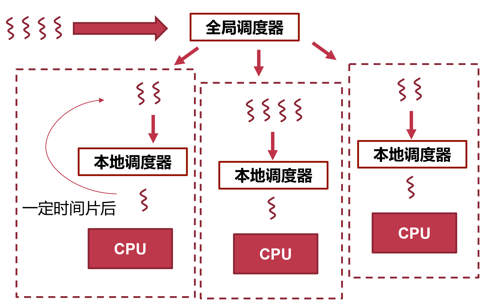

- 全局调度器把一些线程放到各个CPU上

- 之后每个CPU上有本地调度器（每个CPU核心都有自己的 runq），负责调度自己被分配的这些线程

- 一段时间后，再回到全局调度器

问题：资源调度一定是越全局掌控越好，全局才可能带来资源最大的利用率（信息最多）

### 负载均衡（Load Balance）

其中一个CPU被分配的线程都跑完了，另一个却还在跑

- 需要追踪CPU的负载情况
- 将任务从负载高的CPU核心迁移到负载低的CPU核心（work stealing）

work stealing 就会导致某个 CPU 核上的 runq 有可能被另外两个 CPU 核心同时访问（两个人都去抢同一个任务），引发同步问题，需要加锁

#### 如何定义任务的负载

根据任务负载定义的不同，负载均衡的效果也不尽相同

- 每个CPU核心本地运行队列的长度
  - 优势：实现简单
  - 劣势：不能准确反应当前CPU的负载情况
- 每个任务单位时间内使用的CPU资源
  - 优势：直观反映当前CPU的负载情况
  - 劣势：引入额外负载追踪开销

### 亲和性（Affinity）

允许程序员把线程绑定到某一个核心上（`sched_setaffinity`，`sched_getaffinity`）

**程序员如何控制自己程序的行为？**例如，程序员希望某个线程独占一个CPU核心

**通过操作系统暴露的任务亲和性接口，可以指定任务能够使用的CPU核心**


# 进程间通信 Inter-Process Communication（IPC）

一些应用程序选择使用不同进程来运行不同模块（把原本同一个地址空间的代码拆到两个地址空间）

- 优势-1：功能模块化，避免重复造轮子（如数据库、界面绘制）
- 优势-2：增强模块间隔离，增强安全保障（敏感数据的隔离）
- 优势-3：提高应用容错能力，限制故障在模块间的传播

**不同进程拥有不同的内存地址空间，进程与进程之间无法直接进行通信和交互，需要一种进程间通信的方式**

## 常见 IPC 的类型

| IPC 机制 | 数据抽象 | 参与者   | 方向      |
| -------- | -------- | -------- | --------- |
| 管道     | 文件接口 | 两个进程 | 单向      |
| 共享内存 | 内存接口 | 多进程   | 单向/双向 |
| 消息队列 | 消息接口 | 多进程   | 单向/双向 |
| 信号     | 信号接口 | 多进程   | 单向      |
| 套接字   | 文件接口 | 两个进程 | 单向/双向 |

### IPC 的接口类型

- 已有接口
  - 内存接口：共享内存；文件接口：管道（Pipe）、套接字（Socket）
- 新的接口
  - 消息接口、信号接口等
- 简单IPC的消息接口
  - 发送消息：`Send(message)`
  - 接收消息：`Recv(message)`
  - 远程方法调用：`RPC(req_message, resp_message)`
  - 回复消息：`Reply(resp_message)`

## 简单 IPC 的设计与实现

### 消息接口

- 最基本的消息接口
  - 发送消息：`Send(message)`
  - 接收消息：`Recv(message)`
- 远程方法调用与返回（RPC）
  - 远程方法调用：`RPC(req_message, resp_message)`
  - 回复消息：`Reply(resp_message)`

### 设计与实现

- 发送者和消费者需要依赖于一个通信连接chan（即channel），作为媒介进行消息传输

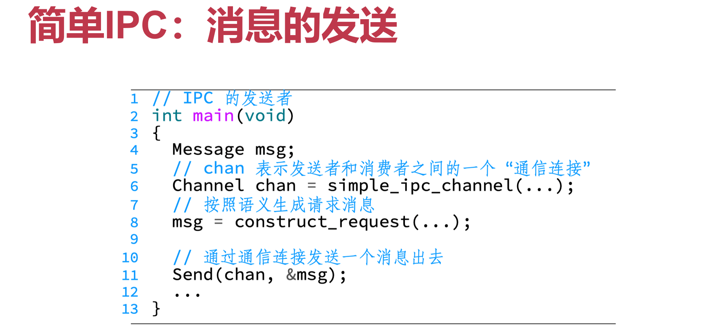

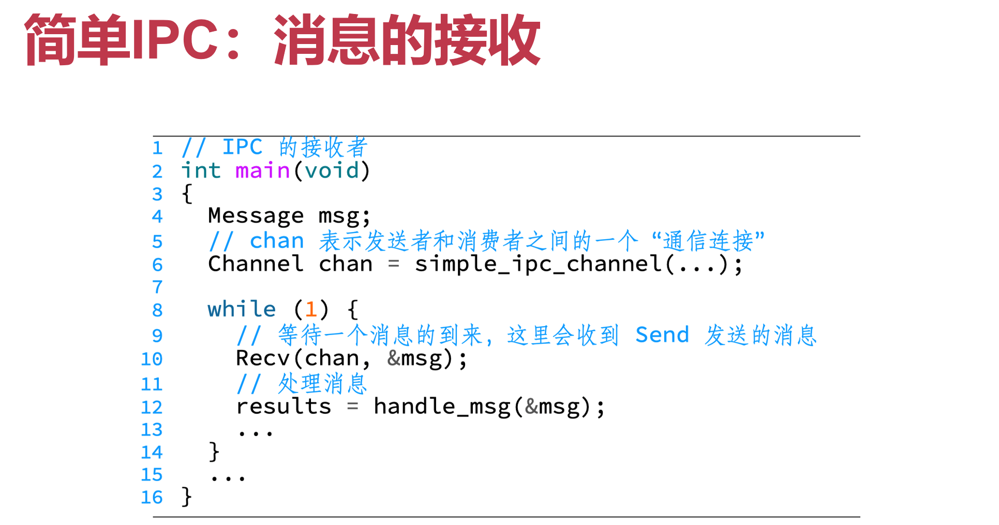

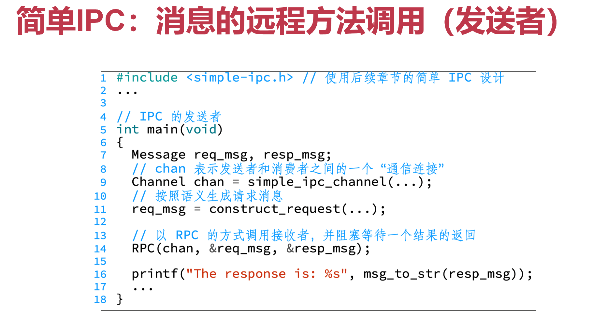

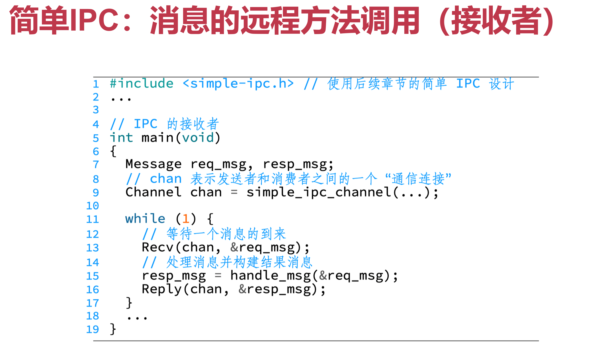

### 简单 IPC 的两个阶段

- 阶段-1：准备阶段
  - **建立通信连接**，即进程间的信道
    - 假设内核已经为两个进程映射了一段共享内存
- 阶段-2：通信阶段
  - 数据传递
    - "消息"抽象：通常包含头部（含魔数）和数据内容（500字节）【数据一般**不包含指针**，因为两边的虚拟地址空间不一样，指针内的地址无意义】
  - 通信机制
    - 两个消息保存在共享内存中：发送者消息、接收者消息
    - 发送者和接收者通过**轮询**消息的状态作为通知机制

### 简单 IPC 数据传递的两种方法

- 方法-1：基于共享内存的数据传递
  - **操作系统在通信过程中不干预数据传输**
  - 操作系统仅负责准备阶段的映射
  - 一次拷贝（one-copy）
- 方法-2：基于操作系统辅助的数据传递
  - 操作系统提供接口**（系统调用）**：Send、Recv
  - **通过内核态内存来传递数据**，无需在用户态建立共享内存
  - 两次拷贝（two-copy）， sender 到 OS内存 到 receiver

**两种数据传递方法的对比**

- 基于共享内存的优势
  - **用户态无需切换到内核态即可完成IPC**（多核场景下）
  - 完全由用户态程序控制，定制能力更强
  - 可实现零内存拷贝（无需内核介入）
- 基于系统调用的优势
  - 抽象更简单，用户态直接调用接口，使用更方便
  - 安全性保证更强，发送者在消息被接收时通常无法修改消息
  - 多方（多进程）通信时更灵活、更安全

### 简单 IPC 的通知机制

数据发完之后，通知对方说我已经发完了

- 方法-1：基于轮询（消息头部的状态信息）【时延更低】
  - 缺点：大量CPU计算资源的浪费
- 方法-2：基于控制流转移【时延更高，写消息的通知后不一定马上调度到读消息的进程】
  - 由内核控制进程的运行状态
  - 优点：进程只有在条件满足的情况（对方通知后）下才运行，避免CPU浪费

## IPC 控制流：同步和异步

- 同步 IPC
  - IPC操作会阻塞进程直到操作完成
  - 线性的控制流
  - 调用者继续运行时，返回结果已经ready
- 异步 IPC（不等待，直接继续往下走）
  - 进程发起IPC操作后即可返回而不需要等待其完成
  - 通过轮询或回调函数（需内核支持）来获取返回结果

## IPC 的超时机制（实际上一般还是完全同步/异步，而不会设置超时时间超参数）

- **一种新的错误：超时**
  - 传统的函数调用不存在超时问题
  - IPC涉及两个进程，分别有独立的控制流
- **超时可能的原因**
  - 被调用者是恶意的：故意不返回
  - 被调用者不是恶意的：运行时间过长、调度时间过长、请求丢失等
- **超时机制**
  - 应用可自行设置超时的阈值，但如何选择合适的阈值却很难
  - 特殊的超时机制：阻塞、立即返回（要求被调用者处于可立即响应的状态）

## IPC 的两种通信连接抽象

- 方法-1：直接通信
  - 通信的一方需要显示地标识另一方，每一方都拥有唯一标识
  - 如：`Send(P, message)`, `Recv(Q, message)`
  - 连接的建立是自动完成的（由内核完成）
- 方法-2：间接通信（建立一个信箱，一些进程往里面发，一些在里面收）
  - 通信双方通过**"信箱"的抽象**来完成通信
  - 每个信箱有自己唯一的标识符
  - **通信双方并不直接知道在与谁通信**
  - 进程间连接的建立发生在共享一个信箱时

## IPC 的权限检查

- **宏内核**
  - 通常基于权限检查的机制实现
  - 如：Linux中与文件的权限检查结合在一起（如 pipe，有权限打开对应文件的进程就有权限使用这个文件和其它进程通信）
- **微内核**（Capability 可以转让，类似于进程可以把带权限的 fd 转让给别的进程）
  - 通常基于Capability安全检查机制实现
  - 如seL4将通信连接抽象为内核对象，不同进程对于内核对象的访问权限与操作有Capability来刻画
  - Capability保存在内核中，与进程绑定
  - 进程发起IPC时，内核检查其是否拥有对应的Capability

## IPC 的命名服务

一个进程跟别的进程想要建立信道，需要先知道有这个进程，这就需要这个进程通过通信告诉它自己存在，也就需要信道，循环！

需要有一个全部进程都知道的人（well-known）——命名服务（单独的进程），它知道所有进程

所有进程启动时连接命名服务

- **命名服务：一个单独的进程**
  - 类似一个全局的看板，协调服务端与客户端之间的信息
  - 服务端可以将自己提供的服务注册到命名服务中
  - 客户端可以通过命名服务进程获取当前可用的服务
- **命名服务的功能：分发权限**
  - 例如：文件系统进程允许命名服务将连接文件系统的权限任意分发，因此所有进程都可以访问全局的文件系统
  - 例如：数据库进程只允许拥有特定证书的客户端连接

## 管道：文件接口的 IPC

管道(Pipe): 两个进程间的一根通信通道

- 一端向里投递，另一端接收 
- 管道是间接消息传递方式，通过共享一个管道来建立连接

### 匿名管道与命名管道

- **匿名管道：传统的管道缺乏名字，只能在有亲缘关系的进程间使用**
  - 也称为“匿名管道”
  - 通常通过fork，在父子进程间传递fd
- **命名管道（FIFO）：具有文件名**
  - 在Linux中也称为fifo，可通过 `mkfifo()` 来创建
  - 可以在没有亲缘关系的进程之间实现IPC
  - 允许一个写端，多个读端；或多个写端，一个读端

### 优点与问题

优点：设计和实现简单

- 针对简单通信场景十分有效

问题：

- 缺少消息的类型（就是文件的数据流），接收者需要对消息内容进行解析
- 缓冲区大小预先分配且固定
- 只能支持单向通信（buffer 写进去之后，另外一个人收取，只能单向）
- 只能支持最多两个进程间通信

## 共享内存（内存接口的IPC）

### 生产者消费者问题实现

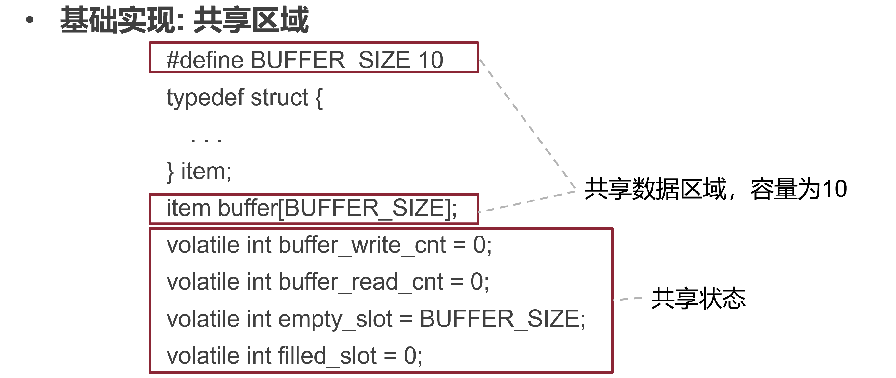

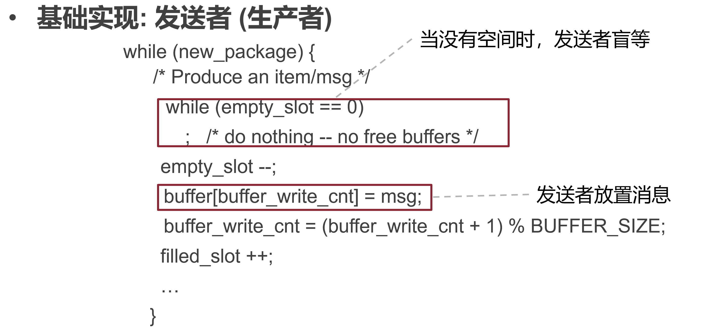

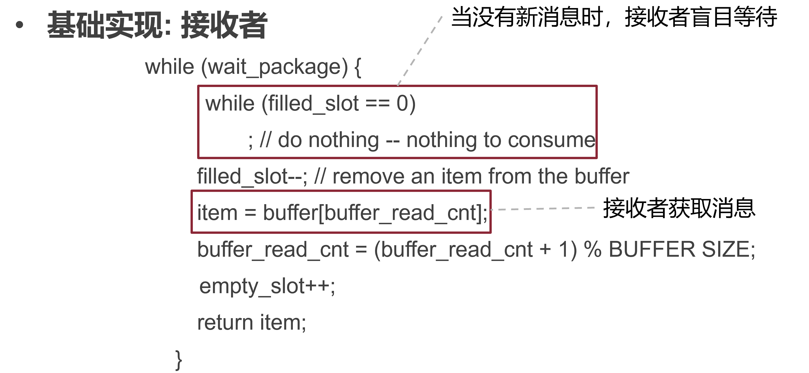

### 共享内存的问题

- **缺少通知机制**
  - 若轮询检查，则导致CPU资源浪费
  - 若周期性检查，则可能导致较长的等待时延
  - **根本原因：**共享内存的抽象过于底层；缺少OS更多支持
- TOCTTOU （Time-of-check to Time-of-use）问题
  - 当接收者直接用共享内存上的数据时，可能存在被发送者恶意篡改的情况**（发生在接收者检查完数据之后，使用数据之前）**【如果拷贝到内核再拷贝回读进程就不会有这种情况】
  - 这可能导致buffer overflow等问题

## 消息队列（Message Passing）：一种带类型的消息传递机制

- 消息队列: 以链表的方式组织消息
  - 任何有权限的进程都可以访问队列，写入或者读取
  - 支持异步通信 (非阻塞)
- 消息的格式: 类型 + 数据
  - 类型：由一个整型表示，具体的意义由用户决定
- 消息队列是间接消息传递方式
  - 不同进程通过共享一个队列来建立连接

### 案例

file to key：`ftok();`

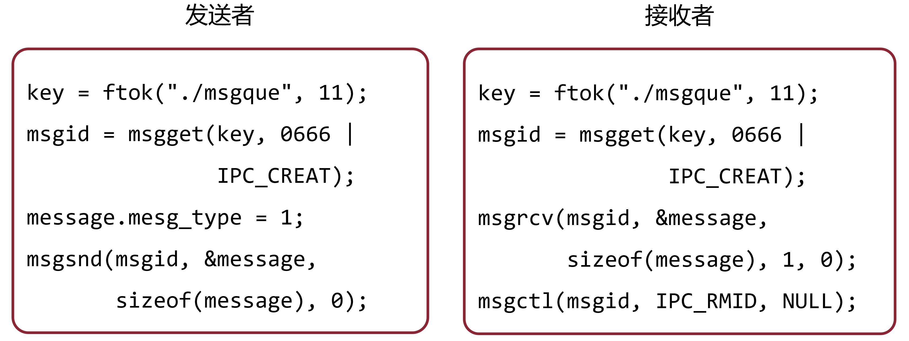

- 消息队列的组织
  - 基本遵循FIFO (First-In-First-Out)先进先出原则
  - 消息队列的写入：增加在队列尾部
  - 消息队列的读取：默认从队首获取消息
- 允许按照类型查询: `Recv(A, type, message)`
  - 类型为0时返回第一个消息 (FIFO)
  - 类型有值时按照类型查询消息
    - 如type为正数，则返回第一个类型为type的消息

## 消息队列 VS. 管道

- 缓存区设计:
  - 消息队列: 链表的组织方式，动态分配资源，可以设置很大的上限
  - 管道: 固定的缓冲区间，分配过大资源容易造成浪费
- 消息格式:
  - 消息队列: 带类型的数据
  - 管道: 数据 (字节流)
- 连接上的通信进程:
  - 消息队列: 可以有多个发送者和接收者
  - 管道: 两个端口，最多对应两个进程
- 消息的管理:
  - 消息队列: FIFO + 基于类型的查询
  - 管道: FIFO

## 轻量级远程方法调用 Lightweight Remote Procedure Call (LRPC)

“一个线程有很多的进程”

线程A调用另一个进程的线程B某个特定函数，之后执行流切换到该进程的线程B（不用经过调度器！），等执行完再切回原本线程A

<u>**线程的本质就是一个栈**</u>，A把自己的栈给到B，B使用并运行，之后再还给A（期间不经过调度器！）

内核的角度看，自始至终只有一个线程


**IPC 通常会带来较大的性能损失**

- 传统的进程间通信机制通常会结合以下机制：
  - 通知：告诉目标进程事件的发生
  - 调度：修改进程的运行状态以及系统的调度队列
  - 传输：传输一个消息的数据过去
- 缺少一个轻量的远程调用机制
  - **客户端进程切换到服务端进程，执行特定的函数 (Handler)**
  - 参数的传递和结果的返回

**解决两个主要问题**

- 控制流转换: Client进程快速通知Server进程（Client 尽快切换到 Server）
- 数据传输: 将栈和寄存器参数传递给Server进程

### 控制流转换: 调度导致不确定时延

- 控制流转换需要下陷到内核
- 内核系统为了保证公平等，会在内核中根据情况进行调度
  - 期望Client到内核直接到Server，但是实际上Client和Server之间可能会执行多个不相关进程

### 迁移线程: 将Client运行在Server的上下文

为什么需要做控制流转换?

- 使用Server的代码和数据
- 使用Server的权限 (如访问某些系统资源)

**只切换地址空间、权限表等状态，<u>不做调度和线程切换</u>**

### 数据传输: 减少数据拷贝的性能损失

#### 共享参数栈和寄存器

**参数栈 (Argument stack，简称A-stack）：**要传的参数放在 A stack

- 系统内核为每一对LRPC连接预先分配好一个A-stack
- <u>A-stack共享内存，被同时映射在Client进程和Server进程地址空间</u>
- Client进程只需要将参数准备到A-stack即可
  - 不需要内核额外拷贝

**执行栈（Execution stack，简称E-stack）：**Server 提前准备好，从 buffer pool 里面挑一个 stack 执行 A-stack 里面的参数

**共享寄存器**

- 普通的上下文切换: 保存当前寄存器状态 → 恢复切换到的进程寄存器状态
- LRPC迁移进程: 直接使用当前的通用寄存器
  - 类似函数调用中用寄存器传递参数

### 轻量远程调用：通信连接建立

- Server进程通过内核注册一个服务描述符
  - 对应Server进程内部的一个处理函数(Handler)
- 内核为服务描述符预先分配好参数栈（A stack，共享）
- 内核为服务描述符分配好调用记录 (Linkage record)
  - 用于从Server进程处返回（类似栈）
- 内核将参数栈交给Client进程，作为一个绑定成功的标志
  - 在通信过程中，通过检查A-stack来判断Client是否正确发起通信


**栈的作用**

- 传参（A stack，client 与 server 都可以访问）
- 记录函数调用流（E stack，server 内部的调用与返回，只有server能访问）
- return（Linkage record，跨进程的返回地址，即从 server 返回 client 应该返回到哪里）

### 轻量远程调用：一次调用过程

1. 内核验证绑定对象的正确性，并找到正确的服务描述符
2. 内核验证参数栈和连接记录
3. 检查是否有并发调用 (可能导致A-stack等异常)
4. 将Client的返回地址和栈指针放到连接记录中
5. 将连接记录放到线程控制结构体中的栈上 (支持嵌套LRPC调用)
6. 找到Server进程的*E-stack* *(*执行代码所使用的栈)
7. 将当前线程的栈指针设置为Server进程的运行栈地址
8. 将地址空间切换到Server进程中
9. 执行Server地址空间中的处理函数


**为什么需要将栈分成参数栈（A stack）和运行栈（E stack）？**

参数栈是为了共享传递参数，而执行栈是为了执行代码已经处理局部变量等使用的，只有 server 能访问

**LRPC中控制流转换的主要开销是什么？**

无 schedule，调度开销为0；主要开销来自于TLB flush，即地址空间的切换（来自硬件限制）是最主要的性能开销

**在不考虑多线程的情况下，共享参数栈是否安全？**

安全的。因为是同步IPC，所以在被调用者上下文执行的时候，其实没有其他人可以去读写A-stack

## ChCore 进程间通信

**建立通信连接**

1. 服务端进程在内核中注册服务
2. 客户端进程向内核申请连接目标服务端进程的服务
   - 可选: 设置共享内存
3. 内核将客户端请求请求转发给服务端
4. 服务端告诉内核同意连接 (或拒绝)
   - 可选: 设置共享内存
5. 内核建立连接，并把连接的Capability返回给客户端
   - 或返回拒绝

**通信过程 (发起通信)**

1. 客户端进程通过连接的Capability发起进程间通信请求
2. 内核检查权限，若通过则继续步骤3，否则返回错误
3. 内核直接切换到服务端进程执行 (不经过调度器)
   - 将通信请求的参数设置给服务端进程的寄存器中
4. 服务端处理完毕后，通过与步骤3相反的过程将返回值传回客户端

## IPC 小结

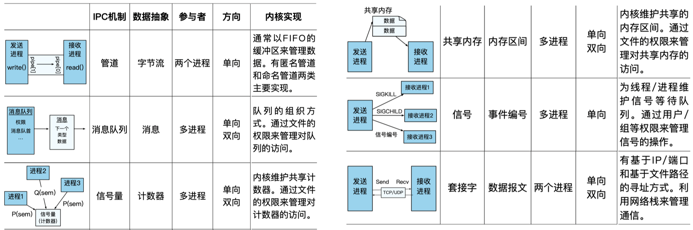


# 同步原语（Synchronization Primitives）

> **同步原语**（Synchronization Primitives）是一个平台（如**操作系统**）提供的用于帮助开发者实现线程之间**同步**的**软件工具**

**另一种划分思路：**

- 同步（order 相关）：强调先后顺序（如 producer 和 consumer 不同情况下谁先做谁后做）
- 互斥（exclusive 相关）：不在乎顺序（一个 critical section 同时只能有一个人跑，核心在于两个人同时跑，不关心谁先谁后）

**多处理器与多核**

- 单核性能提升遇到瓶颈
- 不能通过一味提升频率来获得更好的性能
- 通过增加CPU核数来提升软件的性能

**多核的问题**

- 正确性问题
  - 对共享资源的竞争导致错误，操作系统提供同步原语供开发者使用
- 性能可扩展问题
  - 大部分核无事可干

## 临界区（Critical Section）

任意时刻，有且只有一个线程可以进入临界区执行

**实现临界区抽象的三个要求**

1. 互斥访问：在同一时刻，**有且仅有一个进程**可以进入临界区
2. 有限等待：当一个进程申请进入临界区之后，必须在**有限的时间**内获得许可进入临界区而不能无限等待
3. 空闲让进：当没有进程在临界区中时，必须在申请进入临界区的进程中选择一个进入临界区，保证执行临界区的**进展**  

**可以考虑关闭中断来解决临界区问题吗？**

可以解决单个CPU核上的临界区问题，如果在多个核心中，关闭中断不能阻塞其他进程执行（进程的所有线程都在一个核上跑，是可以的）

## 软件解决方案：皮特森算法

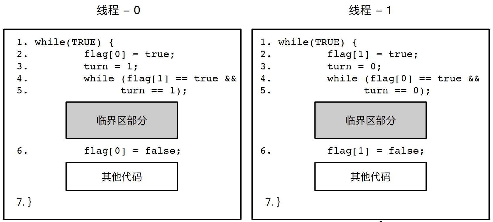


## 四种同步原语

| 同步原语 | 描述                             | 适用场景                           |
| -------- | -------------------------------- | ---------------------------------- |
| 互斥锁   | 保证对共享资源的**互斥访问**     | 共享资源互斥访问                   |
| 读写锁   | 允许读者线程**并发读取**共享资源 | 读写场景并发读取                   |
| 条件变量 | 提供线程**睡眠**与**唤醒**机制   | 条件等待与唤醒                     |
| 信号量   | 协调**有限数量**资源的消耗与释放 | 多资源协调管理（ring buffer 实现） |

- 互斥锁——共享资源的互斥访问：多个线程需要同时访问同一共享数据，应用程序需要保证**互斥访问**避免数据竞争
  - 读写锁——读写场景并发读取：多个线程**只会读取**共享数据，允许读者线程**并发执行**
- 条件变量——条件等待与唤醒：线程等待某条件时**睡眠**，达成该条件后**唤醒**
- 信号量——多资源协调管理：多个资源可以被多个线程**消耗或释放**，正确协同线程获取资源或等待


### 互斥锁（Mutual Exclusive Lock）

共享资源的**互斥访问**

#### 接口

- `Lock(lock)`：尝试拿到锁
  - 若当前没有其他线程拿着lock，则拿到lock，并继续往下执行
  - 若lock被其他线程拿着，则不断循环等待放锁（busy loop）
- `Unlock(lock)`：释放锁
- 保证同时只有一个线程能够拿到锁

> `pthread` 库提供的互斥锁实现
>
> `pthread_mutex_lock(&lock);`
>
> `pthread_mutex_unlock(&lock);`


### 条件变量（Conditional Variable）

线程等待某条件时**睡眠**，条件满足后**唤醒**（避免无意义等待，操作系统的调度器调度其他进程/线程执行）

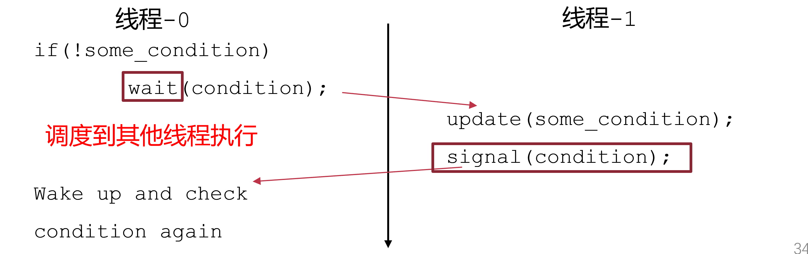

#### 接口

- `void cond_wait(struct cond *cond, struct lock *mutex)`：等待
  - 放入条件变量的**等待队列**
  - 阻塞自己同时释放锁：即调度器可以调度到其他线程
  - 被唤醒后重新**获取锁**
- `void cond_signal(struct cond *cond)`：唤醒
  - 检查**等待队列**
  - 如果有等待者则**移出等待队列并唤醒**

`cond`：标记等待队列（唯一标记在哪个队列中等待，因而实际上可以只用很少的bit来实现）

#### 使用案例

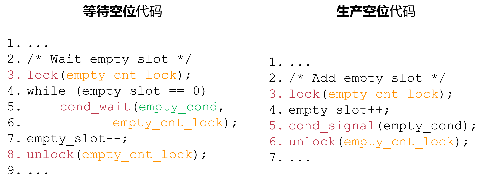


### 信号量（Semaphore）

> 条件变量使用复杂，通过信号量抽象包装与简化：使用**互斥锁**搭配**条件变量**完成资源的等待与消耗，需要单独创建互斥锁与条件变量，并手动通过计数器来管理资源数量。为何不提出一种新的同步原语，便于在多个线程之间**管理资源**？

多个**资源**可以被多个线程消耗或释放（资源管理）

信号量协调（阻塞/放行）多个线程共享有限数量的资源

#### PV 原语

语义上：信号量的值cnt记录了**当前可用资源的数量**

- P 操作（pass）：消耗资源
- V 操作（increment）：增加资源

```c++
// P操作：消耗资源
void sem_wait(sem_t *sem) {
	while(sem->cnt <= 0)	// cnt代表剩余资源数量
		/* Waiting */;
	sem->cnt--; 
}
// V操作：增加资源
void sem_signal(sem_t *sem) {
	sem->cnt++;
}
// 注意：此处代码只展示语义，并非真实实现
```

#### 使用案例

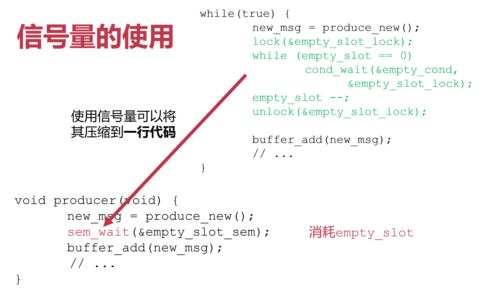

**生产者消费者问题中的使用**

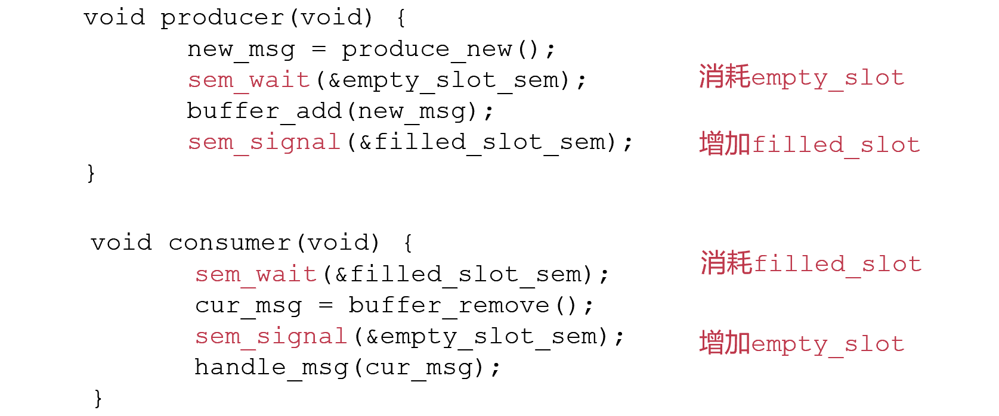

#### 二元信号量与计数信号量

- 二元信号量：初始化资源数量为1
  - 其计数器（counter）只有可能为0、1两个值，同一时刻**只有一个**线程能够拿到资源
- 计数信号量：初始化资源数量大于1
  - 同一时刻**可能有多个**线程能够拿到资源


### 读写锁

读写场景的并发读取（允许读者并发读取）

- 区分读者与写者，**允许读者之间并行，读者与写者之间互斥**
  - 读者在临界区时，读者可以进入临界区，写者不能进入临界区
  - 写者在临界区时，读者不能进入临界区，写者不能进入临界区

#### 使用案例

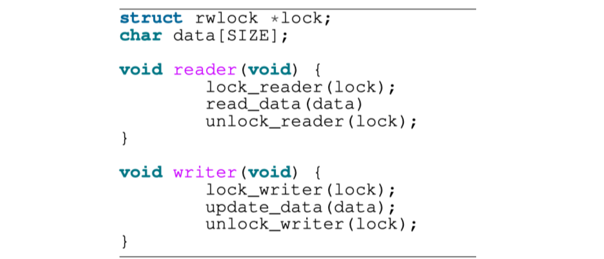

#### 偏向性

读者在临界区，有新的写者在等待，之后另一个读者到来，是读者还是写者先进入临界区

- 偏向写者的读写锁
  - 后序读者必须等待写者进入后才进入
  - 更加公平，数据更新更及时
- 偏向读者的读写锁
  - 后序读者可以直接进入临界区
  - 更好的并行性


## 同步原语对比

互斥锁/条件变量/信号量：

- **互斥锁**与**二元信号量**（只允许0与1的信号量：只有一个资源，即互斥锁）功能类似，但**抽象不同**：
  - 互斥锁有**拥有者**的概念，一般同一个线程拿锁/放锁
  - 信号量为资源协调，一般一个线程signal，另一个线程wait
- **条件变量**用于解决不同问题（睡眠/唤醒），需要搭配**互斥锁**使用
- 条件变量搭配互斥锁+计数器可以实现与信号量相同的功能


## 同步原语带来的问题

**死锁产生的原因：**互斥访问（同一时刻只有一个线程能够访问），持有并等待（一直持有一部分资源并等待另一部分不会中途释放），资源非抢占（即proc_B不会抢proc_A已经持有的锁A），循环等待（A等B，B等A）

**死锁的解决：**死锁的检测与恢复（出问题再处理）、预防（设计时避免）和避免（运行时避免）

### 死锁检测与恢复（出问题再处理）

资源分配图中检测持有/等待锁的环，kill 环中的一个/多个进程

### 死锁的预防（设计时避免）

- 避免互斥访问：通过其他手段（如代理执行，只有代理线程能够访问共享资源，线程发送修改请求给代理线程，由代理线程统一执行，代理锁实现该功能）
- 不允许持有并等待：一次性申请所有资源（`trylock(lck)`，非阻塞，立即返回成功/失败）
  - 注意要避免死锁带来的活锁 Live Lock
- 资源允许抢占：需要考虑如何恢复到被抢占的拿锁前状态（直接抢占锁）
- 打破循环等待：按照特定顺序获取资源（对锁编号，按顺序拿锁）

### 死锁避免（运行时避免）

#### <u>银行家算法</u>

- 所有进程获取资源需要通过**管理者**同意
- 管理者**预演**会不会造成死锁
  - 如果会造成：阻塞进程，下次再给
  - 如果不会造成：给进程该资源  

<u>**分配给能满足其全部资源需求的进程**</u>

对于一组线程 `{P1, P2, ... , Pn}`：

- 安全状态：能找出至少一个执行序列，如 `P2->P1->P5...` 让所有线程需求得到满足
- 非安全状态：不能找出这个序列，必定会导致死锁
- 银行家算法：保证系统一直处于**安全状态**，且按照这个序列执行

##### 算法细节

M个资源 N个线程

- 全局可利用资源：`Available[M]`
  - 代表某一时刻系统中每一类元素的可用个数。这个向量初始化时设置为系统中拥有的第M类资源的总量
- 每线程最大需求量：`Max[N][M]`
  - 该矩阵包含所有线程N对第M类资源的最大需求量
- 已分配资源：`Allocation[N][M]`
  - 该矩阵包含已经分配给所有线程N的M种资源的数量
- 还需要的资源：`Need[N][M]`
  - 该矩阵包含所有线程N对第M类资源还需要的资源数量

##### 案例

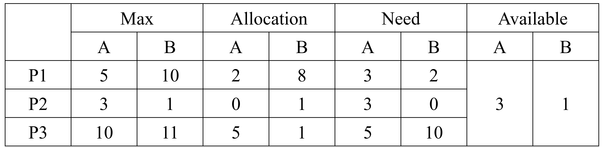

安全序列： `P2 -> P1 -> P3`，通过安全性检查，处于安全状态！（先一次性给P2分配其需要的所有，执行完P2释放之后，Available 变成 A 3 B 2，可以满足P1的需求，一次性给P1分配其需要的所有，执行完P1释放之后，Available 变成 A 5 B 10，可以满足P3的需求）

新来请求：P1请求资源，需要A资源2份，B资源1份

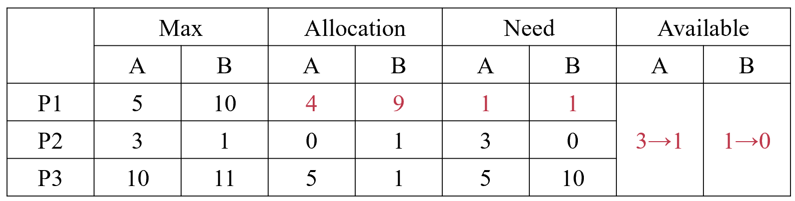

- 假设分配给它，运行安全检查：无法通过（由于此时P1的所有need没有被完全满足，其无法执行完，因此不会释放拿到的资源，看下一个时不能把available加上P1的allocation；此时available不能满足任何一个线程的need）
- 采取行动：阻塞P1，保证系统维持在安全状态


## 同步原语的应用

### 多线程执行屏障：所有线程都要到对应执行点，才能都继续执行（条件变量）

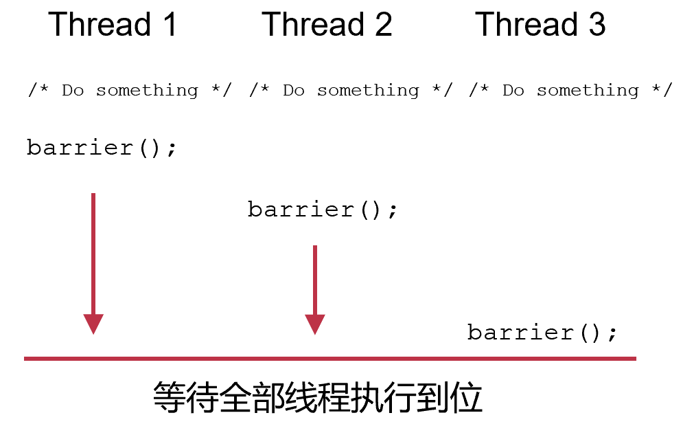

```c++
lock(&thread_cnt_lock);
thread_cnt--;
if (thread_cnt == 0)
  cond_broadcast(cond);	// 唤醒所有等待的线程
while(thread_cnt != 0)
  cond_wait(&cond, &thread_cnt_lock); 
unlock(&thread_cnt_lock);
```

### 等待队列工作窃取：做得快的从做得慢的等待队列中窃取任务帮忙做（互斥锁）

`lock(ready_queue_lock[0]);`

### MapReduce：Wordcount任务（条件变量，信号量）

- Mapper：统计一部分文本自述
- Reducer：一旦其中<u>任意数量</u>的Mapper结束，就累加其结果

```c++
// 条件变量
// Mapper
lock(&finished_cnt_lock);
finished_cnt++;
cond_signal(&cond);
unlock(&thread_cnt_lock);

// Reducer
lock(&finished_cnt_lock);
while(finished_cnt == 0)
  cond_wait(&cond, &finished_cnt_lock);
/* collect result */	// Reducer起来后，可能发现多个mapper finish
finished_cnt = 0;	// 一次性拿走所有的finished的Mapper的结果
unlock(&thread_cnt_lock);

// 信号量，将Mapper的结果视为资源
// Mapper
signal(&finish_sem);

// Reducer
while(finished_cnt != mapper_cnt) {
  wait(&finish_sem);
  /* collect result */
  finished_cnt ++;
}
```

两种方式的不同：

- cv可以多个结果一起collect，sem这种只能一次collect一个
- sem的语义，就是一次只能拿走一个（counter每次只能减一）
- 但cv更复杂

### 网页渲染：等待<u>所有的请求均完成</u>之后再进行渲染（条件变量，信号量）

```c++
// 条件变量
// Request_cb 请求线程
lock(&glock);
finished_cnt ++；
if (finished_cnt == req_cnt)
  cond_signal(&gcond);
unlock(&glock);

// 渲染线程
lock(&glock);
while (finished_cnt != req_cnt)
  cond_wait(&gcond, &glock);
unlock(&glock);

// 信号量
// Request_cb 请求线程
signal(&gsem);

// 渲染线程
while(remain_req != 0) {
  wait(&gsem);
  remain_req --;
}
```

- 必须所有结束，渲染才能继续（渲染线程处于阻塞状态）

两种方式的不同：

- 信号量的案例中渲染线程会被唤醒多次，条件变量案例中渲染线程只会被调用一次
- 与barrier场景的区别：barrier不适合用sem，没有什么适合抽象成等待的资源

### 线程池并发控制：控制同一时刻可以执行的线程数量（信号量）

控制同一时刻可以执行的线程数量

原因：有的线程阻塞时可以允许新的线程替上

```c++
// 信号量，视剩余可并行执行线程数量为有限资源
thread_routine () {
  wait(&thread_cnt_sem);
  /* doing something */
  signal(&thread_cnt_sem);
}
```

### 网页服务器：client向server获取网页，后端更新存在server的网页（读写锁）

- 处理响应客户端获取静态网页需求
- 处理后端更新静态网页需求
- 不允许读取更新到一半的页面

client 读锁，后端写锁

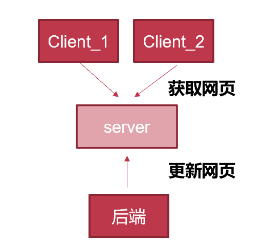

## 同步原语选择依据

- 存在多线程同步需求
  - 保护数据（data）
    - 存在读多写少
      - 是：读写锁
      - 否（或不存在读写场景）：互斥锁
  - 协调线程执行顺序（order）
    - 管理有限数量的资源
      - 是：信号量
      - 否（复杂逻辑）：条件变量


## 同步原语的实现

### <u>原子指令</u>（硬件提供）

保证执行期间不会被打断

- Test-and-set：Intel
- Compare-and-swap：Intel（悲观）
- Load-linked & Store-conditional：ARM（乐观）
- Fetch-and-add：Intel

#### Test-and-set（TAS）

#### Compare-and-swap（CAS）

老的CAS实现会把整个总线都锁住，相当于整个系统中同时能够进行CAS的代码只有一处

#### Load-linked & Store-conditional（LL & SC）

先load一下，读的时候把对应地址的状态记下来，但是如果在后续的执行中有别人修改了，那么在store的时候就会出错，无法成功store进去

> if no one has updated *ptr since the LoadLinked to this address, then change the value of the pointer

```assembly
retry:	ldxr	x0, addr	# LL 读的时候监视addr
	cmp	x0, expected
	bne	out
	stxr	x1, new_value, addr	# SC 修改的时候看addr是否被其他人修改
	cbnz	x1, retry	# 没人修改就写成功，否则回到retry
out:	
```

系统中可以很多地方同时 LL & SC

#### Fetch-and-add（FAA）

### 锁的实现

#### 自旋锁（Spin Lock）

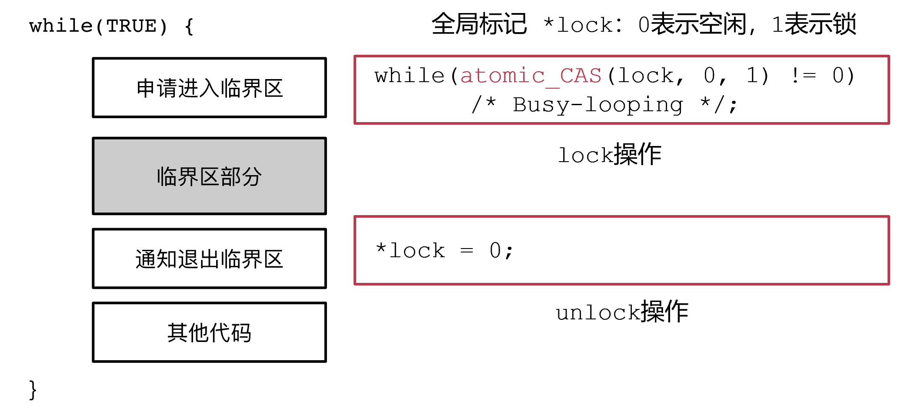

`atomic_CAS(lock,0,1)`：比较 lock 是否等于0，如果是就把lock修改为1

`*lock = 0`：只有一个人可能同时拿到锁，因此不需要在放锁的时候使用原子指令

**实现**

```c++
void lock(int *lock) {
    while(atomic_CAS(lock, 0, 1) 
	!= 0)
	/* Busy-looping */ ;
}

void unlock(int *lock) {
    *lock = 0;
}
```

**问题**

- 有限等待：有的“运气差”的进程可能永远也不能成功CAS => 出现饥饿
- 空闲让进：依赖于硬件 => 当多个核同时对一个地址执行原子操作时，能否保证至少有一个能够成功（这里我们认为硬件能够确保原子操作make progress）

#### 排号锁（Ticket Lock）：实现有限等待

保证竞争者公平性，按照竞争者到达**顺序**来传递锁

**实现**

```c++
// owner：当前拿着锁的
// next：表示目前放号的最新值
void lock(int *lock) {
    volatile unsigned my_ticket =
        atomic_FAA(&lock->next, 1);	// 原子拿号，并递增目前放号的最新值
    while(lock->owner != my_ticket)	// 等待叫号
	/* busy waiting */;
}

void unlock(int *lock) {
    lock->owner ++;	// 叫下一个号
}
```

- 有限等待：按照顺序，在前序竞争者保证有限时间释放时，可以达到有限等待

优化：精准的叫持有对应号的线程来

#### 读写锁

##### <u>偏向读者</u>读写锁实现案例

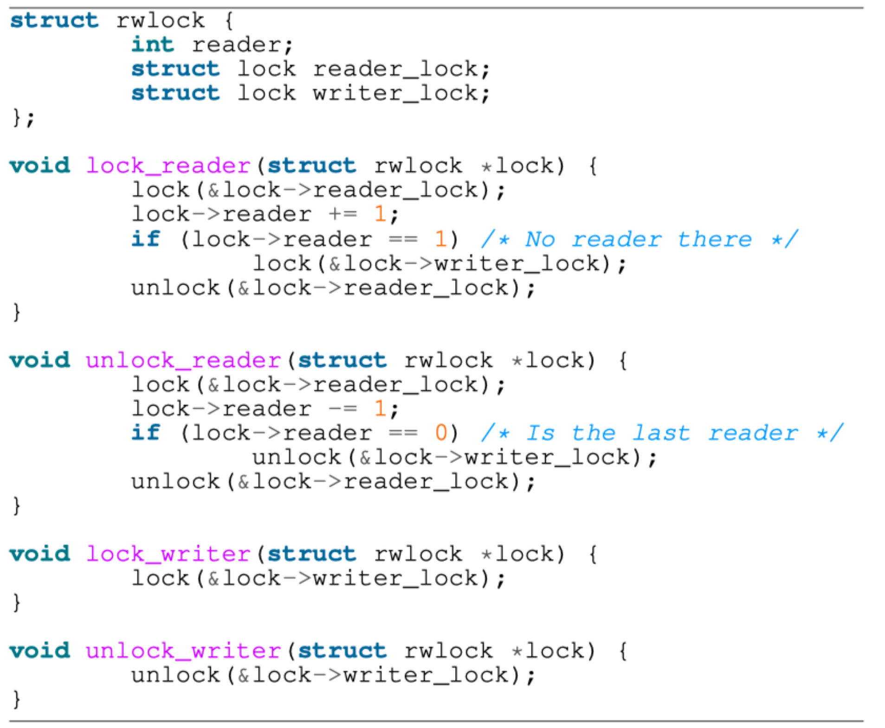

- Reader计数器：表示有多少读者
- 第一个/最后一个reader负责获取/释放写锁
- 只有当完全没有读者时，写者才能进入临界区

**步骤**

读者拿锁：1.获取读者锁，增加读计数器 2.如果没有读者在，拿写锁避免写者进入；有读者在，无需再次获取写锁 3.释放读者锁

读者放锁：1.获取读者锁，减少计数器 2.还有其他读者在，无需释放写锁；无其他读者在，释放写锁，写者可进入临界区 3.释放读者锁

> 注意：读者锁还有阻塞其他读者的语义，因此不能用原子操作来替代

### 条件变量的实现

`yield()`：阻塞自己的线程的系统调用

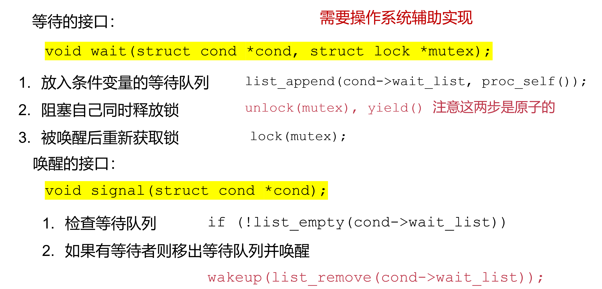

### 信号量的实现

> 为什么信号量没有lost notification的问题呢？因为counter会记录下notification

```c++
// 错误实现
void wait(int S) {
	while(S <= 0)	// 多个线程都在某线程signal之后，进入对应while，导致资源过度消耗
		/* Waiting */;
	atomic_add(&S, -1); 
} 

void signal(int S) {
	atomic_add(&S, 1); 
}

```

```c++
// 实现-1：忙等
void wait(sem_t *S) {
	lock(S->sem_lock);
	while(S->value == 0) {	// Busy looping，无意义等待
		unlock(S->sem_lock);
		lock(S->sem_lock); 	
	}
 	S->value --;	// 此时已经取得sem_lock，防止同时-1
	unlock(S->sem_lock);
} 

void signal(sem_t *S) {
	lock(S->sem_lock);
	S->value ++;
	unlock(S->sem_lock);
}

// 信号量的实现-2：条件变量
void wait(sem_t *S) {
	lock(S->sem_lock );
	while(S->value == 0) {	// 使用条件变量避免无意义等待
		cond_wait(S->sem_cond, S->sem_lock);
	}
 	S->value --; 
	unlock(S->sem_lock);
} 

void signal(sem_t *S) {
	lock(S->sem_lock);
	S->value ++;
	cond_signal(s->sem_cond);	// 每次都要signal，很可能无人等待
	unlock(S->sem_lock);
}

// 实现-3：减少signal次数
void wait(sem_t *S) {
	lock(S->sem_lock );
 	S->value --; 
	while(S->value < 0) {	// value减到负数代表有人等待
        // 但是比如S->value = -3，signal 后S->value = -2，还是不满足上面while的条件
	  cond_wait(S->sem_cond, S->sem_lock);
	}
 	unlock(S->sem_lock);
} 

void signal(sem_t *S) {
	lock(S->sem_lock);
	S->value ++;
	if (S->value < 0)	// 需要额外的计数器用于单独记录有多少可以唤醒的，加入条件判断是否需要wake
	  cond_signal(s->sem_cond);
	unlock(S->sem_lock);
}

// 实现-4：条件变量 + 互斥锁 + 计数器 = 信号量
// 新增一个变量 wakeup：等待时可以唤醒的数量
// value：正数为信号量，负数为有人等待
// 某一时刻真实的资源数：value < 0 ? wakeup : value + wakeup
void wait(sem_t *S) {
     lock(S->sem_lock);
     S->value --;
	 if (S->value < 0) {
                do {
                        cond_wait(S->sem_cond, S->sem_lock);
                } while (S->wakeup == 0);
                S->wakeup --;
        }
        unlock(S->sem_lock);
}

void signal(sem_t *S) {
        lock(S->sem_lock);
        S->value ++;
        if (S->value <= 0) {
            	// 有人等待
                S->wakeup ++;
                cond_signal(S->sem_cond);                
        }
        unlock(S->sem_lock);
}
// 为何要do while? 有限等待
// 线程0挂起等待，线程1发signal，之后线程1 wait拿到资源，线程0被唤醒，发现没有可用的资源
```

## Read Copy Update（RCU）：更高效的读写互斥

对于读写锁的改进，希望让读者即使在有写者写的时候随意读（这样就不一定读到最新的；同时旧值被改写为新的是原子操作，中间状态不会被读到）

思路：写者另拷贝一份数据来进行修改，修改完成之后把指向原本数据的**指针**改为指向拷贝（修改过程是原子性的）（需要将数据抽象为指针，由于硬件对于原子操作修改的大小支持有限）

需要一种能够**类似之前硬件原子操作**的方式，让读者要么看到旧的值，要么看到新的值，不会读到任何中间结果。

#### 单拷贝原子性（Single-copy atomicity）

> 单拷贝原子性（Single-copy atomicity）：处理器任意一个操作的是否能够原子的可见，如更新一个指针

此处原子性的操作是指针更新，而不是具体内容

#### RCU 订阅发布机制

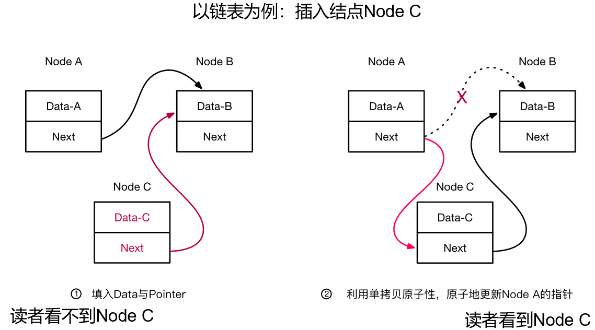


对于update C可以依据C新创建C'，修改需要更新的字段后，之后更新A的next指向C'

**局限性**

1. 无法使用在复杂场景下如双向链表
2. 需要在**合适**的时间，**回收**无用的旧拷贝


问题：无用的旧拷贝（**更新**完指针时，还有读者在被修改前的数据上读，此时不能回收。需要知道读之前旧拷贝的读者什么时候读完）

#### RCU 宽限期

需要知道读临界区什么时候开始，什么时候结束

**最后一个可能看到旧拷贝的读者离开临界区，才能够回收旧拷贝**

```c++
void rcu_reader() {
	RCU_READ_START();	// 通知RCU，读者进临界区了

	/* Reader Critical Section */

	RCU_READ_STOP();	// 通知RCU，读者出临界区了
}
// 可以使用计数器实现，有多少 reader 还在临界区内
```

## RCU 与 读写锁 对比

相同点：允许读者并行

不同点：

- 读写锁
  - 读者也需要上读者锁
  - 关键路径上有额外开销
  - 方便使用
  - 可以选择对写者开销不大的读写锁
- RCU
  - 读者无需上锁
  - 使用较繁琐
  - 写者开销大


## 同步原语与多核

多核心带来的**可扩展与性能**问题

### 并行计算的理论加速比（理论上限）

**Amdahl’s Law**


### 自旋锁带来的性能断崖

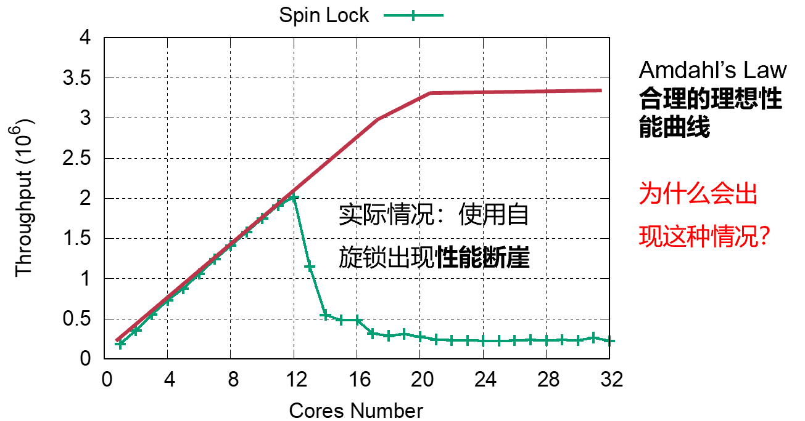

单核心，访存时数据在 L1 cache，然而多核并不共用 L1 cache！因此会从一个核的缓存搬运到另一个核，从而导致性能下降！

### 多核环境中的缓存结构

如果简单的将多核当成一个核心，共享缓存设计（所有核心共用L1到L3缓存），将会有高速缓存成为瓶颈（单点竞争），硬件物理分布离核心远，速度减慢等问题

#### 多级缓存

- 每个核心有自己的**私有**高速缓存（L1 Cache）
- 多个核心共享一个**二级**高速缓存（L2 Cache）
- 所有核心共享一个**最末级**高速缓存（LLC）

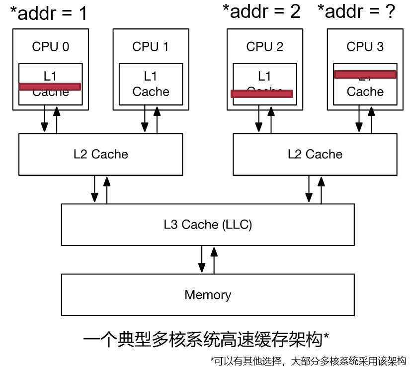

- 非一致缓存访问（NUCA）
- 数据一致性问题（如CPU0把addr地址的数据赋值1，CPU2把addr地址的数据赋值为2，那么CPU3应该看到1还是2？）

#### 缓存一致性

- 保证不同核心对同一地址的值达成共识

- 多种缓存一致性协议：窥探式/目录式缓存一致性协议  


##### 窥探式缓存一致性协议

使用者在开始使用/结束使用的时候显式通知别人

##### 目录式缓存一致性协议

###### MSI状态迁移

**缓存行（cache line）**处于不同状态（MSI状态）

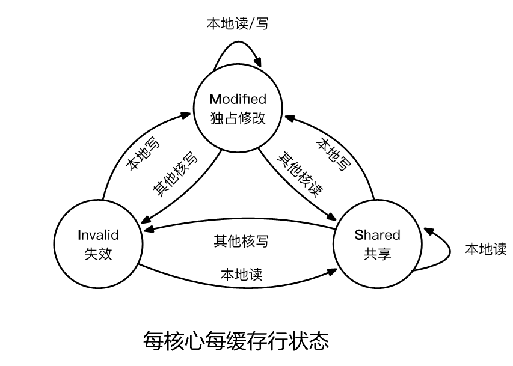

- 独占修改 （**M**odified）：该核心独占拥有缓存行，本地可**读**可**写**。其他核**读**需要迁移到**共享**，其他核**写**需要迁移到**失效**。
- 共享（**S**hared）：可能多个核同时有缓存行的拷贝，本地可**读**。本地**写**需要迁移到**独占修改**，并使其他核该缓存行**失效**，其他核**写**需要迁移到**失效**。
- 失效（**I**nvalid）：本地缓存行失效，**本地不能读/写**缓存行；本地**读**需要迁移到**共享**，并使其他核该缓存行迁移到**共享**，本地**写**需要迁移到**独占修改**，并使其他核心该缓存行**失效**。

共享状态可以优化性能（类似于只读并行）

###### 全局目录项

通知其他核心需要迁移缓存行状态

全局目录项：记录缓存行在不同核上的状态，通过总线通讯

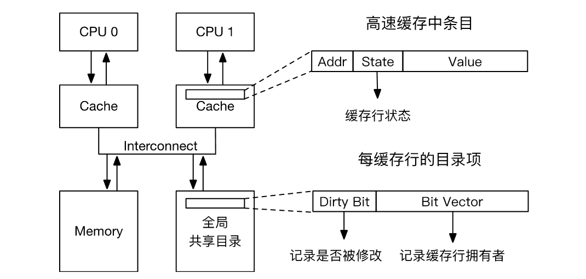

###### 案例

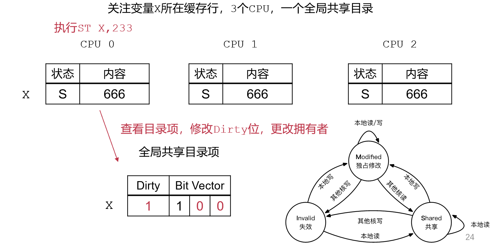

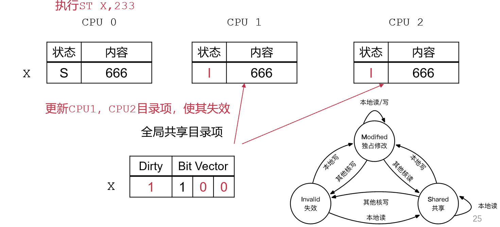

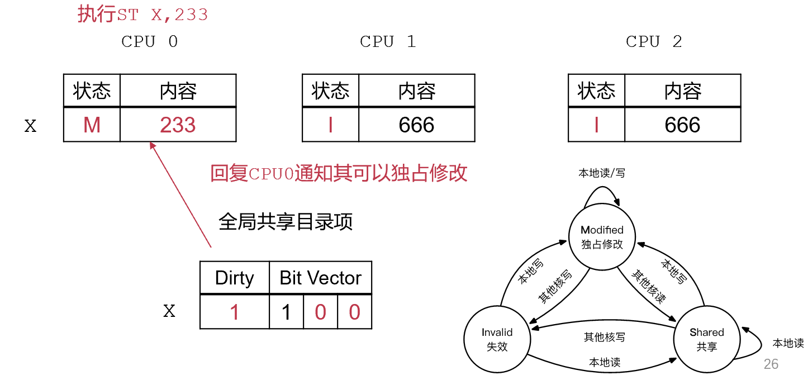

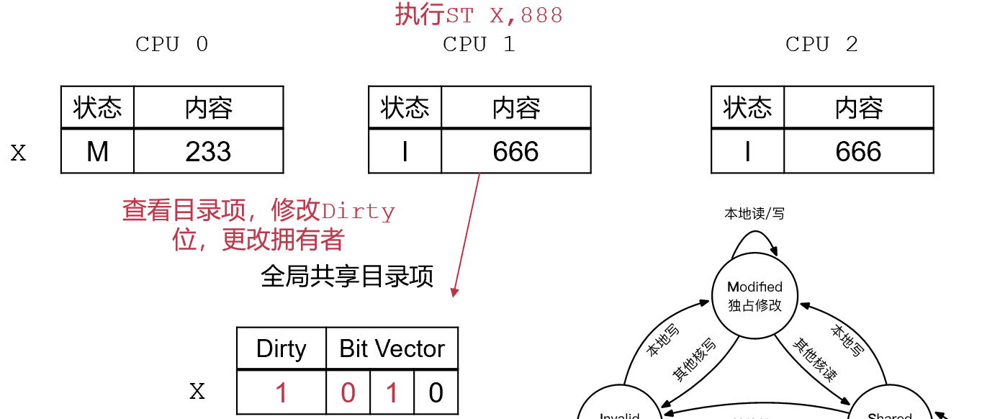

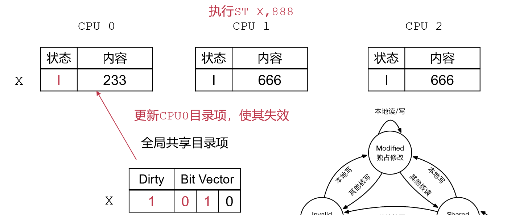

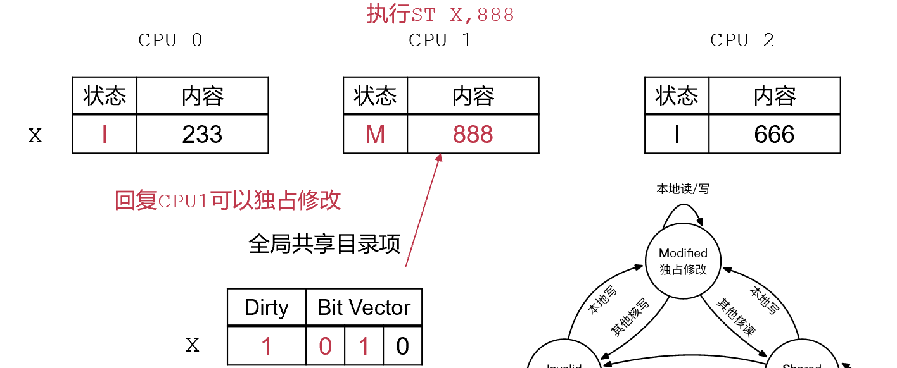

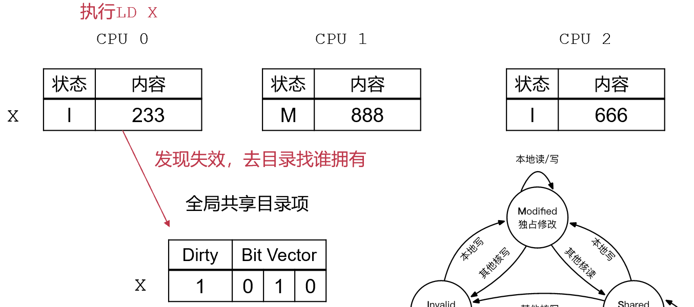

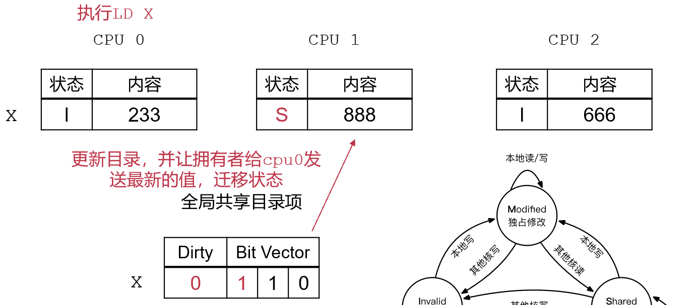

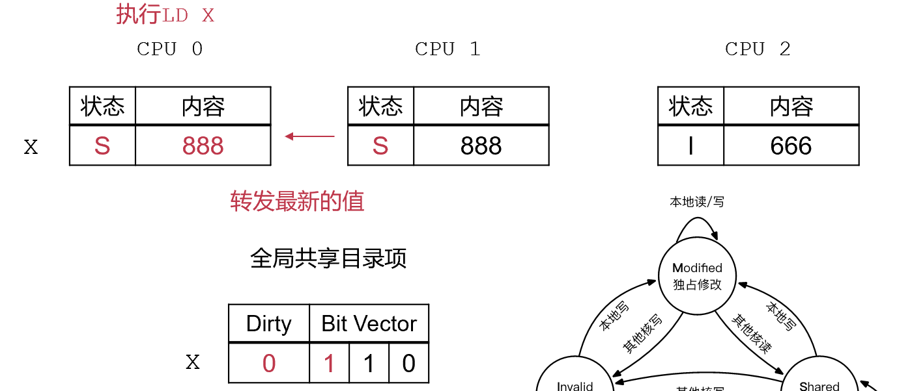

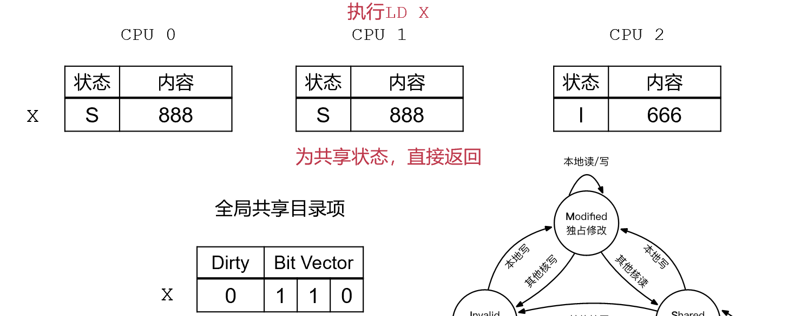

Bit Vector：指代拥有者

### 可扩展性断崖的原因

对**单一缓存行**的竞争导致严重的性能开销

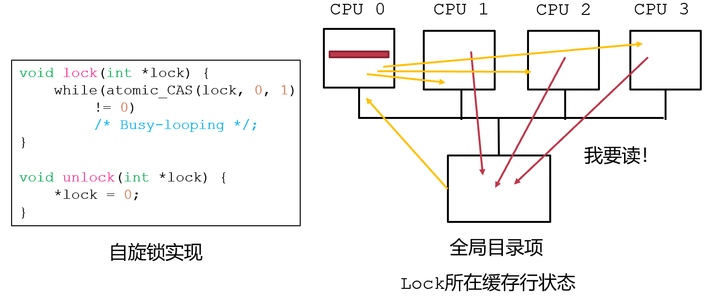

所有都在同一个lock字段竞争

### MCS锁（解决可扩展性问题）

核心思路：在**关键路径上**避免对单一缓存行的高度竞争（完全解决竞争不现实：将其移到关键路径之外）

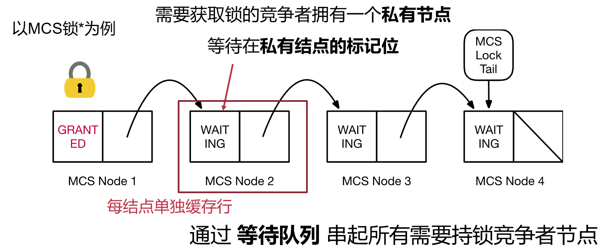

- 每个锁的节点使用的是不同的缓存行
- 新的竞争者加入等待队列：新竞争者出现后，先填写自己结点的内容，通过**原子操作**更新MCS锁的尾指针，最后链接入等待队列
- 锁持有者的传递：头结点放锁，传递给下一个等待者

#### 实现

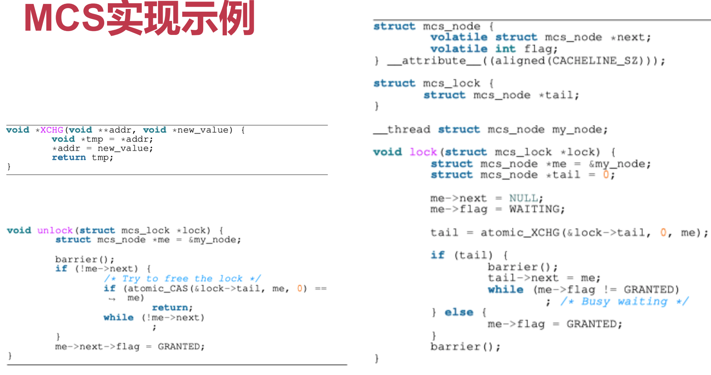

#### 性能分析（不再会高频竞争<u>全局</u>缓存行）

- 放锁时只是修改了下一个节点的状态（写一个私有缓存行），只invalid了一个CPU的数据

#### 问题

- 内存开销（每一个锁的竞争者都需要申请一个节点）
- 过程复杂，对于非竞争状态额外开销较大（MCS在竞争程度低时，锁性能差）

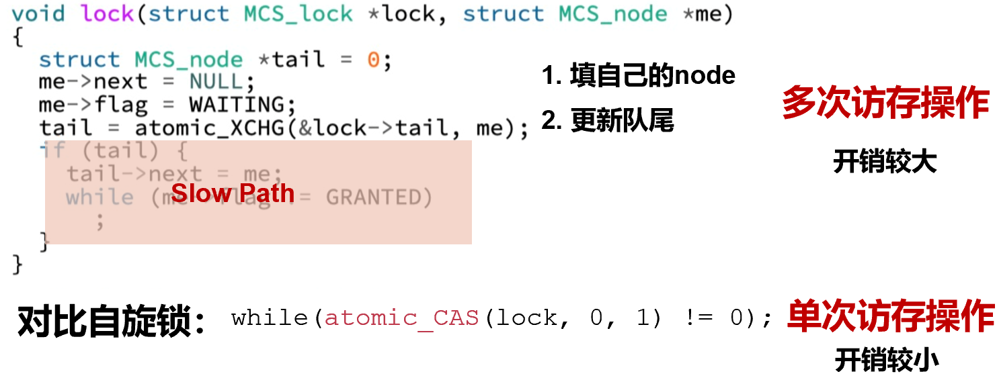

### QSpinlock（Linux 中的同步原语）

- 竞争程度低：快速路径，使用类似自旋锁设计，加锁/放锁流程简单
- 竞争程度高：慢速路径，使用类似MCS锁设计，竞争者多时可扩展性好

```c++
void lock(lock_t lock) {
    /* fast path */
    /* 快速路径，只需要一次原子操作 */
    if (spin_trylock(&lock->spin) == SUCC)
	return;

    /* slow path */
    /* 失败则加入mcs队列并等待 */
	mcs_lock(&lock->mcs);
    spin_lock(&lock->spin);
    mcs_unlock(&lock->mcs);
}
```

先尝试拿spin_lock，拿不到再加入mcs队列并等待

**好处**

- 不用修改原来的接口
- 竞争程度低的时候性能好，高的时候可扩展性好

### 非一致内存访问（NUMA）

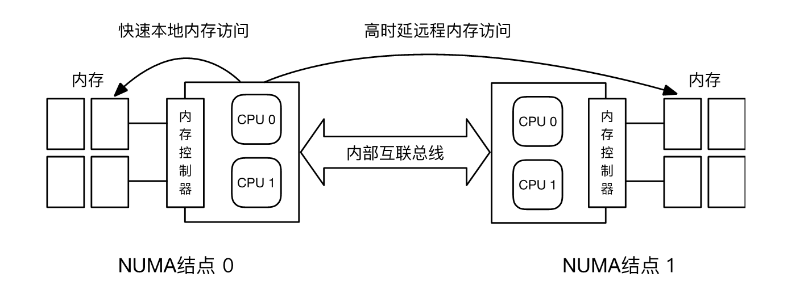

- 避免单内存控制器成为瓶颈，减少内存访问距离
- 一个内存控制器 放中间，内存访问都慢；放两个，局部都快
- 常见于多处理器（多插槽）机器（单处理器众核系统也有可能使用，如Intel Xeon Phi）

**跨结点的缓存一致性协议开销巨大**

Challenge: 锁**不知道**临界区中需要访问的内容！

#### Cohort 锁

核心思路：在一段时间内将访存**限制在本地**（同一个时间内访存尽量在同一个节点，节点内竞争者都处理完之后，再去到下一个节点；全局锁尽量减少跨节点传递）

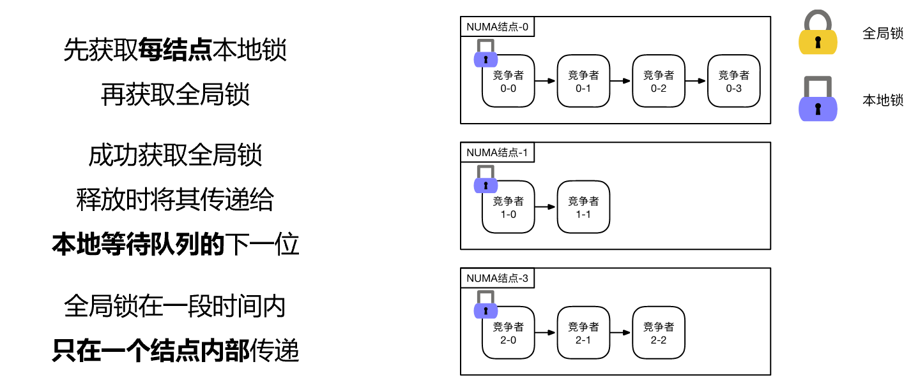


但是还是会涉及跨NUMA的内存访问，性能最终稳定在理想情况之下

#### 代理锁：通过代理执行避免跨节点访问

- 与其让缓存行在不同的NUMA节点之间移动，不如一直将其**限定**在一个**核心上**
- 都找代理锁 lock server 来做，所有缓存都在 lock server 那儿（临界区转换为可以远程执行的闭包；进临界区都向 lock server 发请求）

#### 性能对比

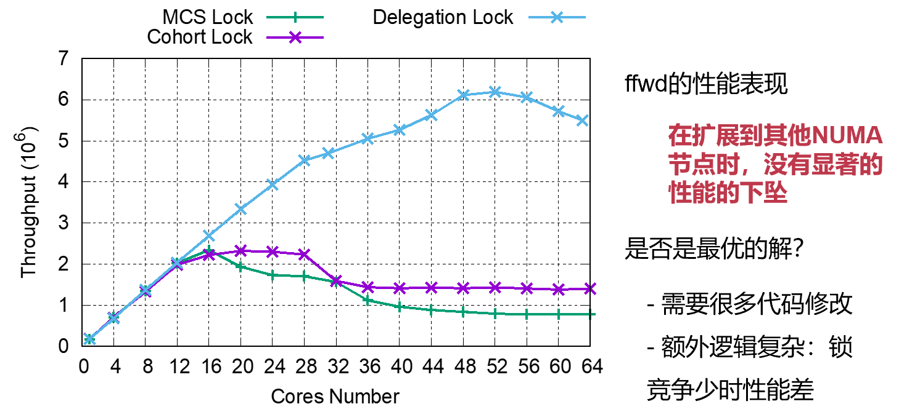

### 非对称多核的可扩展性（如 Apple M1 大小核）

而当目标缓存行竞争程度较高时，自旋锁将展现**小核倾向性，**即小核更容易获取锁此时，**非公平锁**（TAS）**吞吐率与时延**均出现可扩展性**断崖**

**传统同步原语无法适应异构场景**

1. 不同核处理性能各异，通过获取公平性不再适用：对于保证**获取公平性**的同步原语（如Ticket Lock，MCS Lock等），小核执行临界区时间更长，阻塞大核执行，导致**吞吐率**受到影响
2. 不同核原子操作成功率不同，带来性能问题：对于不保证获取公平性的同步原语（如TAS spinlock等），当大核成功率高**（大核倾向性）**，小核的**锁延迟**受到较大影响，甚至会出现**饥饿**；当小核成功率高**（小核倾向性）** ，**吞吐率**会大幅下降，且大核拥有较长**锁延迟**

**如何在非对称多核中扩展**

1. 遵循获取公平性的锁传递顺序无法适用AMP，需要设计适合AMP的锁传递顺序。
2. （针对获取锁的时间顺序）允许大核乱序到小核之前拿锁可以有效提升吞吐率，但乱序程度必须可控，避免违背应用时延需求。

#### 非对称多核感知锁 LibASL

根据**时延需求指导的锁传递顺序**

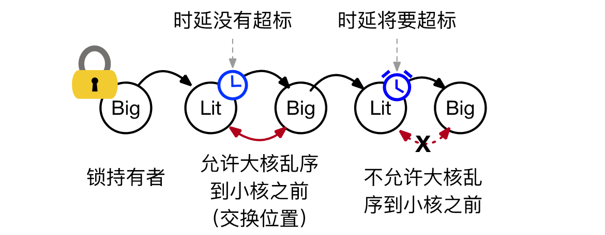

效率优先，兼顾公平；按照获取锁的时间顺序上（FIFO），在**不违背小核时延需求的前提**下，

**尽可能让大核乱序**到小核之前，达到更高的吞吐率


## 读写锁的可扩展性

性能问题：读者需要抢一把全局互斥锁，并对一个全局计数器自增

### 大读者锁

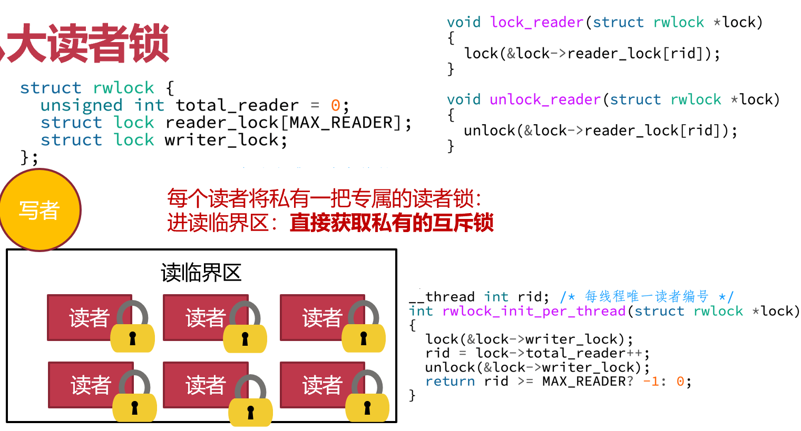


写者开销巨大

# 文件系统

空间的统一管理

## 理解一个文件系统的11个问题

1. 文件系统使用磁盘块的基本单位是什么？（一般磁盘块大小是4K，需要管理数以亿记的block）
2. 一个文件的组织方式？（文件并不是个必要的抽象！其它抽象如KV-store）
3. 空闲空间的组织方式？（bitmap/linklist/buddy system）
4. 目录的结构是什么？
5. 是否支持硬链接？
6. 是否支持软链接？
7. 磁盘存储的整体布局是什么？（元数据在头部/尾部/很多地方）
8. 如何根据文件名查找到一个文件？
9. 如何读取一个文件？
10. 如何为一个文件分配新的磁盘空间？
11. 如何挂载一个文件系统？

## UNIX v6 文件系统（inode 文件系统）

### inode：记录文件多个磁盘块的位置

- 为了支持多个磁盘块构成的文件，总得有一个地方记录这些磁盘块在哪里（inode）
- 每个块号指向一个数据块，inode 中放很多块号组织成文件

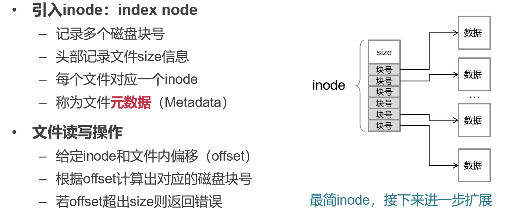

### inode 文件系统的存储布局

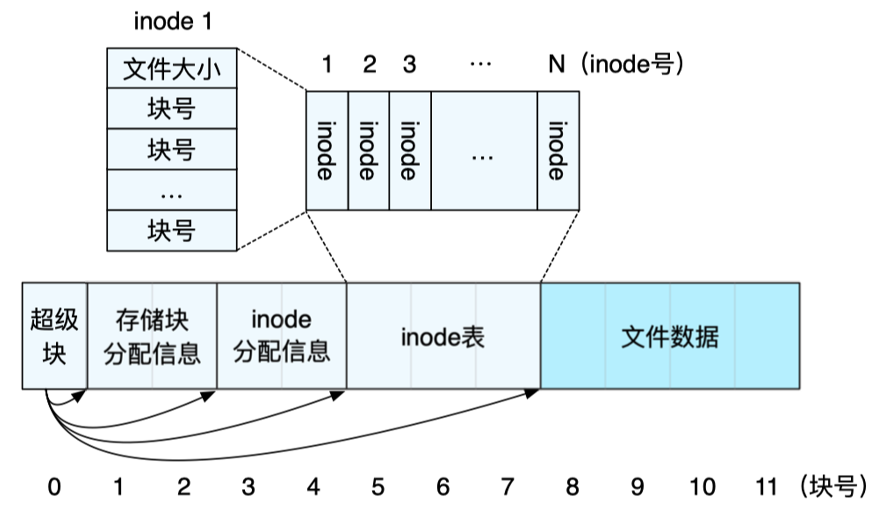

- inode表：记录所有inode
  - 可以看成inode的大数组
  - 每个inode使用作为索引
  - 此时，inode号即为文件名
- inode分配信息（位图）
  - 记录哪些inode已分配，哪些空闲
- 超级块：Super Block
  - 记录磁盘块的大小、其他信息的起始磁盘块位置，等等
  - 是整个文件系统的元数据

**inode表的假设**

- 一个inode记录的所有块指针在磁盘上的空间是连续的
- 多个inode在磁盘上的空间是连续的

### inode文件系统的基本操作

- 加载文件系统
  - 首先读取超级块（super block），然后找到其他信息
- 创建新文件
  - 根据inode分配信息找到空闲inode，将inode对应的bit设置为1
  - 返回inode在inode表中的索引，作为文件名
- 查找文件（根据inode号）
  - 在inode表中根据inode号定位该inode
- 删除文件
  - 在inode分配表中，将该inode对应的bit设置为0

### 多级inode

问题：单级inode过大

**一个4GB的文件，对应inode有多大？**

- 假设磁盘块号（块指针）为8-Byte（64-bit）
- inode大小：4GB/4KB * 8 = 8MB
- 若文件大小为4TB，则inode大小为8GB！
- 如果要支持4TB，预留inode时每个大小都得分8GB！

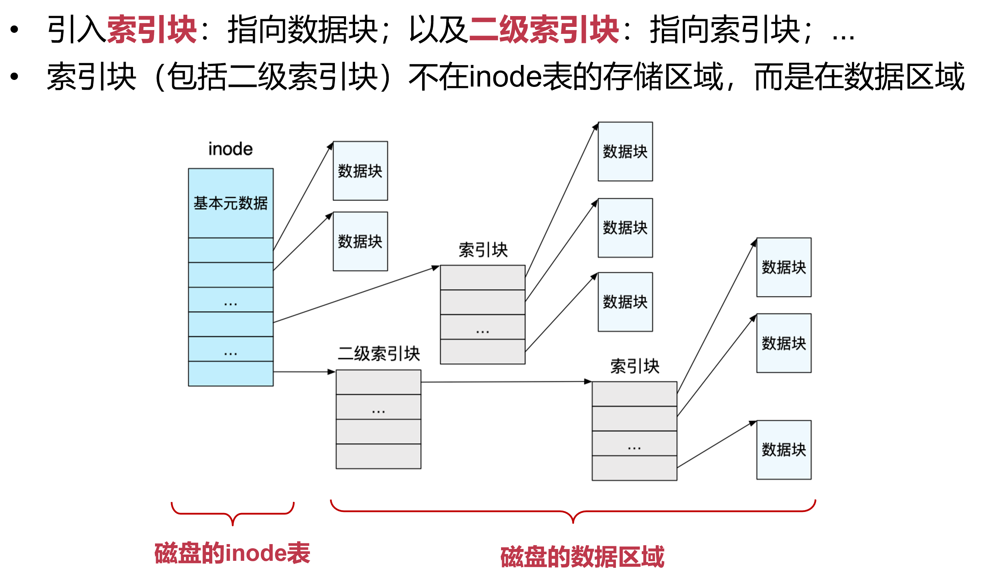

**一个多级inode占用的空间很少**

- 一共只有15个指针（即记录磁盘块），这些指针占用120-Byte
- 包含12个直接指针（小文件直接快速访问），3个间接指针，1个二级间接指针
- 文件最大为：4K x 12 + 4K x 512 x 3 + 4K x 512 x 512 = 48K + 6M + 1G

**多级inode和多级页表有什么关系？**

- 都是要把**一个命名空间翻译到另一个命名空间**
  - 多级inode：文件的offset（内偏移）翻译成磁盘块号
  - 多级页表：虚拟地址翻译成物理地址
- 都是时间换空间
- 如果单级页表，那么其大小必须覆盖VA范围（单级页表索引，如 page table 不管用了多少，那就需要 0 到 4G 都要有预留页表项），但是大部分应用程序不会用完虚拟地址空间，中间会有很多空洞！多级页表中的索引VA不一定每个都对应有值，省空间，但是查找时更耗时

**为什么不用inode的方式设计页表？**

- VA中间是有很多空洞的，但是文件中间是不会有空洞的；inode中直接指针如果第四个指向的block有数据，那么第三个一定指向的也有数据
- MMU是硬件实现，相对不灵活，需要有一个固定的规范化流程规范；但是inode是软件控制，可以更灵活，比如 12 个直接指针，数是可以改的

**格式化**

- 格式化后一个文件系统能存放的文件数量上限是有限的！（格式化之后的inode table大小限制）
  - 后面添加一个动态大小的inode表

### 目录文件与目录项（为了用字符串文件名而不是 inode number 指代文件）

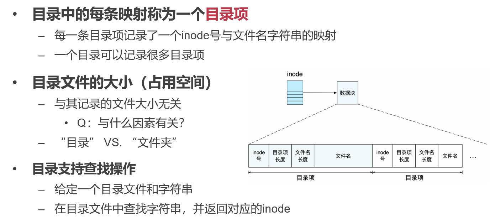

### 文件的查找过程

/os-book/fs.tex


底下 block 30 和 33 里面是二级 block，数字指代的是 block 号

### 打开和读写文件

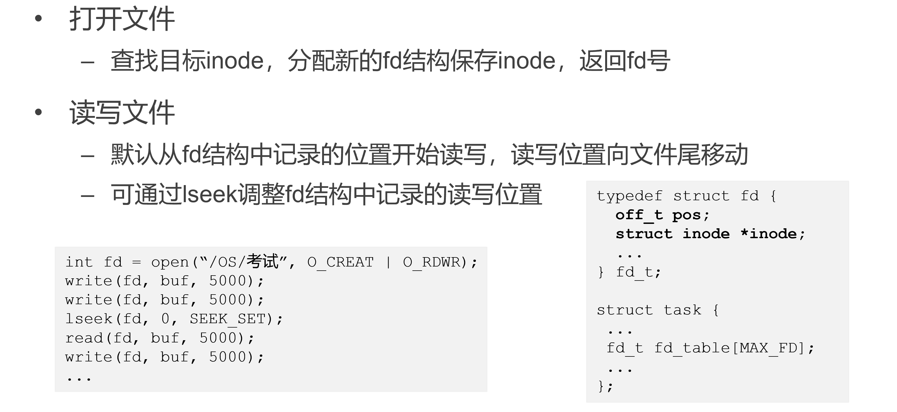

### mmap()：用内存接口来访问文件


**文件内存映射的优势**

- 对于随机访问，不用频繁lseek
- 减少系统调用次数
- 可以减少数据copy，如拷贝文件，数据无需经过中间buffer
- 访问的局部性更好
- 可以用madvice为内核提供访问提示，提高性能

## Ext2 文件系统

- 将磁盘分为多个块组，每个块组中都有超级块，互为备份（不会把所有东西都放在头部，而是分而治之，每一个组都是一个小硬盘）
- 超级块（Super Block）记录了整个文件系统的元数据
- 块组描述表记录了块组中各个区域的位置和大小


### Ext2 的常规文件

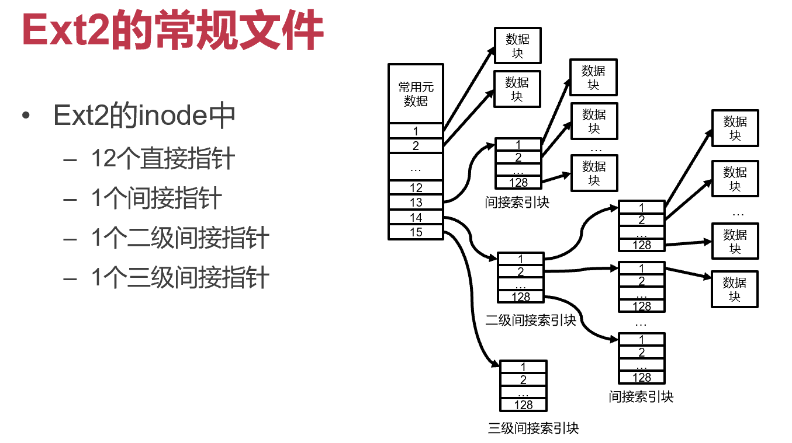

### <u>区段（Extent）：减少要存的元数据信息</u>

思想：如果数据块物理上连续（比如视频文件，就很常见），只需要保存**起始块地址和长度**即可！

区段（Extent）是由**物理上连续的多个数据块**组成

- 一个区段内的数据可以连续访问，无需按4KB数据块访问
- 可以减少元数据的数量

### Ext4 文件存储 **–** 区段树（Extent）

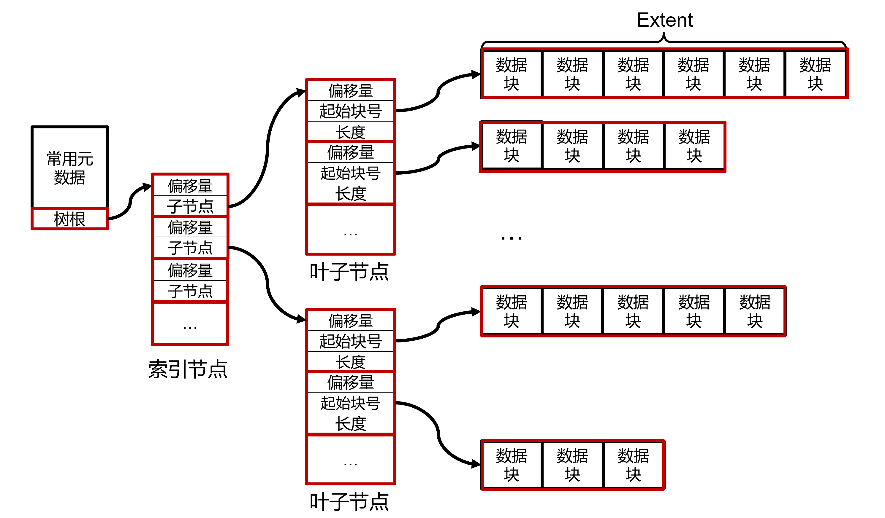

本来连续的要记录多个块号，现在变成一个起始块号和长度

**trade off**

- 如果过于碎片化，inode（元数据）的大小反而会变大
- 由于每一个 extent 大小不一致，无法像之前那样直接通过偏移量找到目标，查找变慢
  - 叶子节点记录偏移量，可以类似二分查找（偏移量到偏移量+长度就知道范围）
  - 同时实际上瓶颈还是在读磁盘（读数据块进内存），查找时间多一点没关系（但是近些年硬件已经变快，查找逐渐成为瓶颈）
- 时间换空间

### Ext2 的目录文件

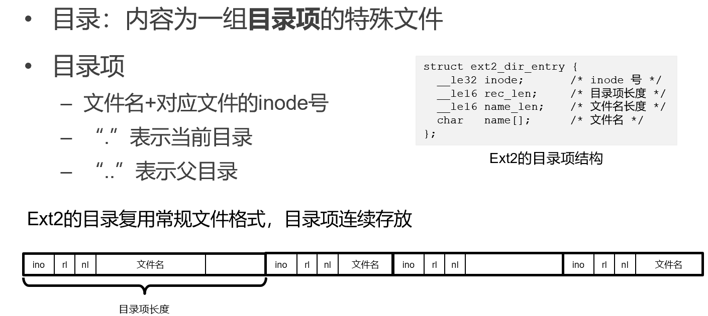

### 其他常见的文件类型


设备文件，如 `/dev/ttys0`

## ChCore 的文件系统（内存模拟文件系统）

### ChCore 的常规文件

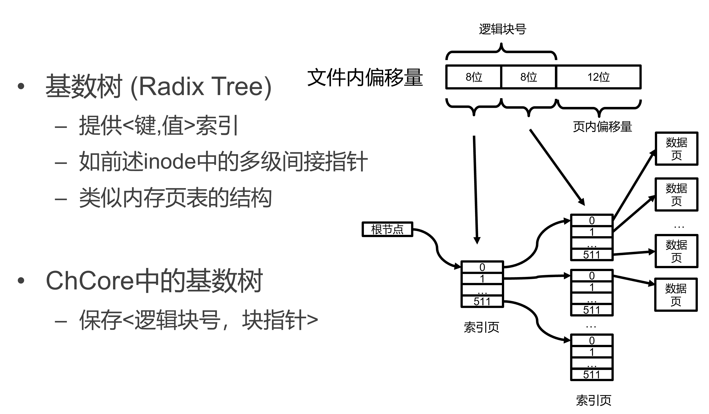

基数树 (Radix Tree)

### ChCore 的目录文件


## FAT 文件系统：基于 Table 的文件系统（类似链表串起来）

### FAT32存储布局

cluster（类似于 inode 的 block）大小可变

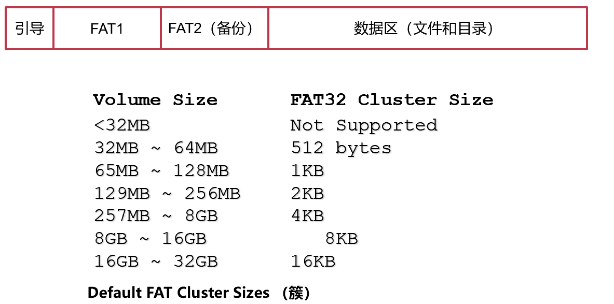

### FAT：文件分配表（链表的方式，串起来）

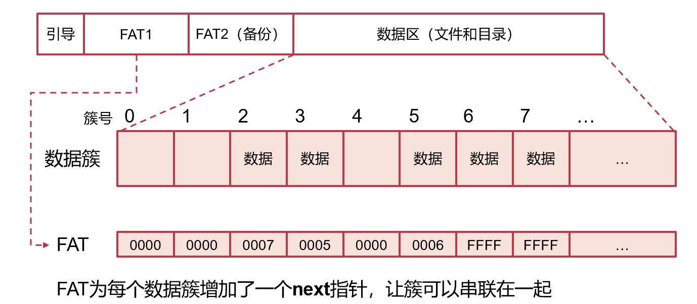

数据块和FAT表存在着一一映射的关系。

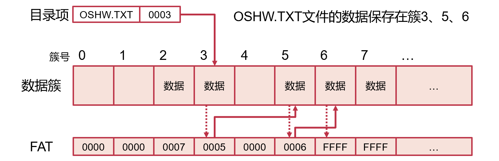

- 0003：文件的第一个cluster是0003号数据块上，直接从数据区的0003处拿
- 依据0003号位置对应的FAT表里面的0005，去找0005位置的数据；之后看0005位置的FAT表里面，找到0006对应的数据块，再看0006对应的FAT表中是FFFF（EOF），文件结束

### FAT32中的目录项

- 目录同样是一种（特殊的）文件 —— 与基于inode的文件系统一样

- 目录文件包含若干个目录项，每个目录项记录32个字节

- 四种目录项：

  短文件名目录项、长文件名目录项、卷标目录项、"."和".."目录项

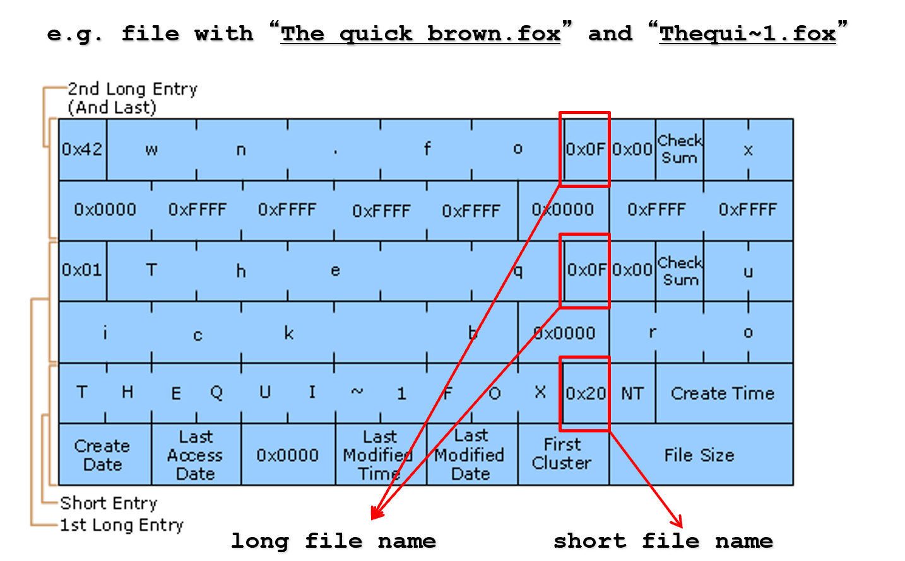

- 上图是一个目录文件，文件名（文件名形式 8.3 即文件名八个字符，后缀三个字符）大小不能修改

- 文件名如果长度超过 8.3 的形式，会生成短文件名：如 "The quick brown.fox" -> "Thequi~1.fox"

  - 如果后一个文件已经存在，怎么办？

    尝试THEQUI~2FOX，若还冲突，则尝试：THEQUI~3FOX；若还冲突，则尝试： …；若还冲突，则尝试：T~999999FOX；若还冲突，则报错

  - 使用短文件名打开文件也可以打开（实际上文件）

- 将好几个目录项拼起来（标志位处不能动，不能变成文件名的一部分）来表示长文件名

**FAT32最大支持多大的单个文件？为什么？**

4G，因为目录项中 file size 字段只有 32 bit

**应该如何扩展FAT，使其能支持更大的文件？**

file size 字段用更多字节保存

**为什么U盘一般用FAT？**

- 兼容性问题（win 与 mac 都能兼容，如 NTFS 就不行）
- 日志问题，没有日志，减少写
- 简单

**为什么FAT不支持link（硬链接）？**

无法统计link count；FAT32 目录项中记录了文件名及文件很多的元数据，inode 目录项中只记录文件名以及inode number！这导致如果FAT支持link（硬链接），同一个文件的多个目录项在文件被修改时，类似file size，modify time等都需要consistent的修改，很困难

**为什么有时候会出现图片等下半部分变为乱七八糟的色块这样的错误？**

一串中一旦有一个FAT表地方出问题，整一条链就出问题（可以依据此判定用的是FAT）

**为什么FAT会有大量的随机读写？**

linklist中跳来跳去，目录项对比和顺序存储

### 应用

数码相机 SD 卡等

## 磁盘碎片

- 磁盘碎片是如何产生的？
  - 思考场景：增大一个文件
  - 表现形式：磁盘使用块不连续
  - 磁盘碎片会导致什么问题？
- 如何避免磁盘碎片？
  - 做好磁盘的预留（预留空间，文件增长的时候尽量用其预留的空间）
  - 利用内存缓存延迟写入磁盘
    - 写入时尽可能整合在一起

## exFAT Highlights

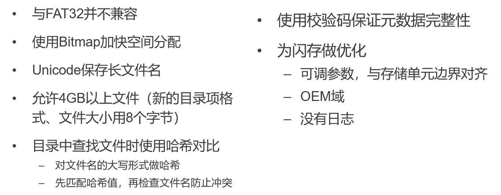

- 允许4GB以上文件（新的目录项格式、文件大小用8个字节）
  - 因而与FAT32并不兼容（目录项字段如filesize大小都不一样）

## NTFS 文件系统：基于数据库的文件系统

### NTFS 存储布局

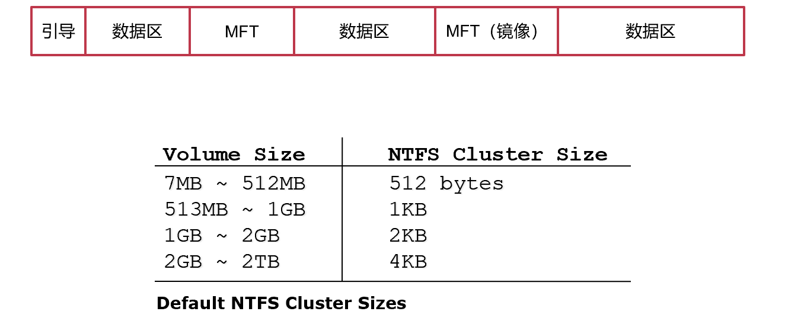

### NTFS 主文件表 MFT

- MFT是一个**关系型数据库**
  - MFT中的每一行对应着一个文件
  - 每一列为这个文件的某个元数据
  - NTFS 中所有的文件均在 MFT 中有记录
  - 一般会预留整个文件系统存储空间的12.5%，专门保存MFT
- 一切皆文件
  - NTFS 中的所有被分配使用的空间均被某个文件所使用
  - 用于存放文件系统元数据的空间，也会属于某个保留的元数据文件
  - 如：MFT本身，也是一个文件，其元数据保存在MFT中（递归）

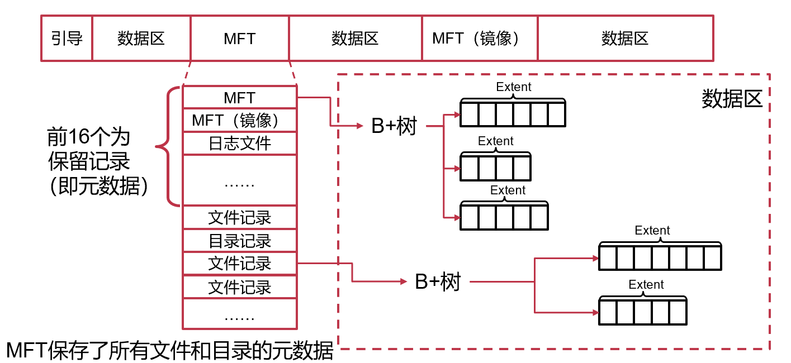


#### 主文件表包含的文件（保留文件）

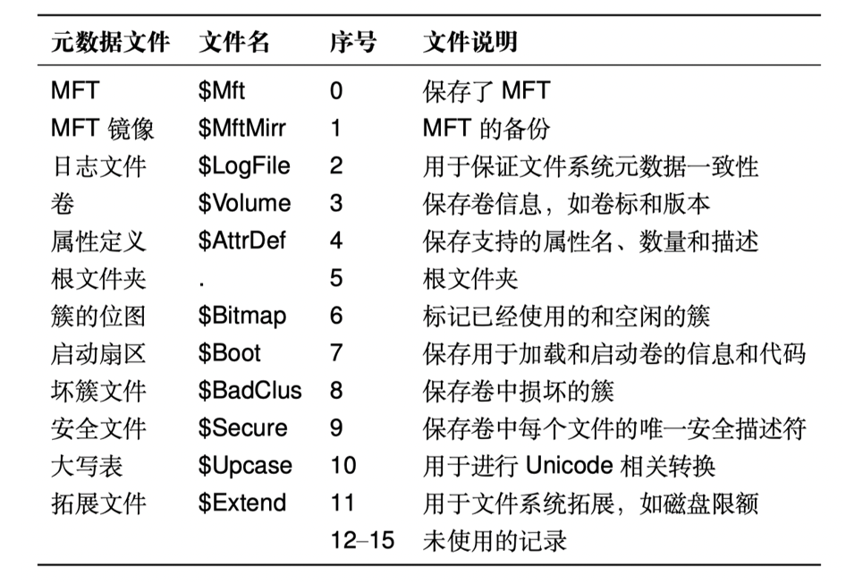

#### 主文件表记录

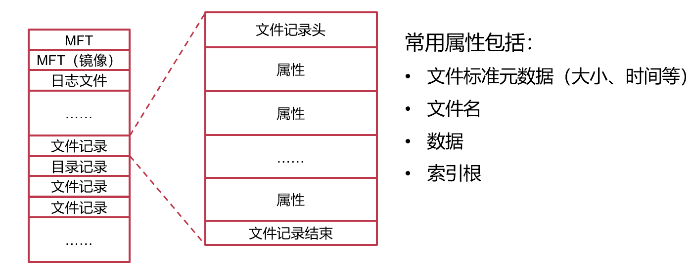

- 属性是可以新添加的
- 一行文件记录大致有1K
  - 优化：把很小的文件直接放在文件记录对应的位置上的特定字段

### NTFS 数据保存位置和目录项

- 非常驻文件（大文件/目录）
  - 数据区的B+树和区段
- 常驻文件（小文件/目录）
  - 大小不超过MFT记录的最大值（1KB）
  - 内嵌在MFT中保存（在"数据"属性中）
- 目录项与硬链接
  - 包含文件名、文件ID（在MFT中的序号）
  - 支持硬链接：每个硬链接拥有一个单独的目录项

**为什么NTFS查找所有有某字段的文件（如 Everything）这么快？**

- linux 文件系统（inode）中的目录可能保存在磁盘的任意地方，需要从根目录遍历所有的目录，之后把目录条目抽出来做索引（同时要保证修改后的 consistency），对磁盘也是随机读写
- windows 将所有文件名放在数据库中，每次只需要读取MFT并生成索引（文件名在MFT中记录），即可找到所有文件名

**虽然NTFS中文件名是文件元数据的一部分，但是还是支持hardlink**

**NTFS 中的 ls 实现也很快？**

文件名在MFT中记录，目录项中也会有相关信息

## 文件系统高级功能

### 文件复制/克隆（Clone）

秒级复制：COW实现

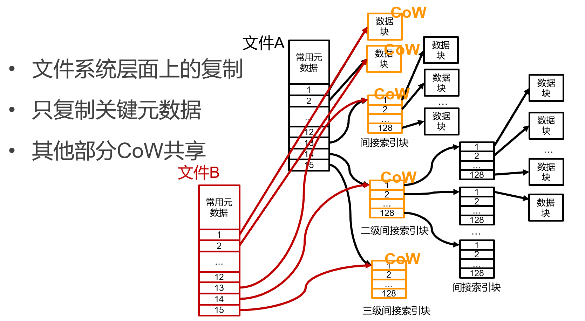

### 快照（Snapshot）

对文件做快照，之后过一段时间，可以将文件回滚到当前快照

- 同样使用CoW
- 对于基于inode表的文件系统
  - 将inode表拷贝一份作为快照保存
  - 标记已用数据区为CoW
  - 结束之后想要恢复，可以把快照之后CoW的部分删掉
- 对于树状结构的文件系统
  - 将树根拷贝一份作为快照保存
  - 树根以下的节点标记为CoW

### 稀疏文件

一个文件大部分数据为0，则为稀疏文件（如虚拟机镜像文件），浪费存储空间


全0对应的索引节点对应段的偏移量和子节点全0

## 文件系统的多种形式

### Git：内容寻址文件系统

- 表面上GIT是一个版本控制软件
- 但实际上GIT可以被看做是一个**内容寻址**的文件系统（根据内容找数据在哪儿）
- 其核心是一个键值存储（KV Store）
  - 值：加入GIT的数据
  - 键：通过数据内容算出的40个字符SHA-1校验和
    - 前2个字符作为子目录名，后38个字符作为文件名
  - 所有对象均保存在 `.git/objects` 目录中（文件内容会被压缩）
- 是一个“文件系统之上的文件系统”

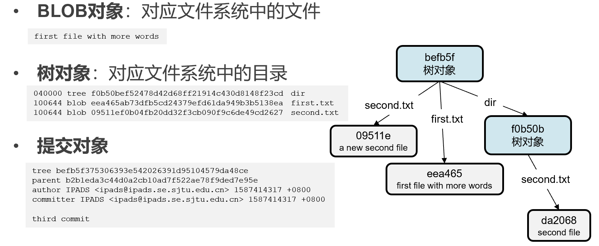

两个文件内容是一样的，那hash就一样，在git中就会被视作是一样的：天生可以做same data merge

#### Git 的提交

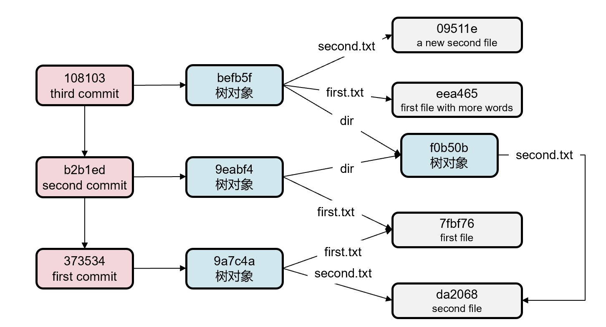

### SQLite：文件系统的竞争者（适合小文件存储）

自己的大文件（底层文件系统inode提供的文件抽象）里面包含多个小文件（SQLite提供的文件抽象）

- 核心还是一个数据库
  - 在关系型数据库的表中，记录文件名和BLOB类型文件数据
  - 通过查找文件名，获取对应文件数据
  - 存储大量小文件

**对于小文件，为何一般文件系统不如SQLite效率高？**

打开时间慢=>查找时间慢=>目录结构效率不高、目录太深

**文件系统如何针对小文件进行改进？**

优化目录结构、用db做fs的索引、或者在fs中内置一个db专门存小文件

**还有哪些针对小文件特殊处理的场景？**

- HTML里面小图片都是拼在一起，用css切图（页面加载速度、网络传输）
- 传文件到远端或优盘，先打包再传输
- Git的push/pull是先打包再传输

### FUSE：用户态文件系统框架

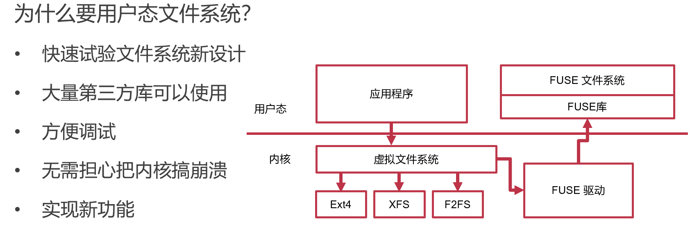

对接到VFS层即可，把用户请求重定向到上层在用户态的FUSE文件系统

#### FUSE 基本流程

1. FUSE文件系统向FUSE驱动注册（挂载）
2. 应用程序发起文件请求
3. 根据挂载点，VFS将请求转发给FUSE驱动
4. FUSE驱动通过中断、共享内存等方式将请求发给FUSE文件系统
5. FUSE文件系统处理请求
6. FUSE文件系统通知FUSE驱动请求结果
7. FUSE驱动通过VFS返回结果给应用程序

**从这个流程中可以看出FUSE有什么问题？**

内核反向依赖用户态！万一用户态这部分卡住了，内核就一直在等待（如考虑copy个10G的文件）。

#### FUSE API

- 底层API
  - 直接与内核交互
  - 需要负责处理inode和查找等操作
  - 需要处理内核版本等差异
- 高层API
  - 构建于底层API之上
  - 以路径名为参数
  - 无需关注inode、路径和查找

#### FUSE 能用来做什么

> Since *everything* *is* *a* *file,* can everything be done with a filesystem?

SSHFS（用ssh挂载远端目录到本地），Android Sandbox，GMailFs（以文件接口收发邮件），WikipediaFS（用文件查看和编辑Wikipedia），网盘同步，分布式文件系统（Lustre、GlusterFS等）

# 虚拟文件系统（VFS）

增加一层抽象来解决问题

**如何在一个系统中同时支持多个文件系统？**

- 计算机中的异构文件系统
  - Linux和Windows双启动，两个分区有各自的文件系统
  - Mac用APFS，U盘一般用FAT/exFAT，移动硬盘用NTFS
- 如何对用户屏蔽文件系统的异构性？
  - VFS：Virtual File System
  - 中间层，对上提供POSIX API，对下对接不同的文件系统驱动

## Linux 中的虚拟文件系统 VFS（抽象为 inode 文件系统）

> Windows的类似机制：Installable File System

Linux的VFS定义了一些系列接口，具体的文件系统实现这些接口

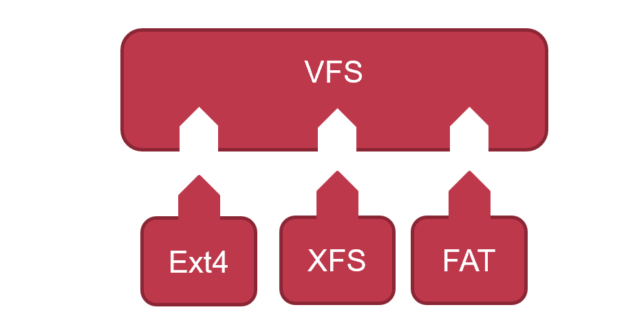

如在读取一个inode的文件时

- VFS先找到该inode所属文件系统
- 再调用该文件系统的读取接口

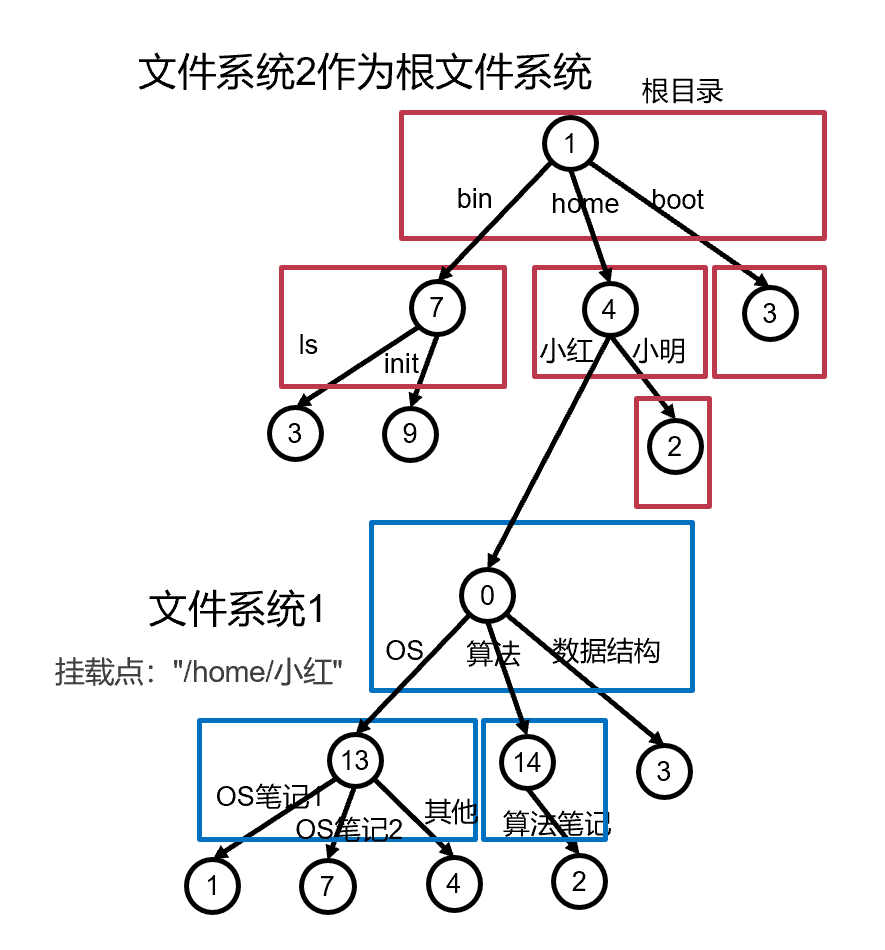

- VFS维护一个统一的文件系统树
- 操作系统内核启动时会挂载一个根文件系统
- 挂载在逻辑上覆盖挂载点原有的结构，挂载后挂载点在旧文件系统中对应的位置无法访问（如上图中文件系统2中4的左子树）。挂载点下的数据在卸载后依然可以访问
- 其他文件系统可以**挂载**在文件系统树的目录上（内存中的操作）
- 查找文件时的每一步，检查当前目录是否为挂载点。若是，则使用被挂载的文件系统继续进行访问

- VFS是内存中维护的（in-memory-only），不会对磁盘做任何变化，断电即失去
  - inode 抽象：on-disk
  - vnode 抽象：in-memory

## VFS对接FAT32

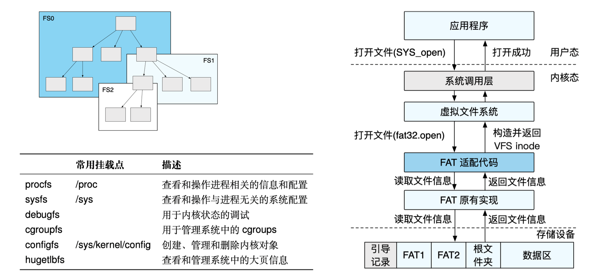

**FAT没有inode，如何挂载到VFS？**

- VFS层对上提供的接口，每个文件都有一个inode。FAT的inode从哪里来？
- VFS的适配层把FAT的信息构造成inode（vnode）往上传

**FAT的驱动需要提供inode**

- 磁盘上的FAT并没有inode：硬盘上的数据结构
- 内存中的VFS需要inode：只在内存中的数据结构

# 存储结构与缓存

## 宏内核(Linux)中的存储栈

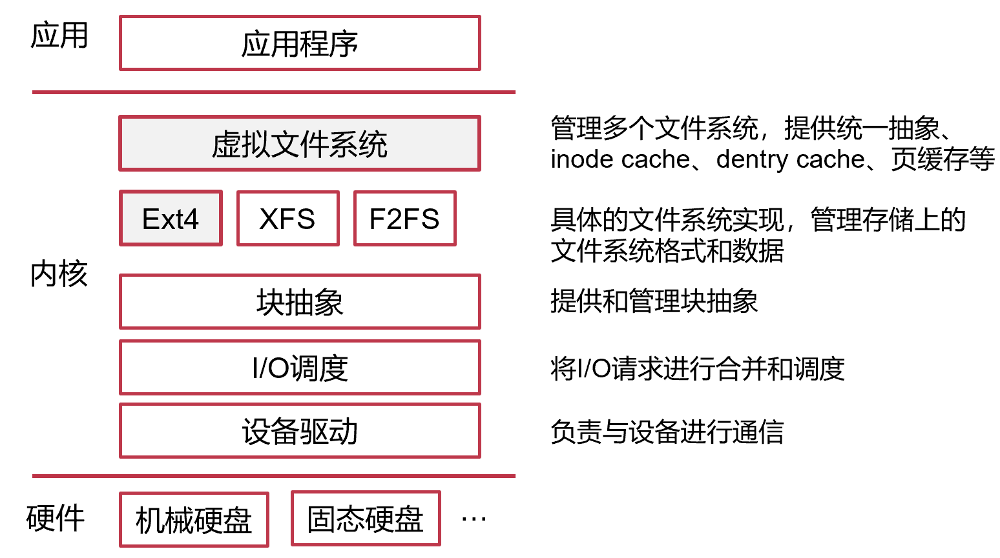

虚拟文件系统统一实现缓存，底下的具体文件系统就不需要自己实现缓存的部分

## 内存与存储结构

存储中的每个数据结构，在内存中均有对应的结构

- 存储的数据页：page cache页缓存中的内存页
- 存储中的inode：icache中的inode（打开文件时，通过inode造vnode，即需要缓存inode方便再次打开）
- 存储中的目录项：dcache中的目录项（缓存目录行dentry，这样不需要每次都在磁盘中递归找目录条目）
- 存储中的超级块：内存中的超级块结构
- 存储中的分配表：内存中的分配器

**为什么要为每个结构设计单独的缓存？能否只使用页缓存？**

inode及dentry相较page明显更小。不同结构的大小和使用方式不同，单独的能够更加高效（在内存利用率和性能上）。比如 inode 小于 4K，一个页面里有多个 inode，如果其中只有一个 inode 被使用，整个页面都存在内存，浪费了。比如分配器，一些文件系统可以在内存中通过链表等方式，加速分配，而在磁盘上保存 bitmap。

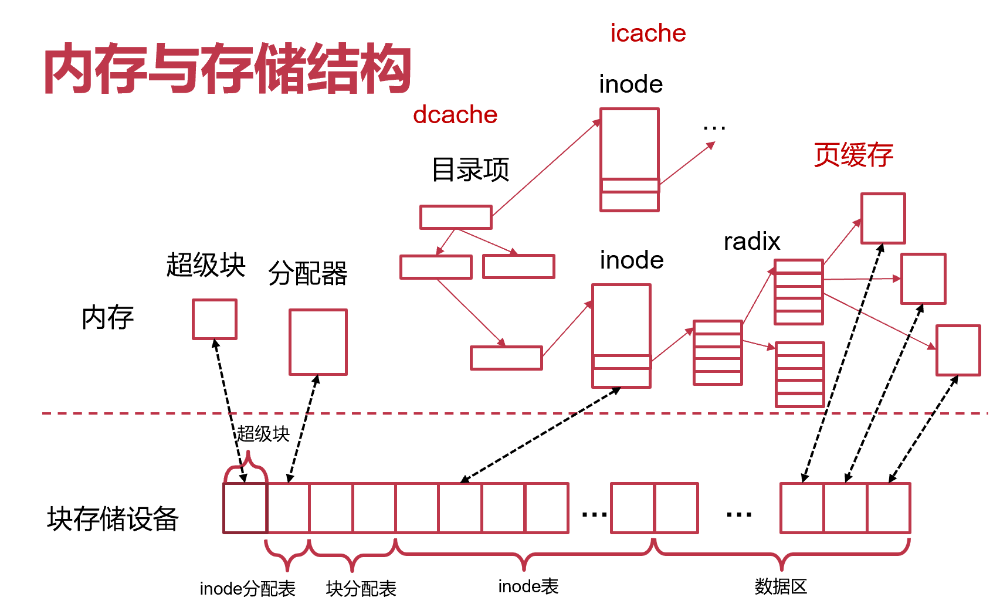


## 有缓存情况下的文件查找

- 由于内存大小限制，内存中缓存的数据是存储中数据的子集
- 当要访问的数据不在内存中时，会从存储中读取并构造内存中相应的对象

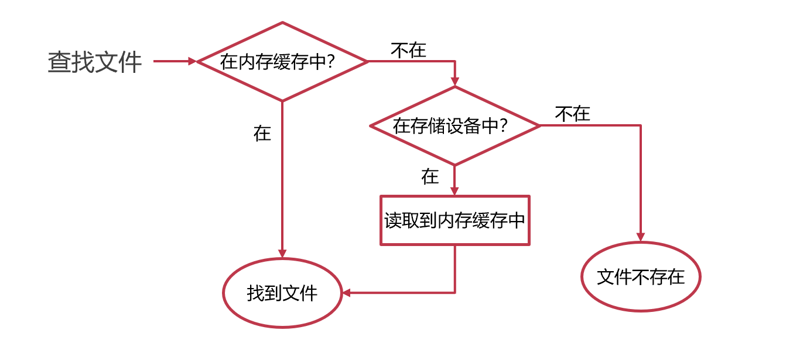

## 页缓存（Page Cache）

- 存储访问非常耗时
- 文件访问具有时间局部性（一些目录/文件的数据块会被频繁的读取或写入）

通过**缓存**提升文件系统性能

- 在一个块被读入内存并被访问完成后，并不立即回收内存
  - 将块数据暂时缓存在内存中，下一次被访问时可以避免磁盘读取
- 在一个块被修改后，并不立即将其写回设备
  - 将块数据暂时留在内存中，此后对于该数据块的写可直接修改在此内存中
- 定期或在用户要求时才将数据写回设备

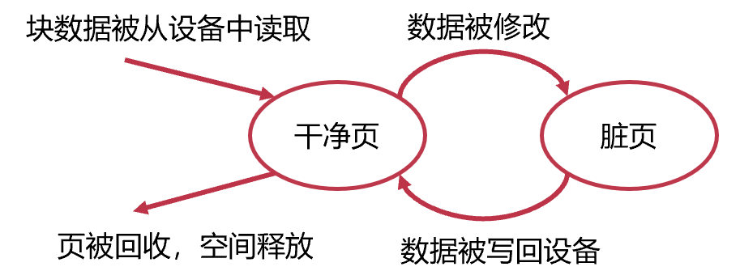

**数据不及时写回，会造成什么问题？**

断电就丢了

## 微内核中的文件与存储结构

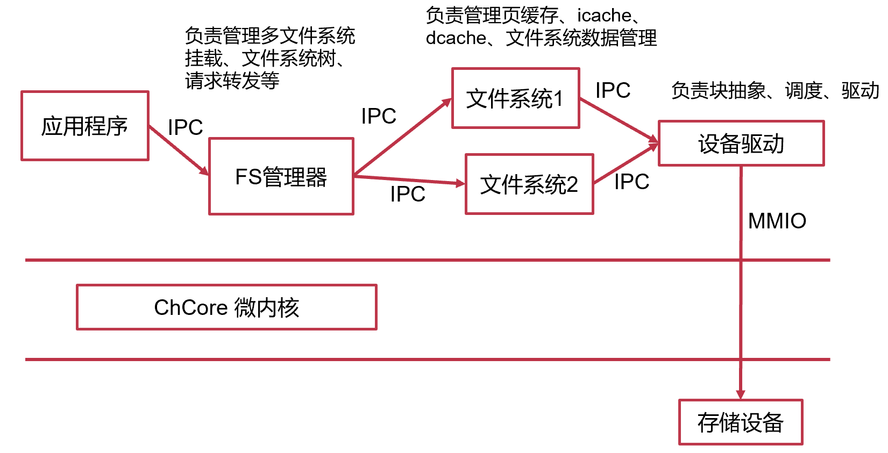

# 文件系统崩溃一致性

- 文件系统中保存了多种数据结构
- 各种数据结构之间存在依赖关系与一致性要求
  - inode中保存的文件大小，应该与其索引中保存的数据块个数相匹配
  - inode中保存的链接数，应与指向其的目录项个数相同
  - 超级块中保存的文件系统大小，应该与文件系统所管理的空间大小相同
  - 所有inode分配表中标记为空闲的inode应当均未被使用；标记为已用的inode均可以通过文件系统操作访问
- 突发状况（崩溃）可能会造成这些一致性被打破！（更新时总会有先后顺序，在之间崩溃）

## 创建文件时崩溃，有几种情况？

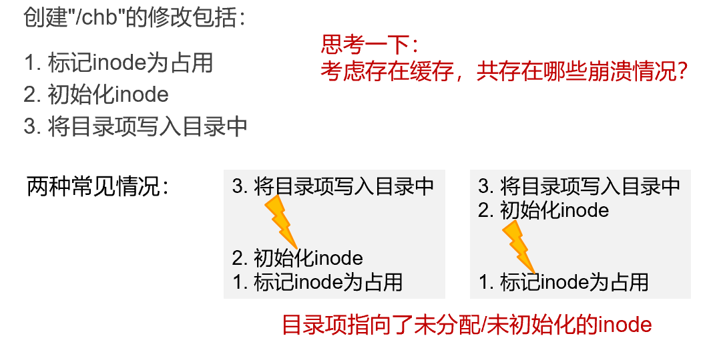

- 3与2之间crash：inode可能是格式合法，但是被人删除掉的文件（删除之后不会清空）；crash恢复之后，就读到了一个被删除的文件
- 2与1之间crash：之后再创建文件，如果恰好使用到这个inode，导致两个文件名指向同一个inode（已经被人指向，但是还是标记为free）

> 此处的创建文件还未考虑修改时间戳、写入新目录项需要分配新的数据块、修改超级块中的统计信息等情况。考虑后情况会更复杂！

**考虑存在缓存，共存在哪些崩溃情况？**

8种情况；{}（没有操作被持久化），{1}，{2}，{3}，{1, 2} （与{2,1}相同），{1, 3}，{2, 3}，{1, 2, 3}

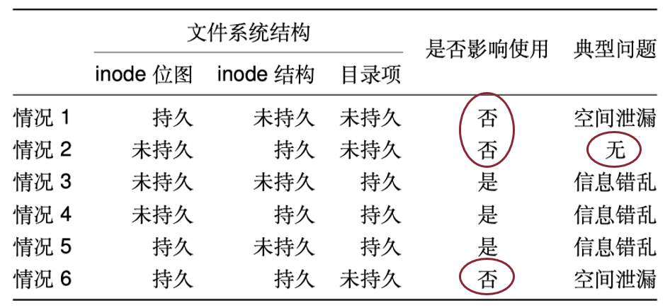

- inode位图：标记inode是被占用还是未使用
- inode结构：写inode的具体内容
- 目录项：在目录中增添对应目录项

## 崩溃一致性：用户期望

重启并恢复后…

1. 维护文件系统数据结构的内部的不变量 

   例如, 没有磁盘块既在free list中也在一个文件中

2. 仅有最近的一些操作没有被保存到磁盘中

   用户只需要关心最近的几次修改还在不在 

3. 没有顺序的异常 

    `$ echo 99 > result ; echo done > status` 

## 文件系统操作所要求的三个属性

`create(“a”); fd = creat(“b”); write(fd,…); crash`

- 持久化/Durable: 哪些操作可见（a和b都可以）
- 原子性/Atomic: 要不所有操作都可见，要不都不可见（要么a和b都可见，要么都不可见）
- 有序性/Ordered: 按照前缀序(Prefix)的方式可见（如果b可见，那么a也应该可见）

## 崩溃一致性保障方法

- 同步元数据写+fsck
- 日志（原子更新技术）
- 写时复制（原子更新技术）
- Soft updates

### 同步元数据写+fsck：元数据直接同步写穿（直达磁盘），重启后判断元数据如何恢复

思想：元数据直接写到磁盘，不要cache（元数据错更可能导致恶性错误）；同时元数据相较于数据小很多，同步性能开销小

**同步元数据写**

每次元数据写入后，运行 `sync()` 保证更新后的元数据入盘

**若非正常重启，则运行fsck检查磁盘，具体步骤：**

1. 检查superblock
   - 例：保证文件系统大小大于已分配的磁盘块总和
   - 如果出错，则尝试使用superblock的备份
2. 检查空闲的block
   - 扫描所有inode的所有包含的磁盘块（从inode table遍历inode）
   - 用扫描结果来检验磁盘块的bitmap
   - 对inode bitmap也用类似方法
3. 检查inode的状态
   - 检查类型：如普通文件、目录、符号链接等
   - 若类型错误，则清除掉inode以及对应的bitmap
4. 检查inode链接
   - 扫描整个文件系统树，核对文件链接的数量（如果指向 inode 的目录项的数量与 inode 中记录的 refcount 不一致，改 refcount；如果改目录项不知道应该删除哪一个！）
   - 如果某个inode存在但不在任何一个目录（没有任何的目录项指向该文件inode），则放到/lost+found
5. 检查重复磁盘块
   - 如：两个inode指向同一个磁盘块
   - 如果一个inode明显有问题（格式错误等）则删掉，否则复制磁盘块一边给一个
6. 检查坏的磁盘块ID
   - 如：指向超出磁盘空间的ID
   - 问：这种情况下，fsck能做什么呢？仅仅是移除这个指针么？
     - 把指针指向全0的区域（比如中间指向某个block的指针出问题，但是周边的没问题）
     - 或者丢掉对应指针，把后面的都往前移动
7. 检查目录
   - 这是fsck对数据有更多语义的唯一的一种文件
   - 保证 `.` 和 `..` 是位于头部的目录项（发现没有 `.` 和 `..` ：创建目录时，目录文件的具体数据还没来得及写，只写了元数据）
   - 保证目录的链接数只能是1个
   - 保证同一个目录中不会有相同的文件名

#### fsck 的问题：太慢，要扫盘

- fsck需要用多长时间：对于服务器70GB磁盘（2百万个inode），需要10分钟
- 同步元数据写导致创建文件等操作非常慢

### 日志（原子更新技术：Journaling）

- 在进行修改之前，先将修改记录到日志中
- 所有要进行的修改都记录完毕后，提交日志
- 此后再进行修改
- 修改之后，删除日志

这样不会出现数据丢失的问题（不去写只有一份的数据）

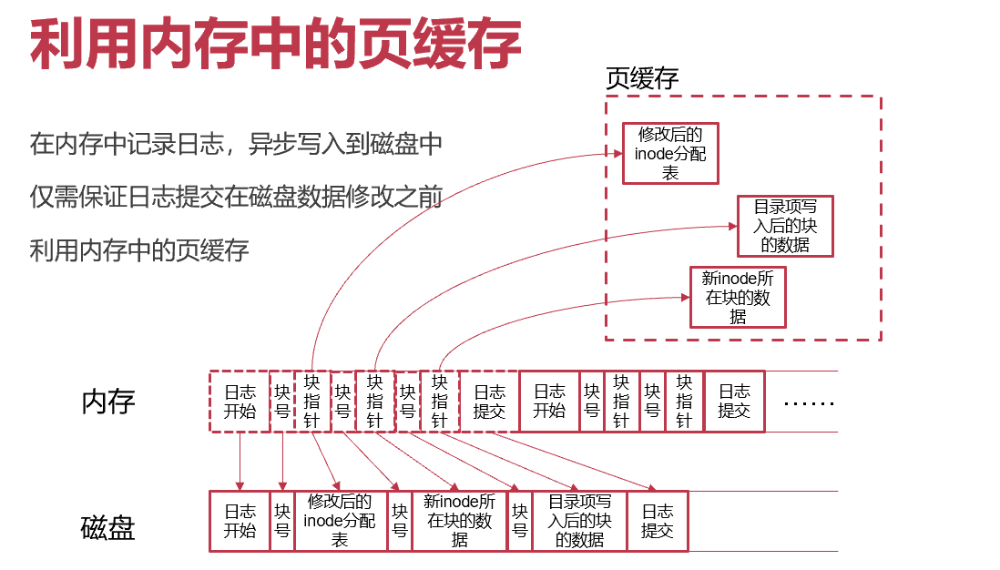

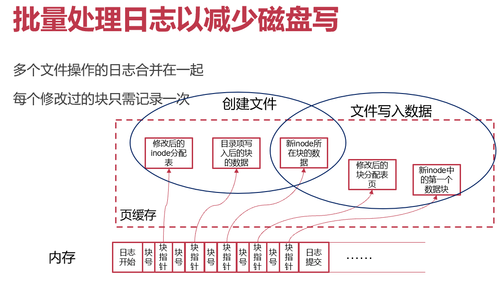

**日志提交的触发条件**

- 定期触发
  - 每一段时间（如5s）触发一次
  - 日志达到一定量（如500MB）时触发一次
- 用户触发
  - 应用调用fsync()时触发

#### Linux中的日志系统JBD2（Journal Block Device 2）

通用的日志记录模块，日志可以以文件形式保存，日志也可以直接写入存储设备块

- Journal：日志，由文件或设备中某区域组成
- Handle：原子操作，由需要原子完成的多个修改组成（如一个syscall中的各种操作，如写操作）
- Transaction：事务，多个批量在一起的原子操作（如一个syscall）

一个Transaction中包括多个Handle，等到Transaction结束commit，此时这一条Transaction就记录在了日志中。此后等到日志提交触发条件达到，把当前已经写好的Transaction都执行落盘，并清空对应日志。

##### JBD2事务的状态

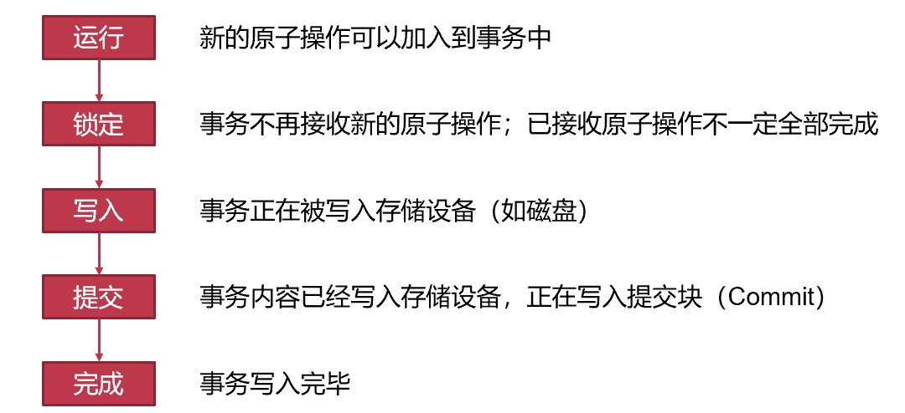

#### Ext4的三种日志模式

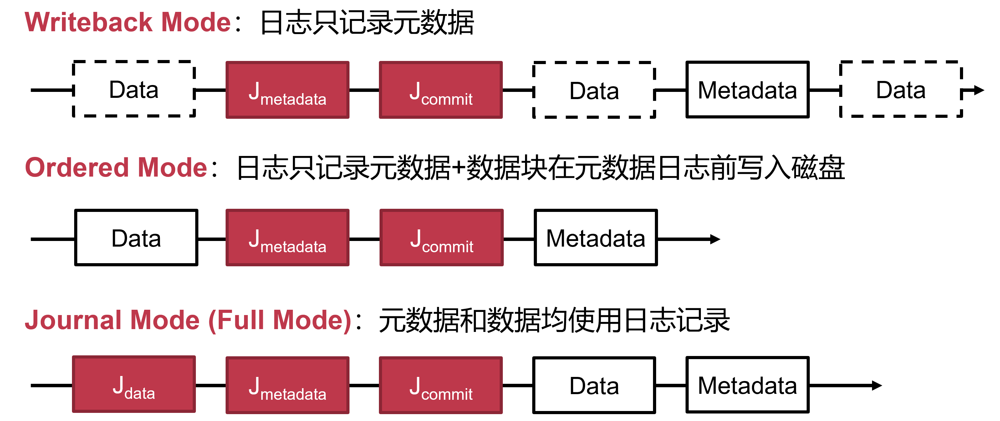

- **Writeback Mode：**日志只记录元数据（数据不写入日志）；最快，但是一致性最差，有可能元数据指向了错误的数据
- **Journal Mode（Full Mode）：**元数据和数据均使用日志记录；最保险，一致性最好，但是所有写入都需要写两遍，对大文件比较差
- **Ordered Mode：**日志只记录元数据+数据块在元数据日志前写入磁盘：**先把数据写到数据应该在的位置，之后等数据写完，再把metadata写到日志里**，写完就是all，没有就是nothing；默认模式，一种平衡的模式。能保证元数据不会指错，但是数据部分可能会出现不一致。（比如写了一个write操作只持久化了一半；一个操作的数据写完了，但是元数据没有修改。考虑将密码写入一个文件，却未来得及将文件权限进行相应修改）

##### Ordered Mode：两次Flush保证顺序

1. 应用程序产生数据，数据写到文件系统

2. 文件系统根据数据，在文件系统中产生对应元数据以及元数据的journal，写完之后生成 J_cmt

3. 文件系统把数据发给缓存，把元数据的journal发给缓存，之后缓存处进行Flush

4. 第一个Flush返回，表示数据和元数据的journal从缓存落到盘片

   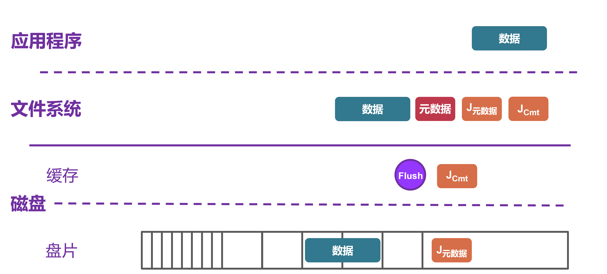

5. 文件系统把 J_cmt 发给缓存（此时如果看到 J_cmt，表明数据和元数据的 journal 都一定在磁盘上）

6. 缓存处进行Flush

7. 第二个Flush返回，表示 J_cmt 从缓存落到盘片

   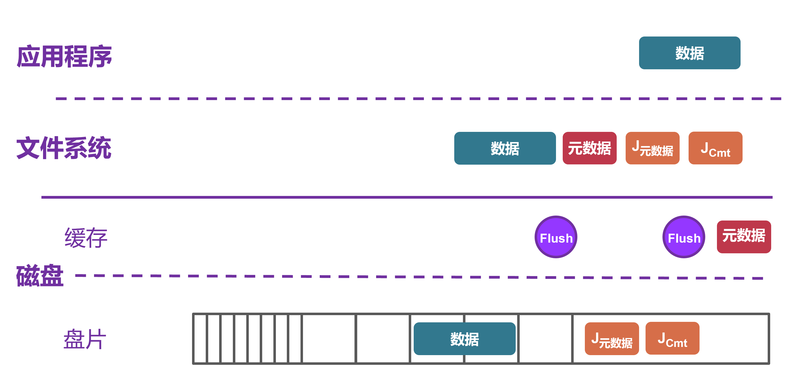

8. 最后将元数据从文件系统写到缓存，再写到磁盘盘片

**Flush 为了保证顺序**

- 第一个flush：没有这个flush，可能 J_cmt 写了，但是数据和元数据的journal没有写完，但是以为数据和元数据的journal合法
  - 去掉该flush：在 J_cmt 中增加数据和元数据的journal的hash，检查hash是否一致
- 第二个flush：区分commit与真正元数据的order；如果无此Flush，可能先写元数据，J_cmt 没有写，此时新的元数据可能把旧的元数据覆盖掉，但是此时没有commit，无法回滚到原本状态（旧元数据丢失，无法回滚为nothing）
  - 发现其实这部分的元数据不需要立即写到盘片：内存里是新数据，log里也是新数据，只是没有落盘，不会影响正常执行（读的时候会读缓存，也即能读到最新元数据）；等元数据积累很多，再落盘
  - 修改硬件：本质上只需要保证order；但是现在把order和持久化耦合了；让把一些数据从缓存写到磁盘之后，发一个中断，OS就知道前面已经落盘，就可以放心些元数据到磁盘，比flush开销低

##### Ordered Mode 问题

- 权衡一致性和性能
  - 数据的数量大，只需要写入一次
  - 元数据的数量少，写入两次相对可接受
- 可能出现的问题
  - **数据只有一份，若出现问题无法回退（all-or-nothing）**
  - 部分情况下，一致性还是可以保证的（如新增数据时）
  - 部分情况下，数据会丢失，但元数据依然可以保证一致性

### 写时复制（原子更新技术：Copy-on-Write）

在修改多个数据时，**不直接修改数据，而是将数据复制一份，在复制上进行修改**，并通过递归的方法将修改变成原子操作（All-or-nothing commit point：换树状结构的根）

- 不会有对旧数据的覆盖
- 新的数据只要写一遍就行，但是可能会递归向上层修改导致复制很多页/块

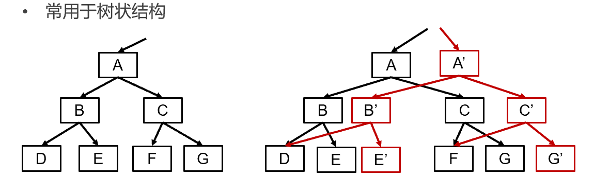

#### 文件中的写时复制

- 文件数据散落在多个数据块内
- 使用日志：数据需要写两遍
- 写时复制保证多个数据块原子更新
  - 将要修改的数据块进行复制（分配新的块）
  
    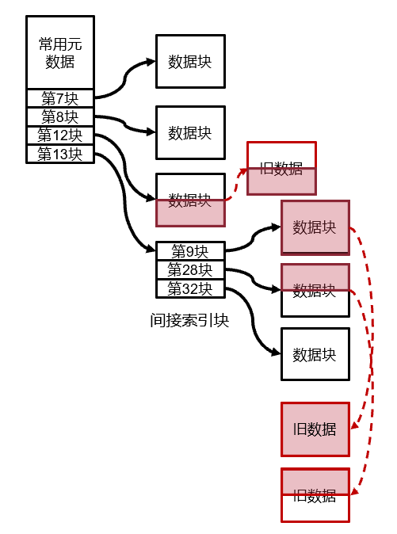
  
  - 在新的数据块上修改数据
  
    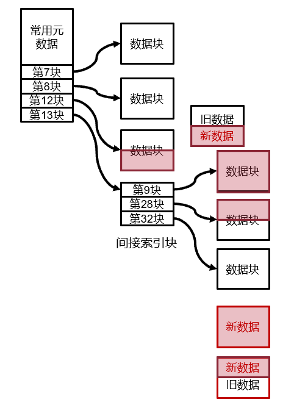
  
  - 向上递归复制和修改，直到所有修改能原子完成
  
    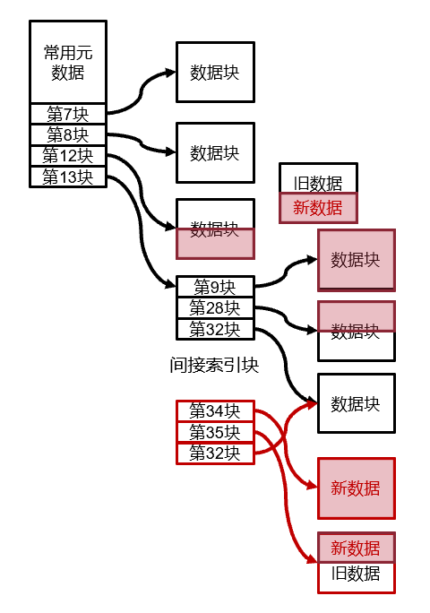
  
  - 进行原子修改
  
    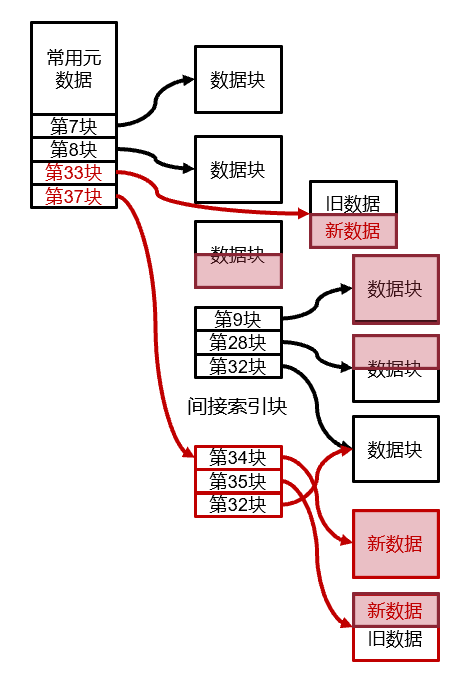
  
  - 回收资源
  
    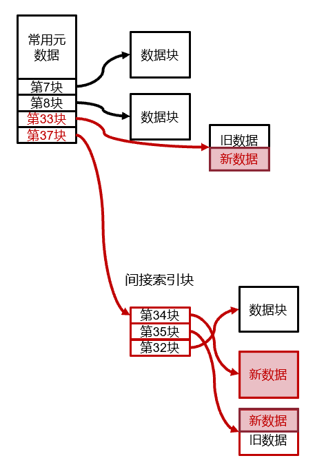

**对于文件的修改，写时复制一定比日志更高效吗？**

不一定，写时复制对于大量的小修改很低效（至少需要copy一个页）

**写时复制和日志各自的优缺点有哪些？**

写时复制CoW的小修改需要复制的东西比较多；日志要redo，要写两遍

**能否只用写时复制来实现一个文件系统？**

Btrfs (B-tree FS)

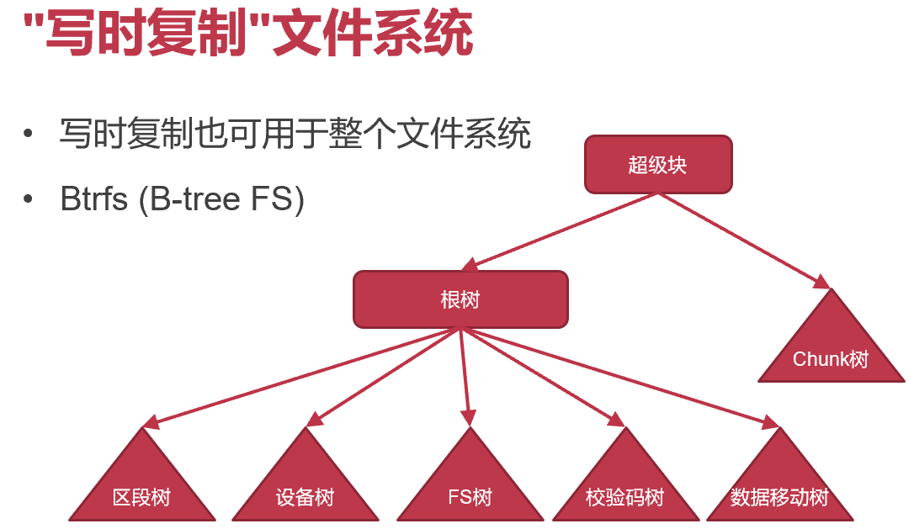

做snapshot：只需要记录根节点即可

- Chunk树: 维护了logical chunk到physical chunk的映射
- 区段树：管理磁盘空间分配（extent）
- 设备树：管理多设备
- FS：文件系统
- 校验码树：管理校验码
- 数据移动树：data relocation tree，记录extent的移动，支持online的磁盘碎片整理

### Soft updates

一些不一致情况是良性的（不会造成恶劣影响），合理安排修改写入磁盘的次序（order），可避免恶性不一致情况的发生

```sh
# 良性情况
某inode被标记为占用，却从文件系统中无法遍历到该inode
如创建文件：
1. 标记inode为占用
2. 初始化inode
3. 将目录项写入目录中
```

**相对其它方法的优势**（时间和空间上都能获得好处）

- 无需恢复便可挂载使用
- 无需在磁盘上记录额外信息（log 和 COW 都需要额外空间）

**Soft Updates的总体思想**

- 最新的元数据在内存中
  - 在DRAM中更新，跟踪dependency
    - DRAM 性能更好
    - 无需同步的磁盘写
- 磁盘中的元数据总是一致的（不影响正常使用）
  - 在遵循dependency的前提下写入磁盘
    - 一直能保证一致性
    - 发生崩溃后，重启立即可用（有可能该写的没写进去，但是内部元数据与数据自恰）

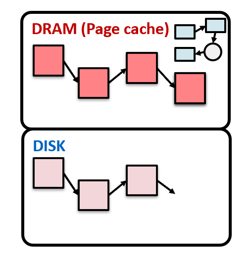

#### <u>Soft Updates的三个次序规则</u>

1. **不要指向一个未初始化的结构**
   - 如：目录项指向一个inode之前，该inode结构应该先被初始化
2. **一个结构被指针指向时，不要重用该结构**
   - 如：当一个inode指向了一个数据块时，这个数据块不应该被重新分配给其他结构
3. **不要修改最后一个指向有用结构的指针**
   - 如：Rename文件时，在写入新的目录项前，不应删除旧的目录项


- **对于每个文件系统请求，将其拆解成对多个结构的操作**
  - 记录对每个结构的修改内容（旧值、新值）
  - 记录这个修改依赖于那些修改（应在哪些修改之后持久化）
  - 如创建文件：
    1. 标记inode为占用（对bitmap的修改）
    2. 初始化inode（对inode的修改，依赖于1）
    3. 将目录项写入目录中（对目录文件的内容修改，依赖于1和2）

**案例**

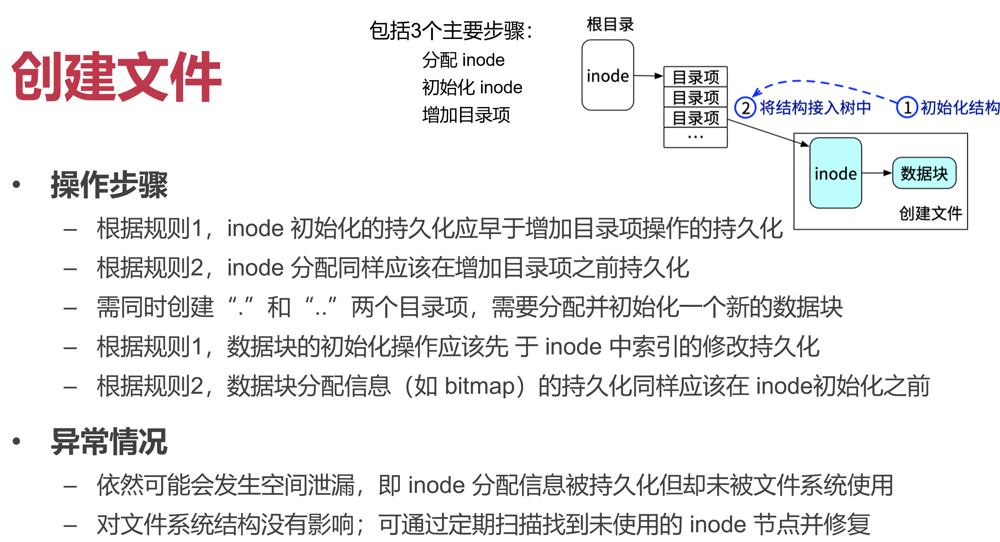

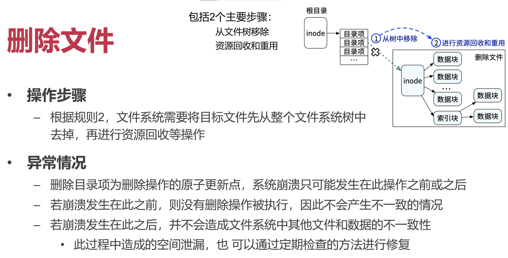

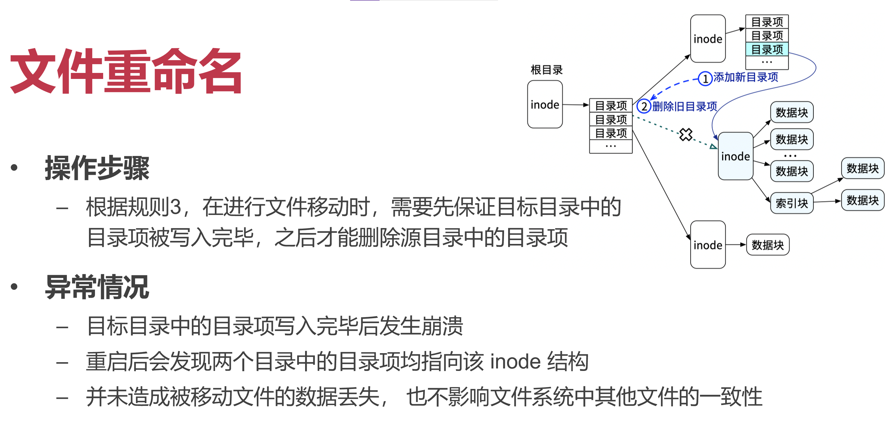

#### 依赖追踪

- Soft Update原理
  - 使用内存结构表示还未写回到存储设备的修改，并异步地将这些修改写入存储设备中
  - 问题：如何保证这些修改的持久化顺序呢？
- 依赖追踪
  - 根据3条规则，对修改之间需要遵守的顺序进行记录
    - 如果修改 A需要在修改B之前写入到存储，则称B依赖于A
  - Soft update会将这些修改之间的依赖关系记录下来

**矛盾：写磁盘最小的粒度为 block，但是修改的最小粒度是数据结构，多个修改可能发生在同一个 block 上**

> 写时磁盘块粒度的原子性可以由硬件提供

1. 问题1：环形依赖（修改的多个数据结构恰好在相同磁盘块上，并且写顺序发生冲突）

   - 一个块通常包含多个文件系统结构

   - 环形依赖：块 A 需要在块 B 前写回，同时块 B 需要在块 A 前写回

     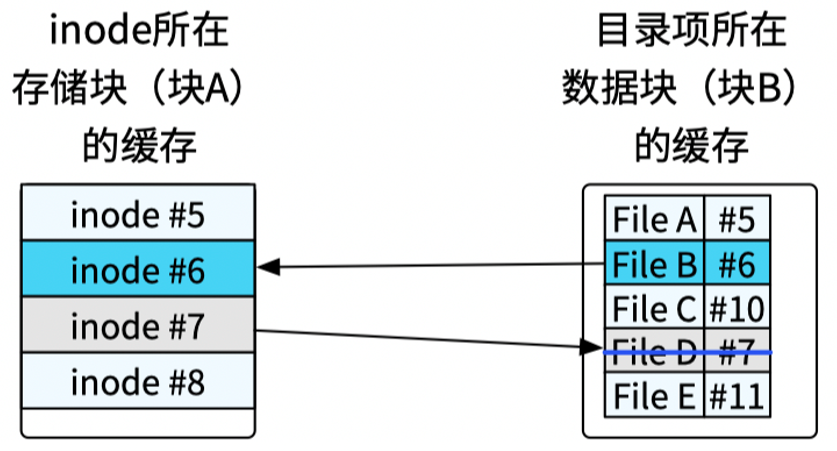

   **解决：撤销和重做**

   记录每个结构上的修改记录

   - 当需要将某个结构写回到存储设备时，检测是否有环形依赖
   - 当出现环形依赖时，其先将部分操作撤销
     - 即将内存中的结构还原到此操作执行前的状态
   - 撤销之后环形依赖被打破，根据打破后的依赖将修改按照顺序持久化
   - 持久化完毕之后，将此前被撤销的操作恢复，即重做
   - 在重做完成后，将最新的内存中的结构按照新的依赖关系再次持久化

   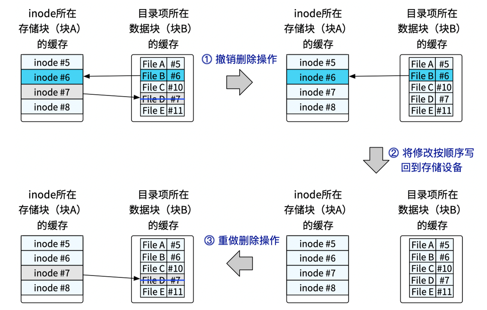

   问题：为了自己的实现方便，做的事情太上层，比如把用户的一个“删除”操作滞后掉

   再解决：加锁

2. 问题2：写回迟滞

   - 当一个结构中的数据被频繁修改时，该结构很可能由于一直产生新的依赖导致长时间无法被写回到存储设备之中

   **解决：撤销和重做**

   若某个结构被频繁修改，导致不断有新的依赖产生时，可将部分新的修改撤销，在快速完成持久化后将修改重做，避免新依赖不断推迟该结构上修改的持久化


# 日志文件系统 Log-Structured File System

> 思想：依据内存与磁盘优劣
>
> - 写：磁盘上顺序写
> - 读：内存中随机读

- 假设：文件被缓存在内存中，文件读请求可以被很好的处理；于是，文件写成为瓶颈
- 块存储设备的顺序写比随机写速度很块（磁盘寻道时间）
- 将文件系统的修改以日志的方式**顺序写入**存储设备

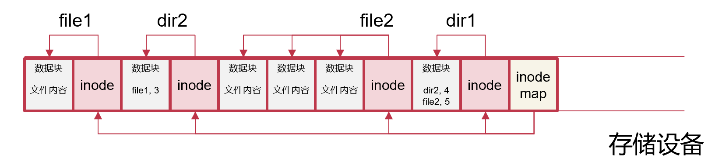

> 先写数据，再写指向其的指针

inode map：用来索引所有 inode，记录他们的位置（不断往后写时把inode map不断更新，并放在最后）

## Sprite LFS 的数据结构

- 固定位置的结构
  - 超级块、检查点（checkpoint）区域
- 以Log形式保存的结构
  - inode、间接块（索引块）、数据块
  - inode map：记录每个inode的当前位置
  - 段概要（Segment Summary）：记录段中的有效块
  - 段使用表：记录段中有效字节数、段的最后修改时间
  - 目录修改日志

**案例**

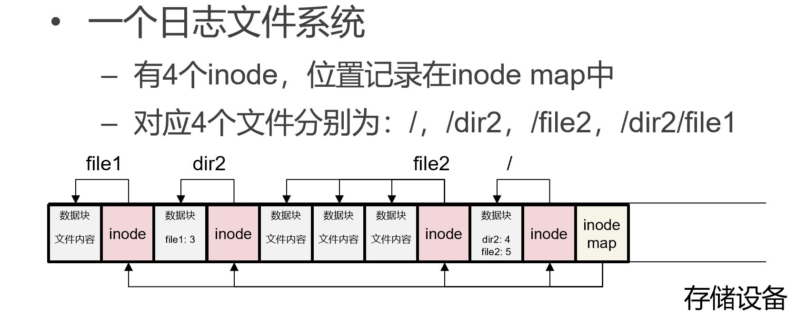

`echo hello > /file3`：需要创建文件，修改文件数据


## 空间回收管理方法

**空间回收利用**

前面阴影部分的空间被浪费掉了：如何复用？

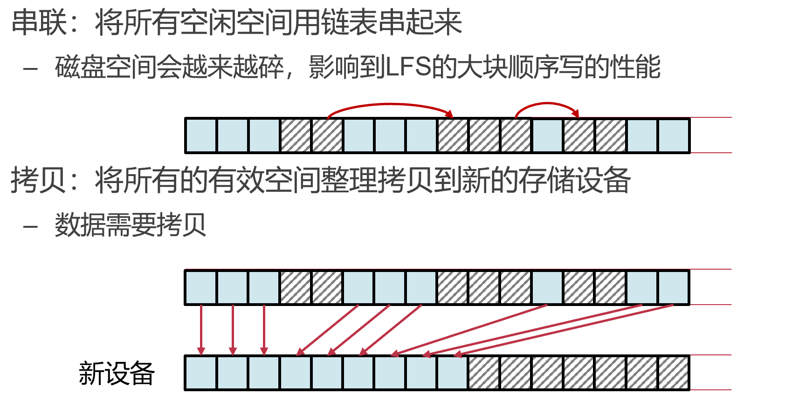

- 串联：所有空闲空间用链表串起来
  - 磁盘空间会越来越碎，影响到LFS的大块顺序写的性能
- 拷贝：将所有的有效空间整理拷贝到新的存储设备
  - 整理与拷贝需要时间
    - 多个机械硬盘一起（把这个整理时间错开）
    - 机械硬盘组中加上一块 SSD 用于随机读写的操作

### 段（Segment）

- 一个设备被拆分为定长的区域，称为段（把整个磁盘看成是一个一个段）
  - 段大小需要足以发挥出顺序写的优势，512KB、1MB等
- **每段内只能顺序写入**
  - 只有当段内全都是无效数据之后，才能被重新使用
- 干净段用链表维护（对应串联方法）（只会在空闲段之间跳，段内仍旧保有顺序写性能）

**段使用表**

- 记录每个段中有效字节数
  - 归零时变为干净段，放进空闲链表
- 记录了每个段最近写入时间（意味着段本身新还是旧）
  - 将非干净段按时间顺序连在一起，形成逻辑上的连续空间
- 一个物理磁盘变成逻辑上的两个磁盘（非干净段连成的链表和空闲干净段连成的链表）

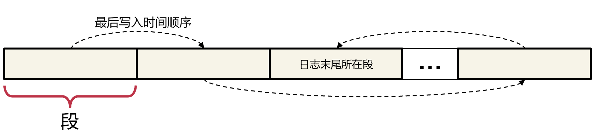

#### <u>段清理</u>

1. 将一些段读入内存中准备清理

2. 识别出有效数据

3. 将有效数据整理后写入到干净段中（对应拷贝方法）

   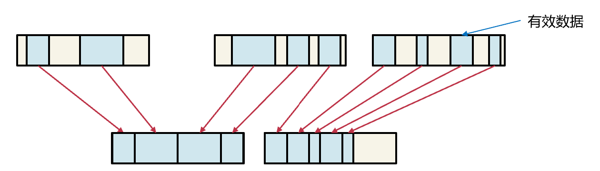

4. 标记被清理的段为干净

   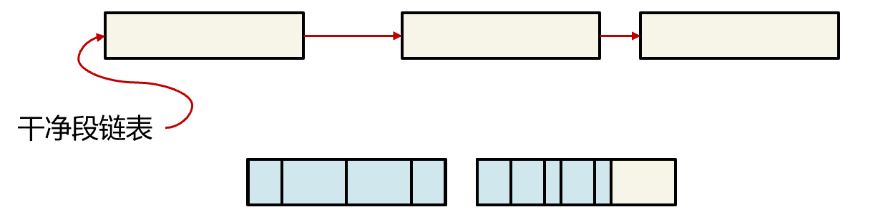

**识别有效数据**

- 每个段头中保存有**段概要（Segment Summary）**
  - 记录每个块被哪个文件的哪个位置所使用（从物理磁盘块反向回到inode的指针）
    - 如：数据块可使用inode号和第几个数据块来表示位置
  - 数据块的有效性可通过对比该位置上的现有指针来判断（找到8号inode中第2个数据块，若不指向
     此位置，则表示该数据块为无效块）

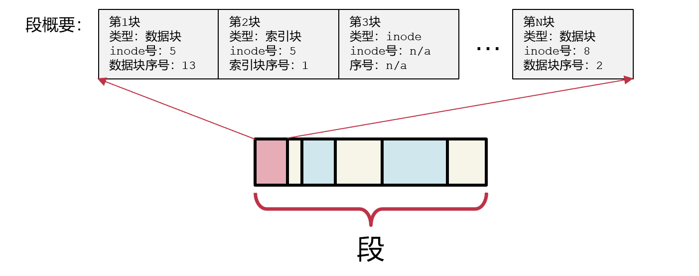

**清理策略**

- 什么时候执行清理？后台持续清理？晚上清理？磁盘要满的时候清理？
- 一次清理多少段？清理哪些段？
- 有效数据应该以什么顺序排序写入新的段？维持原顺序？相同目录放一起？相近修改时间放一起？

## 挂载和恢复

- 方法-1：扫描整个磁盘所有日志，重建出整个文件系统的内存结构
  - 缺点：大量无效数据也被扫描
- 方法-2：定期写入检查点（checkpoint）
  - 写入前的有效数据，可以通过检查点找到
  - 只需扫描检查点之后写入的日志
  - 减少挂载/恢复时间

### 检查点（Checkpoint）

**检查点（有两个）内容**

- 最新inode map的位置（可找到所有文件的内容）
- 段使用表
- 当前时间
- 最后写入的段的指针

**为什么需要两个检查点区域**

万一写 checkpoint 的时候断电（防止写入检查点时崩溃）

### 恢复：前滚（roll-forward）

- 尽量恢复检查点后写入的数据

- 通过段概要里面的新inode，恢复新的inode
  - 其inode中的数据块会被自动恢复
- 未被inode"认领"的数据块会被删除


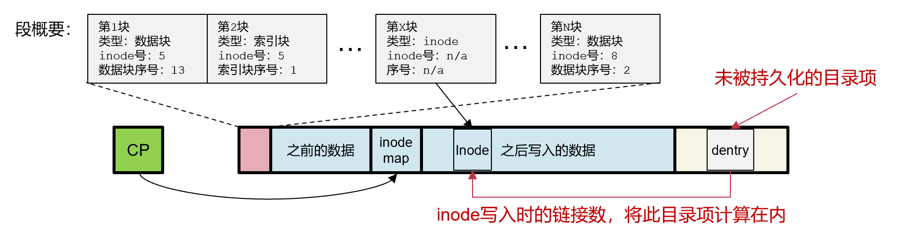


- 段概要无法保证inode的链接数一致性
  - 如：inode被持久化，但是指向其的目录项未被持久化
- 解决方案：目录修改日志
  - 整个文件系统是一个日志，为了目录单独加一个特殊的日志

### 恢复：目录修改日志

- 目录修改日志
  - 记录了每个目录操作的信息
    - create、link、rename、unlink
  - 以及操作的具体信息
    - 目录项位置、内容、inode的链接数
- 目录修改日志的持久化在目录修改之前
  - 恢复时根据目录修改日志保证inode的链接数是一致的

**LFS读性能如何**

比较差，虽然之前假设大多数读请求可以通过内存缓存处理；但一旦去磁盘上读，会非常慢，因为文件会非常分散（如一个文件在创建文件系统的时候写的，之后过了十年再去读）


# 新型存储设备的文件系统

## 磁盘结构与性能特性

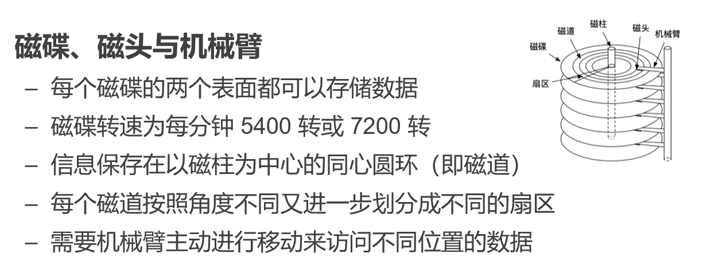

- 顺序读写的速度远远大于随机读写（差距100倍左右）

## 瓦式磁盘 Shingled Magnetic Recording (SMR) Disk

观察：读写磁头宽度要求不同（写的宽，读的窄）

思想：通过重叠压缩磁道宽度

- 传统磁盘密度难以提升：写磁头的宽度难以减小
- 瓦式磁盘将磁道重叠，提升存储密度：减小读磁头的宽度

问题：随机写会覆盖后面磁道的数据，只能顺序写入；修改已经写过的数据很麻烦

- 避免整个磁盘只能顺序写入
  - 磁盘划分成多个Band，Band间增大距离，不同Band可随机写（间隔宽度正常）
  - 每个Band内必须顺序写入
  
  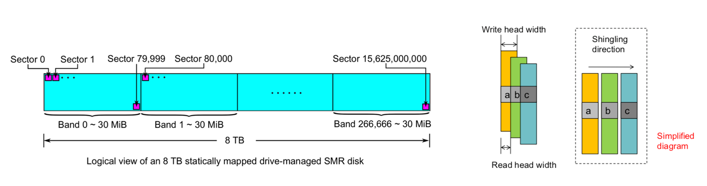

**Band内随机写怎么办？**

- 方法一：多次拷贝

  - 修改Band X中的4KB数据
    1. 找到空闲Band Y
    2. 从Band X的数据拷贝到Band Y，拷贝时将4KB修改写入
    3. 将Band Y中的数据拷贝回Band X
  - 很少的随机写会导致很多的拷贝与访问

- 方法二：缓存+动态映射

  修改时随机写放到磁盘大容量持久缓存中并标记；等空闲时候统一顺序写回瓦式磁盘
  
  - 大容量持久缓存（结构同传统磁盘）
    - 在磁盘头部预留的区域，磁道不重叠，可随机写入
    - 给固件（STL）单独使用，外部不可见
  - 动态映射：Shingle Translation Layer (STL)
    - 从外部（逻辑）地址（OS给的地址）到内部（物理）地址的映射
  - 修改Band X中的4KB数据
    1. 将修改写入缓存，标记Band X为dirty
    2. 修改STL映射（让原位置指向持久化缓存）
    3. 空闲时，根据缓存内容，清理 dirty Band
  - 4KB随机写 → 修改4KB缓存

**瓦式磁盘种类**

| SMR磁盘种类                  | 接口           | 随机写处理方法               |
| ---------------------------- | -------------- | ---------------------------- |
| Drive-managed  SMR  (DM-SMR) | 普通块设备接口 | 固件进行缓存和清理           |
| Host-aware  SMR  (HA-SMR)    | 特殊指令接口   | 固件进行缓存和清理           |
| Host-managed  SMR  (HM-SMR)  | 特殊指令接口   | 必须顺序写，随机写请求被拒绝 |

### 如何改进Ext4来适应瓦式磁盘？

**DM-SMR上使用Ext4**

当随机写入时，Ext4吞吐量非常低！

（刚开始的时候非常快（比传统的还快），因为写的是缓存部分（传统磁盘），同时是顺序写）

**观察：持久缓存对吞吐量的影响**

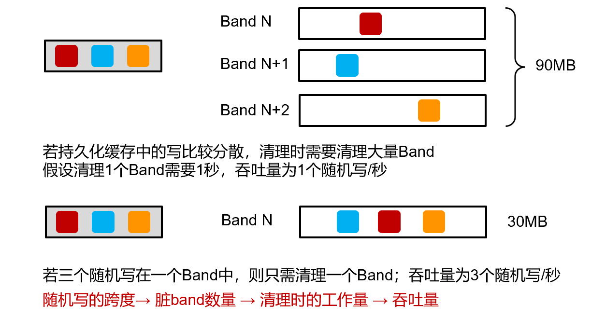

- 随机写的跨度小→ 脏band数量少 → 清理时的工作量少 → 吞吐量高
- Ext4的元数据非常分散（在各个块组中），分散在很多band上

**Ext4上的元数据写回**

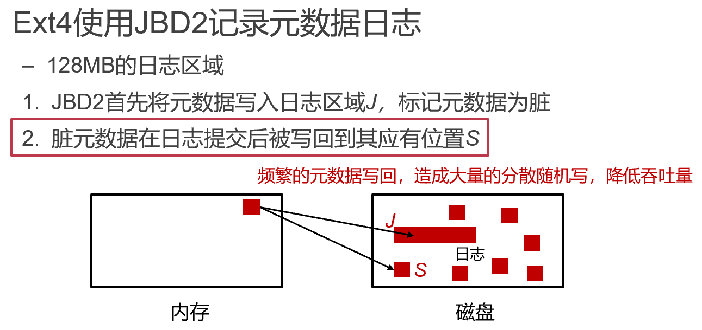

- 频繁的元数据写回，造成大量的分散随机写，降低吞吐量
- 不修改磁盘布局，**引入Indirection（加一层）**：以LFS形式增加一个元数据缓存（把日志变成LFS，内存中维护journal map，将本来要写回到内存的位置重新映射回journal所在的位置；读S的时候不会读到S的区域，而会读到journal）

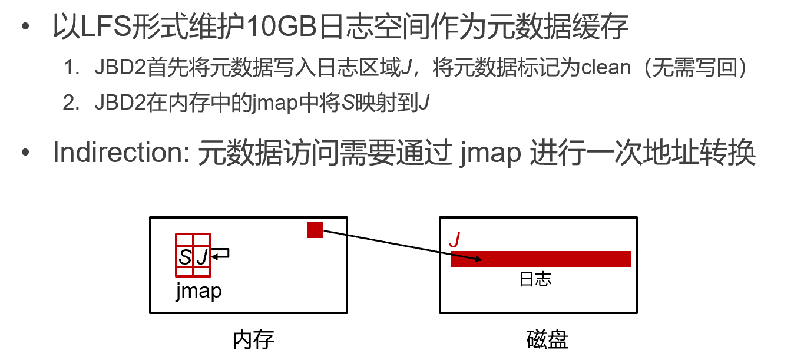

**断电后内存中的jmap没了？**

通过扫描日志，恢复还原jmap即可（恢复存储的所有S到J到映射）

**日志满了怎么办？**

- 日志空间清理
  - 无效的元数据（被新修改覆盖过的元数据）可以直接被回收
  - 对于冷的元数据，可将其写回到Ext4中其原本的位置*S*
  - 热的元数据继续保留在日志中


## 闪存盘的文件系统（Flash Disk）：NAND

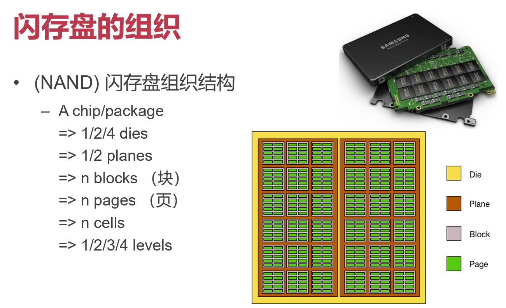

- 闪存盘：层次化的方式一层一层嵌套组织


- 多个channel可以同时执行读/写请求

**闪存盘的性质**

为了写一个page，需要把这个page所在的block全部擦掉（只能在**空的**block上写页）

- 非对称的读写与擦除操作
  - 页 (page) 是读写单元 (8-16KB)
  - 块 (block) 是擦除单元 (4-8MB)
- Program/Erase cycles
  - 写入前需要先擦除
  - 每个块被擦除的次数是有限的
- 随机访问性能
  - 没有寻道时间
  - 随机访问的速度提升，但仍与顺序访问有一定差距
- 磨损均衡
  - 频繁写入同一个块会造成写穿问题
    - 如果EXT4直接用，元数据块肯定先磨损
  - 将写入操作均匀的分摊在整个设备
- 多通道：多通道同时写，高并行性
- 异质Cell：存储1到4个比特：SLC 、MLC、TLC、 QLC（single， multiple，triple...）
  - SLC最贵，但是最快，耐磨度也最好

### Flash Translation Layer (FTL)

- **逻辑地址到物理地址的转换**
  - 对外使用逻辑地址
  - 内部使用物理地址
  - 可软件实现，也可以固件实现
  - 用于垃圾回收、数据迁移、磨损均衡（wear-levelling）等


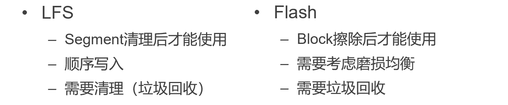

### F2FS文件系统： Flash Friendly File System

**LFS 问题**

- LFS的问题1：递归更新问题

  修改数据之后，之后要修改所有直接间接指向这块数据的块

  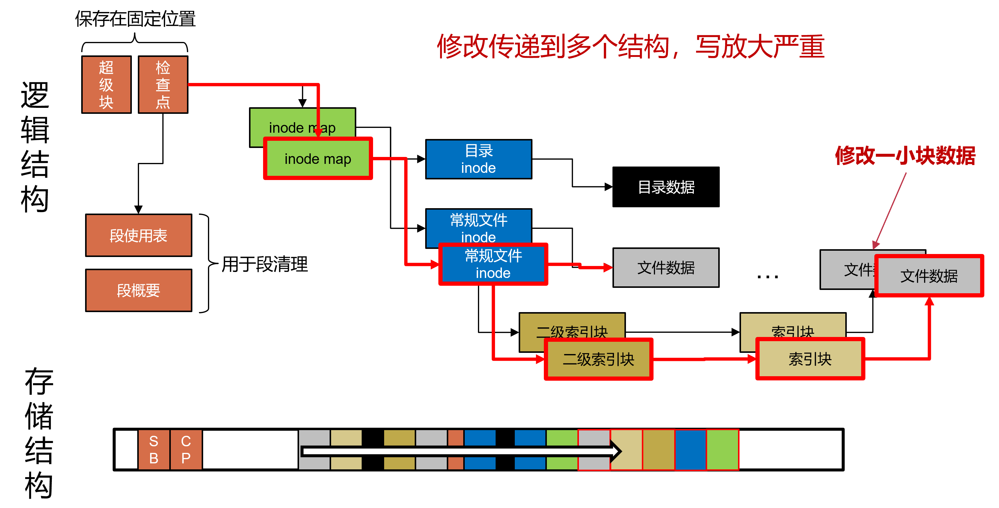

- LFS的问题2：对于单一log顺序写入，无法利用到现代Flash设备的高并行性（无法同时写）

解决：逻辑块号上面加了一层indirection

- F2FS的改进1：NAT（Node Address Table）

  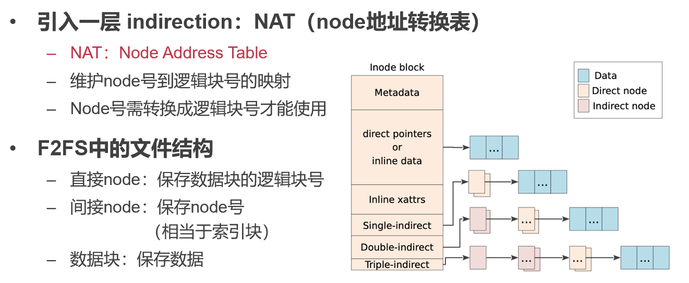

  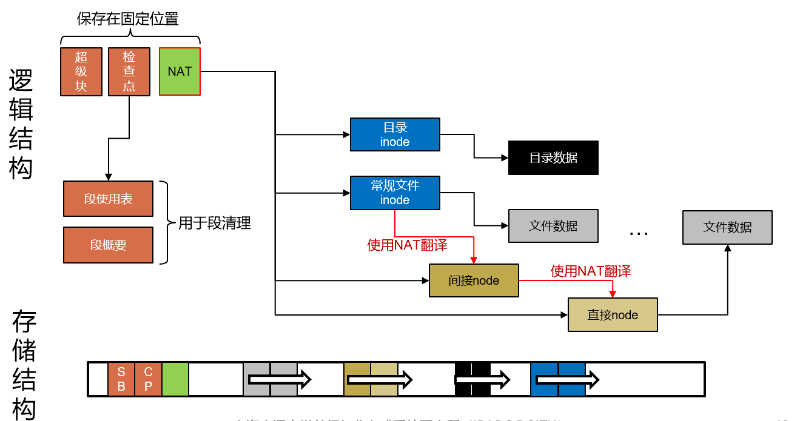

  

  node：inode中的间接多级的部分

- F2FS的改进2：多log并行写入

  需要对数据进行分类，不同类并行写
  
  **闪存友好的磁盘布局**
  
  
  
  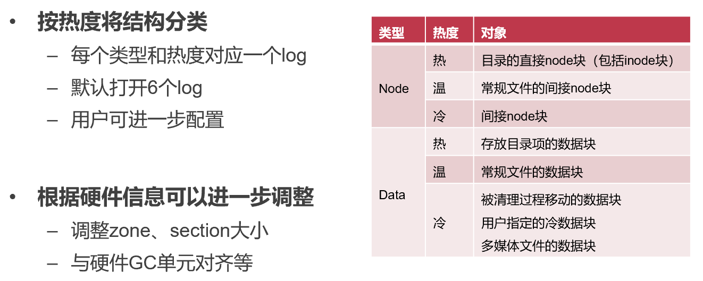

## 非易失性内存 Non-volatile Memory (NVM)

重启后，内存里面的数据还在

**NVDIMM**

- 在内存条上加上Flash和超级电容（足够把DRAM中的数据转移到Flash中的电量）
  - 平时数据在DRAM中；断电后转移到Flash中持久保存
- 容量很难再提升

**Intel Optane DC Persistent Memory**

内存接口；字节寻址；持久保存数据；高密度 (单条512GB/DIMM)；需要磨损均衡，但耐磨度比NAND好10倍；比DRAM慢十倍以内，比NAND快1000倍

### 非易失性内存带来的新问题

断电之后NVM里面的数据没有丢，但是CPU缓存里面的数据丢了

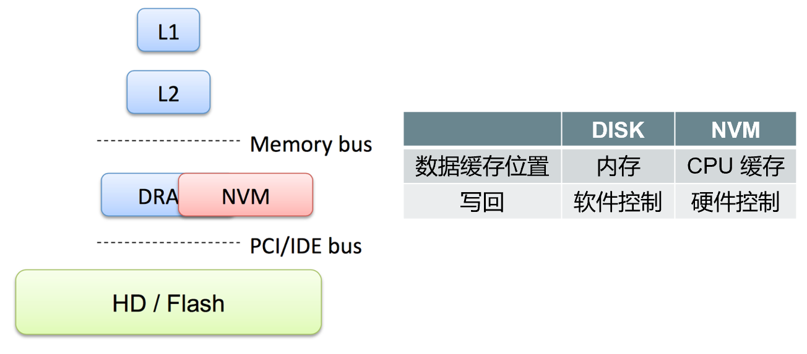

#### 内存写入顺序

Writeback模式的CPU缓存：虽然能提升性能，但会打乱数据写入内存的顺序


考虑持久性和一致性，写入顺序很重要

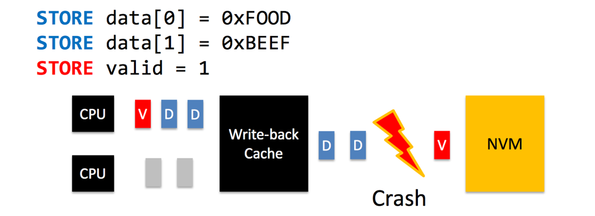

读到valid以为D都已经成功写入，但是实际上是因为cache的策略导致V在两个D之前写入NVM，并且cache断电后里面的数据丢失

**解决**

- 关闭CPU缓存？
- 使用Write-through模式的缓存？
- 每次写入后刷除整个缓存？

**使用CLFLUSH保证顺序**（cacheline flush）

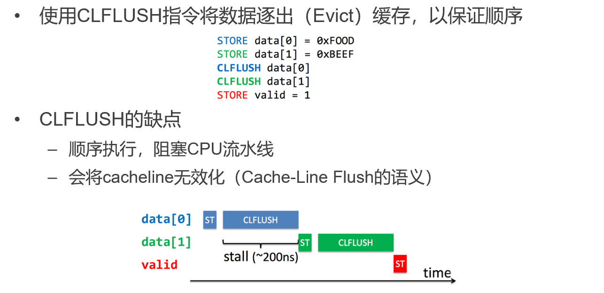

**Intel x86 拓展指令集**

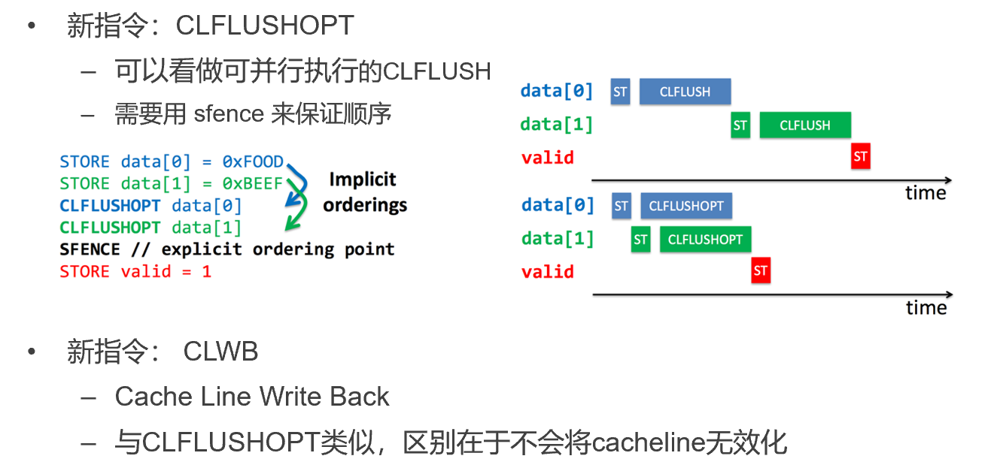

CLWB不会把缓存清掉

**案例：NVM上的写时复制**

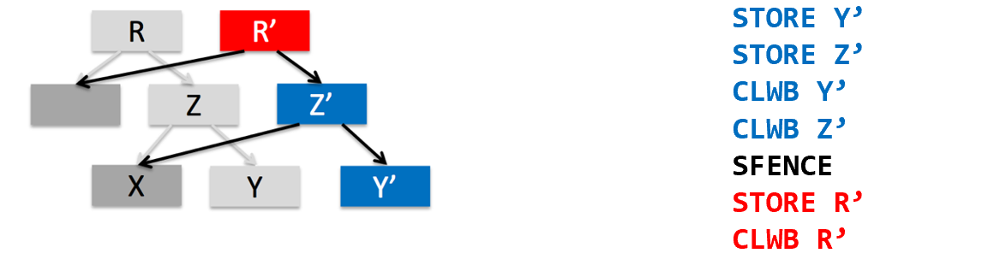

- SFENCE：保证写入顺序
- CLWB R' 为 commit point

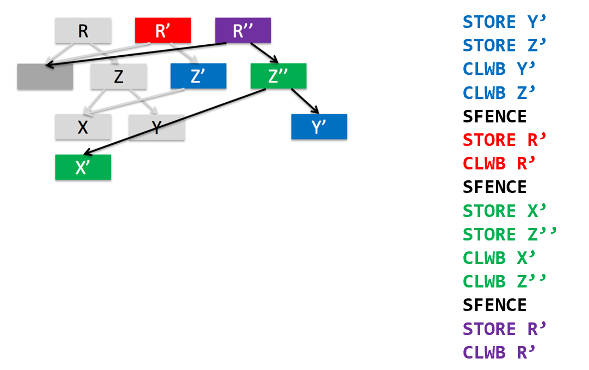

### 非易失性内存文件系统 Non-volatile Memory File System

何必要用文件接口来访问非易失性内存？可以把对应的存储层干掉

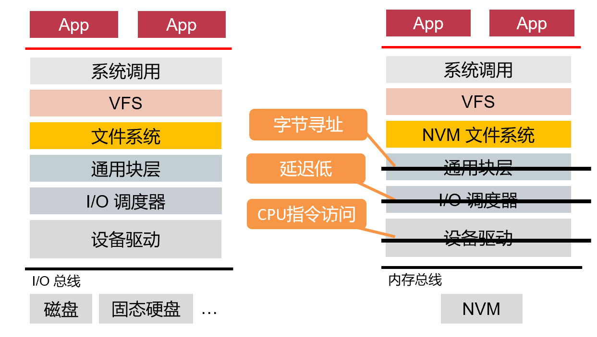

**PMFS**

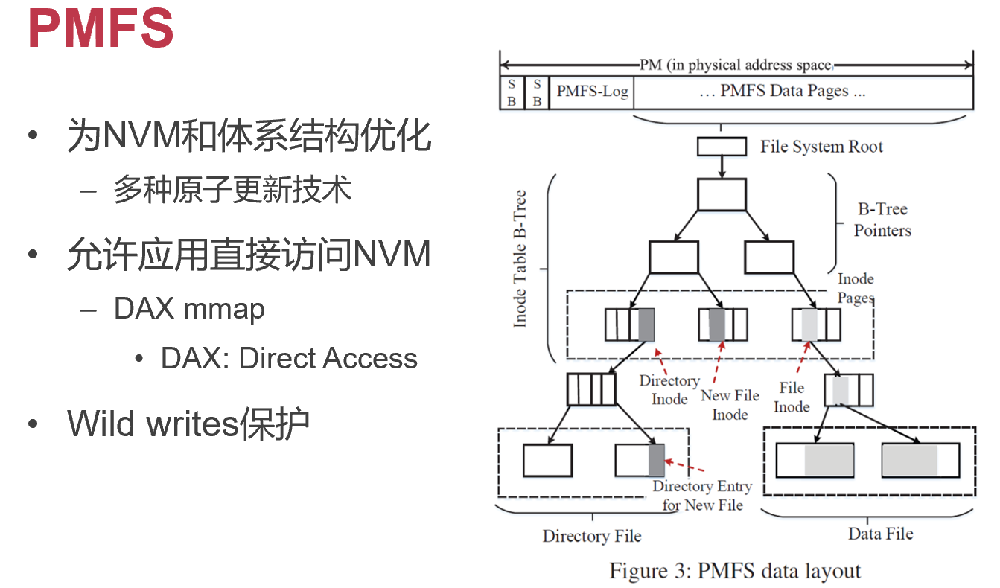

**PMFS中的一致性保证**

- 现有方法
  - 写时复制 (Shadow Paging)：用于文件数据更新
  - 日志：用于元数据更新，如inode
  - Log-structured updates
- NVM专有的方法
  - 原子指令更新：用于小修改

**拓展的原子指令更新**

- 8字节更新
  - CPU原本就支持8字节的原子更新
  - 更新inode的访问时间
- 16字节更新 
  - 使用 *cmpxchg16b* 指令
  - 同时更新inode中的文件大小和修改时间
- 64字节更新
  - 使用硬件事务内存（HTM）
  - 更新inode中的多个数据

**让应用直接访问NVM**

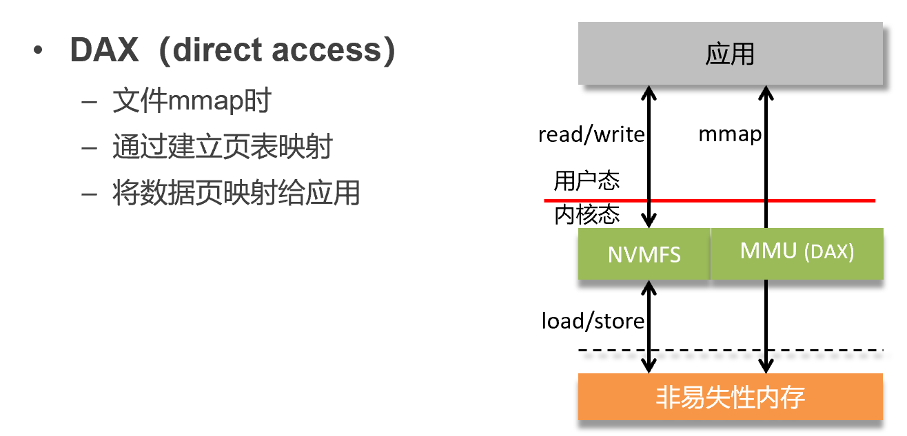

底层内存接口通过NVMFS变成文件系统接口，再通过memory map变成内存接口

**如何防止NVM上的wild writes？**

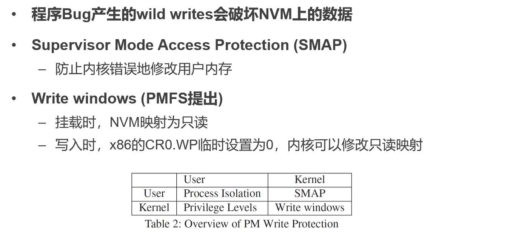

### 不同NVM文件系统的层次

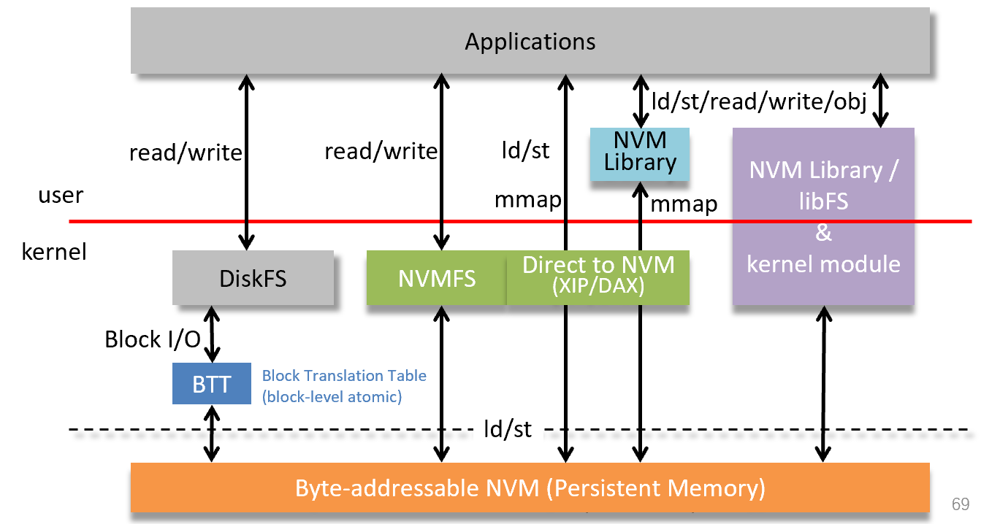


# 设备管理与I/O子系统

## 操作系统的I/O层次

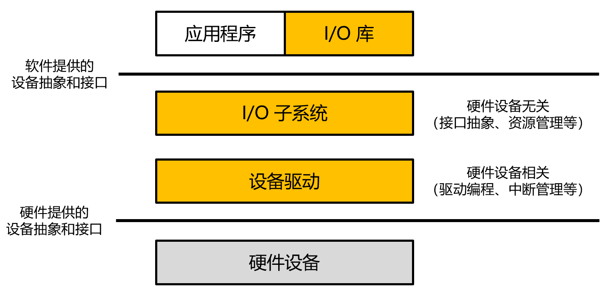

注意，上面的横线不是用户态和内核态的划分，而操作系统和应用程序的分界线

## 硬件设备

**不同的响应速度需求**（块设备，网络设备，字符设备）

- PS/2 键盘控制器：按下键盘之后，把对应按键的 scan code 存储在某个寄存器中，等待 CPU 读走
  - CPU 读的频率如果比按的频率慢？按下一个键不放？
- UART（串口）通用异步收发传输器 Universal Asynchronous Receiver/Transmitter：半双工，每次只能传输一个字符
- Flash 闪存：按照页/块的粒度进行读写/擦除，支持页/块随机访问
- Ethernet 网卡：每次传输一帧数据（以太网帧）

## 设备与CPU的连接（硬件视角）

### 硬件总线：以AMBA为例

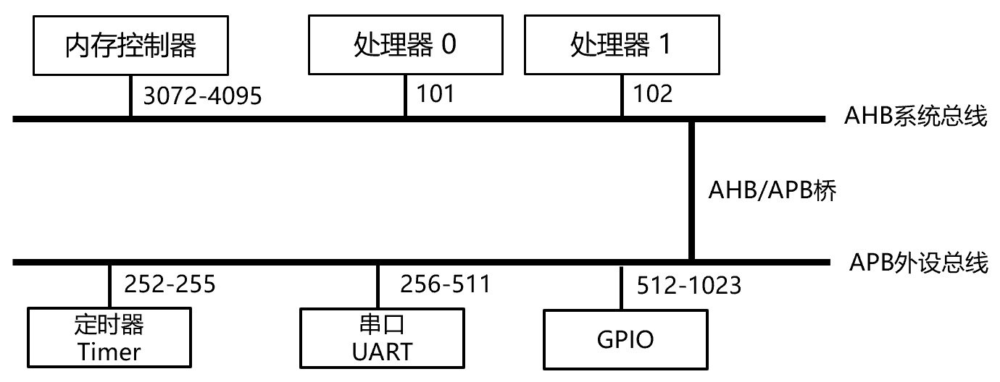

- AHB: Advanced High-performance Bus（高速总线）
- APB: Advanced Peripheral（外设） Bus（低速总线）

<u>**物理地址本质上是总线地址！内存占的比较多，其它部分占用的比较少**</u>

- 硬件设备都在一个地址空间之内！这样才能够交互
- 每个设备都有自己的地址区域

#### 硬件总线的特点

- **一组电线**
  - 将各个I/O模块连接到一起，包含了地址总线、数据总线和控制总线
- **使用广播**（广播意味着同时只有一个人能在发消息，一个人在收有用的消息）
  - 每个模块都能收到消息
  - 总线**地址**：标识了预期的接收方
- **仲裁协议**
  - 决定哪个模块可以在什么时间收发消息
  - 总线仲裁器：用于选择哪些模块可以使用该总线

#### 数据传输的同步与异步

- **同步数据传输**
  - 源（Source）和目标（destination）借助**共享时钟**进行协作
  - 例子：DDR内存访问（对表，看电平，每一个cycle收一个数据）
- **异步数据传输**
  - 源（Source）和目标（destination）借助**显式信号**进行协作
  - 例子：对信号的确认（ack）（有一根显式的信号线告诉什么时候可以收数据，什么时候不行）

#### 总线事务

1. 源（发送方）获取总线的使用权（具有排他性）（仲裁器决定）
2. 源（发送方）将目标（接收方）的地址写到总线上
3. 源（发送方）发出 READY 信号，提醒其他模块（广播）
4. 目标（接收方）在拷贝完数据后，发出 ACKNOWLEDGE 信号
   - 同步模式下，无需 READY 和 ACKNOWLEDGE，只要在每个时钟周期进行检查即可
5. 源（发送方）释放总线

### 中断线

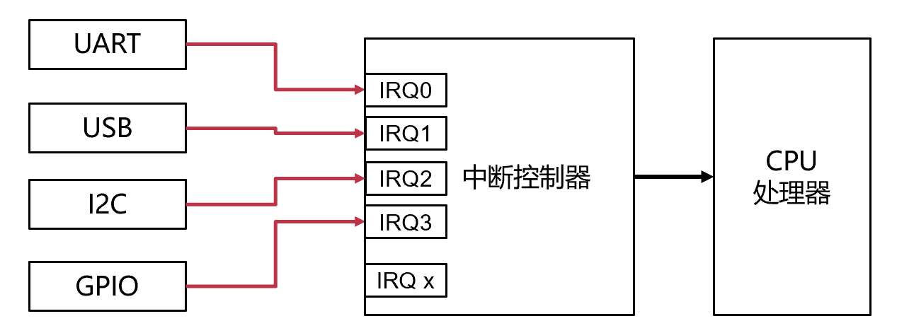

- 中断线：CPU上的**一个**针脚/金属触点；这个线上的电平高低变化，表示有无中断
- 中断控制器：连接到不同的硬件设备，将不同硬件设备发来的中断转发给CPU处理器的那一个线上，中断控制器也会告诉CPU是谁给它发的中断，方便OS运行相应驱动

## 设备与CPU的交互（驱动/软件视角）

在软件看来，**设备就是一组寄存器**

### 硬件设备的接口：设备寄存器

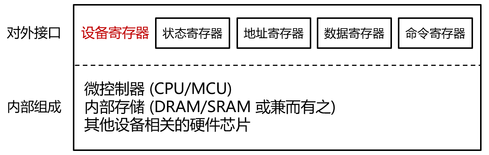

- CPU 与内存交互：把内存的地址直接映射到总线地址上（也即物理地址），CPU 想读任何一个字节都可以直接从总线上读；CPU 读内存的流程即为：CPU 给要读的地址到总线上，内存拿到地址，把对应地址位置的数据放到总线上，之后 CPU 读走数据
- CPU 与硬盘交互（只在几个寄存器）：不会把硬盘的地址直接映射到总线地址上；如写磁盘，处理器将地址（block id）传给磁盘（第一个寄存器），写到内存的什么地址位置（第二个寄存器），表示是否开始做（第三个寄存器）等，硬盘就把对应的数据写到内存（DMA，数据不直接与 CPU 交互），之后再发中断给 CPU 说写完了

### 数据交互方式

#### 可编程I/O（Programmable I/O）：一点一点传数据，慢

- 通过CPU in/out 或 load/store 指令

- 消耗CPU时钟周期和数据量成正比

- 适合于简单小型的设备


##### <u>内存映射 I/O MMIO (Memory-mapped I/O)</u>

- 将设备映射到连续物理内存中

- 使用内存访问指令（load/store）

- 行为与内存不完全一样，**读写有副作用（需要volatile）**

- 在Arm、RISC-V等架构中使用

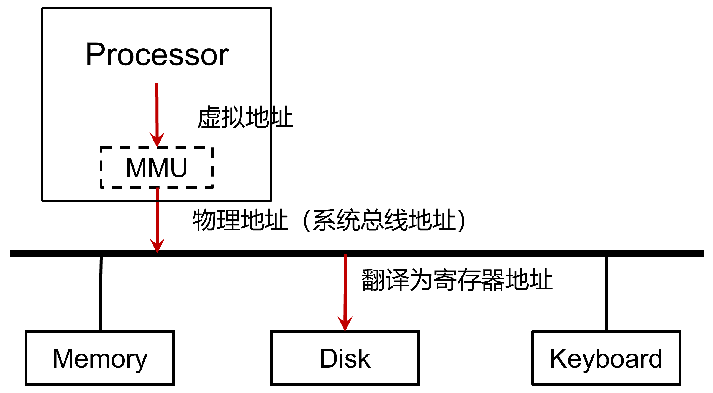

使用控制内存的接口控制设备寄存器：虚拟地址翻译成物理地址来控制对应寄存器；要写一个寄存器只需要写对应虚拟地址（背后是某个设备寄存器），但是暴露给软件层面仍旧是使用 `load` 与 `store`

**案例**

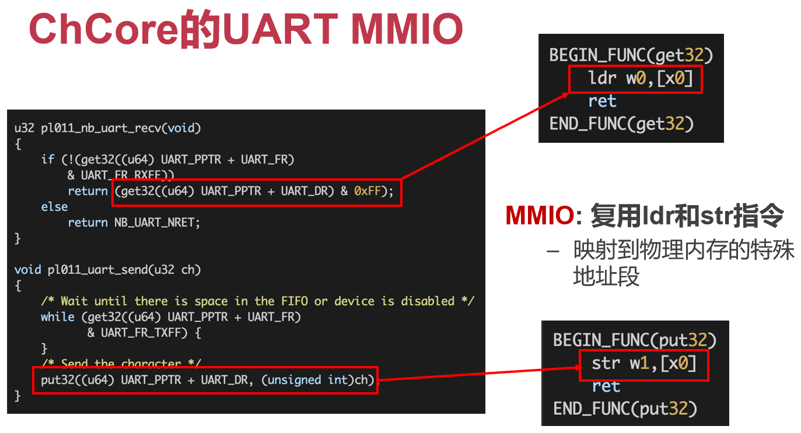

**<u>MMIO地址应使用Volatile关键字</u>**

否则可能会不把对应的设备寄存器当成“内存”用，而把值放到CPU通用寄存器里；这样即使设备寄存器被修改，上层的CPU通用寄存器值不会变！同时也可能从缓存里面拿，但是最新的数据在物理地址对应位置上（设备寄存器中）

- 编译器：优化，多次使用存储在通用寄存器中，而不重新去内存中取
- OS：可能从缓存中拿取对应“设备寄存器”，要设置为non-cacheable

##### PIO (Port I/O)

- IO设备具有独立的地址空间

- 使用专门的PIO指令（ in/out ）

- 在x86架构中使用

在总线的物理地址空间之外有额外的一块地址空间，用 in/out 来读写

#### 直接内存访问（Direct Memory Access, DMA）：硬盘与内存直接传数据，不用经过CPU

- 设备可直接访问总线
- DMA与内存互相传输数据，传输不需要CPU参与
- 适合于高吞吐量I/O

> 核心：绕过CPU去做事情，给CPU核心的任务留下更多时间


**如何保证设备访存（使用物理地址）的安全性？**

- MMU在CPU里，因此DMA访存使用的是物理地址而不是虚拟地址（否则还得去MMU翻译一下）
- 使用物理地址访存，不受虚拟地址权限的管控
- 添加IOMMU

**DMA的内存一致性**

- 现代处理器通常带有高速缓存（CPU Cache）

- 当DMA发生时，DMA缓冲区的数据仍在cache中怎么办？

- **解决方法：**

  方案1：将DMA区域映射为non-cacheable

  方案2：由软件负责维护一致性，软件主动刷缓存

  部分架构在硬件上保证了DMA一致性，如总线监视技术

### IOMMU

**避免设备直接使用物理地址访问内存**

在主板/总线上，而不是每个设备有一个（这样对于接入总线的任意设备，都有了虚拟地址）

- 设备所使用的地址，由IOMMU翻译为实际的物理地址
- 广泛应用于虚拟机场景中（允许虚拟机独占某个设备）

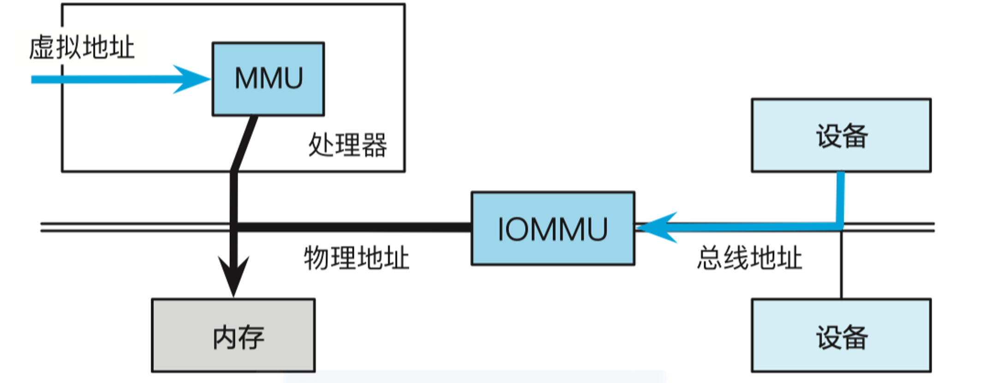

### CPU访问设备方式小结

- **MMIO** ：将设备寄存器映射到物理地址空间，CPU通过读写设备寄存器操作设备
- **DMA**：设备使用物理地址访问内存

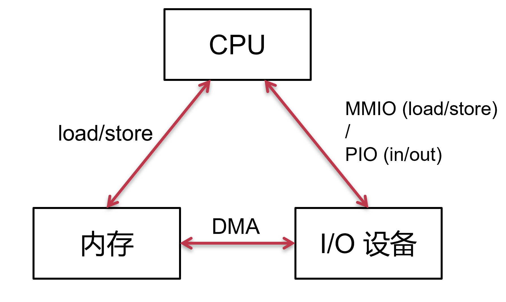


## 中断与中断响应：设备通知CPU的方式

之所以要引入中断，是因为CPU太快了，设备太慢了，希望CPU不用等设备

> 当设备比CPU要快的时候，比如网卡（现在高速万兆网卡可以达到1000个cycle就来一个包），那么CPU绝大部分时间都在被网卡中断，之后保存/恢复上下文，以及处理对应包。此时中断就不是好的方式！

<u>中断只适合慢速设备！</u>

**高频中断的问题：活锁**

- 网络场景下的中断使用（网卡设备）
  - 当每个网络包到来时都发送中断请求时，OS可能进入活锁
  - 活锁：CPU只顾着响应中断，无法调度用户进程和处理中断发来的数据
- 解决方案：合二为一（中断+轮询），兼顾各方优势
  - 默认使用中断
  - 网络中断发生后，使用轮询处理后续达到的网络包
  - 如果没有更多中断，或轮询中断超过时间限制，则回到中断模式
  - 该方案在Linux网络驱动中称为 NAPI (New API)

### CPU中断处理流程

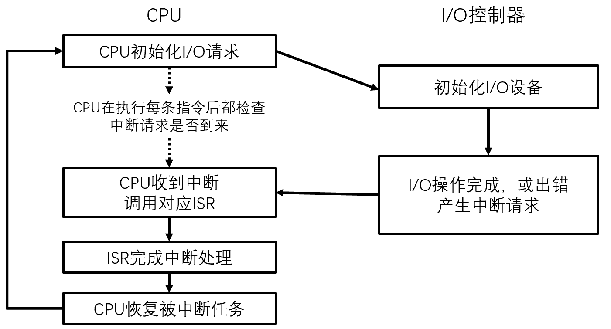

> 真机上：CPU每一行指令之后检查一下中断电平
>
> QEMU中：每一个逻辑代码basic block之后检查中断电平，因此有很多bug可能不会出现（中断粒度太粗）

### AArch64的中断分类

IRQ，FIQ连接CPU的不同针脚，可在中断控制器（Interrupt Controller）中配置

- IRQ（Interrupt Request）
  - 普通中断，优先级低，处理慢
- FIQ（Fast Interrupt Request）
  - 一次只能有一个FIQ
  - 快速中断，优先级高，处理快
  - 常为可信任的中断源预留
- SError（System Error）
  - 原因难以定位、较难处理的异常，多由异步中止（Abort）导致
  - 如从缓存行（Cacheline）写回至内存时发生的异常

**多核CPU如何处理中断？如何避免中断一次性打断所有核呢？**

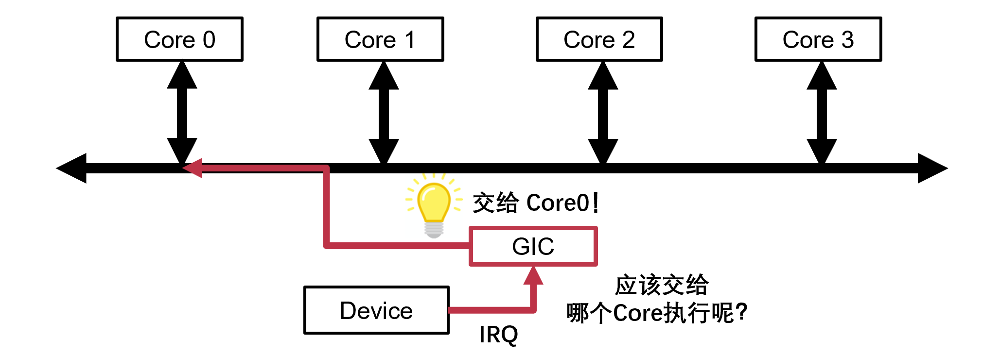

### ARM 中断控制器——GIC（Generic Interrupt Controller）

接受硬件中断信号，并进行简单处理，通过一定的设置策略，分给对应的CPU进行处理


连接不同的CPU核心和不同的设备（单点，可能成为瓶颈）

- 组件1：Distributor
  - 负责全局中断的分发和管理
- 组件2：CPU Interface
  - 类似“门卫”，判断中断是否要发给CPU处理

#### GIC Distributor

- 中断分发器：将当前最高优先级中断转发给对应CPU Interface
- 寄存器：GICD
- 作用：中断使能，确定中断优先级，中断分组，中断触发方式，中断的目的core

#### CPU Interface

将中断发给具体的CPU

- CPU接口：将GICD发送的中断，通过IRQ中断线发给连接到 interface 的核心
- 寄存器：GICC
- 作用：将中断请求发给CPU，配置中断屏蔽，中断确认（acknowledging an interrupt），中断完成（indicating completion of an interrupt），核间中断（Inter-Processor Interrupt，IPI）以用于核间通信（为了让 OS 通知所有 CPU 核心去 flush TLB cache）

### ARM中断的生命周期

1. Generate：外设发起一个中断
2. Distribute：Distributor对收到的中断源进行仲裁，然后发送给对应CPU Interface（可配置）
3. Deliver：CPU Interface将中断传给core
4. Activate：core读 GICC_IAR 寄存器，对中断进行确认
5. Priority drop：core写 GICC_EOIR 寄存器，实现优先级重置
6. Deactivate：core写 GICC_DIR 寄存器，来无效该中断

### 多个中断同时发生怎么办？

中断优先级：当多个中断同时发生时（NMI、软中断、异常），CPU首先响应高优先级的中断

ARM Cortex-M 处理器的中断优先级如下所示：

| **类型**                        | **优先级（值越低，优先级越高）** |
| ------------------------------- | -------------------------------- |
| 复位（reset）                   | -3                               |
| 不可屏蔽中断（NMI）             | -2                               |
| 硬件故障（Hard  Fault）         | -1                               |
| 系统服务调用（SVcall）          | 可配置                           |
| 调试监控（debug  monitor）      | 可配置                           |
| 系统定时器（SysTick）           | 可配置                           |
| 外部中断（External  Interrupt） | 可配置                           |

### 中断嵌套

- 中断也可能被“中断”
- 在处理当前中断（ISR）时：更高优先级的中断产生；或者相同优先级的中断产生
- 如何响应：
  - 允许高优先级抢占
  - 同级中断无法抢占
- ARM的FIQ能抢占任意IRQ，FIQ本身不可抢占

#### 如何禁止中断被抢占？（软件保证而不是硬件）

- 中断屏蔽：
  - 屏蔽全局中断：不再响应任何外设请求
  - 屏蔽对应中断：只停止对应IRQ的响应
- 屏蔽策略：
  - 屏蔽全局中断：
    - 系统关键步骤（原子性）
    - 保证任务响应的实时性
  - 屏蔽对应中断：通常都是这种情况，对系统的整体影响最小

### 中断合并（Interrupt Coalescing）

与合二为一（中断+轮询）不同的对于高频中断的解决方案，压制发送端，多个设备中断合并变成一个

- 中断合并：设备在发送中断前，需要等待一小段时间。在等待期间，其他中断可能也会马上到来，因此将多个中断合并为同一个中断，进而降低频繁中断带来的开销（之后需要分开来处理）
- 注意：等待过长时间会导致中断响应时延增加，这是系统中常见的“折衷”（trade-off）

### 案例：Linux的上下半部（中断子系统）

面临问题：

- 中断处理过程中若运行复杂逻辑，会导致系统失去响应更久
- 中断处理时不能调用会导致系统block的函数

将中断处理分为两部分：

- 上半部（Top Half）：尽量快，提高对外设的响应能力（<u>尽量不能block，不做耗时操作</u>，马上做）
  - 最小化公共例程：
    - 保存寄存器、屏蔽中断
    - 恢复寄存器，返回现场
  - Top half 要做的事情：把硬件产生的数据放到安全的地方
    - 将请求放入队列（或设置flag）（注意避免被相隔很近的下一个请求覆盖，类似于收多个signal当成一个），将其他处理推迟到bottom half
      - 现代处理器中，多个I/O设备共享一个IRQ和中断向量（IRQ少，不够用）
      - 多个ISR (interrupt service routines)可以绑定同一向量上
    - 调用每个设备对应的IRQ的ISR 
    - 不允许做耗时操作，如不允许内核访问用户态内存（因为有可能会swap页，耗时）
- 下半部（Bottom Half）：将中断的处理推迟完成（绝大多数工作，延迟做）
  - 提供可以推迟完成任务的机制：softirqs，tasklets (建立在softirqs之上)，工作队列，内核线程
    - 内核线程（Kernel Threads）：始终运行在内核态，进行处理中断的剩余工作
      1. 没有用户空间上下文
      2. 和用户进程一样被调度器管理
  - 这些机制都**可以被中断**

| 特点                                  | ISR     | SoftIRQ | Tasklet | WorkQueue | KThread |
| ------------------------------------- | ------- | ------- | ------- | --------- | ------- |
| 禁用所有中断？                        | Briefly | No      | No      | No        | No      |
| 禁用相同优先级的中断？                | Yes     | Yes     | No      | No        | No      |
| 比常规任务优先级更高？                | Yes     | Yes*    | Yes*    | No        | No      |
| 在相同处理器上运行？                  | N/A     | Yes     | Yes     | Yes       | Maybe   |
| 允许在同一CPU上有多个实例同时运行？   | No      | No      | No      | Yes       | Yes     |
| 允许在多个CPU上运行同时多个相同实例？ | Yes     | Yes     | No      | Yes       | Yes     |
| 完整的模式切换？                      | No      | No      | No      | Yes       | Yes     |
| 能否睡眠（拥有自己的内核栈）？        | No      | No      | No      | Yes       | Yes     |
| 能否访问用户空间？                    | No      | No      | No      | No        | No      |

## 设备驱动（设备相关的I/O软件）

一般而言一个硬件对应一个驱动

设备驱动：

- 专门用于操作硬件设备的代码集合
- 通常由硬件制造商负责提供
- 驱动程序**包含中断处理程序**

驱动特点：

- 和设备功能高度相关
- 不同设备间的驱动复杂度差异巨大
- 是操作系统 bugs 的主要来源

### 宏内核I/O架构（Linux、BSD、Windows）

- 设备驱动在内核态
- 优势：通常性能更好
- 劣势：容错性差
- 中断形式为内核ISR

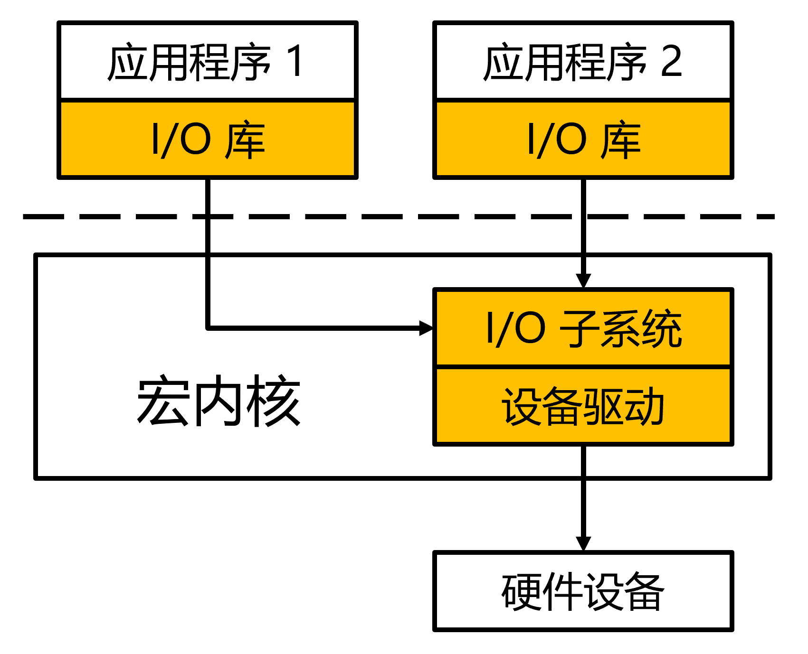

### 微内核I/O架构（谷歌Fuchsia手机系统）

驱动与I/O子系统分别为两个进程，通过IPC调

- 设备驱动主体在用户态
- 优势：可靠性和容错性更好
- 劣势：IPC性能开销
- 中断为用户态驱动线程

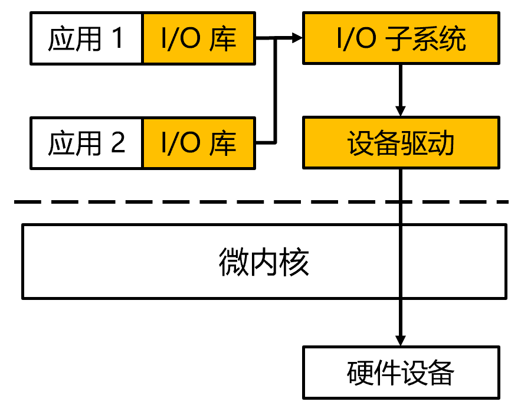

### 混合I/O架构（谷歌安卓系统：硬件抽象层（HAL））

- 设备驱动分解为用户态和内核态
- 优势1：驱动开发和Linux内核解耦
- 优势2：允许驱动以闭源形式存在，保护硬件厂商的知识产权（放linux内核里面的东西必须要开源）

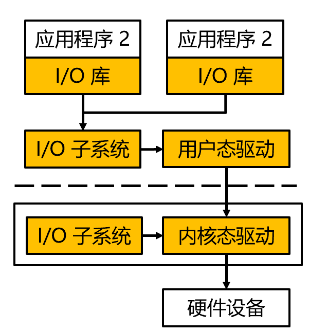


### Linux 驱动模型 Linux Device Driver Model (LDDM)

设备驱动的复杂性在提高，希望标准化的数据结构和接口，将驱动开发简化为对数据结构的填充和实现

**驱动模型的好处**

- 电源管理：
  - 描述设备在系统中的拓扑结构（树形结构）
  - 保证能正确控制设备的电源，先关闭设备和再关闭总线
- 驱动开发者：
  - 允许同系列设备的驱动代码之间的复用
  - 将设备和驱动联系起来，方便相互索引
- 系统管理员：
  - 帮助用户枚举系统设备，观察设备间拓扑和设备的工作状态

**提供驱动的统一抽象，具体驱动实现对应接口即可**

- 支持电源管理与设备的热拔插
- 利用sysfs向用户空间提供系统信息
- 维护内核对象的依赖关系与生命周期，简化开发工作
  - 驱动人员只需告诉内核对象间的依赖关系
  - 启动设备时会自动初始化依赖的对象，直到启动条件满足为止

## I/O子系统（设备无关的I/O软件）

进一步收敛复杂性，不同设备驱动还是不一样，需要统一管理

目标：提供统一接口，涵盖不同设备；满足I/O硬件管理的共同需求，提供统一抽象

### 设备文件：统一抽象

- 为应用程序提供的相同的设备抽象：设备文件
- 操作系统将外设细节和协议封装在文件接口的内部
- 复用文件系统接口：open(), read(), write(), close, etc.


**设备操作的专用接口：`ioctl`**

- 需要应用程序和驱动程序事先协商好“操作码”和对应语义，驱动自己解释操作码
- 通用接口，第一个参数为 `fd`，之后参数任意


### 设备文件操作与设备驱动函数的对接

通过函数指针

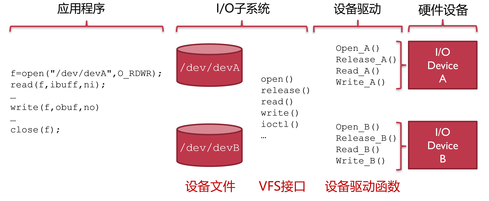

### 设备的逻辑分类

Linux设备分类

- 字符设备：如键盘，串口；数据一次来一个，就处理一个
- 块设备：如磁盘，SSD；数据可以随机访问
- 网络设备

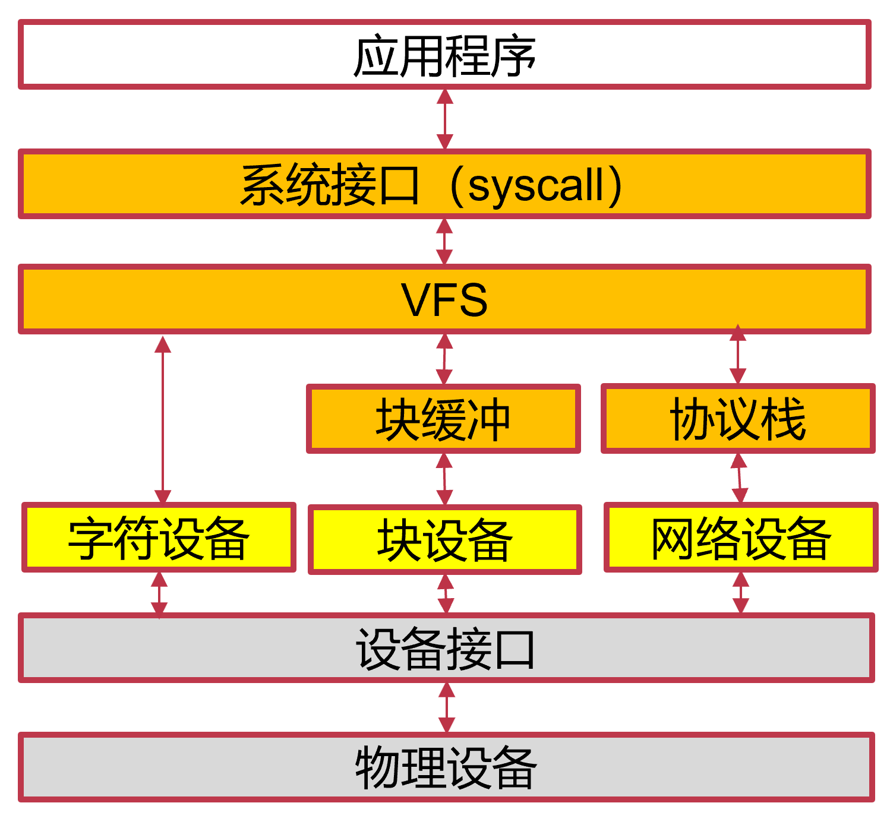

#### 字符设备（cdev）

- 键盘、鼠标、串口、打印机等
- 大多数伪设备：`/dev/null`, `/dev/zero`, `/dev/random`

访问模式：

- **顺序访问**，每次读取一个字符
- 调用驱动程序和设备直接交互

**文件抽象**：open(), read(), write(), close()

#### 块设备（blkdev）

磁盘、U盘、闪存等（以存储设备为主）

访问模式：

- **随机访问**，以块为单位进行寻址（如512B、4KB不等）
- 通常为块设备增加一层缓冲，避免频繁读写I/O导致的慢速

通常使用**内存抽象**：

- 内存映射文件(Memory-Mapped File)：`mmap()` 访问块设备

  

- 提供文件形式接口和原始I/O接口（绕过缓冲）

#### 网络设备（netdev）

以太网、WiFi、蓝牙等（以通信设备为主）

访问模式：

- 面向**格式化报文**的收发
- 在驱动层之上维护多种协议，支持不同策略

**套接字抽象：**socket(), send(), recv(), close(), etc.

#### 设备逻辑分类小结

总体而言都是文件

**设备分类：**

- 字符设备（cdev）：键盘、鼠标、串口、打印机等
- 块设备（blkdev）：磁盘、U盘、闪存等存储设备
- 网络设备（netdev）：以太网、WiFi、蓝牙等通信设备

**设备接口：**

- 字符设备： read(), write()
- 块设备： read(), write(), lseek(), mmap()
- 网络设备：socket(), send(), recv()
  - 同时兼容文件接口（也可以用read(), write()读写socket）

### 设备的缓冲管理

#### 单缓冲区

问题：

- 读写性能不匹配：慢速的存储设备 vs. 高速的CPU
- 读写粒度不匹配：小数据的访问存在读写放大的问题

解决方法：

- 开辟内存缓冲区，避免频繁读写I/O

单缓冲区例子：Linux的page cache（读的时候当cache，写的时候当buffer）


#### 双缓冲区

- 维护两个缓冲区，轮流使用（读写错开）
- 第一个缓冲区被填满但没被读取前，使用第二个缓冲区填充数据
- 双缓冲区例子：显存刷新，防止屏幕内容出现闪烁或撕裂
  - 前置缓冲区被读取后，通过“交换”（swap）将前置和后置身份互换
- 游戏中甚至启用三重缓冲

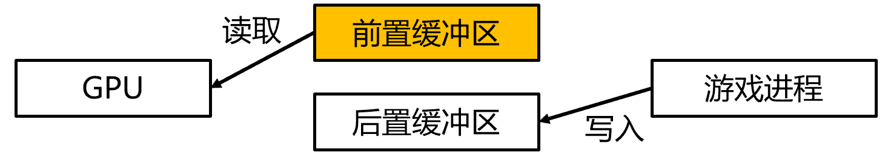

之后交换缓冲区（前置后置交换），GPU从前置缓冲区（原后置）读，游戏进程写入后置缓冲区

#### 环形缓冲区

- 容许更多缓冲区存在，提高I/O带宽
- 组成：一段连续内存区域+两个指针，读写时自动推进指针
  - 读指针：指向有效数据区域的开始地址
  - 写指针：指向下一个空闲区域的开始地址
- 环形缓冲区例子：网卡DMA缓冲区、NVMe存储的命令队列


#### 设备的缓冲区管理小结

- 单缓冲区：块设备的缓冲区
- 双缓冲区：常用于游戏或流媒体的显存同步
- 环形缓冲区：网卡的数据交互和NVMe存储的命令交互

**缓冲区是否总能提高性能？**

缓冲区意味着数据的多次拷贝，使用过多反而损伤性能

### I/O模型：如何同时监听多个设备？

- 如果要支持多个fd怎么办？
  - 阻塞I/O：一旦一个阻塞，则其余无法响应
- 改成非阻塞可以么？
  - 非阻塞I/O：需要程序不断轮询设备情况：浪费CPU
- 能否采用异步通知机制？让内核主动来通知？
  - 异步I/O：允许程序先做其他事，等设备数据就绪再接收通知
  - 多路复用I/O：仍为阻塞，但一旦设备数据就绪就收到通知

#### 阻塞I/O模型

一旦一个阻塞，则其余无法响应


#### 非阻塞I/O模型

不断轮询设备情况，浪费CPU

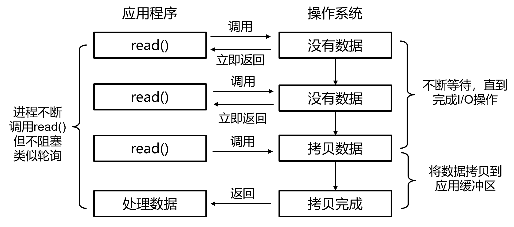

#### 异步I/O模型

立即返回，允许程序先做其他事，等设备数据就绪再接收通知


#### I/O多路复用模型

同时等待多个fd，直到其中有一个可用就用

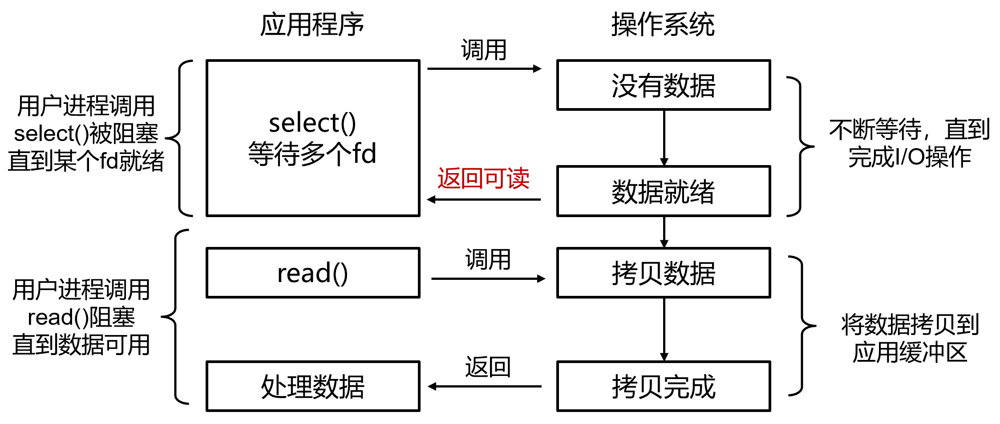

#### I/O模型小结

- 阻塞I/O：一直等待
  - 进程请求<u>读数据</u>不得，将其挂起，直到<u>数据来了</u>再将其唤醒
  - 进程请求<u>写数据</u>不得，将其挂起，直到<u>设备准备好了</u>再将其唤醒
- 非阻塞I/O：不等待
  - 读写请求后直接返回（可能读不到数据或者写失败）
- 异步I/O：稍后再来
  - 等读写请求成功后再通知用户
  - 用户执行并不停滞（类似DMA之于CPU）
- I/O多路复用：同时监听多个请求，只要有一个就绪就不再等待

## I/O库（应用程序员视角）

- 以共享库的形式，和应用程序直接链接
- 简化应用程序I/O开发的复杂度
- 提供更好的性能和更灵活的I/O管理能力
- 例子：glibc：提供用户态I/O缓冲区管理，Linux AIO和io_uring：支持异步I/O

### 案例：glibc的buffer I/O

- fread()/fwrite()和read()/write() 有何区别？
  - 前者是I/O库接口（函数调用），后者是VFS接口（系统调用）
  - 使用用户态缓冲区，减少模式切换次数
- 缓冲模式配置：
  - 全缓冲（_IOFBF）：缓冲区满了才flush缓冲区
  - 行缓冲（_IOLBF）：遇到换行符就flush缓冲区
  - 无缓冲（_IONBF）：和直接调用read()/write()效果一样

## 设备管理的三种方式

- 内核直管：静态I/O资源分配+向上提供文件接口
  - 代表设备：Console（CGA+键盘）
  - 特征：中断号等固定，内核直接提供文件接口（无需外部驱动，嵌在内核中，简单的设备）
- 设备驱动：动态I/O资源分配+向上提供文件接口
  - 代表设备：PCI、USB，如硬盘、网卡等
  - 特征：中断号等动态分配，内核提供驱动框架，设备制造商提供驱动模块
- 用户态库：动态I/O资源分配+向上提供内存接口
  - 代表设备：智能网卡、智能SSD
  - 特征：内核直接将设备（寄存器）暴露给用户态，设备制造商提供用户态库（绕过内核；内存接口load与store）

### OS的设备管理：对上与对下

- 向下对接设备：分配必要的I/O资源
  - 中断号 + 虚拟地址映射空间
    - 静态绑定：由硬件规范确定
    - 动态分配：动态扫描后再分配
- 对上提供接口：应用使用设备的方式
  - 文件接口：通过系统调用
    - open、read、write、close、ioctl等
  - 内存接口：寄存器直接映射到用户态虚拟内存空间
    - 无需系统调用，应用可直接访问设备

#### 内核直管

- 以Console为例
  - 包含设备：显示器（CGA）+键盘
- I/O资源静态绑定
  - 中断号（即异常向量表）
  - 寄存器所映射的虚拟内存地址
- 文件接口
  - read：读取键盘输入，通常以行为单位
  - write：向显示器输出字符并显示

#### 设备驱动

- 操作系统的设备驱动框架
  - 提供标准化的数据结构和接口
  - 将驱动开发简化为对数据结构的填充和实现
  - 方便操作系统统一组织和管理设备
- 操作系统为驱动提供的辅助功能
  - VFS（对上提供文件接口，可复用权限检查等逻辑）
  - 与设备类型相关的框架（如：块设备层、网络协议栈等）
  - 模块动态插入框架（如：Linux的module插入）
  - 中断处理框架（如：Linux的 top half + bottom half）

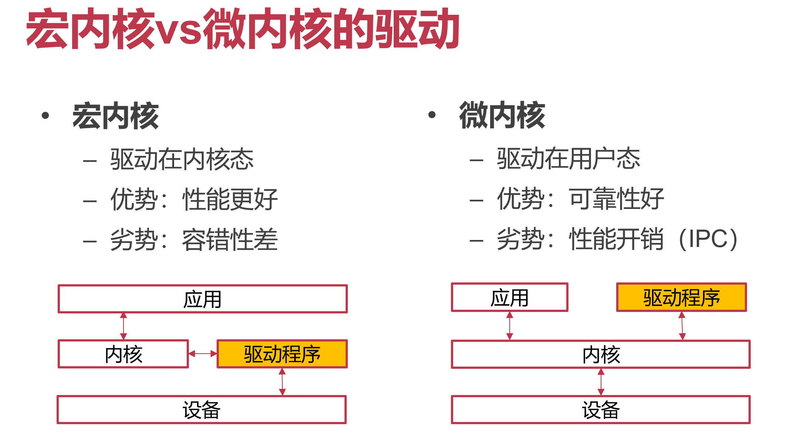

#### 用户态库

- 操作系统内核负责：
  - 将设备寄存器映射到用户可访问的虚拟地址空间
  - 通常只允许某一个应用访问该设备，防止发生冲突
- 用户态库负责：
  - 100%控制硬件设备，并向上或对外提供服务
  - 通过轮询访问设备（问：为何不用中断？有中断就会进内核）
    - 通常需要独占一个CPU
  - 典型例子：Intel DPDK（网卡）、SPDK（存储）
  - 通常用于高性能场景（问：为什么性能高？）

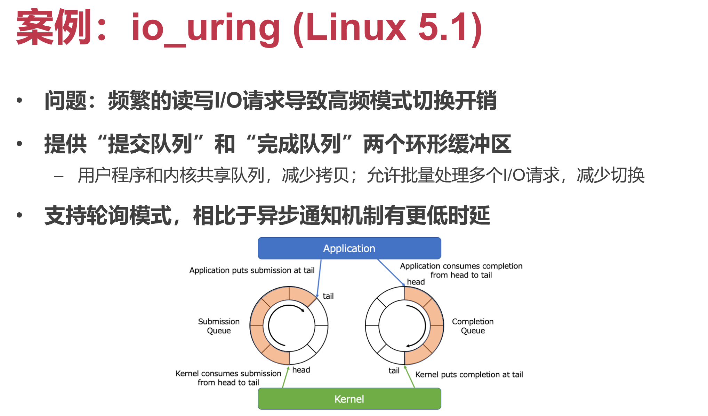

# 系统虚拟化

操作系统实际上也是一种虚拟化：对硬件的虚拟化，相当于让操作系统上层的应用以为自己是独占硬件

**计算设备集中与分散的变化**

大型机（集中式计算资源，所有用户通过网络连接大型机，共享计算资源）→ PC（分布式计算资源，每个PC用户独占计算资源）→ 云（集中式计算资源，所有人通过网络连接，共享计算资源）

共享计算资源的方法：

- 分时复用
- 系统虚拟化

**系统虚拟化是云计算的核心支撑技术**

新引入的一个软件层（虚拟化层），上层是操作系统+应用（虚拟机），底层是硬件；与上层软件解耦，上层软件可在不同硬件之间切换

**虚拟化优势**

本质：增加了一层新的抽象

> "*Any problem in computer science can be solved by another level of indirection*" 																									--- **David Wheeler**

1. 服务器整合：提高资源利用率
   - 单个物理机资源利用率低，利用系统虚拟化进行资源整合（一台物理机同时运行多台虚拟机）
2. 方便程序开发
   - 调试操作系统，测试应用程序的兼容性（可以在一台物理机上同时运行在不同的操作系统）；可以随时查看修改虚拟硬件的状态
3. 简化服务器管理
   - 通过软件接口管理虚拟机（创建、开机、关机、销毁），虚拟机热迁移（方便物理机器的维护和升级）

## 操作系统中的接口层次

- ISA层 Instruction Set Architecture（操作系统与硬件之间的）：指令集架构，硬件对上提供的接口；区分硬件和软件
  - 用户ISA：用户态和内核态程序都可以使用，如 `mov x0, sp`，`add x0, x0, #1`
  - 系统ISA：只有内核态程序可以使用（敏感资源的接口），如 `msr vbar_el1, x0`；应用程序通过调用 syscall 使用这些敏感资源
- ABI层 Application Binary Interface：提供操作系统服务或硬件功能，包含用户ISA和系统调用
  - 如操作系统对上提供的 syscall
- API层 Application Programming Interface（应用程序调的）：不同用户态库提供的接口
  - 包含库的接口和用户ISA
  - 如UNIX环境中的clib：支持UNIX/C编程语言

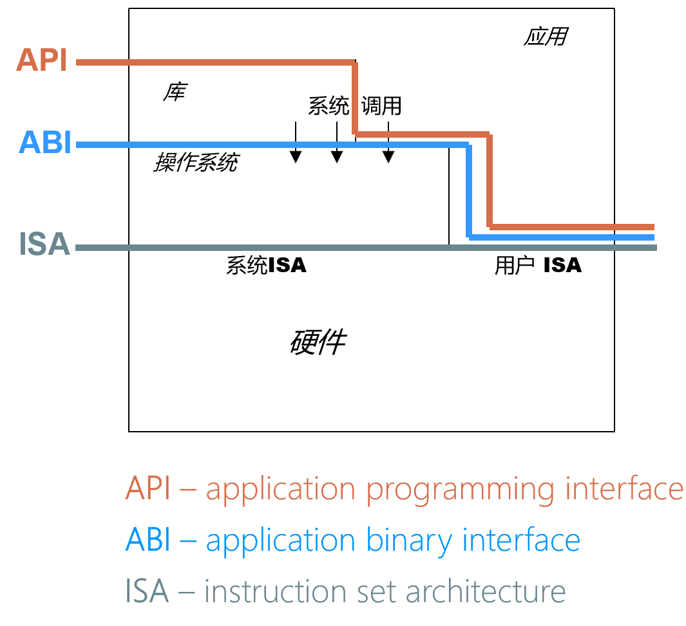

## 系统虚拟化的标准

高效系统虚拟化的三个特性

- 为虚拟机内程序提供与该程序原先执行的硬件**完全一样的接口**
- 虚拟机只比在无虚拟化的情况下**性能略差一点** 
- 虚拟机监控器**控制所有物理资源**（但是为了性能，现在也允许虚拟机直接访问物理资源）

## 虚拟机和虚拟机监控器

### 如何定义虚拟机?

从操作系统角度看"Machine"：ISA 提供了操作系统和Machine之间的界限

### 虚拟机监控器 (VMM/Hypervisor)

向上层虚拟机暴露其所需要的ISA**（对上层不同虚拟机提供不同ISA接口）**，可同时运行多台虚拟机 (VM)

#### 虚拟机监控器的分类

- **Type-1虚拟机监控器：**VMM直接运行在硬件之上（驱动如果不支持，就跑不起来，只能换硬件）

  - 充当操作系统的角色，直接管理所有物理资源
    - 实现调度、内存管理、驱动等功能
  - 性能损失较少（可以针对性性能优化）
  - 例如Xen, VMware ESX Server

  

- **Type-2虚拟机监控器：**VMM依托于主机操作系统（基于Host OS）（复用主机的驱动等）

  - 主机操作系统管理物理资源
  - 虚拟机监控器以进程/内核模块的形态运行
  - 易于实现和安装
  - 例如：QEMU/KVM

  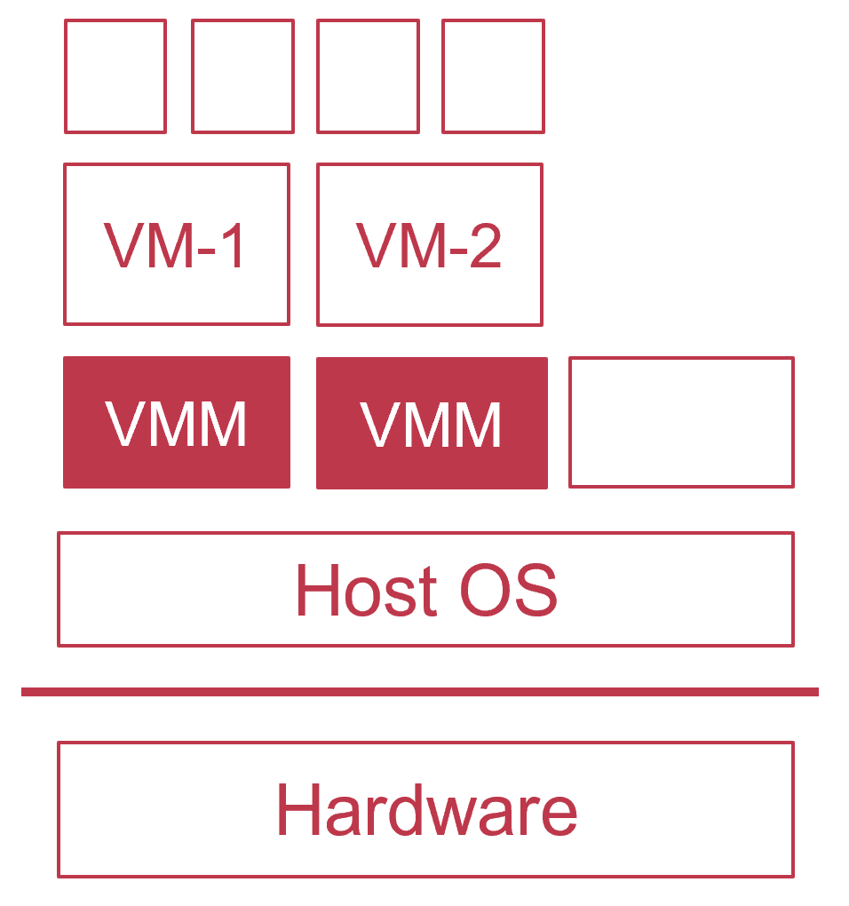

  - 优势
    - 在已有的操作系统之上将虚拟机当做应用运行
    - 复用主机操作系统的大部分功能（如文件系统，驱动，处理器调度，物理内存管理等）

## 如何实现系统虚拟化?

### 系统ISA：操作系统运行环境


希望虚拟机跑在用户态进程（用户态不能接触的部分，需要虚拟机监控器来管！）

- 虚拟机监控器主要需要关注系统ISA

### 系统虚拟化的流程：<u>Trap & Emulate</u>

- Trap：在用户态EL0执行特权指令将陷入EL1的VMM中
- Emulate：这些指令的功能都由VMM内的函数实现


每当执行某种特殊 system ISA 时，都会下陷 Trap，之后由内核 VMM 模拟（如上VM希望写页表基地址 `MSR ttbr0_el1, x0`，这是 system ISA，在这一瞬间会触发 Trap 进入内核，内核会判断该写是否合法，合法则会真的执行指令的功能）

- 第一步（Trap）
  - 捕捉所有系统ISA并陷入/下陷
- 第二步（Emulate）
  - 由具体 system ISA 指令实现相应虚拟化
    - 控制虚拟处理器行为
    - 控制虚拟内存行为
    - 控制虚拟设备行为
- 第三步
  - 回到虚拟机继续执行

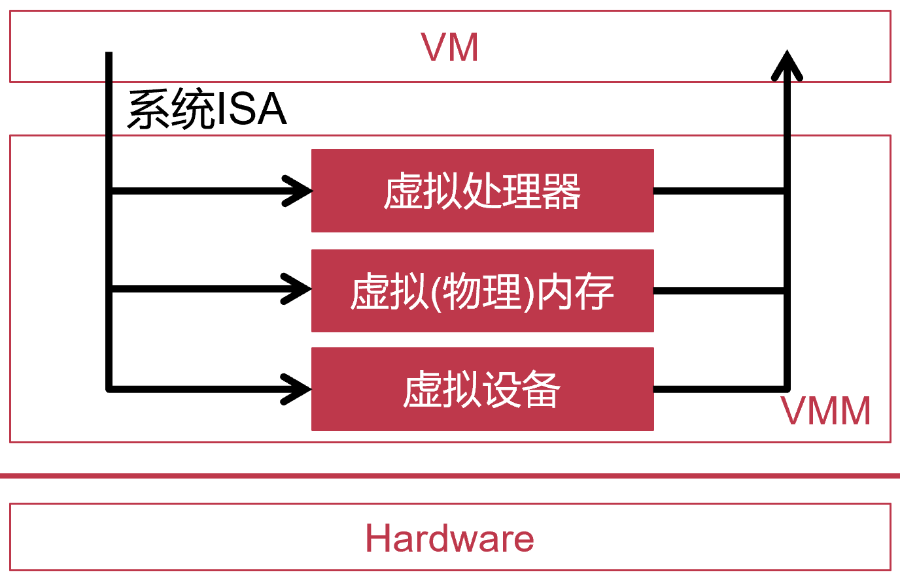

### 系统虚拟化技术

- 处理器虚拟化：捕捉系统ISA，控制虚拟处理器的行为
- 内存虚拟化：提供“假”物理内存的抽象
- 设备虚拟化：提供虚拟的I/O设备

### 虚拟化：一种直接的实现方法

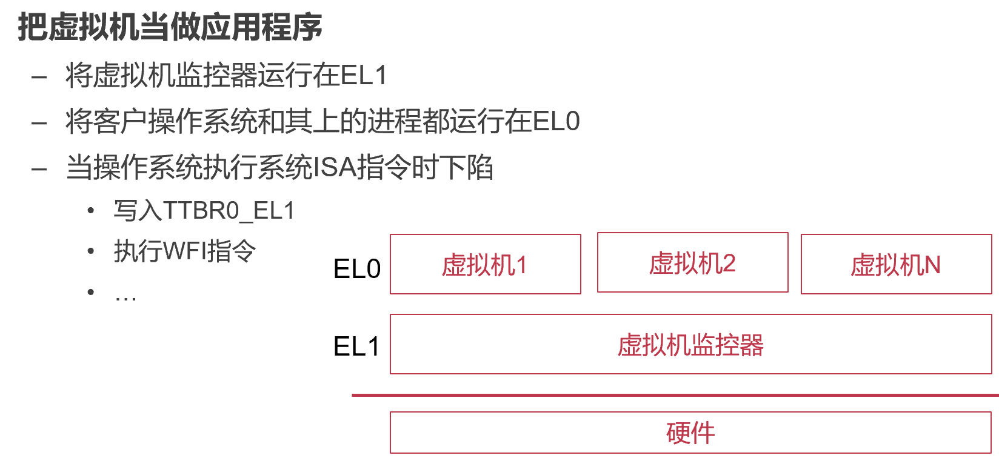

## 虚拟化功能

虚拟机VM放用户态，虚拟机监控器VMM放内核态

前提：用户态调用特权指令，就一定会触发异常，发生下陷

### 第一版：支持只有内核态的虚拟机

虚拟机只在内核态运行简单代码

**VM的能力**

- 只支持一个 VM
- 没有内核态与用户态的切换
- 只有内核态，且仅运行用户ISA的指令（与用户态没有区别）

**VMM的实现**

- 处理时钟中断造成的 VM Exit（类似于时间片到了，用户态到内核态，切换线程）


### 第二版：支持虚拟机内部的时钟中断

**VM的能力**

- 设置irq_handler（中断处理程序）
- 配置时钟中断寄存器（多久触发一次）
- 开关时钟中断 (寄存器 irq_bit 设为1，表明可以接收中断)：有控制是否希望接收/屏蔽中断的能力
- 运行时钟中断处理函数：真的中断后，硬件要有帮忙调用对应写好的中断处理程序的能力

**VMM的实现**

- 捕捉VM对irq_handler的修改
- 捕捉VM对irq_bit的修改
- 根据irq_bit决定插入虚拟时钟中断vIRQ并调用irq_handler（ret后还要让控制流回去）


**正常无虚拟化时中断的流程**（有 Host 中包括 handler，以及 Thread）

1. irq_bit为1时，接收到中断，硬件会把控制流转换给irq_handler
2. 之后handler需要保存上下文（硬件寄存器和内存内容都是下陷之前的状态，handler处理完之后还都要恢复回去！）
3. 执行handler处理函数
4. handler加载恢复上下文
5. 返回到原控制流

**虚拟化时的中断流程**

1. irq_bit为1时，硬件接收到中断，会把控制流转换给内核态VMM
2. 进入VMM对应的中断处理函数handler，保存上下文
3. 插入虚拟时钟中断，调用对应handler
4. 加载恢复上下文（原本控制流的上下文，而不是handler处理函数所在位置的上下文，“内核”不需要保存上下文！），此时handler看到的状态就是下陷的一瞬间的上下文
5. 之后handler需要保存上下文
6. 执行handler处理函数
7. handler加载恢复上下文（用户态状态，而不是虚拟机中内核的状态，虚拟机中内核不需要保存状态，出来后丢掉即可）
8. 进入 VMM，保存上下文
9. 离开 VMM，恢复上下文
10. 返回到原控制流

**VMM的逻辑**

```shell
int reason // 记录下陷原因

save_context // 保存上下文

switch(reason){
	case(...): ...	// 调用对应的处理函数
	case(...): ...
	...
}

restore_context // 恢复上下文

struct VM_CTX {
	int user_node // 区分这个 VM 跑的是用户/操作系统内核
	ctx // 寄存器状态
};
```

### 第三版：支持虚拟机内单一用户态线程

- 需要维护用户态与内核态VM的特权区别：VMM里面用一个bit，来表明现在跑的是用户态还是内核态
- 用户态调 system ISA，VMM发现无对应权限，就往内核态VM插入fault，告诉它用户态想干非法事情
- 用户态调 syscall，VMM就转发给内核态VM，之后内核态VM做相应操作

**VM的能力**

- 虚拟机包含内核态与用户态
- 用户态运行一个用户态线程
  - U-Thread
- 用户态线程可调用内核syscall
- 用户态线程可被时钟中断打断

**VMM的实现**

- 捕捉并转发U-Thread系统调用syscall
- 转发syscall至VM内核
- 捕捉并转发U-Thread执行时的时钟中断

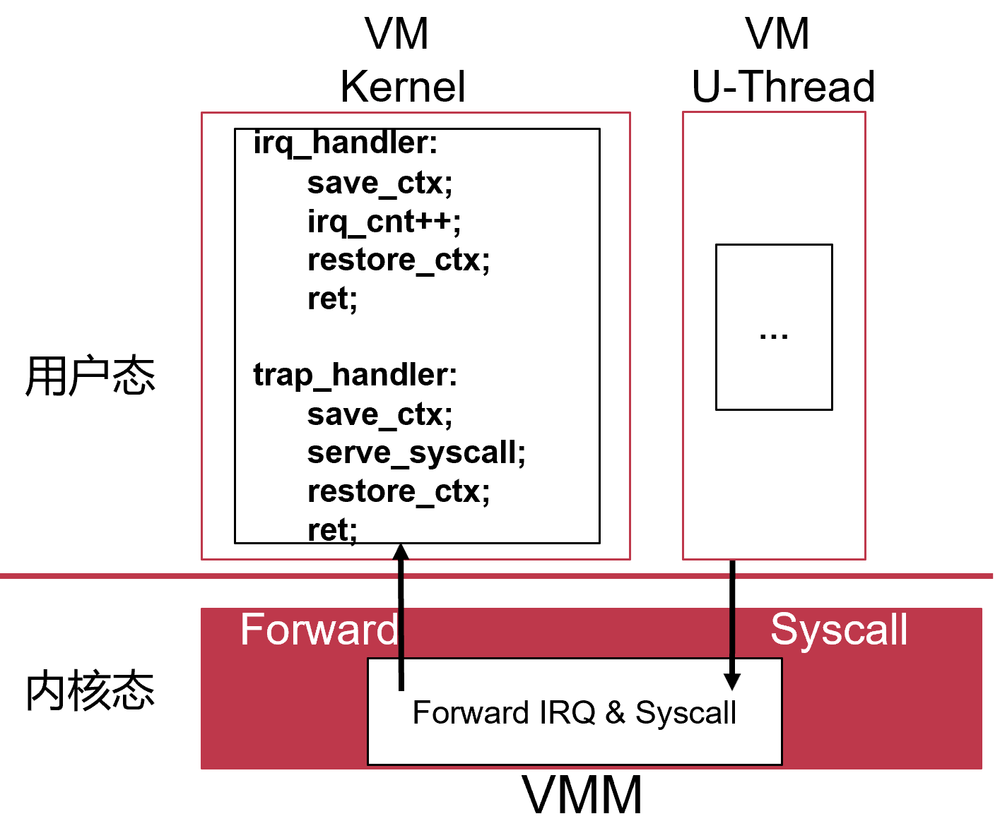

### 第四版：支持虚拟机内多个用户态线程

VM 内核态内部有多个context，内部也要有相应的调度机制和策略

**VM的能力**

- 用户态运行多个用户态线程
- 内核可调度用户态线程

**VMM的实现**

- 与第三版相同

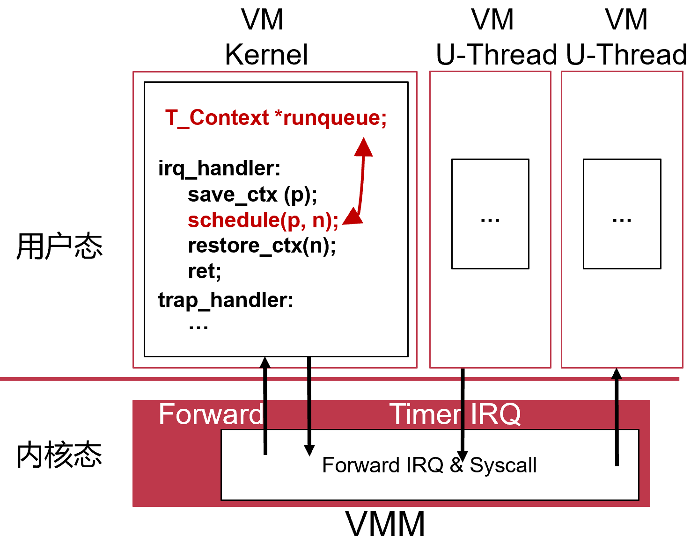

**Fork bomb（VM用户态线程不断 Fork）是否会影响VMM？**

不会！多了线程只是在虚拟机内部多了 runqueue 的 entry，也就只是多了内存；只需要限制内核态 VM 的内存使用量，就没什么影响

### 第五版：支持多个虚拟机间的分时复用

**VM的能力**

- 支持多个VM

**VMM的实现**

- 每个VM对应一个 VMM 内核线程
- 维护VM_runqueue队列
  - 每个元素对应一个VM的运行状态
- 由VMM实现VM间切换
  - 保存和恢复VM寄存器

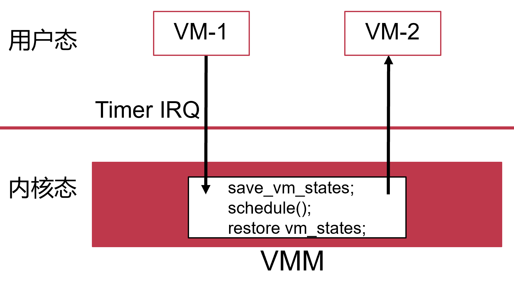

### 第六版：支持多个物理CPU

**VM的能力**

- 与第五版相同

**VMM的实现（基于第五版）**

- 为每个pCPU维护不同的VM_runqueue（每个核维护自己的 runqueue）

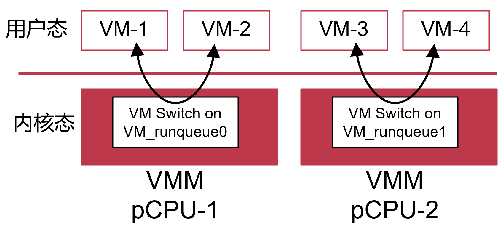

### 第七版：支持多个虚拟CPU

**VM的能力（与第六版的区别）**

- 虚拟机有多个Virtual CPU (vCPU)
- vCPU 是一种软件抽象

**VMM的实现**

- 在VM_runqueue中标记出VM和vCPU的类型
  - VMM内核态维护某个VM的vCPU的context
  - 调度的单位是vCPU（VM类似于进程，vCPU类似于线程；类似一个进程里面多个线程，调度的是线程，不关心一个进程里面究竟有多少线程）
    - 用户期待这些 vCPU 能够同时运行，但是实际上不是“同时”跑

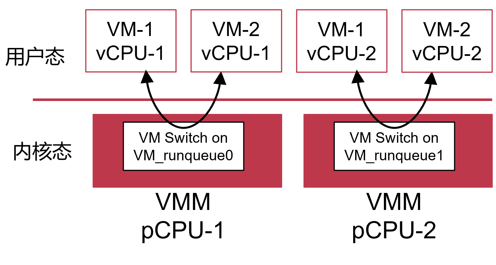

> 虚拟化中的锁：内核中如果使用了spinlock，拿锁后如果对应的vCPU被虚拟机监控器调度走了，那么别的等锁的人spin的时间会大大增加

# 处理器虚拟化

## ARM不是严格的可虚拟化架构

- 敏感指令
  - 读写特殊寄存器或更改处理器状态
  - 读写敏感内存：例如访问未映射内存、写入只读内存
  - I/O指令
- 特权指令
  - 在用户态执行会触发**异常**，并陷入内核态

在ARM中：不是所有敏感指令都属于特权指令**（不是所有 system ISA 在用户态执行的时候会触发 Trap！不会到“内核”中，也即 VMM 内核态不知道发生了什么）**

- 例子: CPSID/CPSIE指令
  - CPSID和CPSIE分别可以关闭和打开中断
  - 内核态执行：PSTATE.{A, I, F} 可以被CPS指令修改
  - 在用户态执行：CPS 被当做NOP指令，不产生任何效果
    - 不是特权指令

## 如何处理这些不会下陷的敏感指令？

处理这些不会下陷的敏感指令，使得虚拟机中的操作系统能够运行在用户态（EL-0）

- 方法1：解释执行
- 方法2：二进制翻译
- 方法3：半虚拟化
- 方法4：硬件虚拟化（改硬件）

### 方法1：解释执行

不直接运行代码；把代码全部当成数据，一条条拿出来看（每一条指令都 fetch-decode-execute），来进行模拟

- 使用软件方法一条条对虚拟机代码进行模拟
  - 不区分敏感指令还是其他指令
  - 没有虚拟机指令直接在硬件上执行
- 使用内存维护虚拟机状态（自己假装成硬件，需要维护伪硬件状态）
  - 例如：使用uint64_t x[30]数组保存所有通用寄存器的值

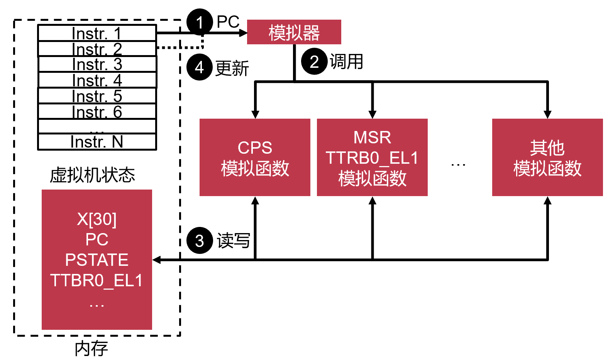

1. 看当前内部维护的PC值
2. 从维护的内存里去找对应代码，拿出来，根据 decode 的结果去调用内部维护的这些 execute 的函数
3. 在 execute 过程中会不断读写内存，修改虚拟机状态
4. 更新 PC 值，之后执行下一条

**案例**

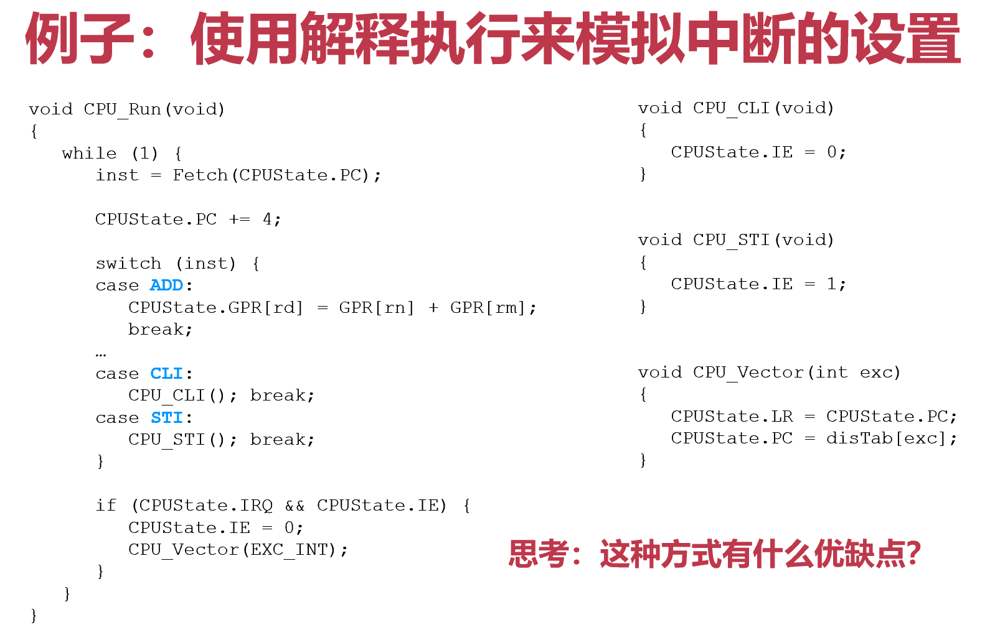

**优缺点**

- 优点：
  - 解决了敏感函数不下陷的问题
  - **可以模拟不同ISA的虚拟机**（比如可以在X86物理机上模拟ARM虚拟机）
  - 易于实现、复杂度低
- 缺点：
  - **非常慢**：任何一条虚拟机指令都会转换成多条模拟指令

### 方法2：二进制翻译

先翻译，再执行

- 提出两个加速技术
  - 在执行前**批量翻译**虚拟机指令（提前把需要处理的指令翻译成能够下陷的指令，其他不相关的不管直接忽略）
  - **缓存**已翻译完成的指令
- 使用基本块(Basic Block)的翻译粒度
  - 每一个基本块被翻译完后叫代码补丁

> 基本块(Basic Block)：从头执行到尾，中间没有 if while 等等循环和条件判断

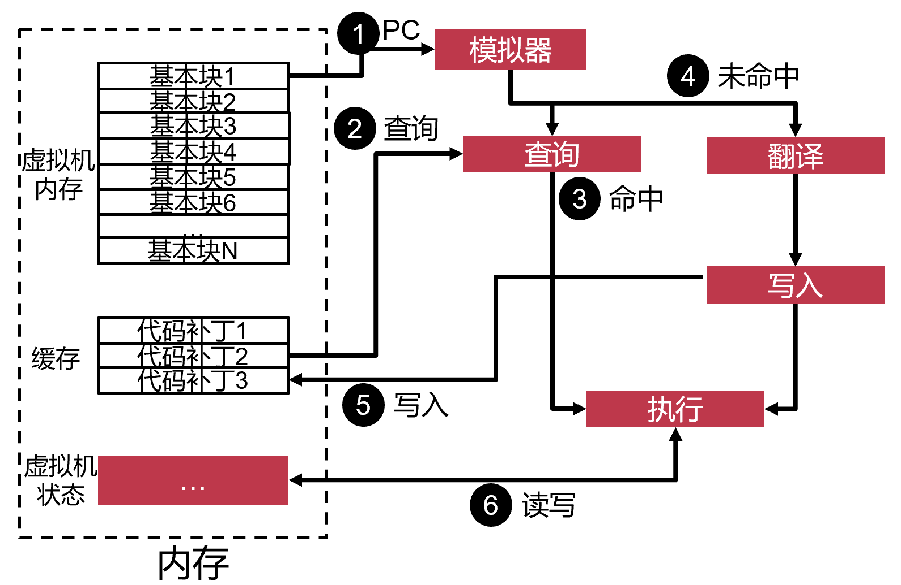

**二进制翻译的 Basic Blocks**

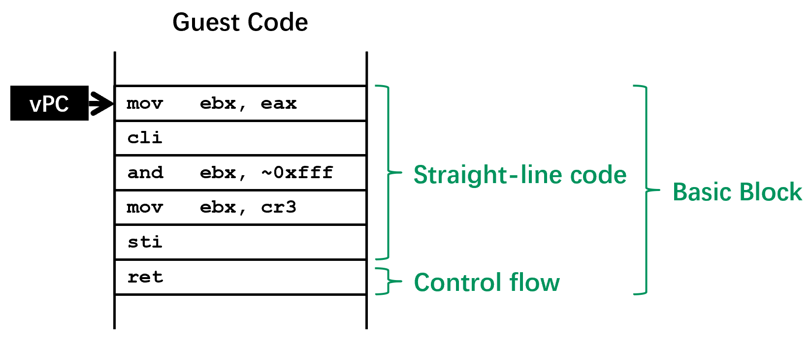

`cli`：关中断	`sti`：开中断	`cr3`：x86 页表基地址

**二进制翻译举例**

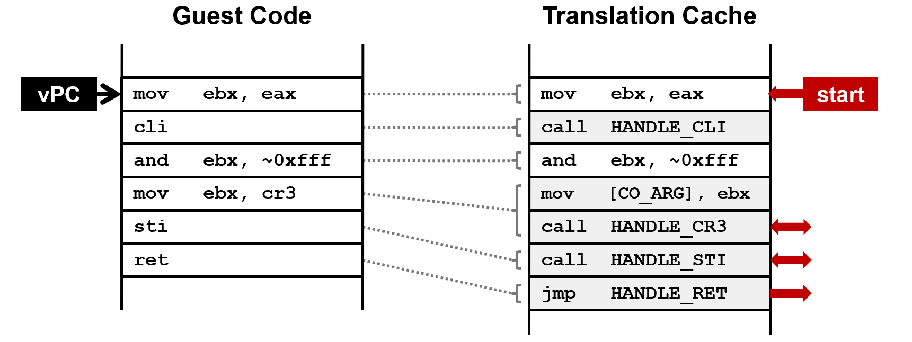

比较重要的指令进行翻译（翻译成准备好的函数调用），之后为了性能也可以展开 call

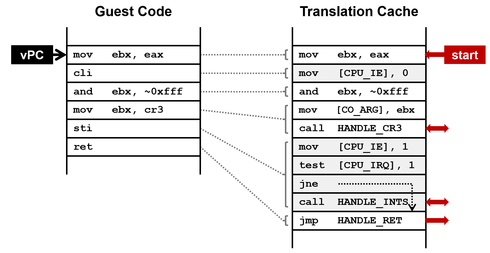

**缺点**

- 不能处理自修改的代码(Self-modifying Code)
- 中断插入粒度变大
  - 模拟执行可以在任意指令位置插入虚拟中断
  - **二进制翻译时只能在基本块边界插入虚拟中断**（翻译完之后块内部的指令不会下陷，都是直接call准备好的函数，不会再下陷通知VMM；只有下陷的时候才会看到有什么中断）

### <u>方法3：半虚拟化 (Para-virtualization)</u>

把用户态不能够下陷的代码换了，直接调用 VMM 提供的接口

- 协同设计
  - 让VMM提供接口给虚拟机，称为**Hypercall**
  - **修改操作系统源码，让其主动调用VMM接口**
- **Hypercall可以理解为VMM提供的系统调用**
  - 在ARM中是HVC指令
- 将所有不引起下陷的敏感指令替换成超级调用
- batch：对于需要下陷的操作，不是一个一个做，而是等一批来了之后，再进行处理

如 Xen

**优缺点**

- 优点：
  - 解决了敏感函数不下陷的问题
  - 协同设计的思想可以提升某些场景下的系统性能
    - I/O等场景
- 缺点：
  - 需要修改操作系统代码，难以用于闭源系统
  - 即使是开源系统，也难以同时在不同版本中实现

### <u>方法4：硬件虚拟化（改硬件）</u>

- x86和ARM都引入了全新的虚拟化特权级
- x86引入了root模式和non-root模式
  - Intel推出了VT-x硬件虚拟化扩展
  - Root模式是最高特权级别，控制物理资源
  - VMM运行在root模式，虚拟机运行在non-root模式
  - 两个模式内都有4个特权级别：Ring0~Ring3
- ARM引入了EL2
  - VMM运行在EL2
  - EL2是最高特权级别，控制物理资源
  - VMM的操作系统和应用程序分别运行在EL1和EL0

#### Intel VT-x

##### VT-x的处理器虚拟化

把已有的用户态和内核态砍成两半，增加 Root 和 Non-root 模式


X86中内核态Ring0，用户态Ring3

|        | Root                 | Non-root            |
| ------ | -------------------- | ------------------- |
| 用户态 | VMM 管理 Tool 部分等 | 虚拟机 Guest App    |
| 内核态 | VMM                  | 虚拟机 Guest Kernel |

- **虚拟机 Guest Kernel 中发生的任何 system ISA 都会 trap 下来，从 Non-root 模式 trap 到 root 模式内核态（VMM），VMM 通过 switch 处理后，返回虚拟机 Guest Kernel**
- 一些优化：虚拟机 Guest Kernel 在 non-root 模式下配置页表 CR3 不需要下陷（VMM 与 虚拟机 Guest Kernel 有各自的 CR3，下陷时硬件需要负责保存/恢复 CR3，保存恢复的位置？VMCS）
- Non-root 虚拟机 Guest App 调用 syscall 会直接下陷到虚拟机 Guest Kernel（除非设置对应 bit）
- 一个时刻一个核只能有一个mode（要么Root，要么Non-root）

##### Virtual Machine Control Structure (VMCS) ：硬件自动存/取状态，减少下陷带来的cycle性能开销

整个系统起来之后，VMM会提供给硬件的内存页（4KB）作为VMCS：记录与当前VM运行相关的所有状态（比如寄存器）

- VM Entry
  - 硬件自动将当前CPU中的VMM状态保存至VMCS
  - 硬件硬件自动从VMCS中加载VM状态至CPU中
- VM Exit
  - 硬件自动将当前CPU中的VM状态保存至VMCS
  - 硬件自动从VMCS加载VMM状态至CPU中

包含6个部分

- Guest-state area：发生VM exit时，CPU的状态会被硬件自动保存至该区域；发生VM Entry时，硬件自动从该区域加载状态至CPU中
- Host-state area：发生VM exit时，硬件自动从该区域加载状态至CPU中；发生VM Entry时，CPU的状态会被自动保存至该区域
- VM-execution control fields： 控制Non-root模式中虚拟机的行为
- VM-exit control fields：控制VM exit的行为
- VM-entry control fields：控制VM entry的行为
- VM-exit information fields：VM Exit的原因和相关信息（只读区域）

##### VT-x的执行过程

事件驱动的设计

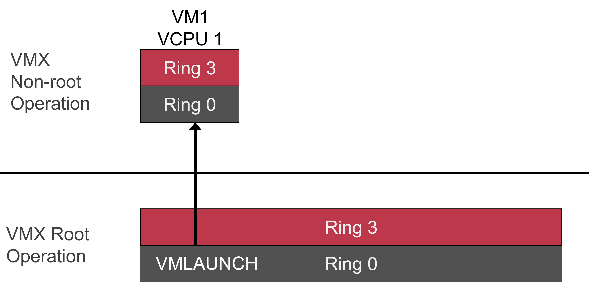

1. 启动虚拟机 VMLAUNCH
2. 虚拟机发生下陷，VM Exit，到 VMX Root

**<u>每一个跑的 VM 的 vCPU 都会有一个 VMCS</u>**

> **8个核，上面10个VM虚拟机，每个虚拟机4个vCPU，需要多少VMCS？**
>
> VMCS为vCPU服务（保存的是寄存器状态，每个vCPU都有自己的一套寄存器），有多少vCPU就有多少VMCS；需要 4*10 = 40 个（当然如果内存紧张，就8个，因为只有8核）


#### ARM的虚拟化技术

##### ARM的处理器虚拟化

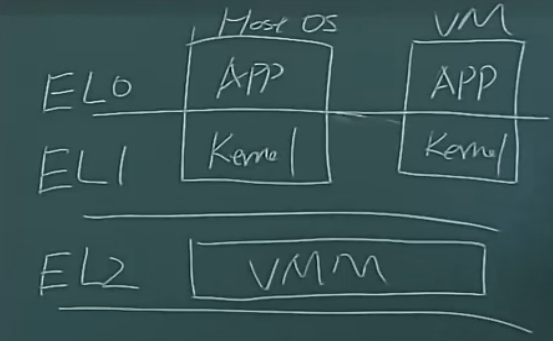

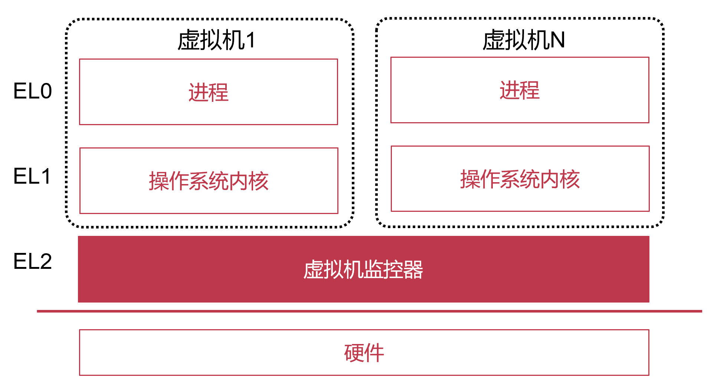

- **EL2 专门为运行 VMM 准备**
- 每一层 EL 都有自己的一套寄存器（_ELX结尾），也即在VM与VMM之间切换时，不需要再有硬件来把寄存器状态存储/恢复（因为切换特权级后不会覆盖原本的寄存器，留着原本特权级的寄存器不动即可）
  - 当然如果在多个VM之间切换时（类似于线程切换），还是需要保存上下文，因为VM都运行在相同特权级，并且共用寄存器

##### ARM的VM Entry和VM Exit

- VM Entry
  - 使用ERET指令从VMM进入VM
  - 在进入VM之前，VMM需要主动加载VM状态
    - VM内状态：通用寄存器、系统寄存器、
    - VM的控制状态：HCR_EL2、VTTBR_EL2等
- VM Exit
  - 虚拟机执行敏感指令或收到中断等
  - 以Exception、IRQ、FIQ的形式回到VMM
    - 调用VMM记录在vbar_el2中的相关处理函数
  - 下陷第一步：VMM主动保存所有VM的状态

##### ARM硬件虚拟化的新功能

- ARM中没有VMCS
- VM能直接控制EL1和EL0的状态
  - 自由地修改PSTATE(VMM不需要捕捉CPS指令)
  - 可以读写TTBR0_EL1/SCTRL_EL1/TCR_EL1等寄存器
- VM Exit时VMM仍然可以直接访问VM的EL0和EL1寄存器

缺点：需要依赖已有的 Host OS

- 为什么不把 Host OS 的内核从 EL1 拉到 EL2 的 VMM？
  - 需要修改 Host OS 的内核
- 现在需要从用户态 VM 的 EL1 kernel 先到 VMM，再到 Host OS 的 EL1 kernel

##### HCR_EL2寄存器简介

- HCR_EL2：VMM控制VM行为的系统寄存器
  - VMM有选择地决定VM在某些情况时下陷
  - 和VT-x VMCS中VM-execution control area类似
- 在VM Entry之前设置相关位，控制虚拟机行为

##### ARMv8.0

- 增加EL2特权级
- EL2只能运行VMM，不能运行一般操作系统内核
  - OS一般只使用EL1的寄存器，在EL2中不存在对应的寄存器
    - EL1：TTBR0_EL1、TTBR1_EL1
    - EL2：TTBR_EL2
  - EL2不能与EL0共享内存
- 因此：无法在EL2中运行Type-2虚拟机监控器的Host OS
  - 或者说，Host OS需要大量修改才能运行在EL2

##### ARMv8.0中的Type-2 VMM架构


- KVM/ARM Lowvisor：运行在EL2，功能简单，只负责进行状态保存/恢复和转发（捕捉虚拟机下陷和进行状态切换，存寄存器在内存上），和配置 EL2 层才能配置的寄存器

性能不好

##### ARMv8.1中的Type-2 VMM架构

- ARMv8.1
  - 推出Virtualization Host Extensions(VHE)，在HCR_EL2.E2H打开（一个 bit）
    - 寄存器映射
    - 允许与EL0共享内存
  - **使 EL2 中可直接运行未修改的操作系统内核（Host OS）**

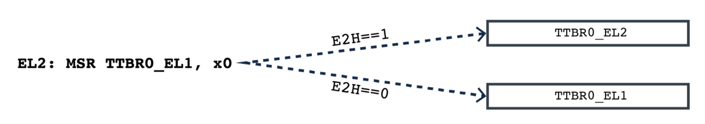

- 打开 E2H bit 之后，可以在 `_EL2` 里面用 `_EL1` 寄存器，硬件会自动把 `_EL1` 寄存器翻译成 `_EL2` 


性能好，结构简单

#### VT-x和VHE对比

|                                    | **VT-x**                 | **VHE**            |
| ---------------------------------- | ------------------------ | ------------------ |
| 新特权级                           | Root和Non-root           | EL2                |
| 是否有VMCS？                       | 是                       | 否                 |
| VM  Entry/Exit时硬件自动保存状态？ | 是                       | 否                 |
| 是否引入新的指令？                 | 是(多)                   | 是(少)             |
| 是否引入新的系统寄存器?            | 否(需要冗余的保存和恢复) | 是(多) (EL2寄存器) |
| 是否有扩展页表(第二阶段页表)?      | 是                       | 是                 |

#### Type-1和Type-2在VT-x和VHE下架构

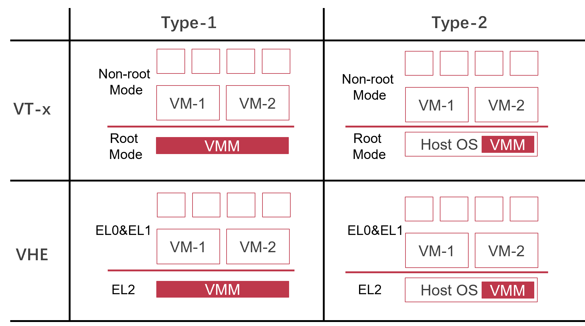

## 案例：QEMU/KVM

**QEMU**

最初目标是在非x86机器上使用动态二进制翻译技术模拟x86机器，之后能模拟出多种不同架构的虚拟机

- 初始阶段QEMU一直使用软件方法进行模拟，如二进制翻译技术
- QEMU 0.10.1开始使用KVM (Kernel-based Virtual Machine)，以替代其软件模拟的方案

### QEMU/KVM架构

- QEMU运行在用户态，负责实现策略
  - 提供设备模拟
  - 也提供虚拟设备的支持
  - 如虚拟机要多少内存，几个vCPU，几个设备
- KVM以Linux内核模块运行，负责实现机制
  - 可以直接使用Linux的功能，与内核交互
  - 例如内存管理、进程调度、捕捉虚拟机下陷
  - 使用硬件虚拟化功能
- 两部分合作
  - KVM捕捉所有敏感指令和事件，传递给QEMU
  - KVM不提供设备的虚拟化，需要使用QEMU的虚拟设备

**3 个 switch case**

- 内核态 KVM 为用户态的 QEMU 提供接口（syscall），如 linux 里的 ioctl
  - 调用 syscall 后进入 KVM，KVM通过 switch case 处理 syscall
- 内核态 KVM 捕捉虚拟机运行过程中的下陷：如运行完，想要回到 QEMU，发 VM_EXIT；I/O 等
  - 硬件会先保存状态到 VMCS，之后找下陷处理函数（KVM提供），需要 handler 中也有 switch case
- 用户态 QEMU 的 switch：内核态的 KVM 如果 switch case 处理不完，会把控制权转交给 QEMU

**<u>进程和虚拟机对应，线程和vCPU对应</u>**

### QEMU使用KVM的用户态接口（文件接口）

QEMU使用/dev/kvm与内核态的KVM通信

- 使用ioctl向KVM传递不同的命令：CREATE_VM, CREATE_VCPU, KVM_RUN等

```c
open("/dev/kvm")
ioctl(KVM_CREATE_VM)
ioctl(KVM_CREATE_VCPU)
while (true) {
     ioctl(KVM_RUN)	// Invoke VMENTRY
     exit_reason = get_exit_reason();
     switch (exit_reason) {
       case KVM_EXIT_IO:  /* ... */
         break;
       case KVM_EXIT_MMIO: /* ... */
         break;
     }
}
```

**如何创建多个vCPU？**

pthread_create 创建多个 pthread，每个 thread 的 worker function 运行自己的 vCPU 代码

### ioctl(KVM_RUN)时发生了什么

- x86中：KVM加载vCPU对应的VMCS，VMLAUNCH/VMRESUME进入Non-root模式
- ARM中：KVM主动加载VCPU对应的所有状态，使用eret指令进入虚拟机，开始执行

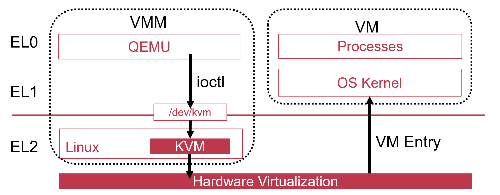


### QEMU/KVM的流程

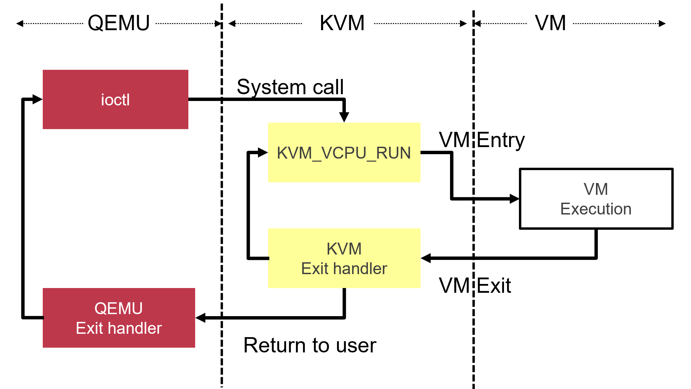

为什么有的不 return to user：并不是所有的下陷都需要回到用户态；如时钟中断到了，处理完就调度走了，不会再回去

### 例：WFI指令VM Exit的处理流程

WFI：进入低功耗状态/等待中断（切换线程）

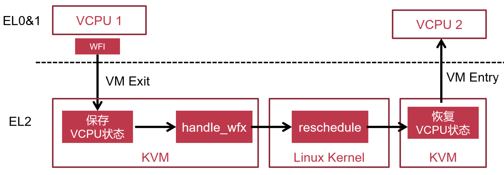

### 例：I/O指令VM Exit的处理流程

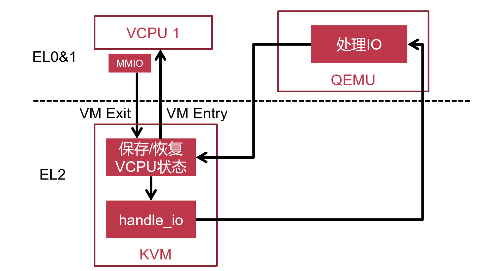

# 内存虚拟化 Memory Virtualization

前提：能够捕捉到特殊指令的下陷

**为什么需要内存虚拟化 ?**

内核会以为自己独占物理内存，并且直接看到的是物理地址，基于此向上层提供虚拟地址的抽象；但是显然要在一台机器上运行多台虚拟机，不可能让一个物理机上的各个虚拟机互相看到对方的内存，也即不可能让虚拟机看到真实的物理地址

**需要再加一层，提供虚拟的物理地址！**

- 操作系统内核直接管理物理内存
  - 物理地址从0开始连续增长
  - 向上层进程提供虚拟内存的抽象
- 如果VM使用的是真实物理地址

## 内存虚拟化的目标

- 为虚拟机提供虚拟的物理地址空间
  - 物理地址从0开始连续增长
- 隔离不同虚拟机的物理地址空间
  - VM-1无法访问其他的内存

## 三种地址

- 客户虚拟地址(Guest Virtual Address, GVA)
  - 虚拟机内进程使用的虚拟地址，通常说的虚拟地址
- **客户物理地址(Guest Physical Address, GPA)** [VMM管理]
  - 虚拟机内使用的“假”物理地址
- 主机物理地址(Host Physical Address, HPA) [VMM管理]
  - 真实寻址的物理地址
  - GPA需要翻译成HPA才能访存

## 怎么实现内存虚拟化?

1. 影子页表(Shadow Page Table)
2. 直接页表(Direct Page Table)
3. 硬件虚拟化：目前使用最多

### 影子页表 (Shadow Page Table)

一个进程就要有一个影子页表！

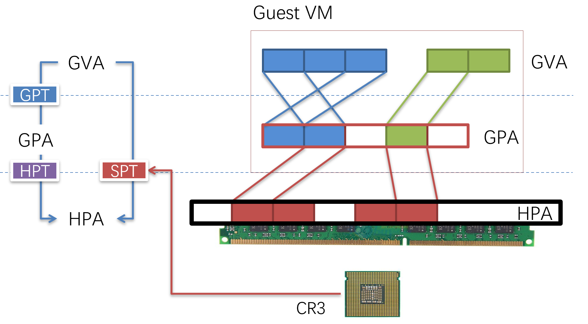

但是真的在 MMU 里面翻译，只能有一个页表（硬件只有一套页表基地址寄存器，要实现两套地址翻译）！需要合二为一

- MMU 实际上只知道虚拟地址翻译到物理地址，而不管究竟地址的逻辑意义；给页表就能翻译
- 最终页表**直接把 GVA 翻译成 HPA**（即**影子页表 SPT**，对 Guest 不可见）

#### 2个页表 → 1个页表

1. 安装页表，把页表的基地址写入 CR3（VMM intercepts guest OS setting the virtual CR3）【敏感操作 system ISA，VMM不会让写，会被 VMM trap；知道发生下陷的虚拟地址，也即可以通过页表查，知道这个虚拟地址对应的内存处的指令内容，就可以知道下陷的原因】
2. VMM 发现页表状态是 GPT；VMM iterates over the guest page table, constructs a corresponding shadow page table
3. GPA 翻译成 HPA；In shadow PT, every guest physical address is translated into host physical address
4. 合成装载到真页表上；Finally, VMM loads the host physical address of the shadow page table

真正用来寻址的 **Shadow Page Table 的设置**（构建 SPT）

```c
set_cr3 (guest_page_table):
    for GVA in 0 to 220	// 遍历每一个 GVA
        if guest_page_table[GVA] & PTE_P:	// 如果这个虚拟地址对应的 P 位（这个页表项有效）是 1
            GPA = guest_page_table[GVA] >> 12
            HPA = host_page_table[GPA] >> 12	// 找对应的 HPA
            shadow_page_table[GVA] = (HPA<<12)|PTE_P	// 4K，左移12位，构建真的 SPT
        else
            shadow_page_table[GVA] = 0
     CR3 = PHYSICAL_ADDR(shadow_page_table)	// SPT 物理基地址填入 CR3
```

#### Guest OS修改页表，如何生效？

- 如用户态进程触发缺页异常，需要分配物理页并填上页表对应项
- 但是 Guset OS 修改页表时候改的是 GPT（不能直接修改 SPT），而实际使用的页表是 SPT

**解决**

每次 Guest OS 想要修改页表的时候 Trap（给页表 GPT 所在的那块内存的内存页设置只读权限！只要 Guest OS 只要写，就会发生 Trap 到内核态）

配置 SPT 设置页表 GPT 所在的那块内存的内存页为只读权限（因为此时硬件真实使用的页表是 SPT）

**如何知道希望写入的新地址和值：**通过寄存器传递（一个寄存器里面是希望写入的地址，另一个里面是希望写入的值，在下陷的一瞬间被保存上下文）

#### Guest内核如何与Guest应用隔离？

整个虚拟机中的用户态/内核态都跑在 user 态，都共用一个页表 SPT；也即和虚拟机内核态相关的页表，虚拟机用户态也可以访问！

**解决**

- 两个影子页表；VM用户态访问使用用户态影子页表（只映射用户态进程的所有虚拟地址），VM内核态访问使用内核态影子页表（内核用户态都包含）

### 直接页表 (Direct Page Table)：半虚拟化

GuestOS 知道它运行在虚拟化环境里面

不再需要维护 SPT，GuestOS 在地址空间内能够建立地址映射范围只有某一段，GuestOS 在构建的时候会注意这一点

- GuestOS 填写页表的时候直接就构建好了 GVA 到 HPA 的映射，直接管理 HPA 空间（不再需要 GPA）
- CR3 指向 GPT

**GuestOS 直接管理页表，权限如何控制？**（可能会把映射恶意建立到别的 VM 地址空间）

- GuestOS 不能直接写 CR3，页表实际上还是由 VMM 直接管理。GuestOS 需要通过调用 **hypercall** 告诉 VMM 需要修改页表，如果 VMM 检查发现合法，就修改；非法或越权，则返回错误

**优缺点**

优点：

- Easy to implement and more clear architecture
- Better performance: guest can batch to reduce trap

缺点：

- Guest 知道了额外的信息，自己的内存被放在哪个 HPA 上
  - May use such info to trigger *rowhammer* attacks（硬件缺陷产生的 bug）
- Not transparent to the guest OS（GuestOS 知道它运行在虚拟化环境里面）
- hypercall 有开销


### 硬件虚拟化对内存翻译的支持

两个页表（硬件支持，可以多一个页表），一个 GPT，一个 HPT；也有新寄存器存新的页表的基地址

- Intel VT-x和ARM硬件虚拟化都有对应的内存虚拟化（GPA 到 HPA）
  - Intel Extended Page Table (EPT)
  - ARM Stage-2 Page Table (第二阶段页表)
- 新的页表
  - 将GPA翻译成HPA
  - 此表被VMM直接控制
  - **每一个VM有一个对应的页表**（HPT是每个虚拟机VM一个），不再像影子页表一样需要每个进程一个

#### 第二阶段页表

第一阶段页表：虚拟机内虚拟地址翻译（GVA->GPA）

第二阶段页表：虚拟机客户物理地址翻译（GPA->HPA）

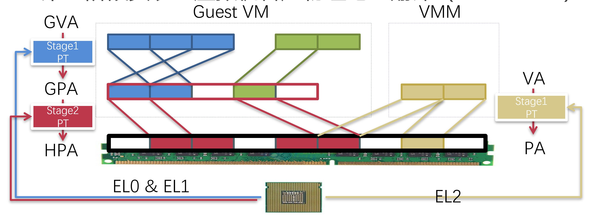

**第二阶段页表项**

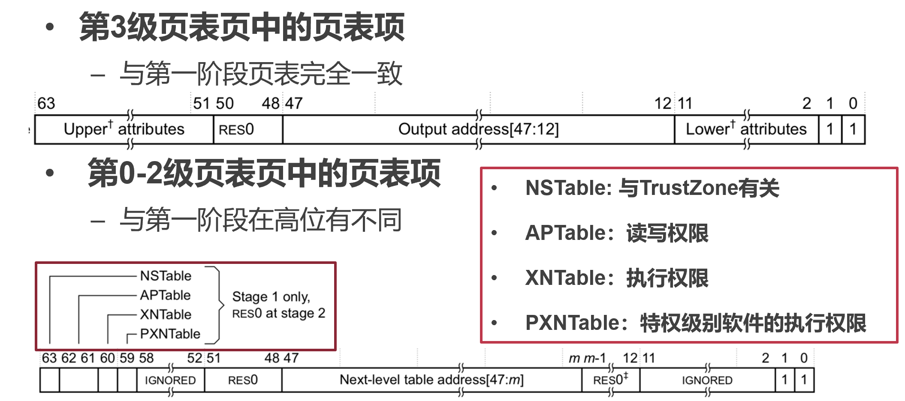

**VTTBR_EL2**

`VTTBR_EL2`：ARM中存储虚拟机第二阶段页表基地址的寄存器

- 对比第一阶段页表有2个页表基地址寄存器：`TTBR0_EL1`、`TTBR1_EL1`
- VMM在调度VM之前需要在 `VTTBR_EL2` 中写入此VM的第二阶段页表基地址
- 第二阶段页表使能HCR_EL2第0位

#### 翻译过程

**普通4级页表访问，需要4次内存访问；那么第二阶段页表加入之后，总共需要几次内存访问？**

24次（1次约100 cycle）

- 第一阶段页表每个页表项里面存储的是 GPA，要先经过第二阶段页表的翻译（4次访存）才能拿到HPA，读出真正物理地址，找到下一级页表
- 第一行四次内存访问，其余每一行五次内存访问

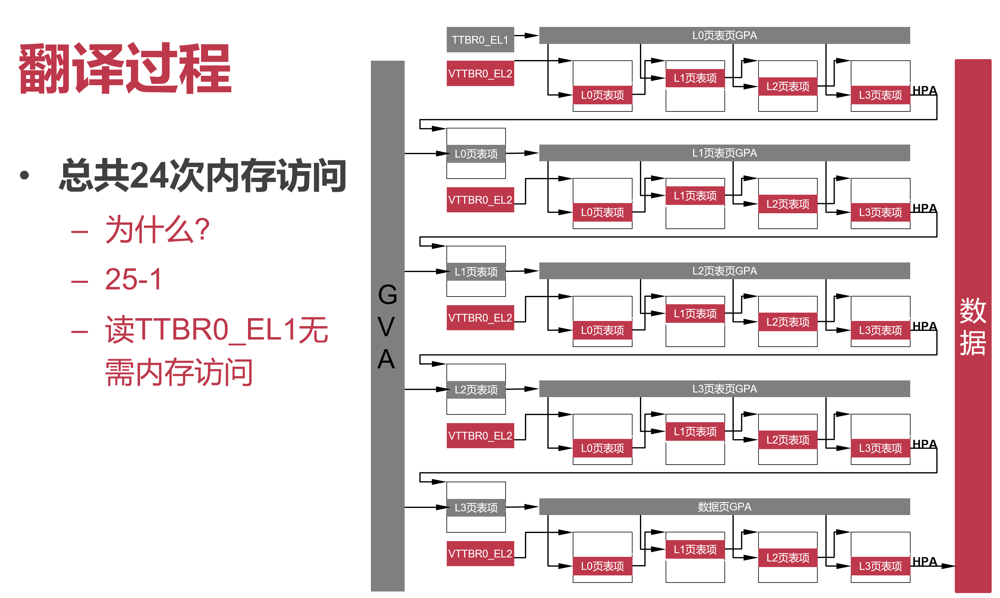

#### TLB：缓存地址翻译结果

TLB不仅可以缓存第一阶段地址翻译结果，TLB也可以第二阶段地址翻译后的结果

- 包括第一阶段的翻译结果(GVA->GPA)
- 包括第二阶段的翻译结果(GPA->HPA)
- 大大提升GVA->HPA的翻译性能：不需要24次内存访问

切换 `VTTBR_EL2` 时，理论上应将前一个VM的TLB项全部刷掉

**TLB 刷新**

- VMID (Virtual Machine IDentifier)
  - VMM为不同进程分配8/16 VMID，将VMID填写在VTTBR_EL2的高8/16位
  - VMID位数由VTCR_EL2的第19位（VS位）决定
  - **避免刷新上个VM的TLB**

#### 如何处理缺页异常

- 两阶段翻译的缺页异常分开处理（影子页表和直接页表都是放在一块处理的）

- 第一阶段缺页异常（整个过程 VMM 不知道）

  - 直接调用VM的Page fault handler
  - 修改第一阶段页表**不会**引起任何虚拟机下陷

- 第二阶段缺页异常

  - 虚拟机下陷，直接调用VMM的Page fault handler

  - **什么时候会发生第二阶段缺页异常？**

    - 1. 虚拟机访问GPA，但是这个GPA在页表里面没有映射

      2. 有映射，但是权限不够

  - VMM 支持 **swapping 换页机制**（如何实现虚拟机级别的内存换页？）

    - 具体场景：将虚拟机A的128MB内存转移到虚拟机B中；虚拟机A对内存的使用较少，虚拟机B对内存需求较大

    - 问题：

      - 选哪一页换出来？LRU等
      - VMM无法识别虚拟机内存的语义（虚拟机VM内部的换页机制对于内存使用的上层语义更清楚）
      - 两层内存换页机制，冗余，并且VM自己的OS与VMM的换页机制可能彼此冲突，造成开销
        - 如 VMM 先把某一页换出去，之后 VM 发现也想把这一页换出去（现在就得先读这一页的内存，实际上 VMM 那一块页表又 pagefault，把对应页换回来）

    - 更好的换页机制：**内存气球机制**（减一层抽象）

      - Upcall（VMM 调用 VM 的接口，向上层调用）

      - 在 VM 中装一个驱动，驱动接到 VMM 要内存的请求，驱动会调用 kmalloc（此时如果内存不足，会触发 VM 的 OS 内部的 swapping），等 VM 的 OS 分配好之后，把分配出来的内存信息告诉 VMM

      - 同样的，当还回内存之后，驱动会调用 free

      - swapping 完全交给 VM 的 OS 的策略

      - 问题：慢（要通知驱动等）

        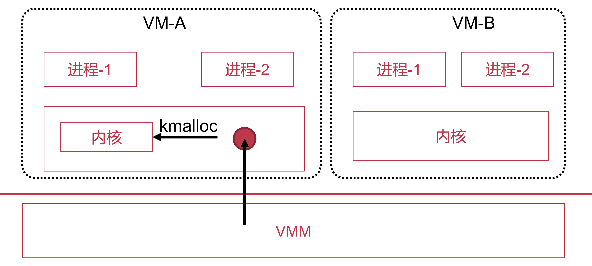

        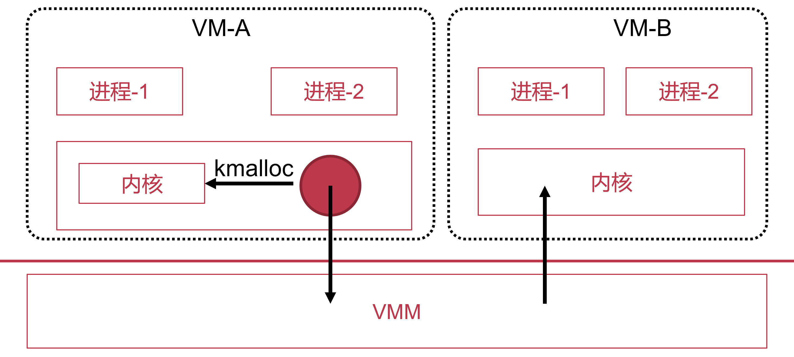

#### 第二阶段页表的优缺点

- 优点
  - VMM实现简单
  - 不需要捕捉Guest Page Table的更新
  - 减少内存开销：每个VM对应一个页表
- 缺点
  - TLB miss时性能开销较大


# I/O虚拟化 I/O Virtualization

> 内存虚拟化是I/O虚拟化的支撑

操作系统内核管理外部设备：

- PIO/MMIO
- DMA 大量数据传输
- Interrupt 设备通知 CPU

**为什么需要I/O虚拟化**

如果VM能直接管理物理设备，所有 VM 都能直接访问物理设备，可能不正确（比如共享网卡，不知道哪个包是哪个 VM 的）；以及安全性问题，恶意VM可以直接读取其他VM的数据

## I/O虚拟化的目标

- 为虚拟机提供虚拟的外部设备（每个虚拟机看到独立的设备），虚拟机正常使用设备
- 隔离不同虚拟机对外部设备的直接访问，实现I/O数据流和控制流的隔离
- 提高物理设备的利用资源，多个VM同时使用，可以提高物理设备的资源利用率

## 怎么实现I/O虚拟化?

1. 设备模拟（Emulation）
2. 半虚拟化方式（Para-virtualization）
3. 设备直通（Pass-through）

### 设备模拟（Emulation）

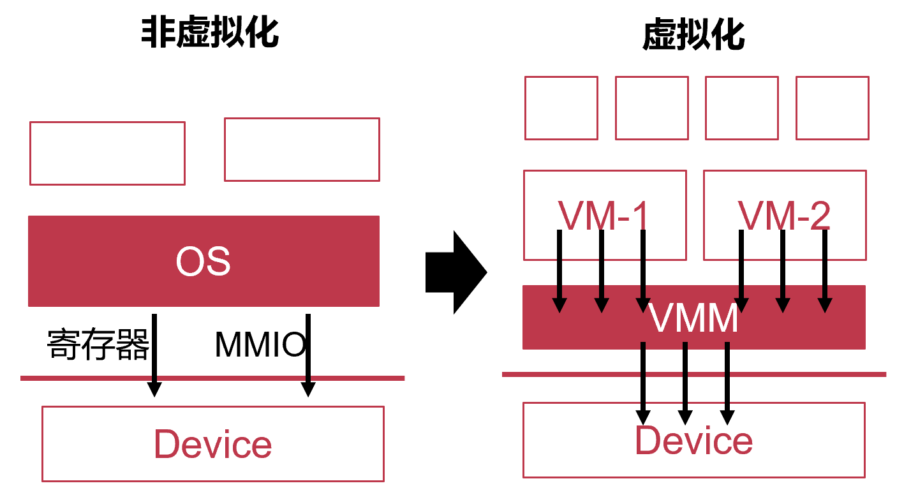

- OS与设备交互的硬件接口
  - 模拟寄存器(中断等)
  - 捕捉MMIO操作
- 硬件虚拟化的方式
  - 硬件虚拟化捕捉PIO指令
  - MMIO对应内存在第二阶段页表中设置为invalid

**<u>没有虚拟化时对设备的操作模式</u>**

如使用网卡发包

1. OS 把网络包的数据放进队列（**写数据**）
2. OS 通过 **MMIO** 写内存，**通知设备**数据已经放好
3. 设备从队列里面**读数据**
4. 设备做完之后，向 OS 发**中断**，告知已经完成

**<u>有虚拟化时对设备的操作模式</u>**

OS 与网卡之间多了VMM

1. OS把网络包数据放进队列（OS与VMM之间的）（写数据）
2. OS 写 VMM 一个故意漏空的 GPA（OS以为这是虚拟设备的MMIO的地址范围），OS往对应地址写的时候发生缺页异常
3. VMM根据上面的虚拟设备地址范围，把OS给的数据放到新的位置（VMM与设备网卡之间的）
4. VMM 通过 MMIO 通知设备数据已放好
5. 设备从对应位置读数据
6. 设备做完之后，向 VMM 发中断，告知已经完成
7. VMM 向 OS 发虚拟中断（调用OS中断处理函数）

#### QEMU/KVM设备模拟

**以虚拟网卡举例——发包过程**

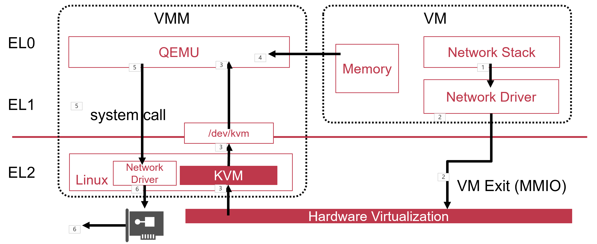

1. 虚拟机 VM 把准备发送的网络包数据放进内存 Memory
2. Driver 想要去访问模拟网卡的设备，本质上就是发生 VM Exit 下陷（page fault）
3. 虚拟化下陷被 KVM 捕捉，KVM 拿到下陷看到是某个网卡的地址范围，不在自己的管理范围中，将其转给 QEMU
4. QEMU 在自己内部运行模拟虚拟网卡的代码，读 VM 的内存拿到虚拟机想发的网络包数据
5. QEMU 使用 socket 的系统调用发送包（之后就是用户态进程发包的流程）

- QEMU 怎么直接读虚拟机内存：VM 和 QEMU 一一对应，一个 QEMU 直接管理一个 VM（所有 VM 的内存本质上是 QEMU malloc 出来的，之后它告诉 KVM 把这些内存与 VM 绑定）（QEMU的虚拟地址是 HVA）
  - VM 底下页表的映射：GPA 到 HPA，由 VMM 管理，第二阶段页表
  - QEMU 底下页表的映射：HVA 到 HPA，第一阶段页表
- 通过 socket 发包不经过网络协议栈，而是直接走 Network Driver（6）？是 RAW 类型的 socket

**以虚拟网卡举例——收包过程**


1. 数据来，先写到 QEMU
2. QEMU 把数据写到虚拟机内存
3. QEMU 插入中断（通过调 KVM 提供的命令）
4. KVM 经过硬件虚拟化给虚拟机插入中断
5. 虚拟机处理中断

#### 设备模拟的优缺点

- 优点
  - 可以模拟任意设备
    - 选择流行设备，支持较“久远”的OS（如e1000网卡）
  - 许在中间拦截（Interposition）:
    - 例如在QEMU层面检查网络内容
  - 不需要硬件修改
- 缺点
  - 性能不佳

### 半虚拟化方式（Para-virtualization）

解决设备模拟的性能问题

打破虚拟机抽象，让虚拟机知道自己使用的是特殊接口的设备

- 协同设计
  - 虚拟机“知道”自己运行在虚拟化环境
  - 虚拟机内运行前端(front-end)驱动
  - VMM内运行后端(back-end)驱动
- VMM主动提供Hypercall给VM
- 通过共享内存传递指令和命令

**VirtIO: Unified Para-virtualized I/O**

- 标准化的半虚拟化I/O框架
  - 通用的前端抽象
  - 标准化接口
  - 增加代码的跨平台重用

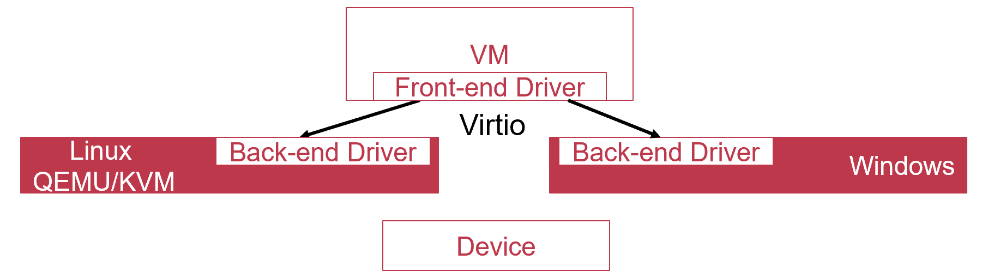

**Virtqueue**

VM和VMM之间传递I/O请求的队列

#### QEMU/KVM半虚拟化

**发网络包**

比上一种快：可以**批量处理** batch，一次可以发很多；相较于上面（发一个包的过程中就有好几次下陷）更快

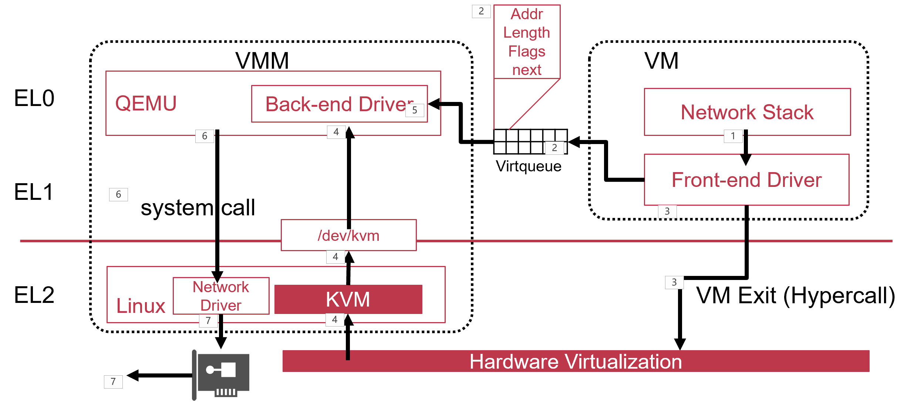

1. 虚拟机告诉 Front-end Driver 说要发网络包
2. Front-end Driver 把数据的基本信息（告诉两边该去哪里找数据）放到 Virtqueue 里（真实数据仍旧在VM内存里）
3. 控制流继续，由KVM转发，直到 QEMU 中 Back-end Driver
4. Back-end Driver 根据 Virtqueue 里的信息去内存拿数据
5. QEMU 通过 syscall 把数据发出去

**收网络包**

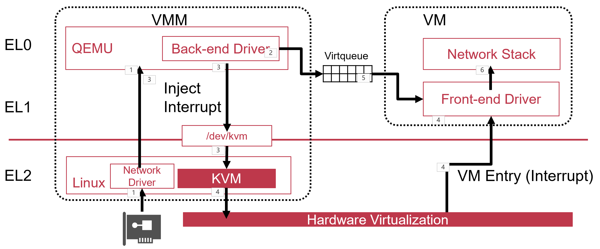

#### 半虚拟化方式的优缺点

- 优点
  - 性能优越
    - 多个MMIO/PIO指令可以整合成一次Hypercall
  - VMM实现简单，不再需要理解物理设备接口
- 缺点
  - 需要修改虚拟机操作系统内核

### 设备直通（Pass-through）

虚拟机直接管理物理设备：设备直接交给虚拟机管理，每个虚拟机拥有独一份的设备（设备不共享！需要买虚拟机数量的硬件物理设备），虚拟机里面直接安装对应设备的驱动


#### 问题1：DMA恶意读写内存

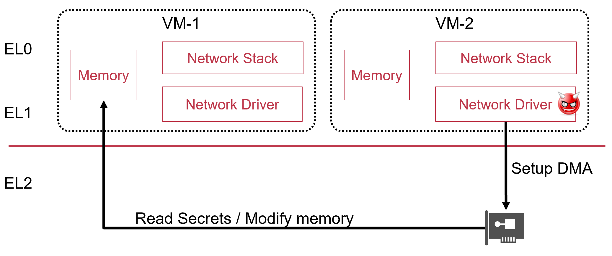

DMA使用的地址是物理地址（DMA过程绕开CPU，无法经过MMU翻译，也因此DMA使用的地址是物理地址！），会直接往对应物理地址写，可能会直接写别的虚拟机的地址！

**解决方案：使用IOMMU（主板上加硬件）**

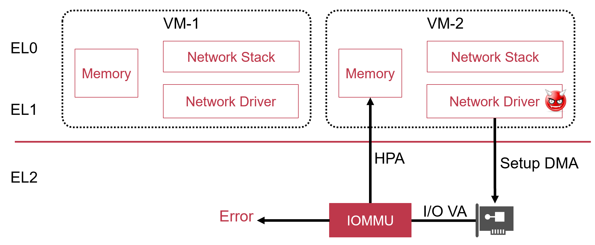

每一个设备想要访问的内存都要经过IOMMU的检查合法性（VMM告诉它每个设备能访问的地址范围，检查页表，如果是对应虚拟机的，就让访存）

**ARM SMMU**

SMMU是ARM中IOMMU的实现，也存在两阶段地址翻译

- 第一阶段：OS为进程配置：IOVA->GPA
- 第二阶段：第一阶段翻译完之后进行第二阶段，VMM为VM配置：GPA->HPA 

#### IOMMU与MMU

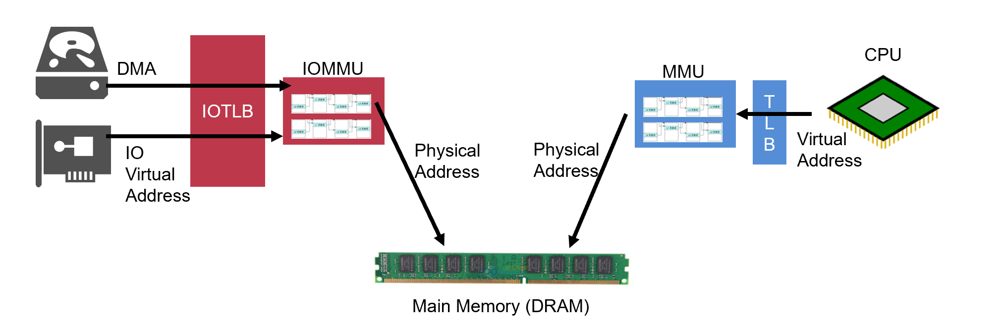

- 右侧是CPU看到的，每一个虚拟地址都经过MMU里的翻译过程，找访存的物理地址
- 左侧是设备看到的，访存都经过IOMMU，其中的页表由特权软件配置

#### 问题2：设备独占

一个设备希望给多个虚拟机同时用（Scalability不够，设备被VM-1独占后，就无法被VM-2使用；导致如果一台物理机上运行16个虚拟机，必须为这些虚拟机安装16个物理网卡）

**Single Root I/O Virtualization (SR-IOV)**

- SR-IOV是PCI-SIG组织确定的标准，满足SRIOV标准的设备，在设备层实现设备复用
- 一个硬件设备可以把自己变成很多份，向外暴露多个接口，每一份分别给一个虚拟机（此过程不需要 VMM 参与）；硬件内部实现隔离
  - 能够创建多个Virtual Function(VF)，每一个VF分配给一个VM
    - 负责进行数据传输，属于数据面（Data-plane）
  - 物理设备被称为Physical Function(PF)，由Host管理
    - 负责进行配置和管理，属于控制面（Control-plane）

#### 设备直通的优缺点

- 优点
  - 性能优越
  - 简化VMM的设计与实现
- 缺点
  - 需要特定硬件功能的支持（IOMMU、SRIOV等）
  - **不能实现Interposition**：难以支持虚拟机热迁移（需要随时把虚拟机停下来，包括所有设备如网卡等；但是现在设备数据通路都不经过VMM，没法停）

## I/O虚拟化技术对比

|                  | **设备模拟** | **半虚拟化** | **设备直通** |
| ---------------- | ------------ | ------------ | ------------ |
| 性能             | 差           | 中           | 好           |
| 修改虚拟机内核   | 否           | 驱动+修改    | 安装VF驱动   |
| VMM复杂度        | 高           | 中           | 低           |
| Interposition    | 有           | 有           | 无           |
| 是否依赖硬件功能 | 否           | 否           | 是           |
| 支持老版本OS     | 是           | 否           | 否           |

# 中断虚拟化


**加载30G的模型进内存，如何变成只使用大概5G**

使用mmap代替read（trade 时间 for 空间）

