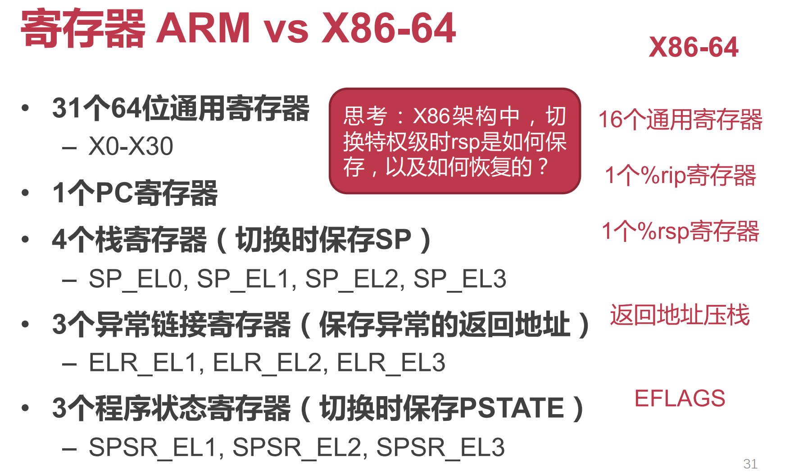
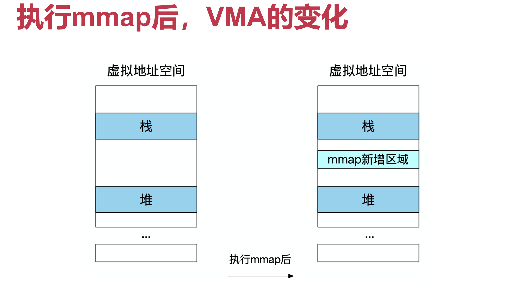

# 操作系统 OS

硬件和应用之间的软件层

## 操作系统为应用提供的一些服务

## 操作系统对应用的管理

# 操作系统结构

**设计原则：策略与机制的分离**

- 策略（Policy）：要做什么 —— 相对动态

- 机制（Mechanism）：该怎么做 —— 相对静态

操作系统可仅通过调整策略来适应不同应用的需求

## 宏内核（Monolithic Kernel）：如 UNIX/Linux、Free BSD

整个系统分为内核与应用两层

- 内核：运行在特权级，集中控制所有计算资源
- 应用：运行在非特权级，受内核管理，使用内核服务
- 其间通过系统调用交互

## 微内核（Micro-Kernel）：如 Mach、L4、seL4、QNX、Google Fuchsia

**设计原则：最小化内核功能**

- 将单个功能从内核拆分出来，移到用户态，称为"服务"（Server）
- 内核仅保留极少功能，为这些服务提供通信（如进程间通信 IPC）等基础能力
- 在用户模块之间，使用消息传递机制通信

**性能较差：内核中的模块交互由函数调用变成了进程间通信**

## 混合内核架构：如 macOS / iOS、Windows NT

宏内核与微内核的结合

- 将需要性能的模块重新放回内核态
- macOS / iOS：Mach微内核 + BSD 4.3 + 系统框架
- Windows NT：微内核 + 内核态的系统服务 + 系统框架

## 外核+库OS（Exokernel **+** LibOS）

- 过度的硬件资源抽象会带来较大的性能损失
- 操作系统提供的硬件资源抽象是针对所有应用的通用抽象，对于一些具体的应用而言这些抽象往往不是最优的选择

**由应用来尽可能控制对硬件资源的抽象（应用可以选择最合适的库OS）。**

内核态：Exokernel（管理应用）【只负责实现硬件资源在多个库OS之间的多路复用，并管理这些库OS实例的生命周期】

用户态：libOS（服务应用）【封装了硬件的抽象，并与应用直接连接；开发者可以选择已有的适合的库OS，或选择自己开发】

- OS无抽象，能在理论上提供最优性能

### 外核架构（Exokernel）

**设计原则：将管理与保护分离**

- 不提供硬件抽象
- 不管理资源，只管理应用（负责将计算资源与应用的绑定，以及资源的回收；保证多个应用之间的隔离）

> 功能：
>
> 追踪计算资源的拥有权：安全绑定（Secure binding）
>
> ​	允许某个LibOS访问某些计算资源（如物理内存），并防止这些计算资源被其他LibOS访问
>
> 保证资源的保护：显式回收（Visible revocation）
>
> ​	显式告知应用资源的分配情况，应用在租期结束之前主动归还资源
>
> 回收对资源的访问权：中止协议（Abort protocol）
>
> ​	若应用不归还资源，则强制中止

### 库OS（LibOS）

- 策略与机制分离：将对硬件的抽象以库的形式提供
- 高度定制化：不同应用可使用不同的LibOS，或完全自定义
- 更高性能：LibOS与应用其他代码之间通过函数调用直接交互

## 单内核（Unikernel）

- 可以看做虚拟化环境下的LibOS
  - 每个虚拟机只使用内核态
  - 内核态中只运行一个应用+LibOS
  - 通过虚拟化层实现不同实例间的隔离

- 适合容器应用场景
  - 每个容器就是一个虚拟机
  - 每个容器运行定制的LibOS以提高性能

## 多内核/复内核（Multikernel）

将一个众核系统看成是由多个独立处理器核通过网络互联而成的分布式系统

思路

- 默认的状态是划分而不是共享
- 维持多份状态的copy而不是共享一份状态
- 显式的核间通信机制（提供一层基于进程间通信的抽象，从而避免处理器核之间通过共享内存进行隐式共享）

设计

- 在每个core上运行一个小内核（包括CPU、GPU等）
- OS整体是一个分布式系统
- 应用程序依然运行在OS之上

## 不同操作系统架构的对比

性能：外核＞宏内核＞微内核

**微内核与外核区别**

微内核：服务各个应用共享；内核中模块的交互由函数调用变为IPC

外核：一个库OS管理并直接服务于一个应用；系统调用又变回函数调用

# ARM

ARMv4T、ARMv5TE：Thumb 16位指令集（对于嵌入式系统，内存小，可以用16位指令代码使得占用空间更小）

## AArch64（ARM architecture 64）

- PC（64-bit）指向**当前**执行的指令
- 指令长度相同 (RISC, **32-bit**)
- PC 会被跳转指令修改：B, BL, BX, BLX

### 寄存器

使用更多寄存器，以精简指令设计

SP（stack pointer），ELR（exception linkage register），SPSR（saved program state register）

**为什么4个栈寄存器，却只有3个异常链接寄存器？**

上一层出问题会给下一层处理（如用户态出错会给内核态处理）！因此异常链接寄存器只需要3个

**X86 中切换特权级（用户态内核态间切换）时候 rsp 如何保存，如何恢复？**

将 rsp 压栈，要恢复的时候从栈取出

### 寻址模式：基地址加偏移量

lsl #Num：移位运算（左移Num位，相当于乘以2的Num次方），用于如数组索引访存等

#### 寻址模式是表示内存地址的表达式

- 基地址模式（索引寻址）[rb]
- 基地址加偏移量模式（偏移量寻址）[rb, offset]
- 前索引寻址（寻址操作前更新基地址）[rb, offset]!           rb += Offset; **寻址**M[rb]
- 后索引寻址（寻址操作后更新基地址）[rb], offset           **寻址**M[rb]; rb += Offset

### 函数调用（caller 调用 callee）

#### 指令

- `bl label`     直接调用，调用函数

- `blr Rn`     间接调用，调用函数指针

#### 功能

- 将**返回地址**存储在**链接寄存器**LR (x30寄存器的别名，LR: Link Register)

- 跳转到被调用者的**入口地址**

### 特权级对比（Exception Level）

#### X86-64

- **Non-root（非虚拟化模式） :** Ring 3：Guest app，Ring 0：Guest OS

- **Root（虚拟化模式）**：Ring 3：App，Ring 0：Hypervisor

#### ARM（特权级：异常级别）

- EL0：跑应用程序
- EL1：跑操作系统
- EL2：跑虚拟机监控器
- EL3：负责普通世界与安全世界中的切换

AArch64 架构中，特权级被称为异常级别（Exception Level，EL），四个异常级别分别为 EL0、EL1、EL2、EL3，其中 EL3 为最高异常级别，常用于安全监控器（Secure Monitor），EL2 其次，常用于虚拟机监控器（Hypervisor），EL1 是内核常用的异常级别，也就是通常所说的内核态，EL0 是最低异常级别，也就是通常所说的用户态。

### 系统状态寄存器、系统控制寄存器等见PPT

### 地址翻译

NS：None secure

### 内存空间

#### X86-64

CR3：进程页表基地址

#### ARM

TTBR0_EL1：用户态页表基地址

TTBR1_EL1：内核态页表基地址

- 用户态和内核态之间地址隔离（使用不同的页表，切换时如果只有一个保存基地址寄存器，开销很大）

### 输入/输出

MMIO (Memory-mapped IO)

- 将IO设备地址映射到物理内存的特殊地址段，和访问内存使用相同的指令（复用ldr和str指令）
- 但是行为与内存不完全一样，会有副作用

PIO（Port IO）

- IO设备具有独立地址空间
- 使用特殊指令（如x86的in/out指令）

# RISC vs CISC

## RISC

- 固定长度指令格式
- 更多的通用寄存器
- Load/store 结构
- 简化寻址方式

## CISC

- 微码：实际上也会先转换为RISC指令（微码）才能在CPU上跑，而不是直接把CISC指令给CPU

# 中断、异常与系统调用

CPU执行逻辑：以PC值位地址从内存中获取一条指令并执行；但是执行过程中可能发生“异常”情况

希望尽量减少的切换：进程切换，用户态和内核态的切换......（对用户态而言这些切换并没有收益！只有开销）

## ARM的异常

- 同步异常：指令执行出现错误，比如除零或缺页
- 异步异常：外部设备触发中断

在ARM中这两种情况都叫做异常（与x86区分），都会导致CPU陷入内核态，并根据异常向量表找到对应的处理函数来执行；处理函数执行完后，执行流需要恢复到之前被打断的地方继续运行

## 操作系统对异常的处理

1. 对异常向量表的设置（CPU上电后立即执行，是系统初始化的主要工作之一；在开启中断和启动第一个应用之前）
2. 实现对不同异常（中断）的处理函数
   - 处理应用程序出错的情况（如除零、缺页）
   - 特殊的同步异常：系统调用（应用主动触发）
   - 外部设备的中断（收取网络包、获取键盘输入）

**内核自己运行出错怎么办？**

可恢复的：直接处理；不可恢复的：crush dump（留下遗言之后崩溃）

### 异常向量表

操作系统预先在一张表中准备好不同类型的异常处理函数（基地址存储在VBAR_EL1寄存器；处理器在异常发生时自动跳转到对应位置）

### 异常处理函数

- 运行在内核态：不受限制访问所有资源
- 处理器将异常类型存储在指定寄存器中（ESR_EL1），表明发生了哪种异常
- 异常处理函数根据异常类型执行不同逻辑
- 完成异常处理后
  - 回到发生异常时正在执行/下一条指令
  - 结束当前进程

## 内核态与用户态的切换

### 处理器在切换过程中的任务

1. 将发生异常事件的指令地址保存在ELR_EL1中
2. 将异常事件的原因保存在ESR_EL1
   - 例如，是执行svc指令导致的，还是访存缺页导致的
3. 将处理器的当前状态（即PSTATE）保存在SPSR_EL1
4. 将引发缺页异常的内存地址保存在FAR_EL1
5. 栈寄存器不再使用SP_EL0（用户态栈寄存器），开始使用SP_EL1
   - 内核态栈寄存器，需要由操作系统提前设置
6. 修改PSTATE寄存器中的特权级标志位，设置为内核态
7. 找到异常处理函数的入口地址，并将该地址写入PC，开始运行操作系统
   - 根据VBAR_EL1寄存器中保存的异常向量表基地址，以及发生异常事件的类型确定

**操作系统为何不能直接使用应用程序在用户态的栈？**

用户态不可信，避免用户态在栈中恶意插入代码等，导致内核态出现问题

### 操作系统在切换过程中的任务

- 主要任务：将属于应用程序的 CPU 状态保存到内存中
  - 用于之后恢复应用程序继续运行
- 应用程序需要保存的运行状态称为处理器上下文
  - 处理器上下文（Processor Context）：应用程序在完成切换后恢复执行所需的最小处理器状态集合
  - 处理器上下文中的寄存器具体包括：通用寄存器 X0-X30；特殊寄存器，主要包括PC、SP和PSTATE；系统寄存器，包括页表基地址寄存器等

## 系统调用

`svc`（supervisor call）：从用户态进入内核态

`eret`：从内核态返回到用户态

参数传递：最多允许8个参数（x0-x7寄存器），x8用于存放系统调用编号，调用者保存的寄存器在用户态保存

返回值：存放在x0寄存器中

**内核自己能够调用 syscall 吗？**

可以，不需要换栈，直接调对应的处理函数就行

**为什么还要存放系统调用的编号，而不直接放到异常向量表里面？**

硬件无关：操作系统具体实现多少个系统调用与处理器无关，处理器只负责提供对应机制

额外开销：通过编号获取系统调用基地址，进行跳转

**寄存器参数放不下怎么办？**

内存传参：将参数放在内存中，将指针放在寄存器中传给内核，内核通过指针访问相关参数

- 指针指向内核区域，不安全
- 指针指向的区域被swap-out，导致内核访问的时候出现page fault
- 指针指向未映射区域，导致segmentation fault

**如何验证传过来指针的合法性（用户态恶意攻击）？**

检查判断是否在最大的VMA（通过mmap创建的虚拟内存空间）

### 优化：syscall 能否不要下陷（Trap）

#### vDSO（virtual dynamic shared object）

系统调用的时延不可忽略（尤其是在频繁调用的部分，比如 `gettimeofday()` ）；想要降低时延，希望不要用户态到内核态的模式切换（没有这种切换就不需要保存和恢复状态）

- 内核定义：在编译时作为内核的一部分
- 用户态运行：共享内存（将对应函数代码加载到一块与应用共享的内存页，这个页称为vDSO），用户态可读（只读），内核态可写（更新对应值）【类似生产者-消费者模式】

#### Flex-SC（flexible system call scheduling with exception-less system calls）

目的：进一步降低系统调用的时延（同时切换后内核态也污染了用户态本来用的cache），希望在不切换状态的情况下实现系统调用

思想：syscall的时候并不直接切换到内核，而是把所有syscall的参数放到一个和内核共享的页里面；内核通过共享页上的参数执行对应syscall，并把返回结果写在共享页上返回给用户

方式：新的syscall机制

- 引入 system call page，用户和内核共享
- 用户线程可以将系统调用请求参数 push 到 system call page（用户写）
- 内核态线程到 system call page pull 系统调用请求（内核读，内核写返回值）
- Exception-less syscall：将系统调用的调用和执行解耦，可以分不到不同的CPU核并行处理
- 一次性可以等很多系统调用堆积之后，再一次性让内核态线程 pull，实现批处理
- 用户和内核线程可以运行在不同CPU核上，没有切换带来的开销

适合的应用：如Apache服务器适合；同步调用变成异步调用，适合系统调用多的情况，可以提升吞吐量，不适合对时延敏感的应用

缺点：优化之后用户和内核线程在两个核（原本在同一个核，相互切换），内存访问时**对于 L1 L2 cache（cpu private）的利用变差**（本来 page 中参数刚放进缓存就被取出来，现在必须在page的level，因为cache不共用）；甚至如果在不同CPU的不同核上，就更大的读写内存开销，很难利用cache

# 系统初始化

syscall 的本质：应用程序想要完成一些事情但是没有权限，需要**请求操作系统帮助**才能完成

## 计算机启动

## 内核启动的2个主要任务

- 任务-1：配置页表并开启虚拟内存机制，允许使用虚拟地址
  - 页表究竟改如何具体配置？
  - 难点：开启地址翻译的前一行指令使用物理地址，开启后立即使用虚拟地址，前后如何衔接？

- 任务2：配置异常向量表并打开中断，允许双循环
  - 异常向量表如何配置？
  - 打开后，异常处理的指令流如何流动？

## 内核代码的加载和运行

**需要用一段代码去初始化CPU，CPU在初始化之前运行不了代码**

树莓派上使用GPU（不需要自己初始化自己，开机后自己设置好，不需要软件代码初始化）先去运行第一行代码（GPU是树莓派自己做的，所以可以自己定义一套初始化流程；CPU是使用别人厂商的，那就需要用代码初始化）

### 入口函数位置

CPU从预定义的**RAM地址**读取第一行代码，由硬件厂商决定（树莓派：32位为0x8000，64位为0x80000，x86：0x7C00）

## ChCore 启动代码

- 设置CPU异常级别为EL1
- 设置初始化时的简单页表，并开启虚拟内存机制
  - TTBR0_EL1：虚拟地址 = 物理地址
  - TTBR1_EL1：虚拟地址 = 物理地址 + OFFSET
- 设置异常向量表
  - 每一个异常向量表项跳转到对应的异常处理函数
  - 处理异常前保存进程上下文、返回进程前恢复其上下文

**两个涉及到的目录：boot和kernel**

- boot目录：编译后放在 .init 段（可读可执行，只运行一次，可以在启动后被抛掉，节省一点点内存），低地址范围（有时也叫bootloader，再次注意不要混淆）
- kernel目录：编译后放在 .text 段（可读可执行），高地址范围

**PPT相关代码注解**

.lds.in 中的 . 表示当前“位置”地址，随着代码往里面添加，. 的值不断增大

寄存器名字中包含 _ELx 对应寄存器只能够在ELx的权限级下被访问

**初始化栈之前怎么bl和eret？**

- **ARM中只调用一层函数不需要栈（返回地址存寄存器LR，link register x30）**，当然多层调用中前面寄存器里放不下的函数返回地址进栈即可

**为什么调用C函数之前要设置栈**

- C不管这个函数是初始化还是在跑内核，因此函数调用时候会正常进行压栈（调用者被调用者保存寄存器等），为了调用C必须先初始化栈，也即在此之后就可以抛弃汇编

**start_kernel物理内存中实际上紧邻init（低地址），为什么可以跳到高地址段执行它？**

因为这之间完成了MMU物理地址到虚拟地址的转换（页表初始化）；物理空间中实际上离得很近，只是虚拟内存空间中两者地址相差比较大

### 页表初始化

- 对于ARM来说，整个虚拟地址空间中间是不用的（其实只用到了48-bit的地址，即16个0开头的地址和16个1开头的地址）
- TTBR1_EL1（16个1开头的地址的翻译）和TTBR0_EL1（16个0开头的地址的翻译）（页表基地址，显然只有内核能够访问页表基地址寄存器，故都是EL1）

**PPT相关代码注解**

boot_ttbr0_l0（l0代表第0级页表）

初始化部分：零级页表指向一级，一级指向二级

2M页的for循环：设置二级页表（2M大页，初始化时把所有内存都映射进来再说，之后再变成4K；也因此不需要初始化L3页表）

**映射设备地址时，为什么要设置DEVICE_MEMORY位（使其变为non-cachable）？**

- non-cachable：CPU访问内存时候不过cache，直接访问内存（对于volatile关键词）
- 设备内存：对应的memory不是真的memory，而是设备上的寄存器（在X86中有两个地址，一种是IO总线地址，另一种就是在物理内存上的地址），只不过是把这块的物理地址空间映射过去
- 这部分物理内存上的地址（对应设备上的寄存器）自己会变化（设备修改），如访问设备的时候需要轮询一个bit看其是否ready，那这个bit是设备修改，肯定不能存在缓存里，存在缓存就没有人改了

**设备内存和物理内存的区别？**

物理地址空间：设备地址（最顶部）和物理内存（从0开始）都会用到物理地址；也即即使你自己加内存条，也很可能因为原本物理地址空间顶上（再往上走）有设备地址，而无法扩展内存

设置TTBR1页表（高地址使用）：把TTBR1设置成和TTBR0一样的位置（映射到同样的物理地址区域），用不同的虚拟地址可以访问同一块物理地址

最终物理地址空间从0开始到物理内存区域结束，映射到低地址，映射到高地址（一块内存映射到两个地址）

页表设置后，开始翻译（enable 页表）

**尚未使用页表到打开页表后地址经过MMU翻译，为什么开启地址翻译的前一行指令使用物理地址，开启后立即使用虚拟地址，前后如何衔接？**

因为最底下这部分蓝色的物理内存地址和虚拟内存地址是一样的；PC的值加4之后，不管翻译还是不翻译，出来的地址结果都是一样的

### 异常向量表的初始化

el1_vector 异常向量表 中 调 syscall_table

## 内核启动前：BIOS（Basic Input/Output System）

BIOS负责计算机上电到内核开始运行（小芯片；许多PC都有这个硬件；嵌入式设备基本没有），通常保存在主板的只读内存（ROM）中，CPU负责执行BIOS（x86 CPU在reset后，PC固定指向0xFFFF0，0xFFFF0就是BIOS的物理地址，也就知道了BIOS在哪里）

- 上电后，开始执行BIOS ROM中的代码
  - 找到第一个可启动设备（如第一块磁盘），将可启动设备的第一个块（512字节，即MBR）加载到内存0x7c00中，跳转到bootloader的内存地址（物理地址0x7c00）并继续执行
- bootloader 开始执行
  - 将内核的二进制文件从启动设备加载到内存中（若内核文件是压缩包，则对其进行解压），跳转到（解压后的）内核加载地址（物理地址）并继续执行
- 内核代码开始执行

上电自检（POST，Power-On Self-Test）：BIOS程序首先检查，计算机硬件能否满足运行的基本条件；如果硬件出现问题，主板会发出不同含义的蜂鸣，启动中止。

主引导记录（MBR，Master Boot Record）：磁盘的0柱面0磁头0扇区称为主引导扇区（磁盘的第一块）；一个磁盘只能分四个主分区；包括三部分（主引导程序，硬盘分区表DPT，硬盘有效标志）

EFI / UEFI：Intel提出取代BIOS interface（为CPU提供软件配套）

## 两种启动的对比

- 定制化的主板（常见的ARM开发板，通常不再扩展其他设备）：树莓派等；初始化时有哪些硬件设备等都是知道的，一般厂商提供私有固件BSP（board support package）完成

- 通用的主板（常见如PC，通常需要再插入其他设备）：系统配置情况在开机的时候是不知道的，需要在启动的时候加入探测看看有哪些设备

# 虚拟内存

如何让OS与不同的应用程序（多用户多程序）都高效又安全地使用物理内存资源？

分时复用物理内存资源的话，切换时将全部内存写入磁盘开销太高；同时使用，各占一部分物理内存的话缺乏安全性和隔离性。

- IBM 360的内存隔离：Protection Key
  - 物理内存的旁边放了一组寄存器（内存被划分为2KB内存块，每个内存块有一个4-bit的key，保存在寄存器中）
  - 每一个进程也对应一个key，进程只能访问与其key一样的内存块！

**希望让应用看不见物理地址**（应用会因为其他应用的加载而受到影响；一旦物理地址范围确定，很难使用更大范围的内存，扩展性差；安全性上，应用可以通过自身内存地址猜测其他应用的位置）

**优势**

- 高效使用物理内存（资源有限）
- 简化内存管理（每个进程看到的是统一的线性地址空间，不用担心别的进程在干什么）
- 更强的隔离性和更细粒度的权限控制

## 虚拟地址

- 地址翻译（物理地址可以不连续，但是在虚拟地址中可以体现为连续）
- 支持隔离（不同进程虚拟地址空间不同）

## 虚拟内存的组织：分段与分页

### 分段

- 翻译时一个虚拟地址（段内地址）需要加上起始地址（根据段号找到）得到物理地址
- 每个进程都可包含代码段、数据段等，与进程自身的内存布局相匹配

**分段机制问题**

- 本段长度有限制
- 对物理内存有连续性要求（如堆和栈），需要预留空间
  - 内存利用率低（外部和内部碎片）

### 分页

粒度恒定的分段机制

- 页表包含多个页表项，存储物理页的页号（虚拟页号为索引）
- 物理内存离散分配，大大降低对物理内存的连续性要求，减少碎片

## ARM64 的页表格式

### 多级页表

- 有效压缩页表的大小
- 允许页表中出现空洞（某级页表中的某条目为空，那么该条目对应的下一级页表无需存在；应用程序的虚拟地址空间大部分都未分配）

**多级页表什么时候不如单级页表**

占满的时候。前面几级页表都浪费了，并且查找的时候很慢。

### AARCH64 体系结构下4级页表

### 虚拟地址解析

### 页表基地址寄存器

### Level 3 页表项

### Level 0，Level 1，Level 2 页表项

**什么时候应该用大页？**

大数据的场景，更少的TLB miss

## TLB：地址翻译的加速器，页表的cache（不是页表页传统数据通路走的那个内存的cache）

- TLB位于CPU内部，是**页表的缓存**
  - Translation Lookaside Buffer
  - 缓存了虚拟页号到物理页号的映射关系
  - **有限数目**的TLB缓存项

- 在地址翻译过程中，MMU首先查询TLB
  - TLB命中，则不再查询页表 （**fast** **path**）
  - TLB未命中，再查询页表

TLB一个一个查，非常慢

TLB难以再提升性能！随着内存越来越大（页表也随之变大），出现与内存不match的情况（两者性能变大斜率不一致！）

### TLB清空：TLB Flush

切换进程（虚拟地址空间变化，页表也会相应换掉）的时候就要清空TLB；在现有知识体系下，内核和用户态之间发生切换不需要清空TLB（内核和应用程序在同一个地址空间里面，地址空间没有发生变化）

- TLB 使用虚拟地址索引
  - 当OS切换页表时需要全部刷掉
- AARCH64上内核和应用程序使用不同的页表
  - 分别存在TTBR0_EL1和TTBR1_EL1
  - 系统调用过程不用切换
- x86_64上只有唯一的基地址寄存器
  - 内核映射到应用页表的高地址
  - 避免系统调用时TLB清空的开销

#### 降低TLB清空导致的开销

- 新的硬件特性ASID（Address Space ID）：OS为不同进程分配8或16位的ASID，将其填写在TTBR0_EL1的高位。TLB每一项头上也加上ASID。在切换进程的时候就不需要清空TLB（同一个虚拟地址不同进程，ASID不一样；使用TLB条目时候检查ASID是否匹配）
  - 缺点：如果有8位，只能256个进程

> **注意：TLB是页表映射的cache，和页表内存页的cache（通常说的缓存）完全不一样！！！**

**OS修改页表后，需要刷掉其它核的TLB吗？**

如果别的核和当前核跑的同一个进程的不同线程（并且属于这个页表），要刷

**OS如何知道需要刷掉哪些核的TLB？**

操作系统要知道进程调度信息（当前改的页表属于哪个进程，看看别的核有没有跑这个进程）

**OS如何刷掉其它核的TLB？**

- x86_64: 发送IPI（CPU核向别的CPU核发出的中断）中断某个核，通知它主动清空

- AARCH64: 可在local CPU上清空其它核TLB
  - 调用的ARM指令：TLBI ASIDE1IS

**内存和CPU一定是CPU缓存中的数据更新吗（内存比CPU的数据更新的模式）？**

- 磁盘（外设）直接修改内存（如DMA，磁盘直接访问DRAM），此时就不经过CPU（CPU对此磁盘改了内存不知情），内存的cache（在CPU中）就失效了
- DMA对应的memory应当设置为non-cacheable，也即不让其被缓存！显然这会导致频繁读写时性能不高（因为没有cache导致），可以通过将这块non-cacheable的内存拷贝到cacheable的内存部分（不会多出拷贝的操作，因为总之需要进行copy to user，应用程序用这块内存不可能访存到在OS中的地址空间）来解决

- DMA在OS中通常是特定的一块内存（比cache更新）；DMA常常用作和IO设备交互的memory

## 虚拟内存：段和VMA

**应用程序有自己独立的虚拟地址空间，那直接拿指针一点一点遍历自己的地址空间，可以做到吗？**

不能。虽然是自己的虚拟地址空间，但并不是应用程序都能直接用，会存在空洞！！！除了代码段和栈等，其它必须要先malloc声明某一段虚拟地址区域自己要用，才能访问。

- OS采用**段**来管理虚拟地址
  - 段内连续，段与段之间非连续
  - 合法虚拟地址段：代码、（只读）数据、堆、栈
  - 非法虚拟地址段：未映射（一旦访问，则触发segfault）

**为什么要使用段来管理？**

因为段的数量比页要少很多，通常每一段都有相同的属性，比如只读、可执行等等，可简化管理

**malloc的时候不会真的分配物理地址！只有VMA发生变化；页表不会发生变化**

### <u>VMA：合法虚拟地址信息的记录方式</u>（OS记录应用程序已分配的虚拟内存端）

- 记录应用程序已分配的虚拟内存区域
  - 在Linux中对应 vm_area_struct（VMA）结构体

#### VMA是如何添加的

- 途径1: OS在创建应用程序时分配（数据（对应ELF段），代码（对应ELF段），栈（初始无内容））
- 途径2: 应用程序主动向OS发出请求
  - `brk()`（扩大、缩小**堆**区域）：可选策略，OS也可以在创建应用时分配初始的堆VMA；**并不是让OS给堆分配更多的物理内存资源！只是虚拟内存地址空间**
  - `mmap()` ：申请一段空的虚拟内存区域，申请映射文件数据的虚拟内存区域（把文件整体映射到内存的某个区域，这样读这个文件就不需要read，write这样的syscall，而直接像访问内存一样访问这个文件即可；匿名映射即指不需要这样一个文件的存在，也可以做这种映射）

- 用户态的malloc会改变VMA
  - 通常是调用brk，在堆中分配新的内存
  - 部分实现也可以调用mmap，由应用管理多个VMA

#### mmap：分配一段虚拟内存区域

该操作并**没有做任何物理内存的分配**！！整个系统里唯一变化的是VMA。访问该新区域会出发page fault，并填充页表。

**VMA和页表是否冗余？**

不冗余。VMA记录的这块区域不一定有页表映射！（VMA覆盖面更大）。如果用立即映射，VMA和页表覆盖范围一致，此时VMA唯一的作用可能仅仅是快速判断。如果是延迟映射，就很需要！

#### <u>页表填写策略</u>

**操作系统何时为应用程序填写页表？**

- **<u>立即映射</u>**：每个虚拟页都对应了一个物理内存页

- **<u>延迟映射</u>/按需调页（Demand Paging）**：有些虚拟页不对应任何物理内存页

  - 对应的数据在磁盘上

  - 没有对应的数据（初始化为0）（如 `mmap` 凭空映射一块区域）

  - 可以节约内存资源，但是缺页异常会导致访问延迟增加

    - 如何取得平衡？

      应用程序访存具有时空局部性（Locality）

      在缺页异常处理函数中采用预取（Prefetching）机制（猜测locality，多取并初始化一些页）

      即节约内存又能减少缺页异常次数

#### mmap的流程

- Prefault
  - 每次 page fault 载入连续的多个页，减少 fault 次数
- MAP_POPULATE
  - 通过一个包含 MAP_POPULATE 的 flags 参数，可以在调用 mmap 时就预取所有的页，此后访问不会 fault

#### 缺页异常（Page Fault）

- CPU的控制流转移
  - CPU陷入内核，找到并运行相应的异常处理函数（handler）
  - OS提前注册缺页异常处理函数

- x86_64
  - 异常号 #PF （13），错误地址存放在CR2寄存器

- AARCH64
  - 触发（通用的）同步异常（8）
  - 根据ESR信息判断是否缺页，错误地址存放在FAR_EL1（作用类似于x86中的CR2）

##### 缺页异常的三种可能

1. 访问非法虚拟地址【非法】
2. 按需分配（尚未分配真正的物理页）【合法】
3. 内存页数据被换出到磁盘上【合法】

**2与3如何区分？**

在页表项PTE中设一位来表示

**如何判断缺页异常的合法性？**

不落在VMA区域，则为非法

**mmap匿名映射与文件映射的区别是什么？**

匿名映射的背后没有文件

没有backup file，内存的初始值从哪里来？0

**如果OS仅采用立即映射，还需要VMA么？**

VMA记录的信息和页表记录的信息有何不同？

VMA只记录虚拟地址的范围，而页表还记录了和物理地址的映射

**demand-paging是否可通过网络来实现？**

如果都通过网络，本地是否还需要磁盘？

可以通过网络，不需要磁盘，实现无盘工作站（现代网卡可以做到比磁盘快，因而相较于放到本地的磁盘，更愿意放到远端机器的内存中)

## 虚拟内存的扩展功能

- 共享内存
  - 节约内存，如共享库
  - 进程通信，传递数据
- 写时拷贝（copy-on-write）
  - 实现
    - 修改页表项权限
    - 在缺页时拷贝与恢复
  - 如fork时（可以节约物理内存，并且性能加速）
- 内存去重
  - OS做，对用户态透明
  - 在内存中扫描找相同内容的物理页面，并执行去重合并
  - 同一块内存映射到不同虚拟地址空间
- 内存压缩
  - 内存不足时，将不大使用的内存压缩/放到硬盘中

**什么情况可以不用虚拟内存**

- 物理内存足够多，远远大于应用程序需求（没必要再有这些额外的开销）
- 在目前的64位地址下，其实可以做到随便分配，为每一个应用程序分足够大的地址空间，并且不重叠
- 如果只用物理内存，不适合多用户，适合单用户

**如果不依靠 MMU，是否有可以替换虚拟内存的方法？**

- 基于高级语言实现多个同一个地址空间内运行实例的隔离

- 基于编译器插桩实现多个运行实例的隔离（访问的时候检查，是不是分配给自己的地址空间）

# 物理内存管理

OS职责：分配物理内存资源

引入虚拟内存后，物理内存分配主要在以下四个场景出现：

1. 用户态应用程序触发on-demand paging（延迟映射）时
   - 此时内核需要分配物理内存页，映射到对应的虚拟页
2. 内核自己申请内存并使用时
   - 如用于内核自身的数据结构，通常通过 `kmalloc()` 完成
3. 内核申请用于设备的DMA缓存时
   - DMA缓存通常需要连续的物理页（一般而言设备没有页表，只能直接访问物理内存；因为MMU在CPU中，设备自己并没有MMU，也即无法进行地址翻译）
4. 发生换页（swapping）时（物理内存不够）
   - 通过磁盘来扩展物理内存的容量

- 应用调用malloc，如果不是立即映射，唯一改动的是VMA，虚拟地址对应的页表项没有发生变化，valid bit可能依然是0
- 如何找到物理页，就需要物理内存的管理！
  - `alloc_page()` 简单分配物理页面的实现
    - 分配时，通过bitmap查找空闲物理页，并在bitmap中标记非空闲
    - 回收时，在bitmap中，把对应的物理页标记成空闲

> 没有被使用 ≠ 没有被映射 （可能被内核映射）

物理内存分配需求：需要能够分配连续的4K物理页（如大页、场景-3DMA）

## 内存碎片（外部碎片与内部碎片）

### 物理内存分配器指标

1. 资源利用率
2. 分配性能

## 伙伴系统（buddy system）：以页为粒度的物理内存管理（最细的粒度就是一页 4K）

合适的大小是 16K，因此首先查找第2条（2^2）空闲链表，如果链表不为空， 则可以直接从链表头取出空闲块进行分配。但是，在这个例子中，该链表为空， 分配器就会依次向存储更大块的链表去查找。由于第 3 条链表不为空，分配器就从该链表头取出空闲块（32K）进行分裂操作，从而获得两个 16K 大小的 块，将其中一个用于服务请求（这里不再需要继续向下分裂），另一个依然作为空闲块插入到第 2 条链表中。若再接收到一个大小为 8K 的分配请求，分配器则会直接从第 1 条链表中取出空闲块服务请求。之后，继续接收到一个大小为 4K 的分配请求，分配器则会取出第 2 条链表中大小为 16K 的空闲块进行连续分裂，从而服务请求。释放块的过程与分配块的过程相反，**分配器首先找到被释放的块的伙伴块，如果伙伴块处于非空闲状态，则将被释放的块直接插入对应大小的空闲链表中，即完成释放；如果伙伴块处于空闲状态，则将它们两个块进行合并，当成一个完整的块释放，并重复该过程。**

### 如何定位伙伴块

**高效地找到伙伴块**

- 互为伙伴的两个块的物理地址**仅有一位**不同，而且块的**大小决定**是哪一位

**例如：**

- 块A（0-8K）和块B（8-16K）互为伙伴块

- 块A和B的物理地址分别是 0x0 和 0x2000

- 仅有第13位不同，块大小是8K（213）

- 分配物理页/连续物理页（2^n），直接映射物理页物理地址与虚拟地址
- 大大提升资源利用率，可以把外部碎片程度降低（不能保证完全没有！）

### 性能

分配 `O(1)`：在链表数组中直接找，找到就分配；否则需要split，复杂度会稍高一些

合并 `O(logn)`：最坏情况应该需要从底到顶

### 代码实现见PPT

## 映射与使用（细节及图见 2023.3.7 视频）

> 映射 ≠ 使用

- 用户态：物理内存一旦map了，一定被use；use了，不一定map了
- 内核态：物理内存map了，不一定use

一块物理内存可能有多个虚拟地址（映射了，但是没有真的使用！）

内核在任何时刻都能访问所有的memory（都映射了，但是有很多地方没有用）

> triple fault：内核触发 page fault 嵌套三次之后就会 panic（人为规定）

## SLAB/SLUB/SLOB**：**细粒度内存管理（内核自己数据结构等要内存的时候用，而不是用户态）

目标：**快速分配小内存对象**（内核中数据结构大小远小于4K，如VMA），为上层内核的 `kmalloc()` 接口提供实现

### SLUB 分配器

**观察：**操作系统频繁分配的对象大小相对比较固定（make the common things fast）

**思想：**

- **从伙伴系统获得大块内存**（可以是4K，8K等等，名为slab）
- 对每份大块内存进一步细分成固定大小的小块内存进行管理
- 块的大小通常是 2^n 个字节（一般来说，3 ⩽ n < 12）
- 也可为特定数据结构增加特殊大小的块，从而减小内部碎片（如经常分配60字节大小的数据结构，就增加60字节大小的块）

**设计：**不同字节大小的资源池（分不同大小如 32字节，64字节，128字节，......的池，每个池中有很多该大小的块）

- 只分配固定大小块

- 对于每个固定块大小，SLUB 分配器都会使用独立的内存资源池进行分配

- 采用 **best fit** 定位资源池
  - 从全部空闲内存块中找出能满足要求
     且大小最小的空闲内存块

**初始化：**把从伙伴系统得到的大的连续物理页（4K或更大）**划分成若干等份**（slot）

**空闲链表（next_free）：**当分配时直接分配一个空闲slot

**如何区分是否空闲？**采用空闲链表（直接在 free 的内存块里面放指针 next_free，指向下一个空闲的块；刚好利用了空闲块的区域）

**分配：**分配N字节时，首先找到大小最合适的SLAB，取走Next_Free指向的第一个；释放时直接放回Next_Free后

**释放：**

**释放时如何找到Next_Free？**

SLAB大小是固定的，因此可以根据object地址计算SLAB起始地址

ADDR & ~(SLAB_SIZE-1)

**上述方法在kfree(addr)接口下可行吗？**

问题：没有size信息，无法判断addr是被slab分配的，还是伙伴系统分配的

解决方法：在物理页结构体中记录所属slab信息

**新增SLAB：**

**当64字节slot的SLAB已经分配完怎么办？**

再从伙伴系统分配一个SLAB（初始化成64字节的）

**以前的64字节slot的SLAB有一些被释放掉，新分配的一边还没有用完，之后再malloc应该从哪分配？**

- current：当前正在使用的SLAB在什么地方（分配内存时从此处分配）
- partial：指向Next_Slab链表（current所有都被分配完之后，对应SLAB会被挪到partial，partial会从里面选一个有被释放空间的SLAB挪到current；partial也都全满了就从buddy system要一个新的；partial里面某一个全是free的，就还给伙伴系统）

**优势：**

1.减少内部碎片（可根据开发需求额外增加特殊大小）

2.分配效率高（常数时间）：分配与释放的时间复杂度 O(1)

## 突破物理内存容量限制（换页）

### 换页 Swapping（mechanism）

- **换页的基本思想**
  - 用磁盘作为物理内存的补充，且对上层应用透明
  - 应用对虚拟内存的使用，不受物理内存大小限制

- **如何实现**
  - 磁盘上划分专门的Swap分区，或专门的Swap文件
  - 在处理缺页异常时，触发物理内存页的换入换出

**导致缺页异常的三种可能**

1. 访问非法虚拟地址【非法】
2. 按需分配（尚未分配真正的物理页）【合法】
3. 内存页数据被换出到磁盘上【合法】

**OS如何区分？**

- 利用VMA区分是否为合法虚拟地址（合法缺页异常）【1与2、3】

- 利用页表项内容区分是按需分配还是需要换入【2与3】
  - 通过页表项 PTE（64bit）
    - Valid bit：第一位为0，硬件知道是 page fault
    - 加一个 is_swap bit（是否是换页）
    - 后面放在磁盘中的地址（剩下62个bit）

<u>**应用进程地址空间中的虚拟页可能存在四种状态**</u><u>（应用进程访问某虚拟页时，操作系统会分别做什么）</u>

1. 未分配（seg fault）
2. 已分配但尚未为其分配物理页（page fault，调用 alloc_page 从伙伴系统分配物理内存页）
3. 已分配且映射到物理页（直接访问）
4. 已分配但对应物理页被换出（换入，之后再访问）

**何时进行换出操作**

- 当用完所有物理页后，再按需换出
  - 回顾：alloc_page，通过伙伴系统进行内存分配
  - 问题：当内存资源紧张时，大部分物理页分配操作都需要触发换出，造成分配时延高

- 设立阈值，在空闲的物理页数量低于阈值时，操作系统择机（如系统空闲时） 换出部分页，直到空闲页数量超过阈值
  - Linux Watermark：高水位线、低水位线、 最小水位线

**<u>应用程序malloc之后，给它分配了多少内存？</u>**

没有分配！只有访问之后才会分配！！但是实际场景下可能会分配一些（接着估计就是memset等别的操作）

#### 换页机制的代价

- 优势：突破物理内存容量限制
- 劣势：缺页异常+磁盘操作导致访问延迟增加

**如何取得平衡？**

- 预取机制 （Prefetching），预测接卸来进程要使用的页，提前换入；在缺页异常处理函数中，根据应用程序访存具有的空间本地性进行预取

### 换页策略（policy）：如何选择哪个页会被换出

- **OPT 最优策略：**优先换出未来最长时间内不会再访问的页面（先知，不可能实现，用于做性能对比的基准）

- **FIFO 策略（先进先出）：**操作系统维护一个队列用于记录换入内存的物理页号，每换入一个物理页就把其页号加到队尾，因此最先换进的物理页号总是处于队头位置

  - Belady’s Anomaly：FIFO 带来的问题，硬件资源（物理页数量）变多，某些情况下性能可能会变差！！

- **Second Chance 策略**（FIFO 策略的一种改进版本，多一条命）：为每一个物理页号维护一个访问标志位。如果访问的页面号已经处在队列中，则置上其访问标志位。换页时查看队头：1）无标志则换出；2）有标志则去除并放入队尾，继续寻找

  

- **LRU 策略（踢走最不常用的）**（很难实现）：OS维护一个链表，在每次内存访问后，OS把刚刚访问的内存页调整到链表尾端；每次都选择换出位于链表头部的页面

  

  缺点-1：对于特定的序列，效果可能非常差，如循环访问内存

  缺点-2：需要排序的内存页可能非常多，导致很高的额外负载

- **时钟算法策略**（LRU 平替）：精准的LRU策略难以实现，时钟算法硬件友好

  - 物理页环形排列（类似时钟）
    - 为每个物理页维护一个访问位
    - 当物理页被访问时， 把访问位设成T
    - OS依次（如顺时针）查看每个页的“访问位”
      - 如果是T，则置成F
      - 如果是F，则驱逐该页
  - 每个**物理页**需要有一个“访问位”
    - MMU在页表项里面为**虚拟页**打上“访问位”
    - 回顾：页表项中的Access Flag
  - 实现（想要把物理页踢走，直接看物理地址）
    - OS在描述物理页的结构体里面记录页表项位置（如何根据物理页找到对应PTE？）
      - 当物理页被填写到某张页表中时，把页表项的位置记录在元数据中（在Linux中称为“反向映射”：**reverse** **mapping**）（是一个list，可能有很多PTE映射到对应物理页）
      - 根据物理页对应的页表项中的“访问位”判断是否驱逐
      - 驱逐某页时应该清空其对应的大部分页表项（例如共享内存）

#### 替换策略评价标准

- 缺页发生的概率 （参照理想但不能实现的OPT策略）

- 策略本身的性能开销

  - 如何高效地记录物理页的使用情况？

    页表项中Access（CPU在读内存的时候写一次页表项PTE，即会写一次内存）/Dirty Bits 

### 颠簸现象 Thrashing Problem

- 直接原因：**过于频繁的缺页异常**（物理内存总需求过大）**<u>（如果经常被使用的内存页被换走，会导致其频繁的刚换进又换出）</u>**

- 大部分 CPU 时间都被用来处理缺页异常
  - 等待缓慢的磁盘 I/O 操作
  - 仅剩小部分的时间用于执行真正有意义的工作

- 调度器造成问题加剧
  - 等待磁盘 I/O导致CPU利用率下降
  - 调度器载入更多的进程以期提高CPU利用率
  - 触发更多的缺页异常、进一步降低CPU利用率、导致连锁反应

### 工作集模型（有效避免Thrashing）

统计一段时间访问的内存都是哪些，猜测下一段时间也是用这一段内存；看这一块的使用频繁程度，换页的时候要么全部留下，要么一起换走

- 一个进程在时间t的工作集W(t, x)：
  - 其在时间段（t - x, t)内使用的内存页集合
  - 也被视为其在未来（下一个x时间内）会访问的页集合
  - 如果希望进程能够顺利进展，则需要将该集合保持在内存中
- 工作集模型：All-or-nothing
  - 进程工作集要么都在内存中，要么全都换出
  - 避免thrashing，提高系统整体性能表现

