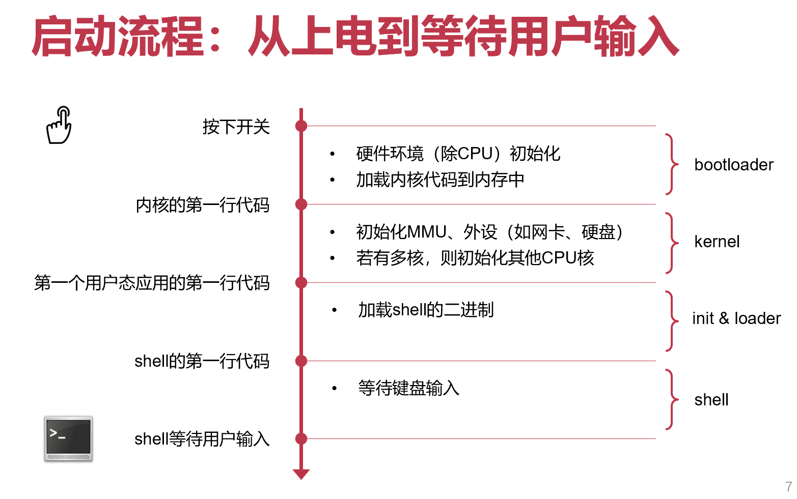

# 操作系统 OS

硬件和应用之间的软件层

## 操作系统为应用提供的一些服务

## 操作系统对应用的管理

# 操作系统结构

**设计原则：策略与机制的分离**

- 策略（Policy）：要做什么 —— 相对动态

- 机制（Mechanism）：该怎么做 —— 相对静态

操作系统可仅通过调整策略来适应不同应用的需求

## 宏内核（Monolithic Kernel）：如 UNIX/Linux、Free BSD

整个系统分为内核与应用两层

- 内核：运行在特权级，集中控制所有计算资源
- 应用：运行在非特权级，受内核管理，使用内核服务
- 其间通过系统调用交互

## 微内核（Micro-Kernel）：如 Mach、L4、seL4、QNX、Google Fuchsia

**设计原则：最小化内核功能**

- 将单个功能从内核拆分出来，移到用户态，称为"服务"（Server）
- 内核仅保留极少功能，为这些服务提供通信（如进程间通信 IPC）等基础能力
- 在用户模块之间，使用消息传递机制通信

**性能较差：内核中的模块交互由函数调用变成了进程间通信**

## 混合内核架构：如 macOS / iOS、Windows NT

宏内核与微内核的结合

- 将需要性能的模块重新放回内核态
- macOS / iOS：Mach微内核 + BSD 4.3 + 系统框架
- Windows NT：微内核 + 内核态的系统服务 + 系统框架

## 外核+库OS（Exokernel **+** LibOS）

- 过度的硬件资源抽象会带来较大的性能损失
- 操作系统提供的硬件资源抽象是针对所有应用的通用抽象，对于一些具体的应用而言这些抽象往往不是最优的选择

**由应用来尽可能控制对硬件资源的抽象（应用可以选择最合适的库OS）。**

内核态：Exokernel（管理应用）【只负责实现硬件资源在多个库OS之间的多路复用，并管理这些库OS实例的生命周期】

用户态：libOS（服务应用）【封装了硬件的抽象，并与应用直接连接；开发者可以选择已有的适合的库OS，或选择自己开发】

- OS无抽象，能在理论上提供最优性能

### 外核架构（Exokernel）

**设计原则：将管理与保护分离**

- 不提供硬件抽象
- 不管理资源，只管理应用（负责将计算资源与应用的绑定，以及资源的回收；保证多个应用之间的隔离）

> 功能：
>
> 追踪计算资源的拥有权：安全绑定（Secure binding）
>
> ​	允许某个LibOS访问某些计算资源（如物理内存），并防止这些计算资源被其他LibOS访问
>
> 保证资源的保护：显式回收（Visible revocation）
>
> ​	显式告知应用资源的分配情况，应用在租期结束之前主动归还资源
>
> 回收对资源的访问权：中止协议（Abort protocol）
>
> ​	若应用不归还资源，则强制中止

### 库OS（LibOS）

- 策略与机制分离：将对硬件的抽象以库的形式提供
- 高度定制化：不同应用可使用不同的LibOS，或完全自定义
- 更高性能：LibOS与应用其他代码之间通过函数调用直接交互

## 单内核（Unikernel）

- 可以看做虚拟化环境下的LibOS
  - 每个虚拟机只使用内核态
  - 内核态中只运行一个应用+LibOS
  - 通过虚拟化层实现不同实例间的隔离

- 适合容器应用场景
  - 每个容器就是一个虚拟机
  - 每个容器运行定制的LibOS以提高性能

## 多内核/复内核（Multikernel）

将一个众核系统看成是由多个独立处理器核通过网络互联而成的分布式系统

思路

- 默认的状态是划分而不是共享
- 维持多份状态的copy而不是共享一份状态
- 显式的核间通信机制（提供一层基于进程间通信的抽象，从而避免处理器核之间通过共享内存进行隐式共享）

设计

- 在每个core上运行一个小内核（包括CPU、GPU等）
- OS整体是一个分布式系统
- 应用程序依然运行在OS之上

## 不同操作系统架构的对比

性能：外核＞宏内核＞微内核

**微内核与外核区别**

微内核：服务各个应用共享；内核中模块的交互由函数调用变为IPC

外核：一个库OS管理并直接服务于一个应用；系统调用又变回函数调用

# ARM

ARMv4T、ARMv5TE：Thumb 16位指令集（对于嵌入式系统，内存小，可以用16位指令代码使得占用空间更小）

## AArch64（ARM architecture 64）

- PC（64-bit）指向**当前**执行的指令
- 指令长度相同 (RISC, **32-bit**)
- PC 会被跳转指令修改：B, BL, BX, BLX

### 寄存器

使用更多寄存器，以精简指令设计

SP（stack pointer），ELR（exception linkage register），SPSR（saved program state register）

**为什么4个栈寄存器，却只有3个异常链接寄存器？**

上一层出问题会给下一层处理（如用户态出错会给内核态处理）！因此异常链接寄存器只需要3个

**X86 中切换特权级（用户态内核态间切换）时候 rsp 如何保存，如何恢复？**

将 rsp 压栈，要恢复的时候从栈取出

### 寻址模式：基地址加偏移量

lsl #Num：移位运算（左移Num位，相当于乘以2的Num次方），用于如数组索引访存等

#### 寻址模式是表示内存地址的表达式

- 基地址模式（索引寻址）[rb]
- 基地址加偏移量模式（偏移量寻址）[rb, offset]
- 前索引寻址（寻址操作前更新基地址）[rb, offset]!           rb += Offset; **寻址**M[rb]
- 后索引寻址（寻址操作后更新基地址）[rb], offset           **寻址**M[rb]; rb += Offset

### 函数调用（caller 调用 callee）

#### 指令

- `bl label`     直接调用，调用函数

- `blr Rn`     间接调用，调用函数指针

#### 功能

- 将**返回地址**存储在**链接寄存器**LR (x30寄存器的别名，LR: Link Register)

- 跳转到被调用者的**入口地址**

### 特权级对比（Exception Level）

#### X86-64

- **Non-root（非虚拟化模式） :** Ring 3：Guest app，Ring 0：Guest OS

- **Root（虚拟化模式）**：Ring 3：App，Ring 0：Hypervisor

#### ARM

- EL0：跑应用程序
- EL1：跑操作系统
- EL2：跑虚拟机监控器
- EL3：负责普通世界与安全世界中的切换

### 系统状态寄存器、系统控制寄存器等见PPT

### 地址翻译

NS：None secure

### 内存空间

#### X86-64

CR3：进程页表基地址

#### ARM

TTBR0_EL1：用户态页表基地址

TTBR1_EL1：内核态页表基地址

- 用户态和内核态之间地址隔离（使用不同的页表，切换时如果只有一个保存基地址寄存器，开销很大）

### 输入/输出

MMIO (Memory-mapped IO)

- 将IO设备地址映射到物理内存的特殊地址段，和访问内存使用相同的指令（复用ldr和str指令）
- 但是行为与内存不完全一样，会有副作用

PIO（Port IO）

- IO设备具有独立地址空间
- 使用特殊指令（如x86的in/out指令）

# RISC vs CISC

## RISC

- 固定长度指令格式
- 更多的通用寄存器
- Load/store 结构
- 简化寻址方式

## CISC

- 微码：实际上也会先转换为RISC指令（微码）才能在CPU上跑，而不是直接把CISC指令给CPU

# 中断、异常与系统调用

CPU执行逻辑：以PC值位地址从内存中获取一条指令并执行；但是执行过程中可能发生“异常”情况

希望尽量减少的切换：进程切换，用户态和内核态的切换......（对用户态而言这些切换并没有收益！只有开销）

## ARM的异常

- 同步异常：指令执行出现错误，比如除零或缺页
- 异步异常：外部设备触发中断

在ARM中这两种情况都叫做异常（与x86区分），都会导致CPU陷入内核态，并根据异常向量表找到对应的处理函数来执行；处理函数执行完后，执行流需要恢复到之前被打断的地方继续运行

## 操作系统对异常的处理

1. 对异常向量表的设置（CPU上电后立即执行，是系统初始化的主要工作之一；在开启中断和启动第一个应用之前）
2. 实现对不同异常（中断）的处理函数
   - 处理应用程序出错的情况（如除零、缺页）
   - 特殊的同步异常：系统调用（应用主动触发）
   - 外部设备的中断（收取网络包、获取键盘输入）

**内核自己运行出错怎么办？**

可恢复的：直接处理；不可恢复的：crush dump（留下遗言之后崩溃）

### 异常向量表

操作系统预先在一张表中准备好不同类型的异常处理函数（基地址存储在VBAR_EL1寄存器；处理器在异常发生时自动跳转到对应位置）

### 异常处理函数

- 运行在内核态：不受限制访问所有资源
- 处理器将异常类型存储在指定寄存器中（ESR_EL1），表明发生了哪种异常
- 异常处理函数根据异常类型执行不同逻辑
- 完成异常处理后
  - 回到发生异常时正在执行/下一条指令
  - 结束当前进程

## 内核态与用户态的切换

### 处理器在切换过程中的任务

1. 将发生异常事件的指令地址保存在ELR_EL1中
2. 将异常事件的原因保存在ESR_EL1
   - 例如，是执行svc指令导致的，还是访存缺页导致的
3. 将处理器的当前状态（即PSTATE）保存在SPSR_EL1
4. 将引发缺页异常的内存地址保存在FAR_EL1
5. 栈寄存器不再使用SP_EL0（用户态栈寄存器），开始使用SP_EL1
   - 内核态栈寄存器，需要由操作系统提前设置
6. 修改PSTATE寄存器中的特权级标志位，设置为内核态
7. 找到异常处理函数的入口地址，并将该地址写入PC，开始运行操作系统
   - 根据VBAR_EL1寄存器中保存的异常向量表基地址，以及发生异常事件的类型确定

**操作系统为何不能直接使用应用程序在用户态的栈？**

用户态不可信，避免用户态在栈中恶意插入代码等，导致内核态出现问题

### 操作系统在切换过程中的任务

- 主要任务：将属于应用程序的 CPU 状态保存到内存中
  - 用于之后恢复应用程序继续运行
- 应用程序需要保存的运行状态称为处理器上下文
  - 处理器上下文（Processor Context）：应用程序在完成切换后恢复执行所需的最小处理器状态集合
  - 处理器上下文中的寄存器具体包括：通用寄存器 X0-X30；特殊寄存器，主要包括PC、SP和PSTATE；系统寄存器，包括页表基地址寄存器等

## 系统调用

`svc`（supervisor call）：从用户态进入内核态

`eret`：从内核态返回到用户态

参数传递：最多允许8个参数（x0-x7寄存器），x8用于存放系统调用编号，调用者保存的寄存器在用户态保存

返回值：存放在x0寄存器中

**内核自己能够调用 syscall 吗？**

可以，不需要换栈，直接调对应的处理函数就行

**为什么还要存放系统调用的编号，而不直接放到异常向量表里面？**

硬件无关：操作系统具体实现多少个系统调用与处理器无关，处理器只负责提供对应机制

额外开销：通过编号获取系统调用基地址，进行跳转

**寄存器参数放不下怎么办？**

内存传参：将参数放在内存中，将指针放在寄存器中传给内核，内核通过指针访问相关参数

- 指针指向内核区域，不安全
- 指针指向的区域被swap-out，导致内核访问的时候出现page fault
- 指针指向未映射区域，导致segmentation fault

**如何验证传过来指针的合法性（用户态恶意攻击）？**

检查判断是否在最大的VMA（通过mmap创建的虚拟内存空间）

### 优化：syscall 能否不要下陷（Trap）

#### vDSO（virtual dynamic shared object）

系统调用的时延不可忽略（尤其是在频繁调用的部分，比如 `gettimeofday()` ）；想要降低时延，希望不要用户态到内核态的模式切换（没有这种切换就不需要保存和恢复状态）

- 内核定义：在编译时作为内核的一部分
- 用户态运行：共享内存（将对应函数代码加载到一块与应用共享的内存页，这个页称为vDSO），用户态可读（只读），内核态可写（更新对应值）【类似生产者-消费者模式】

#### Flex-SC（flexible system call scheduling with exception-less system calls）

目的：进一步降低系统调用的时延（同时切换后内核态也污染了用户态本来用的cache），希望在不切换状态的情况下实现系统调用

思想：syscall的时候并不直接切换到内核，而是把所有syscall的参数放到一个和内核共享的页里面；内核通过共享页上的参数执行对应syscall，并把返回结果写在共享页上返回给用户

方式：新的syscall机制

- 引入 system call page，用户和内核共享
- 用户线程可以将系统调用请求参数 push 到 system call page（用户写）
- 内核态线程到 system call page pull 系统调用请求（内核读，内核写返回值）
- Exception-less syscall：将系统调用的调用和执行解耦，可以分不到不同的CPU核并行处理
- 一次性可以等很多系统调用堆积之后，再一次性让内核态线程 pull，实现批处理
- 用户和内核线程可以运行在不同CPU核上，没有切换带来的开销

适合的应用：如Apache服务器适合；同步调用变成异步调用，适合系统调用多的情况，可以提升吞吐量，不适合对时延敏感的应用

缺点：优化之后用户和内核线程在两个核（原本在同一个核，相互切换），内存访问时**对于 L1 L2 cache（cpu private）的利用变差**（本来 page 中参数刚放进缓存就被取出来，现在必须在page的level，因为cache不共用）；甚至如果在不同CPU的不同核上，就更大的读写内存开销，很难利用cache

# 系统初始化

syscall 的本质：应用程序想要完成一些事情但是没有权限，需要**请求操作系统帮助**才能完成

## 计算机启动

## 内核启动的2个主要任务

- 任务-1：配置页表并开启虚拟内存机制，允许使用虚拟地址
  - 页表究竟改如何具体配置？
  - 难点：开启地址翻译的前一行指令使用物理地址，开启后立即使用虚拟地址，前后如何衔接？

- 任务2：配置异常向量表并打开中断，允许双循环
  - 异常向量表如何配置？
  - 打开后，异常处理的指令流如何流动？

## 内核代码的加载和运行

**需要用一段代码去初始化CPU，CPU在初始化之前运行不了代码**

树莓派上使用GPU（不需要自己初始化自己，开机后自己设置好，不需要软件代码初始化）先去运行第一行代码（GPU是树莓派自己做的，所以可以自己定义一套初始化流程；CPU是使用别人厂商的，那就需要用代码初始化）

### 入口函数位置

CPU从预定义的**RAM地址**读取第一行代码，由硬件厂商决定（树莓派：32位为0x8000，64位为0x80000，x86：0x7C00）

## ChCore 启动代码

- 设置CPU异常级别为EL1
- 设置初始化时的简单页表，并开启虚拟内存机制
  - TTBR0_EL1：虚拟地址 = 物理地址
  - TTBR1_EL1：虚拟地址 = 物理地址 + OFFSET
- 设置异常向量表
  - 每一个异常向量表项跳转到对应的异常处理函数
  - 处理异常前保存进程上下文、返回进程前恢复其上下文

**两个涉及到的目录：boot和kernel**

- boot目录：编译后放在 .init 段（可读可执行，只运行一次，可以在启动后被抛掉，节省一点点内存），低地址范围（有时也叫bootloader，再次注意不要混淆）
- kernel目录：编译后放在 .text 段（可读可执行），高地址范围

**PPT相关代码注解**

.lds.in 中的 . 表示当前“位置”地址，随着代码往里面添加，. 的值不断增大

寄存器名字中包含 _ELx 对应寄存器只能够在ELx的权限级下被访问

**初始化栈之前怎么bl和eret？**

- **ARM中只调用一层函数不需要栈（返回地址存寄存器LR，link register x30）**，当然多层调用中前面寄存器里放不下的函数返回地址进栈即可

**为什么调用C函数之前要设置栈**

- C不管这个函数是初始化还是在跑内核，因此函数调用时候会正常进行压栈（调用者被调用者保存寄存器等），为了调用C必须先初始化栈，也即在此之后就可以抛弃汇编

**start_kernel物理内存中实际上紧邻init（低地址），为什么可以跳到高地址段执行它？**

因为这之间完成了MMU物理地址到虚拟地址的转换（页表初始化）；物理空间中实际上离得很近，只是虚拟内存空间中两者地址相差比较大

### 页表初始化

- 对于ARM来说，整个虚拟地址空间中间是不用的（其实只用到了48-bit的地址，即16个0开头的地址和16个1开头的地址）
- TTBR1_EL1（16个1开头的地址的翻译）和TTBR0_EL1（16个0开头的地址的翻译）（页表基地址，显然只有内核能够访问页表基地址寄存器，故都是EL1）

**PPT相关代码注解**

boot_ttbr0_l0（l0代表第0级页表）

初始化部分：零级页表指向一级，一级指向二级

2M页的for循环：设置二级页表（2M大页，初始化时把所有内存都映射进来再说，之后再变成4K；也因此不需要初始化L3页表）

**映射设备地址时，为什么要设置DEVICE_MEMORY位（使其变为non-cachable）？**

- non-cachable：CPU访问内存时候不过cache，直接访问内存（对于volatile关键词）
- 设备内存：对应的memory不是真的memory，而是设备上的寄存器（在X86中有两个地址，一种是IO总线地址，另一种就是在物理内存上的地址），只不过是把这块的物理地址空间映射过去
- 这部分物理内存上的地址（对应设备上的寄存器）自己会变化（设备修改），如访问设备的时候需要轮询一个bit看其是否ready，那这个bit是设备修改，肯定不能存在缓存里，存在缓存就没有人改了

**设备内存和物理内存的区别？**

物理地址空间：设备地址（最顶部）和物理内存（从0开始）都会用到物理地址；也即即使你自己加内存条，也很可能因为原本物理地址空间顶上（再往上走）有设备地址，而无法扩展内存

设置TTBR1页表（高地址使用）：把TTBR1设置成和TTBR0一样的位置（映射到同样的物理地址区域），用不同的虚拟地址可以访问同一块物理地址

最终物理地址空间从0开始到物理内存区域结束，映射到低地址，映射到高地址（一块内存映射到两个地址）

页表设置后，开始翻译（enable 页表）

**尚未使用页表到打开页表后地址经过MMU翻译，为什么开启地址翻译的前一行指令使用物理地址，开启后立即使用虚拟地址，前后如何衔接？**

因为最底下这部分蓝色的物理内存地址和虚拟内存地址是一样的；PC的值加4之后，不管翻译还是不翻译，出来的地址结果都是一样的

### 异常向量表的初始化

el1_vector 异常向量表 中 调 syscall_table

## 内核启动前：BIOS（Basic Input/Output System）

BIOS负责计算机上电到内核开始运行（小芯片；许多PC都有这个硬件；嵌入式设备基本没有），通常保存在主板的只读内存（ROM）中，CPU负责执行BIOS（x86 CPU在reset后，PC固定指向0xFFFF0，0xFFFF0就是BIOS的物理地址，也就知道了BIOS在哪里）

- 上电后，开始执行BIOS ROM中的代码
  - 找到第一个可启动设备（如第一块磁盘），将可启动设备的第一个块（512字节，即MBR）加载到内存0x7c00中，跳转到bootloader的内存地址（物理地址0x7c00）并继续执行
- bootloader 开始执行
  - 将内核的二进制文件从启动设备加载到内存中（若内核文件是压缩包，则对其进行解压），跳转到（解压后的）内核加载地址（物理地址）并继续执行
- 内核代码开始执行

上电自检（POST，Power-On Self-Test）：BIOS程序首先检查，计算机硬件能否满足运行的基本条件；如果硬件出现问题，主板会发出不同含义的蜂鸣，启动中止。

主引导记录（MBR，Master Boot Record）：磁盘的0柱面0磁头0扇区称为主引导扇区（磁盘的第一块）；一个磁盘只能分四个主分区；包括三部分（主引导程序，硬盘分区表DPT，硬盘有效标志）

EFI / UEFI：Intel提出取代BIOS interface（为CPU提供软件配套）

## 两种启动的对比

- 定制化的主板（常见的ARM开发板，通常不再扩展其他设备）：树莓派等；初始化时有哪些硬件设备等都是知道的，一般厂商提供私有固件BSP（board support package）完成

- 通用的主板（常见如PC，通常需要再插入其他设备）：系统配置情况在开机的时候是不知道的，需要在启动的时候加入探测看看有哪些设备

# 虚拟内存管理

如何让OS与不同的应用程序（多用户多程序）都高效又安全地使用物理内存资源？

分时复用物理内存资源的话，切换时将全部内存写入磁盘开销太高；同时使用，各占一部分物理内存的话缺乏安全性和隔离性。

- IBM 360的内存隔离：Protection Key
  - 物理内存的旁边放了一组寄存器（内存被划分为2KB内存块，每个内存块有一个4-bit的key，保存在寄存器中）
  - 每一个进程也对应一个key，进程只能访问与其key一样的内存块！

**希望让应用看不见物理地址**（应用会因为其他应用的加载而受到影响；一旦物理地址范围确定，很难使用更大范围的内存，扩展性差；安全性上，应用可以通过自身内存地址猜测其他应用的位置）

## 虚拟地址

- 地址翻译（物理地址可以不连续，但是在虚拟地址中可以体现为连续）
- 支持隔离（不同进程虚拟地址空间不同）

## 虚拟内存的组织：分段与分页

### 分段

- 翻译时一个虚拟地址（段内地址）需要加上起始地址（根据段号找到）得到物理地址
- 每个进程都可包含代码段、数据段等，与进程自身的内存布局相匹配

**分段机制问题**

- 本段长度有限制
- 对物理内存有连续性要求（如堆和栈），需要预留空间
  - 内存利用率低（外部和内部碎片）

### 分页

粒度恒定的分段机制

- 页表包含多个页表项，存储物理页的页号（虚拟页号为索引）
- 物理内存离散分配，大大降低对物理内存的连续性要求，减少碎片

## ARM64 的页表格式

### 多级页表

- 有效压缩页表的大小
- 允许页表中出现空洞（某级页表中的某条目为空，那么该条目对应的下一级页表无需存在；应用程序的虚拟地址空间大部分都未分配）

**多级页表什么时候不如单级页表**

占满的时候。前面几级页表都浪费了，并且查找的时候很慢。

### AARCH64 体系结构下4级页表

### 虚拟地址解析

### 页表基地址寄存器

### Level 3 页表项

### Level 0，Level 1，Level 2 页表项

## TLB：地址翻译的加速器，页表的cache（不是页表页传统数据通路走的那个内存的cache）

- TLB位于CPU内部，是**页表的缓存**
  - Translation Lookaside Buffer
  - 缓存了虚拟页号到物理页号的映射关系
  - **有限数目**的TLB缓存项

- 在地址翻译过程中，MMU首先查询TLB
  - TLB命中，则不再查询页表 （**fast** **path**）
  - TLB未命中，再查询页表

TLB一个一个查，非常慢

TLB难以再提升性能！随着内存越来越大（页表也随之变大），出现与内存不match的情况（两者性能变大斜率不一致！）

### TLB清空：TLB Flush

切换进程（虚拟地址空间变化，页表也会相应换掉）的时候就要清空TLB；在现有知识体系下，内核和用户态之间发生切换不需要清空TLB（内核和应用程序在同一个地址空间里面，地址空间没有发生变化）

- TLB 使用虚拟地址索引
  - 当OS切换页表时需要全部刷掉
- AARCH64上内核和应用程序使用不同的页表
  - 分别存在TTBR0_EL1和TTBR1_EL1
  - 系统调用过程不用切换
- x86_64上只有唯一的基地址寄存器
  - 内核映射到应用页表的高地址
  - 避免系统调用时TLB清空的开销

#### 降低TLB清空导致的开销

- 新的硬件特性ASID（Address Space ID）：OS为不同进程分配8或16位的ASID，将其填写在TTBR0_EL1的高位。TLB每一项头上也加上ASID。在切换进程的时候就不需要清空TLB（同一个虚拟地址不同进程，ASID不一样；使用TLB条目时候检查ASID是否匹配）
  - 缺点：如果有8位，只能256个进程

> **注意：TLB是页表映射的cache，和页表内存页的cache（通常说的缓存）完全不一样！！！**

**OS修改页表后，需要刷掉其它核的TLB吗？**

如果别的核和当前核跑的同一个进程的不同线程（并且属于这个页表），要刷

**OS如何知道需要刷掉哪些核的TLB？**

操作系统要知道进程调度信息（当前改的页表属于哪个进程，看看别的核有没有跑这个进程）

**OS如何刷掉其它核的TLB？**

- x86_64: 发送IPI（CPU核向别的CPU核发出的中断）中断某个核，通知它主动清空

- AARCH64: 可在local CPU上清空其它核TLB
  - 调用的ARM指令：TLBI ASIDE1IS

