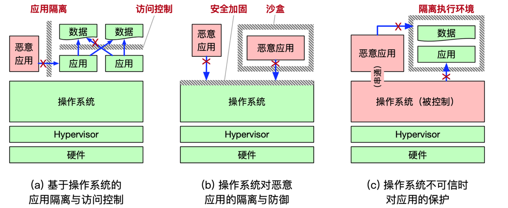
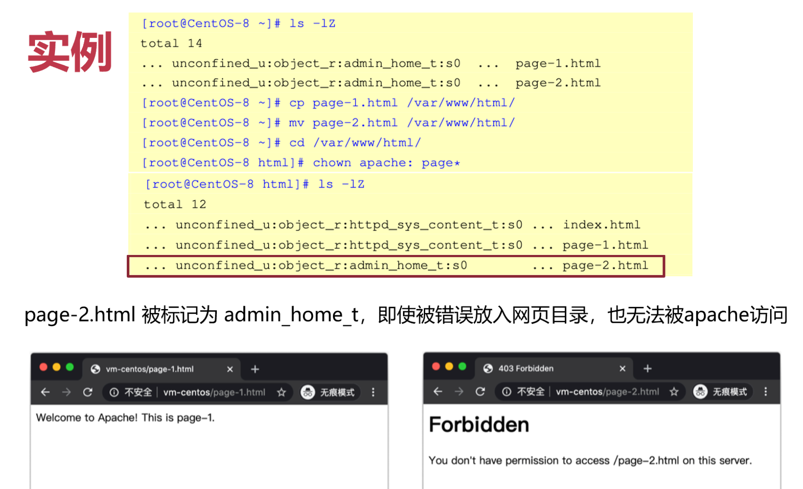
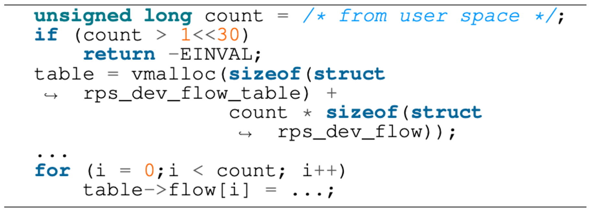
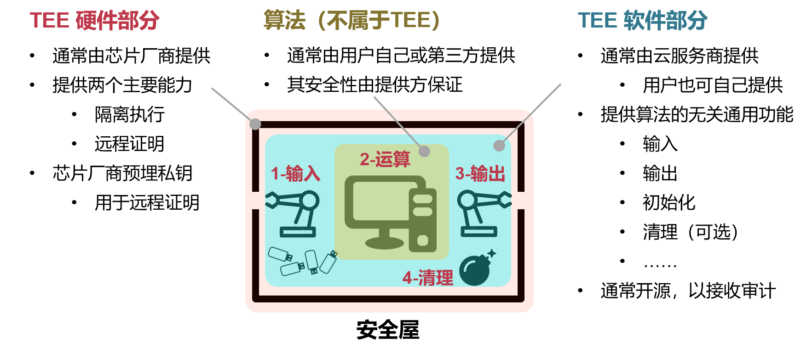
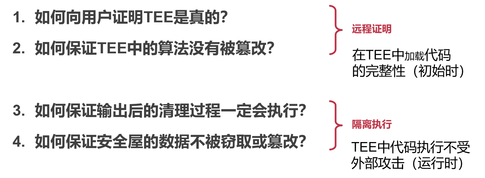
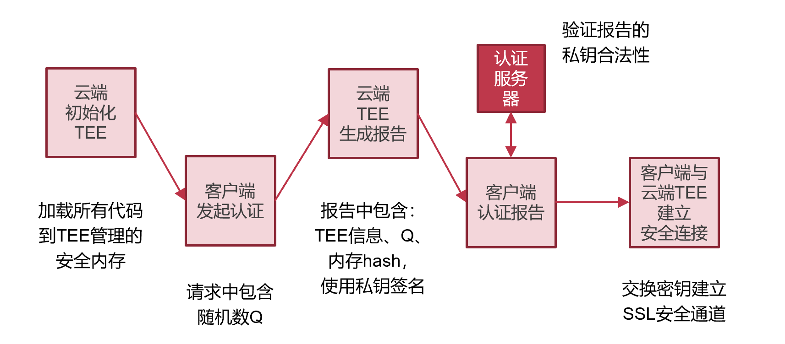
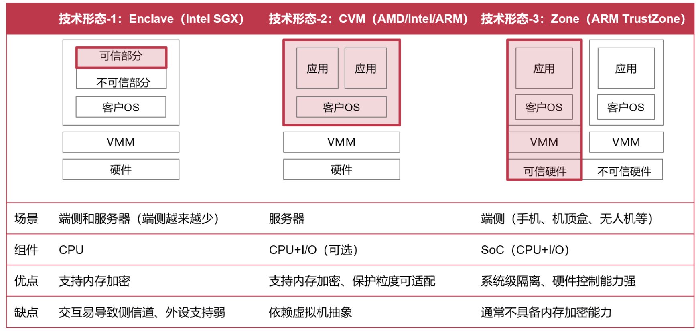
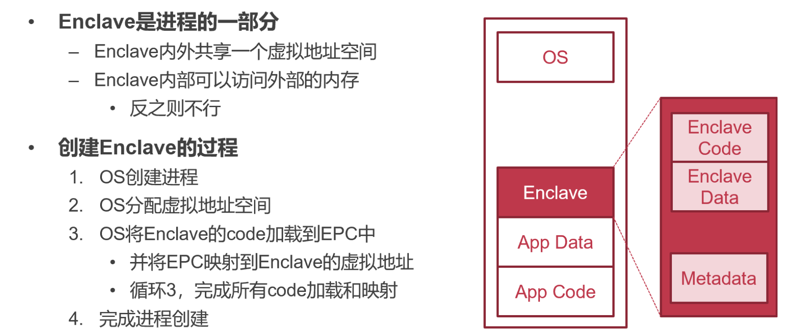
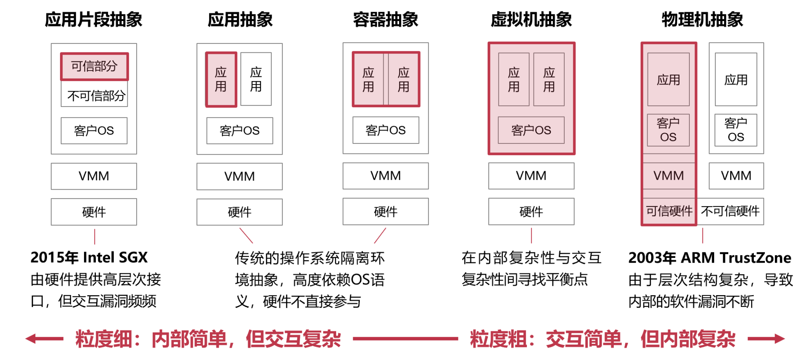
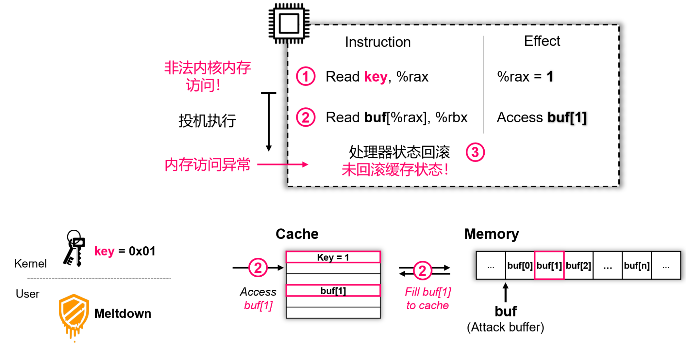

# Security 安全

# 操作系统安全机制

## 操作系统安全的三个层次



沙盒：类似于 VMware

### 层次一：基于OS的应用隔离与访问控制

**威胁模型**

- 操作系统是可信的，能够正常执行且不受攻击
- 应用程序可能是恶意的，会窃取其他应用数据
- 应用程序可能存在bug，导致访问其他应用数据

**应用隔离**

- 内存数据隔离：依赖进程间不同虚拟地址空间的隔离
- 文件系统隔离：文件系统是全局的，需限制哪些应用不能访问哪些文件
  - 操作系统提供对文件系统的**访问控制**机制

### 层次二：OS对恶意应用的隔离与防御

**威胁模型**

- 操作系统存在bug和安全漏洞
- 操作系统的运行过程依然可信
- 恶意应用利用操作系统漏洞攻击，获取更高权限或直接窃取其他应用的数据

**操作系统防御**

- 防御常见的操作系统bug/漏洞
- 沙盒机制限制应用的运行

### 层次三：OS不可信时对应用的保护

**威胁模型**

- 操作系统不可信，有可能被攻击者完全控制
- 恶意应用可能与操作系统串通发起攻击

**基于更底层的应用保护**

- 基于Hypervisor的保护：可信基更小
- 基于硬件Enclave的保护：硬件通常更可信，可以不信任Hypervisor

## 操作系统安全的概念

- 可信计算基（Trusted Computing Base）（绿色，被信任的安全区域）
  - 为实现计算机系统安全保护的所有安全保护机制的集合
  - 包括软件、硬件和固件（硬件上的软件）
- 攻击面（Attacking Surface）
  - 一个组件被其他组件攻击的所有方法的集合
  - 可能来自上层、同层和底层
- 防御纵深（Defense in-depth）
  - 为系统设置多道防线，为防御增加冗余，以进一步提高攻击难度

**指标**

- 千行代码的缺陷密度：每 1,000 行代码的平均缺陷数量
- 已发现的缺陷数量
  - 缺陷的编号方法 CVE（Common Vulnerabilities and Exposures）
    - 一种常见的漏洞编号方式，CVE-2020-10757

### 安全目标（CIA）

- 机密性（Confidentiality）
  - 常又称隐私性（Privacy）
  - 数据不能被未授权的主体窃取（即恶意读操作）
- 完整性（Integrity）
  - 数据不能被未授权的主体篡改（即恶意写操作）
- 可用性（Availability）
  - 数据能够被授权主体正常访问

## 访问控制（Access Control）

OS中代码都是正常运行的时候，维持系统中秩序的方法

- 访问控制（Access Control）
  - 按照访问实体的身份来限制其访问对象的一种机制
  - 为了实现对不同应用访问不同数据的权限控制
  - 包含"认证"和"授权"两个重要步骤
- 引用监视器（Reference Monitor）
  - 是实现访问控制的一种方式
  - 主体必须通过引用（reference）的方式间接访问对象
  - Reference monitor 位于主体和对象之间，进行检查

### 引用监视器（Reference Monitor）机制

思路：不应该让主体和客体直接接触

Reference Monitor 负责两件事：

1. Authentication：确定发起请求实体的身份，即认证
2. Authorization：确定实体确实拥有访问资源的权限，包含授权和鉴权


**认证机制**

- 知道什么 （Something you know）：例如密码/口令、手势密码、某个问题的答案等
- 有什么 （Something you have）：例如 USB-key、密码器等实物
- 是什么 （Something you are）：如指纹、虹膜、步态、键盘输入习惯等属于人的一部分

**访问控制矩阵**

权限矩阵：对象与实体的关系


### 授权机制：POSIX的文件权限

- 将用户分为三类
  - 文件拥有者、文件拥有组、其他用户组
  - 每个文件只需要用9个bit即可：3种权限（读-写-执行） x 3 类用户
- 何时检查用户权限？每次打开文件时，进行鉴权和授权
  - open() 包含可读/可写的参数，OS根据用户组进行检查（鉴权）
  - 引入fd，记录本次打开权限（授权），作为后续操作的参数
  - 每次操作文件时，根据fd信息进行检查（鉴权）

<u>**权限不和文件绑定在一起，而和这一次操作（fd）绑定在一起！**</u>

### 基于角色的访问控制 RBAC（Role-Based Access Control）

RBAC：将用户（人）与角色解耦的访问控制方法

一个用户可以有多个角色！每个角色权限可以不一样；如 linux group 就基本可以满足

### 最小特权级原则：setuid 机制

时间上对于权限的划分，即使是同一个人在不同时间

- linux 中用户如何修改自己的密码？
  - 用户的密码保存在 /etc/shadow 中，用户无权访问；但是一旦提权，以文件为单位的权限管理粒度会导致用户也能修改别的用户的密码
  - 解决：运行 passwd 时使用 root 身份（运行时临时提权）
    - 在passwd的inode中增加一个SUID位，使得用户仅在执行该程序时才会被提权，执行完后恢复，从而将进程提权的时间降至最小
    - passwd程序本身的逻辑会保证某一个用户只能修改其自身的密码

setuid的安全隐患：一旦 passwd 程序存在漏洞，如 buffer-overflow 导致的返回地址修改，则攻击者很容易以root身份通过ROP运行 execv("/bin/sh")

### 权限控制的另一种思路：Capability

- Capability表示一种能力
  - 例如：读取/foo文件，写入/foo文件，等等
  - 有点像钥匙，能打开某一把锁的话就能进行某个操作
  - 每个进程可以拥有一组能力
- Capability怎么实现？很多种方式
  - 仅仅是一串bit，但必须保存在内核中，否则进程就可以任意伪造
    - 通常保存在进程的PCB中，在进程进行某个操作的时候内核检查
  - 可以把不同Capability的组合对应为ACL中的不同组
  - 因此使用Capability的控制粒度可以很细，而且不需要建立大量的组

#### Capability的典型操作

1. 服务端通过系统调用创建一个 Capability，获得相应的 ID
2. 服务端通过系统调用，将此 Capability ID 传递给某个客户端（必须要先建立起通信）
3. 客户端通过 IPC 调用服务端的某个服务函数，以 Capability ID 作为参数
4. IPC 调用过程中，**操作系统**根据该 Capability ID 检查该客户端是否有权限调用服务端函数，检查通过则切换至服务端继续运行（权限检查并不是服务端做的，如果权限检查不通过，直接在OS的部分就拦住了，服务端根本不会知道这次调用）
5. 服务端执行函数，并将结果返回给客户端

Capability 可以传递；一旦把 Capability 的权限给别人，自己就没了

#### fd与Capability的类似之处

- 文件描述符 fd 可以看做是 Capability 的一种实现
  - 用户不能伪造 fd，必须通过内核打开文件（回顾 file_table/fd_table）
  - fd 只是一个指向保存在内核中数据结构的"指针"
  - 拥有 fd 就拥有了访问对应文件的权限
  - **一个文件可以对应不同 fd，相应的权限可以不同**
- fd 也可以在不同进程之间传递（在传递的时候OS也会判断接收方有没有权限）
  - 父进程可以传递给子进程（回顾pipe）
  - 非父子进程之间可以通过 sendmsg 传递 fd

#### Linux的Capability（与前面说的Capability的不同）

需要注意，与前面说的Capability的不同

- 语义都是预先由内核定义，而不允许用户进程自定义
- 不允许传递，而是在创建进程的时候，与该进程相绑定
- 没有提供 Capability ID，无法通过 ID 索引内核资源进行操作

### DAC与MAC

- 自主访问控制（DAC: Discretionary Access Control）
  - 指一个对象的拥有者有权限决定该对象是否可以被其他人访问
    - 例如，文件系统就是一类典型的 DAC
  - 但是对部分场景（如军队）来说，DAC过于灵活
    - 例如，文件拥有者是否真的有权可随意设置文件权限？
- 强制访问控制（MAC: Mandatory Access Control）
  - 由"系统"（超出于当前运行环境的）增加一些强制的、不可改变的规则
    - 甚至是超越 root 的权限，可以管理 root
    - 例如，在军队中，如果某个文件设置为机密，那么就算是指挥官也不能把这个文件给没有权限的人看——这个规则是由军法（系统）规定的
  - MAC与DAC可以结合，此时MAC的优先级更高

#### Bell-LaPadula 模型

- BLP属于强制访问控制（MAC）模型
  - 一个用于访问控制的状态机模型
  - 目的是为了用于政府、军队等具有严格安全等级的场景
- BLP 规定了两条 MAC 规则和一条 DAC 规则
  - 简单安全属性：某个安全级别的主体无法读取更高安全级别的对象
  - \* 属性（星属性）:某一安全级别的主体无法写入任何更低安全级别的对象
    - 任何文件对下不可以随意的写（这样指挥官不会不小心把机密信息写进士兵也能读到的文件里）
  - 自主安全属性：使用访问矩阵来规定自主访问控制（DAC）
    - 指挥官怎么向士兵发送命令？DAC

## 案例：SELinux

Flask 安全架构在 Linux 上的实现，把强制类型访问（MAC）加入到Linux

> Flask 是一个 OS 的安全架构，可灵活提供不同的安全策略

**如何在打开文件的时候有时进行安全检查，而有时又不检查？**

在关键的地方设置 **hook**，而不写实际的代码逻辑；对应 hook 的代码逻辑可以更换实现

LSM：把所有检查函数做成类似于linux驱动的模块，可插拔

SELinux也是LSM的一个驱动的模块

### SELinux引入的概念

- 用户（User）：指系统中的用户
  - 与 Linux 系统用户并没有关系
- 策略（Policy）：一组规则（Rule）的集合
  - 默认是"Targeted"策略，主要对服务进程进行访问控制
  - MLS （Multi-Level Security），实现了 Bell-LaPadula 模型
  - Minimum，考虑资源消耗，仅应用了一些基础的策略规则，一般用于手机等平台
- 安全上下文：是主体和对象的标签（Label）
  - 用于访问时的权限检查
  - 可通过"ls -Z"的命令来查看文件对应的安全上下文

### SELinux的访问向量

- SELinux 将访问控制抽象为一个问题：
  - 一个 < 主体 > 是否可以在一个 < 对象 > 上做一个 < 操作 >
  - 3W: Who, Which (obj), What (operation)

**AVC: Access Vector Cache**

- SELinux 会先查询AVC，若查不到，则再查询安全服务器
- 安全服务器在策略数据库中查找相应的安全上下文进行判断（rule统一放在服务器里面）

### SELinux的安全上下文

- SELinux本质上是一个标签系统
  - 所有的主体和对象都对应了各自的标签
- 标签的格式 \<用户:角色:类型:MLS层级\>
  - 用户登录后，系统根据角色分配给用户一个安全上下文
  - 类型（Type）用于实现访问控制
    - 每个对象都有一个 type
    - 每个进程的type称为 domain
      - 一个角色对应一个domain
      - 重要的服务进程被标记为特定的domain
      - 例如：/usr/sbin/sshd 的类型为 sshd_exec_t



- SELinux中设置规则，apache只能访问type是httpd_sys_content_t的文件
- cp会更改标签，但是mv不会更改标签（也是策略中可以规定的）

### SELinux在实际应用中的问题

- 规则的设置过于复杂：不同规则之间可能存在冲突，错误的规则影响可用性
- 日志难以被理解：当发生违反规则的情况，很难解释发生了什么，该如何判定
- 应用程序不支持：部分规则需要应用程序的配合
- 性能影响：权限检查不可避免的带来性能的损失

# 操作系统攻防

## 操作系统内核漏洞

**分类的三个角度**

- 漏洞类型（指攻击所利用的漏洞类型）
  - 栈/堆缓冲区溢出、整形溢出、空指针/指针计算错误、内存暴露、use-after-free、double-free、未初始化读取、格式化字符串错误、竞争条件错误、参数检查错误、认证检查错误，等等
- 攻击模块（指攻击所利用漏洞的所在的模块）
  - 调度模块、内存管理模块、通信模块、文件系统、设备驱动等
- 攻击效果（指攻击的目的或攻击导致的结果）
  - 执行任意代码、内存篡改、窃取数据、拒绝服务、破坏硬件等

> 控制流攻击：让应用程序去执行一段特定代码
>
> 数据流攻击：造成数据错误（如页表权限位恶意改错）

**内核中哪些数据结构非常危险？**

如 inodetable（此部分恶意篡改后，整个文件都拼不出来），页表权限位，userid改为0（变身root），IDT（记录中断来了之后，跳到哪个中断处理函数的表），syscall table

## 操作系统内核攻防

操作系统出现性能不升反降的趋势，为了安全，一些（性能与可用性的）牺牲是必要的

### 整形溢出漏洞



- vmalloc：不一定会真的 malloc 一块物理 memory（和用户态 malloc 类似）；而 kmalloc 一定会malloc 对应大小的物理内存
- 如果 count 很大，count * sizeof(struct) 会溢出，那么实际上 table 被分配的空间很小，但是 for 循环里面上界为 count，会越界写内存

**防御方法：**增加对溢出的检查代码；利用自动化工具查找并修复

### Return-to-user攻击（ret2usr）

- 内核错误地运行了用户态的代码
  - 由于内核与应用程序共享同一个页表，内核运行时可以任意访问用户态的虚拟地址空间，内核可能执行位于用户态的代码
- 攻击者的常用方法
  - 先在用户态中初始加载一段恶意代码，然后利用内核的某个漏洞，修改内核中的某个函数指针指向这段恶意代码的地址
  - 也可以利用内核的栈溢出漏洞，覆盖栈上的返回地址为恶意代码的地址，使内核在执行 ret 指令时跳转到位于用户态的代码

**ret2usr攻击的防御方法**

- 方法一：仔细检查内核中的每个函数指针（所有 jump 的地方都进行检查）
  - 需对内核所有模块进行检查，很难做到 100% 的覆盖率
- 方法二：在陷入内核时修改页表，将用户态所有的内存都标记为不可执行
  - 由于修改页表后必须要刷新 TLB 才能生效，因此修改页表、刷新 TLB，以及后续运行触发 TLB miss 都会导致性能下降
  - 在返回用户态之前必须将页表恢复，并再次刷掉 TLB，这样又会导致用户态执行时出现 TLB miss，因此对性能的影响非常大
- 方法三：硬件保证CPU处于内核态时不得运行任何用户态的代码
  - 如 Intel 的 SMEP（Supervisor Mode Execution Prevention）技术
  - ARM 同样有类似 SMEP 的技术，称为 PXN（Privileged eXecute-Never）

**SMEP 不能完全解决 ret2usr：ret2dir**

- 操作系统管理内存的方法"直接映射"
  - 将一部分或所有的物理内存映射到一段连续的内核态虚拟地址空间
  - 分配给应用程序后，直接映射依然存在
  - 因此，同一块物理内存在系统中有多个虚拟地址
    - 例如，某个内存页分配给了应用程序，那么内核既可以通过应用程序的虚拟地址访问（前提是内核与应用在一个地址空间），也可以通过直接映射的虚拟地址访问
- 基于直接映射的攻击，可绕过SMEP（攻击者知道直接映射内存区域物理地址，就可以反推在内核中对应映射区域的虚拟地址）
  - 攻击者首先推算出位于用户态的恶意代码在内核直接映射区域的虚拟地址，然后在 ret2usr 攻击中让内核跳转到该地址执行（内容依然为攻击者控制）
  - 攻击成功还有一个前提：直接映射区域必须是可执行的
  - 这种利用直接映射区域的 ret2usr 攻击被称为"ret2dir"攻击

### Rootkit：获取内核权限的恶意代码

- Rootkit 是指以得到 root 权限为目的的恶意软件
  - Rootkit 可以运行在用户态，也可以运行在内核态
- 用户态的Rootkit
  - 可以将自己注入到某个具有 root 权限的进程中，并接收攻击者的命令
- 内核态的Rootkit
  - 可以 hook 某个内核中的关键函数，从而在该函数被调用时触发运行（ROP）
  - 可以是以内核线程的方式运行
  - 可以是修改内核中的系统调用表，用恶意代码来替换掉正常的系统调用

### 内核漏洞防御机制

#### KASLR：内核地址布局随机化

- ASLR 通过随机化地址空间布局来提高系统攻击难度
- KASLR是对内核启用地址随机化

KASLR 可缓解 ret2dir 攻击

- 攻击者需要知道用户态恶意代码在内核中直接映射区域的地址
- KASLR 通过将内核的虚拟地址布局进行随机化，使攻击者准确定位内核地址的难度大大提升

#### 运行时工具

- SFI（Software Fault Isolation）：对内存做访问控制
  - 类似于 Java 类型安全，每次对如 Integer 对象读写时都会检查新的值是否越界等
- 代码完整性保护：阻止非法代码运行
  - 如跑一个线程，每一分钟检查一下全部静态数据结构的哈希（不被修改的话应该保持不变）
- 用户态驱动：降低内核攻击面
- 未初始化内存跟踪：防止未初始化内存被使用或复制到用户态
  - 每次读内存时，先判断这个内存有没有被初始化过（必须要先写再读）
  - 粒度：不能在内存页（比如写了前半部分，读后半部分）

#### 编译时工具

代码静态分析工具，通常需要开发者添加annotation


# 硬件辅助系统安全

当操作系统不再可信时...

如外设攻击操作系统？云上的计算环境？

**恶意操作系统如何攻击应用？**

- 操作系统窃取应用的数据
  - 操作系统控制着页表，可直接映射应用的内存并读取数据
- 操作系统改变应用的执行
  - 操作系统控制着页表，可直接在应用内部新映射一段恶意代码
  - 操作系统可任意改变程序的RIP，劫持其执行流

## 一种新的威胁模型：安全处理器

- 不信任CPU外的硬件：包括内存（DRAM）、设备、网络
- 仅信任CPU：包括cache、所有计算逻辑（Anyway，总得信任CPU吧...）

**Enclave（飞地）：**又称为可信执行环境，TEE（Trusted Execution Environment）

！不能保证 CIA 中的 A（如OS说要关机了，CPU阻止不了）

## Enclave/TEE：可信执行环境

> Enclave，又称"可信执行环境" （TEE，Trusted Execution Environment），是计算机系统中一块通过底层软硬件构造的安全区域，通过保证加载到该区域的代码和数据的完整性和隐私性，实现对代码执行与数据资产的保护 —— *Wikipedia*

- Enclave的两个主要功能
  - 远程证明：验证远程节点是否为加载了合法代码的Enclave
  - 隔离执行：Enclave外无法访问Enclave内部的数据
- Enclave带来的能力：限制访问数据的软件
  - 可保证数据只在提前被认证的合法节点间流动
    - 合法节点：部署了合法软件的节点

**一个例子：多方数据训练**

来自多方的隐私数据，基于多方数据训练出一个模型，要求隐私不能泄露

**“安全屋”**


安全屋面临的安全挑战


### 可信执行环境（TEE）的组成





### TEE技术点一：远程证明

- 认证：TEE的硬件是真的
  - TEE来自某个芯片制造商（如Intel）
  - 方法：通过硬件中内置的私钥来判断（对应公钥由认证服务器维护）
  - 前提：该私钥不出硬件，且对应的公钥不可伪造
- 认证： TEE的软件是真的
  - TEE中加载的软件：包含系统软件和用户的软件
  - 方法：通过对TEE内存计算hash来判断（使用TEE内嵌私钥签名）
  - 时间节点：在所有代码加载入TEE的内存后，在执行第一行代码前

#### 静态度量与动态度量

- 启动时的度量（静态度量）
  - 如专用的TPM芯片（Trusted Platform Module）（主板上）
  - TPM验证最早启动的软件组件（如加载器bootloader）
  - 下层软件加载验证上层软件，形成信任链，TPM是信任根
- 启动后的度量（动态度量）
  - 如Intel TXT（Trusted eXecution Technology）
  - 支持启动后对区域内存进行认证，如认证Hypervisor

#### TEE的初始化与远程证明

1. TEE初始化（TEE服务商）

   初始化硬件环境，并加载软件进入TEE

2. 远程证明（三方交互）

   用户向TEE发起一个认证请求

   TEE生成认证，签名后返回给用户

   用户向验证服务器确认认证有效性

3. 建立安全信道（用户与TEE）

   用户与TEE交换密钥后建立加密通道

4. 通过信道输入数据，并调用算法执行（用户与算法）

**远程验证（Remote Attestation）**



#### 远程证明的安全边界：何时无效？

- 远程证明可能被攻击成功的场景
  - TEE内部的私钥被泄露或被伪造
  - 认证服务器签名私钥被泄露或被伪造
  - 加密算法被攻破（如量子计算等）
  - 依然基于传统的PKI体系（如CA等）
- 信任方：TEE硬件制造商、远程证明服务提供方

### TEE技术点二：隔离执行


### TEE的攻击面

- 恶意云租户
- 恶意修理工
- 恶意云管理员

**攻击-1：恶意特权软件的攻击**

- 特权软件：如操作系统、Hypervisor
  - 可直接窃取或篡改用户数据和代码（隐私性与完整性攻击）：包括CPU状态、内存、存储、网络等
  - 可拒绝为应用提供服务（可用性攻击）

**防御：基于访问控制隔离特权软件**（被攻击部分必须被CPU控制）


**攻击-2：恶意硬件的攻击**（攻击可以与CPU无关，直接绕过CPU）

- 硬件攻击的特点
  - 攻击难度更高：通常需要直接接触硬件（如伪装成维修人员）
  - 防御难度更高：直接绕过软件的防御（如访问权限）

**防御：基于内存加密防御物理攻击**


攻击者改不了root hash（在CPU内部被保护）

用这种方法CPU不能休眠/断电，否则CPU中的root hash就没了（比如放硬盘，但是这样就会脱离CPU控制，不安全了）

**攻击-3：基于访问模式的侧信道攻击**

- 侧信道（隐秘信道）
  - 原本无法直接通信的两方，通过原本不被用于通信的机制进行数据传输
  - 常见的隐秘信道：时间、功耗、电磁泄露、声音等

TEE内代码执行过程会暴露访问模式

- 磁盘和网络访问模式对特权软件可见
- 内存访问模式可通过缓存和页表泄露
- 例-1，利用页表攻击Intel SGX窃取TEE内数据
- 例-2，利用缓存攻击TrustZone窃取TEE数据

**防御：混淆访问模式+减少资源共享**

- 混淆访问模式（通常在应用层）
  - 使用常量时间算法以消除时间侧信道
  - 使用ORAM（Oblivious RAM）以混淆访存模式
    - 使用固定模式访问资源以消除信息泄露
- 减少资源共享（通常在系统层）
  - 空间隔离：为TEE使用单独的CPU核、内存和外设
  - 时间隔离：在切换时刷掉所有共享状态
    - 如缓存、TLB等可被观测到的状态

### 可信执行环境的三种形态



- Enclave：保护的是进程的一部分（一个进程中都可以有多个可信环境）
- CVM：保护的是虚拟机（主流）
- Zone：保护的是物理机抽象（可信与不可信硬件同一个芯片）

#### 形态-1：Enclave -- Intel SGX

**EPC（Enclave Page Cache）**


##### Enclave与进程的关系



##### 硬件内存加密

加密的最小单位 Cache line：64Byte（512bit）

- 方法一：单密钥加密，所有 Cache line 用一样的密钥

  - 缺点：同样的明文会产生同样的密文

- 方法二：多密钥加密

  - 缺点：如何保存这些密钥？CPU内部放不下

- 方法三：单密钥 + 多 seed

  - 为每个cache line单独生成一个seed，用密钥加密后，对数据进行异或

    


#### 形态-2：ARM TrustZone 技术

同时运行一个安全的OS和一个普通的OS

- 两个系统之间互相隔离运行
- 安全的OS具有更多的权限

TrustZone是一个全系统级别的安全架构：处理器、内存和外设的安全隔离


支付安全应用中的私钥是关键

#### 形态-3：机密虚拟机 -- AMD SEV

- 以虚拟机为粒度的Enclave
  - 对不同的虚拟机进行加密
  - 每个虚拟机的密钥均不相同
  - Hypervisor有自己的密钥
- 安全模型的缺陷
  - 依然部分依赖Hypervisor
    - 如：为VM设置正确的密钥


### RISC-V平台的可信执行环境

RISC-V具有一个新的模式：Machine-Mode（类似于微码）

- 位于操作系统和Hypervisor之下，直接访问物理地址
- 具有最高权限，可访问所有的计算资源，并提供新的功能
- 在M-Mode下实现的软件monitor，可实现Enclave的接口


### TEE/Enclave的不足

- 仅靠隔离是不够的，还需要考虑交互安全
  - Enclave依然需要OS提供服务：调度、系统调用、资源分配...
  - 即使隔离，OS依然可能发起的攻击包括
    - 接口攻击：合法的系统调用返回错误的值
      - 例：malloc返回指向栈的地址，导致内部自己破坏掉栈
    - DoS攻击：拒绝分配计算资源（恶意调度）
- 依然受到侧信道等攻击的威胁
  - Spectre、L1TF

### 控制系统复杂性

TEE/Enclave的抽象是一种简化：对威胁模型和信任关系的简化

简化有可能带来新的问题：Single-point of Failure

TEE/Enclave的主要技术

- 远程证明：对密钥的管理
- 隔离执行：基于权限的隔离与基于加密的控制

## 可信执行环境与机密计算

可信执行环境是机密计算的支撑技术：可信执行环境之于机密计算，就像虚拟化之于云计算



## 侧信道与隐秘信道

**隐秘信道（Covert Channel）：**原本无法直接通信的两方，通过原本不被用于通信的机制进行数据传输；两方需要串通好（一方编码信息，一方解码信息），其目的就是为了将信息从一方传给另一方

- 常见的隐秘信道：时间、功耗、电磁泄露、声音等
  - 如：若B可访问CPU温度，则A可长时间运行计算密集代码，CPU升温表示1，反之为0

**侧信道：**两方一方是攻击者，一方是被攻击者；被攻击者无意间泄露信息，被攻击者利用

### 缓存信道（Cache Channel）


攻击者跑一下 func_a 和 func_b，被调用过的之前就在缓存中，因此会更快

#### Flush+Reload

**假设：**攻击进程和目标进程共享一块内存

**攻击步骤**

1. 攻击进程首先将 cache 清空（如：不断访问其他内存占满cache或直接flush）
2. 等待目标进程执行
3. 攻击进程访问共享内存中的某个变量，并记录访问的时间
   - 若时间长，则表示 cache miss，意味着目标进程没有访问过该变量
   - 若时间短，则表示 cache hit，意味着目标进程访问过该变量

**特点分析**

优点：可以跨CPU核，甚至跨多个CPU；噪音低

缺点：攻击准备难度高，需构造与目标进程完全相同的内存页

#### Flush+Flush

基于缓存刷新时间（如clflush）来推测数据在缓存中的状态

1. 攻击进程首先将 cache 清空（Flush）
2. 等待目标进程执行
3. 运行clflush（cacheline flush）再次清空不同的缓存区域
   - 若时间较短说明缓存中无数据
   - 时间较长则说明缓存中有数据，目标进程曾访问对应的内存

**特点分析**

优点：只需清空缓存而不需实际访存，因此具有一定的隐蔽性

缺点：clflush对于有数据和无数据的时间差异不明显，攻击精度不高

#### Evict+Reload

**场景：CPU没有 clflush 指令**

1. 将关键数据所在的 cache set 都替换成攻击进程的数据（攻击者先主动填满缓存）

   前提：攻击者知道关键数据的内存地址，以及CPU上内存-cache的映射机制

2. 等待目标进程执行

3. 访问 cache set 中的某个数据

- 若时间很短，说明目标进程没有将该数据 evict，即没有访问过某个关键数据
- 反之，则说明目标进程访问了某个关键数据

**特点分析**

优点：无需依赖 flush 指令

缺点：无法支持动态分配的内存；需要了解 LLC 的 eviction 策略；Cache 必须是 inclusive；无法很好地支持多 CPU

#### Prime+Probe

**攻击的具体步骤如下:**

1. 攻击进程用自己的数据将 cache set 填满（Prime）
2. 等待目标进程执行
3. 再次访问自己的数据
   - 若时间很短，说明目标进程没有将该数据 evict，即没有访问过某个关键数据
   - 反之，则说明目标进程访问了某个关键数据

**特点分析：**

优点：不需要共享内存;支持动态和静态分配的内存

缺点：噪音更多；需要考虑 LLC 的实现细节，如组相连等；Cache 必须是 inclusive;无法很好地支持多CPU；需要首先定位目标进程使用的cache set

### 侧信道攻击的防御

- 侧信道攻击很难被完全防御住，根本原因在于共享
- 防御侧信道的根本方法：不共享

#### 常量时间（Constant Time）算法


#### 不经意随机访问内存（ORAM）

每次运行访存都是一样的（把行踪隐藏在 routine 的操作中）


### 案例分析：Meltdown

**Meltdown漏洞**

- 效果：允许应用程序读取任意内核内存数据
  - 利用了 CPU 的投机执行机制

**CPU投机执行（预测执行）**

CPU为了性能会进行投机执行：处理器内部会并发执行多条指令，无依赖关系的邻近指令在处理器内部的执行顺序会被打乱，部分指令会被提前

若提前执行了错误指令怎么办？如前一条指令异常，处理器投机执行了后续本不应被执行的指令，执行结果丢弃/回滚：对于不应被执行的指令，处理器会丢弃/回滚其对寄存器、内存等执行状态的修改

复杂的CPU能确保所有状态均正确丢弃/回滚吗？不能

```
if(i==0)
	a=array[]
	b=user_array[a]
```

预测执行到 if 为 true 的分支，但是实际上之后执行 false 分支；预测执行 true 分支可能发生 array 非法访存，但是这个时候不应该报错！因为可能实际上用户只希望执行 false 分支（在投机执行期间，跨权限的内存访问不会立刻触发异常，而是仍会继续执行后续指令）

- 但是实际上此时 true 分支 array 进了缓存！roll back 的时候显然不会把缓存中的拿出去；这样可能 array 会把缓存中别的东西 evict 出来

roll back 时候发现只是读取了 array，以为什么都没有做（当硬件抛出内存访问异常时，CPU理应回滚被错误执行指令对所有状态的修改；实际上CPU未回滚被错误执行指令对CPU缓存的状态修改）

- 利用缓存隐秘信道，窃取非法访问到的内核数据



寄存器恢复了，但是缓存没有恢复！

key 可以是内核的任意数据

**通过未回滚缓存状态窃取目标数据**

- 使用目标数据作为索引访问攻击数组 buf （指令2）
  - 被访问元素会被加载到缓存中
- 异常发生后，根据数组元素是否被缓存，窃取目标数据
  - 若buf中第 i 个元素在缓存中，则目标数据 key = i

**Meltdown漏洞的软件防御方法**


**KPTI：Linux的Meltdown漏洞防御机制**


页表切换导致显著的性能损失

