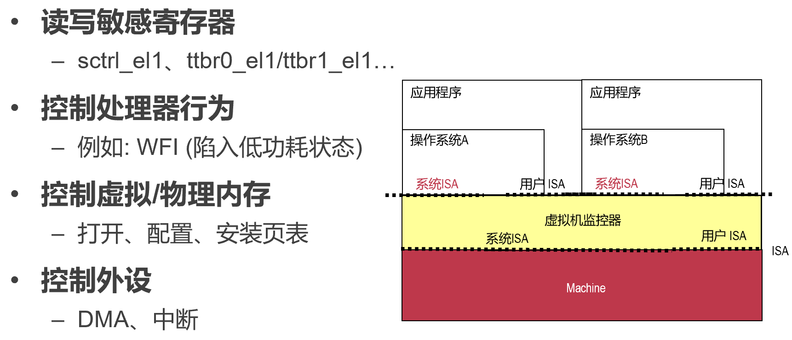
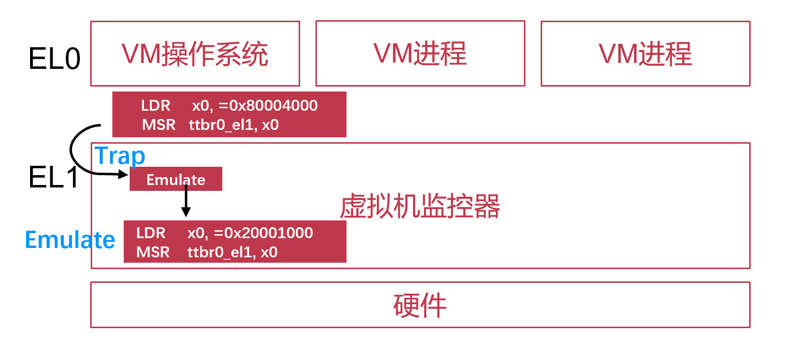
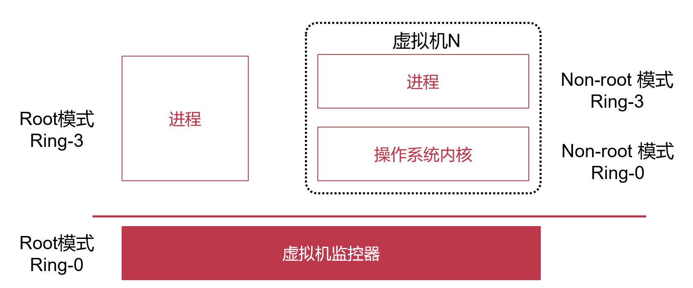
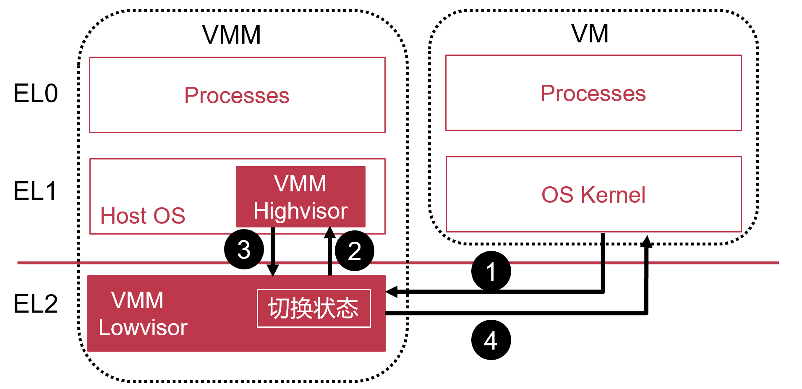
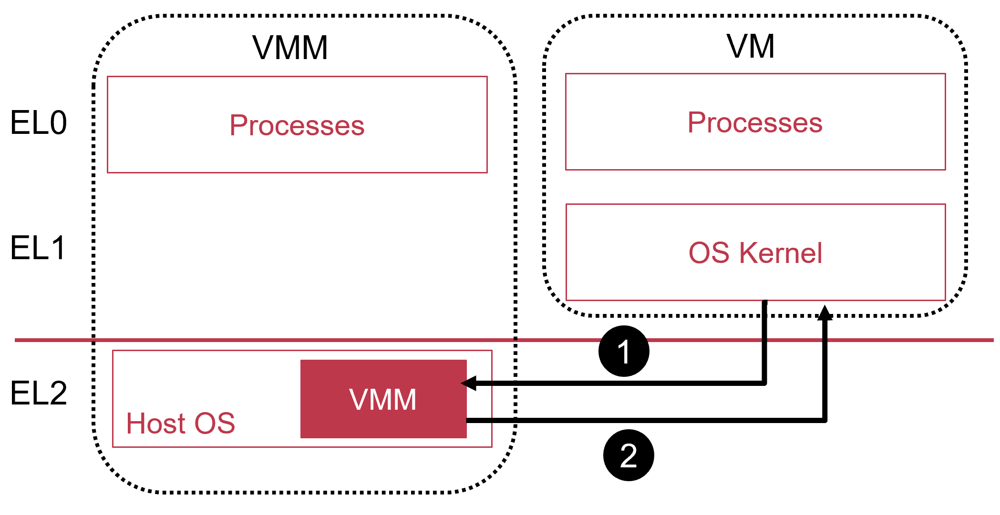
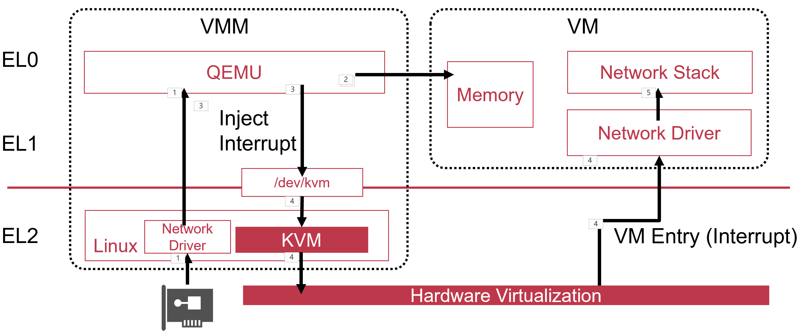
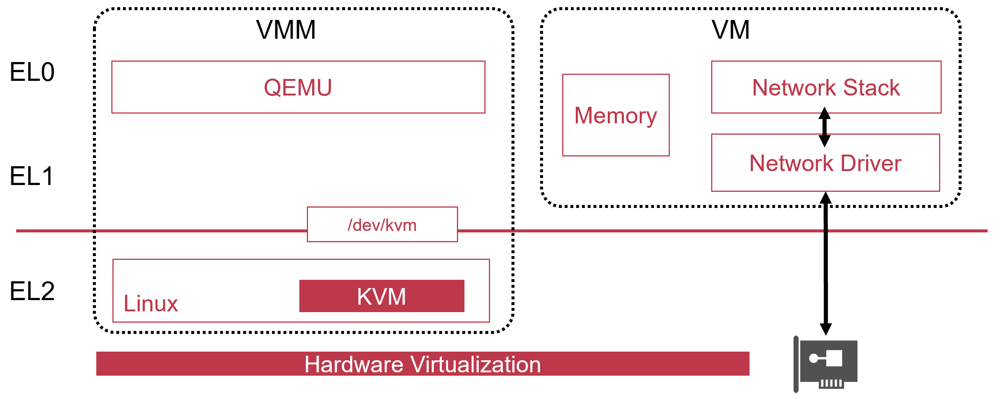
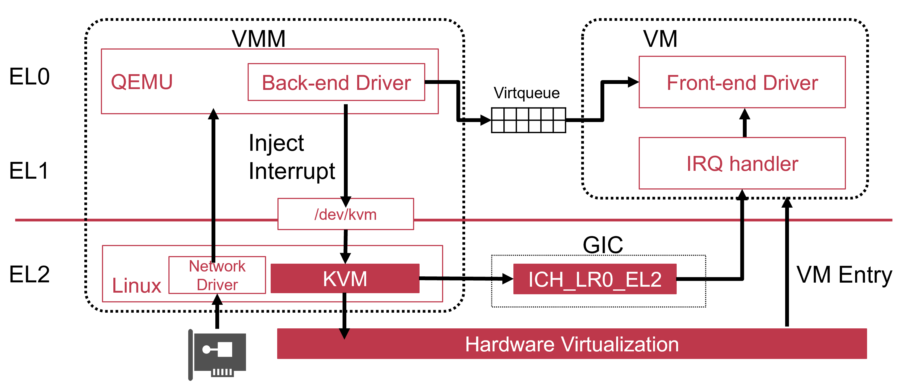
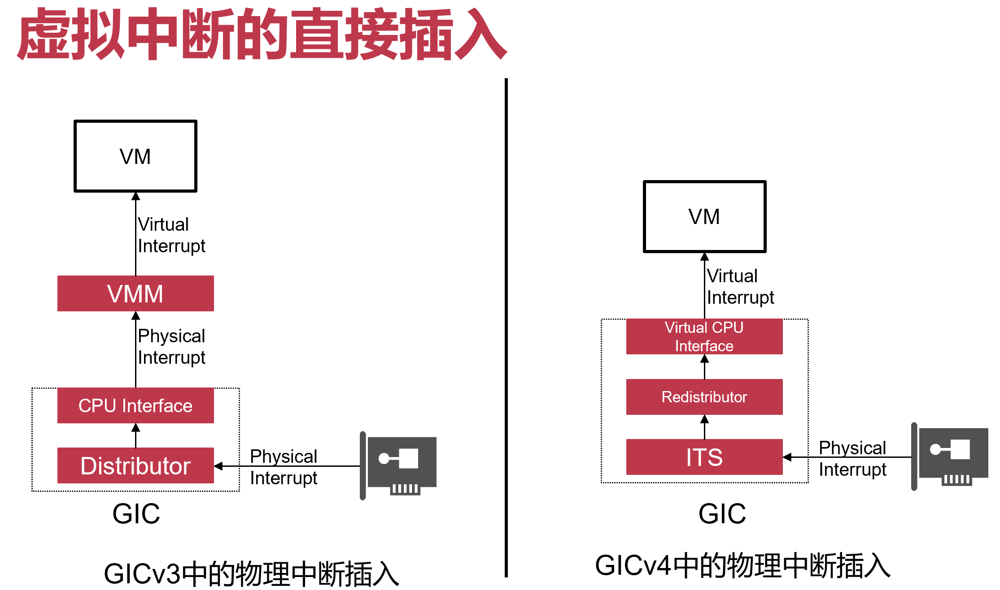
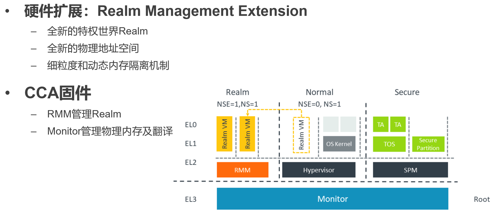

# 虚拟化

[TOC]

# 系统虚拟化

操作系统实际上也是一种虚拟化：对硬件的虚拟化，相当于让操作系统上层的应用以为自己是独占硬件

**计算设备集中与分散的变化**

大型机（集中式计算资源，所有用户通过网络连接大型机，共享计算资源）→ PC（分布式计算资源，每个PC用户独占计算资源）→ 云（集中式计算资源，所有人通过网络连接，共享计算资源）

共享计算资源的方法：

- 分时复用
- 系统虚拟化

**系统虚拟化是云计算的核心支撑技术**

新引入的一个软件层（虚拟化层），上层是操作系统+应用（虚拟机），底层是硬件；与上层软件解耦，上层软件可在不同硬件之间切换

**虚拟化优势**

本质：增加了一层新的抽象

> "*Any problem in computer science can be solved by another level of indirection*" 																									--- **David Wheeler**

1. 服务器整合：提高资源利用率
   - 单个物理机资源利用率低，利用系统虚拟化进行资源整合（一台物理机同时运行多台虚拟机）
2. 方便程序开发
   - 调试操作系统，测试应用程序的兼容性（可以在一台物理机上同时运行在不同的操作系统）；可以随时查看修改虚拟硬件的状态
3. 简化服务器管理
   - 通过软件接口管理虚拟机（创建、开机、关机、销毁），虚拟机热迁移（方便物理机器的维护和升级）

## 操作系统中的接口层次

- ISA层 Instruction Set Architecture（操作系统与硬件之间的）：指令集架构，硬件对上提供的接口；区分硬件和软件
  - 用户ISA：用户态和内核态程序都可以使用，如 `mov x0, sp`，`add x0, x0, #1`
  - 系统ISA：只有内核态程序可以使用（敏感资源的接口），如 `msr vbar_el1, x0`；应用程序通过调用 syscall 使用这些敏感资源
- ABI层 Application Binary Interface：提供操作系统服务或硬件功能，包含用户ISA和系统调用
  - 如操作系统对上提供的 syscall
- API层 Application Programming Interface（应用程序调的）：不同用户态库提供的接口
  - 包含库的接口和用户ISA
  - 如UNIX环境中的clib：支持UNIX/C编程语言


## 系统虚拟化的标准

高效系统虚拟化的三个特性

- 为虚拟机内程序提供与该程序原先执行的硬件**完全一样的接口**
- 虚拟机只比在无虚拟化的情况下**性能略差一点** 
- 虚拟机监控器**控制所有物理资源**（但是为了性能，现在也允许虚拟机直接访问物理资源）

## 虚拟机和虚拟机监控器

### 如何定义虚拟机?

从操作系统角度看"Machine"：ISA 提供了操作系统和Machine之间的界限

### 虚拟机监控器 (VMM/Hypervisor)

向上层虚拟机暴露其所需要的ISA**（对上层不同虚拟机提供不同ISA接口）**，可同时运行多台虚拟机 (VM)

#### 虚拟机监控器的分类

- **Type-1虚拟机监控器：**VMM直接运行在硬件之上（驱动如果不支持，就跑不起来，只能换硬件）

  - 充当操作系统的角色，直接管理所有物理资源
    - 实现调度、内存管理、驱动等功能
  - 性能损失较少（可以针对性性能优化）
  - 例如Xen, VMware ESX Server

  

- **Type-2虚拟机监控器：**VMM依托于主机操作系统（基于Host OS）（复用主机的驱动等）

  - 主机操作系统管理物理资源
  - 虚拟机监控器以进程/内核模块的形态运行
  - 易于实现和安装
  - 例如：QEMU/KVM

  

  - 优势
    - 在已有的操作系统之上将虚拟机当做应用运行
    - 复用主机操作系统的大部分功能（如文件系统，驱动，处理器调度，物理内存管理等）

## 如何实现系统虚拟化?

### 系统ISA：操作系统运行环境



希望虚拟机跑在用户态进程（用户态不能接触的部分，需要虚拟机监控器来管！）

- 虚拟机监控器主要需要关注系统ISA

### 系统虚拟化的流程：<u>Trap & Emulate</u>

- Trap：在用户态EL0执行特权指令将陷入EL1的VMM中
- Emulate：这些指令的功能都由VMM内的函数实现



每当执行某种特殊 system ISA 时，都会下陷 Trap，之后由内核 VMM 模拟（如上VM希望写页表基地址 `MSR ttbr0_el1, x0`，这是 system ISA，在这一瞬间会触发 Trap 进入内核，内核会判断该写是否合法，合法则会真的执行指令的功能）

- 第一步（Trap）
  - 捕捉所有系统ISA并陷入/下陷
- 第二步（Emulate）
  - 由具体 system ISA 指令实现相应虚拟化
    - 控制虚拟处理器行为
    - 控制虚拟内存行为
    - 控制虚拟设备行为
- 第三步
  - 回到虚拟机继续执行


### 系统虚拟化技术

- 处理器虚拟化：捕捉系统ISA，控制虚拟处理器的行为
- 内存虚拟化：提供“假”物理内存的抽象
- 设备虚拟化：提供虚拟的I/O设备

### 虚拟化：一种直接的实现方法


## 虚拟化功能

虚拟机VM放用户态，虚拟机监控器VMM放内核态

前提：用户态调用特权指令，就一定会触发异常，发生下陷

### 第一版：支持只有内核态的虚拟机

虚拟机只在内核态运行简单代码

**VM的能力**

- 只支持一个 VM
- 没有内核态与用户态的切换
- 只有内核态，且仅运行用户ISA的指令（与用户态没有区别）

**VMM的实现**

- 处理时钟中断造成的 VM Exit（类似于时间片到了，用户态到内核态，切换线程）


### 第二版：支持虚拟机内部的时钟中断

**VM的能力**

- 设置irq_handler（中断处理程序）
- 配置时钟中断寄存器（多久触发一次）
- 开关时钟中断 (寄存器 irq_bit 设为1，表明可以接收中断)：有控制是否希望接收/屏蔽中断的能力
- 运行时钟中断处理函数：真的中断后，硬件要有帮忙调用对应写好的中断处理程序的能力

**VMM的实现**

- 捕捉VM对irq_handler的修改
- 捕捉VM对irq_bit的修改
- 根据irq_bit决定插入虚拟时钟中断vIRQ并调用irq_handler（ret后还要让控制流回去）


**正常无虚拟化时中断的流程**（有 Host 中包括 handler，以及 Thread）

1. irq_bit为1时，接收到中断，硬件会把控制流转换给irq_handler
2. 之后handler需要保存上下文（硬件寄存器和内存内容都是下陷之前的状态，handler处理完之后还都要恢复回去！）
3. 执行handler处理函数
4. handler加载恢复上下文
5. 返回到原控制流

**虚拟化时的中断流程**

1. irq_bit为1时，硬件接收到中断，会把控制流转换给内核态VMM
2. 进入VMM对应的中断处理函数handler，保存上下文
3. 插入虚拟时钟中断，调用对应handler
4. 加载恢复上下文（原本控制流的上下文，而不是handler处理函数所在位置的上下文，“内核”不需要保存上下文！），此时handler看到的状态就是下陷的一瞬间的上下文
5. 之后handler需要保存上下文
6. 执行handler处理函数
7. handler加载恢复上下文（用户态状态，而不是虚拟机中内核的状态，虚拟机中内核不需要保存状态，出来后丢掉即可）
8. 进入 VMM，保存上下文
9. 离开 VMM，恢复上下文
10. 返回到原控制流

**VMM的逻辑**

```shell
int reason // 记录下陷原因

save_context // 保存上下文

switch(reason){
	case(...): ...	// 调用对应的处理函数
	case(...): ...
	...
}

restore_context // 恢复上下文

struct VM_CTX {
	int user_node // 区分这个 VM 跑的是用户/操作系统内核
	ctx // 寄存器状态
};
```

### 第三版：支持虚拟机内单一用户态线程

- 需要维护用户态与内核态VM的特权区别：VMM里面用一个bit，来表明现在跑的是用户态还是内核态
- 用户态调 system ISA，VMM发现无对应权限，就往内核态VM插入fault，告诉它用户态想干非法事情
- 用户态调 syscall，VMM就转发给内核态VM，之后内核态VM做相应操作

**VM的能力**

- 虚拟机包含内核态与用户态
- 用户态运行一个用户态线程
  - U-Thread
- 用户态线程可调用内核syscall
- 用户态线程可被时钟中断打断

**VMM的实现**

- 捕捉并转发U-Thread系统调用syscall
- 转发syscall至VM内核
- 捕捉并转发U-Thread执行时的时钟中断


### 第四版：支持虚拟机内多个用户态线程

VM 内核态内部有多个context，内部也要有相应的调度机制和策略

**VM的能力**

- 用户态运行多个用户态线程
- 内核可调度用户态线程

**VMM的实现**

- 与第三版相同


**Fork bomb（VM用户态线程不断 Fork）是否会影响VMM？**

不会！多了线程只是在虚拟机内部多了 runqueue 的 entry，也就只是多了内存；只需要限制内核态 VM 的内存使用量，就没什么影响

### 第五版：支持多个虚拟机间的分时复用

**VM的能力**

- 支持多个VM

**VMM的实现**

- 每个VM对应一个 VMM 内核线程
- 维护VM_runqueue队列
  - 每个元素对应一个VM的运行状态
- 由VMM实现VM间切换
  - 保存和恢复VM寄存器


### 第六版：支持多个物理CPU

**VM的能力**

- 与第五版相同

**VMM的实现（基于第五版）**

- 为每个pCPU维护不同的VM_runqueue（每个核维护自己的 runqueue）


### 第七版：支持多个虚拟CPU

**VM的能力（与第六版的区别）**

- 虚拟机有多个Virtual CPU (vCPU)
- vCPU 是一种软件抽象

**VMM的实现**

- 在VM_runqueue中标记出VM和vCPU的类型
  - VMM内核态维护某个VM的vCPU的context
  - 调度的单位是vCPU（VM类似于进程，vCPU类似于线程；类似一个进程里面多个线程，调度的是线程，不关心一个进程里面究竟有多少线程）
    - 用户期待这些 vCPU 能够同时运行，但是实际上不是“同时”跑


> 虚拟化中的锁：内核中如果使用了spinlock，拿锁后如果对应的vCPU被虚拟机监控器调度走了，那么别的等锁的人spin的时间会大大增加

# 处理器虚拟化

## ARM不是严格的可虚拟化架构

- 敏感指令
  - 读写特殊寄存器或更改处理器状态
  - 读写敏感内存：例如访问未映射内存、写入只读内存
  - I/O指令
- 特权指令
  - 在用户态执行会触发**异常**，并陷入内核态

在ARM中：不是所有敏感指令都属于特权指令**（不是所有 system ISA 在用户态执行的时候会触发 Trap！不会到“内核”中，也即 VMM 内核态不知道发生了什么）**

- 例子: CPSID/CPSIE指令
  - CPSID和CPSIE分别可以关闭和打开中断
  - 内核态执行：PSTATE.{A, I, F} 可以被CPS指令修改
  - 在用户态执行：CPS 被当做NOP指令，不产生任何效果
    - 不是特权指令

## 如何处理这些不会下陷的敏感指令？

处理这些不会下陷的敏感指令，使得虚拟机中的操作系统能够运行在用户态（EL-0）

- 方法1：解释执行
- 方法2：二进制翻译
- 方法3：半虚拟化
- 方法4：硬件虚拟化（改硬件）

### 方法1：解释执行

不直接运行代码；把代码全部当成数据，一条条拿出来看（每一条指令都 fetch-decode-execute），来进行模拟

- 使用软件方法一条条对虚拟机代码进行模拟
  - 不区分敏感指令还是其他指令
  - 没有虚拟机指令直接在硬件上执行
- 使用内存维护虚拟机状态（自己假装成硬件，需要维护伪硬件状态）
  - 例如：使用uint64_t x[30]数组保存所有通用寄存器的值


1. 看当前内部维护的PC值
2. 从维护的内存里去找对应代码，拿出来，根据 decode 的结果去调用内部维护的这些 execute 的函数
3. 在 execute 过程中会不断读写内存，修改虚拟机状态
4. 更新 PC 值，之后执行下一条

**案例**


**优缺点**

- 优点：
  - 解决了敏感函数不下陷的问题
  - **可以模拟不同ISA的虚拟机**（比如可以在X86物理机上模拟ARM虚拟机）
  - 易于实现、复杂度低
- 缺点：
  - **非常慢**：任何一条虚拟机指令都会转换成多条模拟指令

### 方法2：二进制翻译

先翻译，再执行

- 提出两个加速技术
  - 在执行前**批量翻译**虚拟机指令（提前把需要处理的指令翻译成能够下陷的指令，其他不相关的不管直接忽略）
  - **缓存**已翻译完成的指令
- 使用基本块(Basic Block)的翻译粒度
  - 每一个基本块被翻译完后叫代码补丁

> 基本块(Basic Block)：从头执行到尾，中间没有 if while 等等循环和条件判断


**二进制翻译的 Basic Blocks**


`cli`：关中断	`sti`：开中断	`cr3`：x86 页表基地址

**二进制翻译举例**


比较重要的指令进行翻译（翻译成准备好的函数调用），之后为了性能也可以展开 call


**缺点**

- 不能处理自修改的代码(Self-modifying Code)
- 中断插入粒度变大
  - 模拟执行可以在任意指令位置插入虚拟中断
  - **二进制翻译时只能在基本块边界插入虚拟中断**（翻译完之后块内部的指令不会下陷，都是直接call准备好的函数，不会再下陷通知VMM；只有下陷的时候才会看到有什么中断）

### <u>方法3：半虚拟化 (Para-virtualization)</u>

把用户态不能够下陷的代码换了，直接调用 VMM 提供的接口

- 协同设计
  - 让VMM提供接口给虚拟机，称为**Hypercall**
  - **修改操作系统源码，让其主动调用VMM接口**
- **Hypercall可以理解为VMM提供的系统调用**
  - 在ARM中是HVC指令
- 将所有不引起下陷的敏感指令替换成超级调用
- batch：对于需要下陷的操作，不是一个一个做，而是等一批来了之后，再进行处理

如 Xen

**优缺点**

- 优点：
  - 解决了敏感函数不下陷的问题
  - 协同设计的思想可以提升某些场景下的系统性能
    - I/O等场景
- 缺点：
  - 需要修改操作系统代码，难以用于闭源系统
  - 即使是开源系统，也难以同时在不同版本中实现

### <u>方法4：硬件虚拟化（改硬件）</u>

- x86和ARM都引入了全新的虚拟化特权级
- x86引入了root模式和non-root模式
  - Intel推出了VT-x硬件虚拟化扩展
  - Root模式是最高特权级别，控制物理资源
  - VMM运行在root模式，虚拟机运行在non-root模式
  - 两个模式内都有4个特权级别：Ring0~Ring3
- ARM引入了EL2
  - VMM运行在EL2
  - EL2是最高特权级别，控制物理资源
  - VMM的操作系统和应用程序分别运行在EL1和EL0

#### Intel VT-x

##### VT-x的处理器虚拟化

把已有的用户态和内核态砍成两半，增加 Root 和 Non-root 模式



X86中内核态Ring0，用户态Ring3

|        | Root                 | Non-root            |
| ------ | -------------------- | ------------------- |
| 用户态 | VMM 管理 Tool 部分等 | 虚拟机 Guest App    |
| 内核态 | VMM                  | 虚拟机 Guest Kernel |

- **虚拟机 Guest Kernel 中发生的任何 system ISA 都会 trap 下来，从 Non-root 模式 trap 到 root 模式内核态（VMM），VMM 通过 switch 处理后，返回虚拟机 Guest Kernel**
- 一些优化：虚拟机 Guest Kernel 在 non-root 模式下配置页表 CR3 不需要下陷（VMM 与 虚拟机 Guest Kernel 有各自的 CR3，下陷时硬件需要负责保存/恢复 CR3，保存恢复的位置？VMCS）
- Non-root 虚拟机 Guest App 调用 syscall 会直接下陷到虚拟机 Guest Kernel（除非设置对应 bit）
- 一个时刻一个核只能有一个mode（要么Root，要么Non-root）

##### Virtual Machine Control Structure (VMCS) ：硬件自动存/取状态，减少下陷带来的cycle性能开销

整个系统起来之后，VMM会提供给硬件的内存页（4KB）作为VMCS：记录与当前VM运行相关的所有状态（比如寄存器）

- VM Entry
  - 硬件自动将当前CPU中的VMM状态保存至VMCS
  - 硬件硬件自动从VMCS中加载VM状态至CPU中
- VM Exit
  - 硬件自动将当前CPU中的VM状态保存至VMCS
  - 硬件自动从VMCS加载VMM状态至CPU中

包含6个部分

- Guest-state area：发生VM exit时，CPU的状态会被硬件自动保存至该区域；发生VM Entry时，硬件自动从该区域加载状态至CPU中
- Host-state area：发生VM exit时，硬件自动从该区域加载状态至CPU中；发生VM Entry时，CPU的状态会被自动保存至该区域
- VM-execution control fields： 控制Non-root模式中虚拟机的行为
- VM-exit control fields：控制VM exit的行为
- VM-entry control fields：控制VM entry的行为
- VM-exit information fields：VM Exit的原因和相关信息（只读区域）

##### VT-x的执行过程

事件驱动的设计


1. 启动虚拟机 VMLAUNCH
2. 虚拟机发生下陷，VM Exit，到 VMX Root

**<u>每一个跑的 VM 的 vCPU 都会有一个 VMCS</u>**

> **8个核，上面10个VM虚拟机，每个虚拟机4个vCPU，需要多少VMCS？**
>
> VMCS为vCPU服务（保存的是寄存器状态，每个vCPU都有自己的一套寄存器），有多少vCPU就有多少VMCS；需要 4*10 = 40 个（当然如果内存紧张，就8个，因为只有8核）


#### ARM的虚拟化技术

##### ARM的处理器虚拟化


- **EL2 专门为运行 VMM 准备**
- 每一层 EL 都有自己的一套寄存器（_ELX结尾），也即在VM与VMM之间切换时，不需要再有硬件来把寄存器状态存储/恢复（因为切换特权级后不会覆盖原本的寄存器，留着原本特权级的寄存器不动即可）
  - 当然如果在多个VM之间切换时（类似于线程切换），还是需要保存上下文，因为VM都运行在相同特权级，并且共用寄存器

##### ARM的VM Entry和VM Exit

- VM Entry
  - 使用ERET指令从VMM进入VM
  - 在进入VM之前，VMM需要主动加载VM状态
    - VM内状态：通用寄存器、系统寄存器、
    - VM的控制状态：HCR_EL2、VTTBR_EL2等
- VM Exit
  - 虚拟机执行敏感指令或收到中断等
  - 以Exception、IRQ、FIQ的形式回到VMM
    - 调用VMM记录在vbar_el2中的相关处理函数
  - 下陷第一步：VMM主动保存所有VM的状态

##### ARM硬件虚拟化的新功能

- ARM中没有VMCS
- VM能直接控制EL1和EL0的状态
  - 自由地修改PSTATE(VMM不需要捕捉CPS指令)
  - 可以读写TTBR0_EL1/SCTRL_EL1/TCR_EL1等寄存器
- VM Exit时VMM仍然可以直接访问VM的EL0和EL1寄存器

缺点：需要依赖已有的 Host OS

- 为什么不把 Host OS 的内核从 EL1 拉到 EL2 的 VMM？
  - 需要修改 Host OS 的内核
- 现在需要从用户态 VM 的 EL1 kernel 先到 VMM，再到 Host OS 的 EL1 kernel

##### HCR_EL2寄存器简介

- HCR_EL2：VMM控制VM行为的系统寄存器
  - VMM有选择地决定VM在某些情况时下陷
  - 和VT-x VMCS中VM-execution control area类似
- 在VM Entry之前设置相关位，控制虚拟机行为

##### ARMv8.0

- 增加EL2特权级
- EL2只能运行VMM，不能运行一般操作系统内核
  - OS一般只使用EL1的寄存器，在EL2中不存在对应的寄存器
    - EL1：TTBR0_EL1、TTBR1_EL1
    - EL2：TTBR_EL2
  - EL2不能与EL0共享内存
- 因此：无法在EL2中运行Type-2虚拟机监控器的Host OS
  - 或者说，Host OS需要大量修改才能运行在EL2

##### ARMv8.0中的Type-2 VMM架构



- KVM/ARM Lowvisor：运行在EL2，功能简单，只负责进行状态保存/恢复和转发（捕捉虚拟机下陷和进行状态切换，存寄存器在内存上），和配置 EL2 层才能配置的寄存器

性能不好

##### ARMv8.1中的Type-2 VMM架构

- ARMv8.1
  - 推出Virtualization Host Extensions(VHE)，在HCR_EL2.E2H打开（一个 bit）
    - 寄存器映射
    - 允许与EL0共享内存
  - **使 EL2 中可直接运行未修改的操作系统内核（Host OS）**


- 打开 E2H bit 之后，可以在 `_EL2` 里面用 `_EL1` 寄存器，硬件会自动把 `_EL1` 寄存器翻译成 `_EL2` 



性能好，结构简单

#### VT-x和VHE对比

|                                    | **VT-x**                 | **VHE**            |
| ---------------------------------- | ------------------------ | ------------------ |
| 新特权级                           | Root和Non-root           | EL2                |
| 是否有VMCS？                       | 是                       | 否                 |
| VM  Entry/Exit时硬件自动保存状态？ | 是                       | 否                 |
| 是否引入新的指令？                 | 是(多)                   | 是(少)             |
| 是否引入新的系统寄存器?            | 否(需要冗余的保存和恢复) | 是(多) (EL2寄存器) |
| 是否有扩展页表(第二阶段页表)?      | 是                       | 是                 |

#### Type-1和Type-2在VT-x和VHE下架构


## 案例：QEMU/KVM

**QEMU**

最初目标是在非x86机器上使用动态二进制翻译技术模拟x86机器，之后能模拟出多种不同架构的虚拟机

- 初始阶段QEMU一直使用软件方法进行模拟，如二进制翻译技术
- QEMU 0.10.1开始使用KVM (Kernel-based Virtual Machine)，以替代其软件模拟的方案

### QEMU/KVM架构

VM 和 QEMU 一一对应，一个 QEMU 直接管理一个 VM

- QEMU运行在用户态，负责实现策略
  - 提供设备模拟
  - 也提供虚拟设备的支持
  - 如虚拟机要多少内存，几个vCPU，几个设备
- KVM以Linux内核模块运行，负责实现机制
  - 可以直接使用Linux的功能，与内核交互
  - 例如内存管理、进程调度、捕捉虚拟机下陷
  - 使用硬件虚拟化功能
- 两部分合作
  - KVM捕捉所有敏感指令和事件，传递给QEMU
  - KVM不提供设备的虚拟化，需要使用QEMU的虚拟设备

**3 个 switch case**

- 内核态 KVM 为用户态的 QEMU 提供接口（syscall），如 linux 里的 ioctl
  - 调用 syscall 后进入 KVM，KVM通过 switch case 处理 syscall
- 内核态 KVM 捕捉虚拟机运行过程中的下陷：如运行完，想要回到 QEMU，发 VM_EXIT；I/O 等
  - 硬件会先保存状态到 VMCS，之后找下陷处理函数（KVM提供），需要 handler 中也有 switch case
- 用户态 QEMU 的 switch：内核态的 KVM 如果 switch case 处理不完，会把控制权转交给 QEMU

**<u>进程和虚拟机对应，线程和vCPU对应</u>**

### QEMU使用KVM的用户态接口（文件接口）

QEMU使用/dev/kvm与内核态的KVM通信

- 使用ioctl向KVM传递不同的命令：CREATE_VM, CREATE_VCPU, KVM_RUN等

```c
open("/dev/kvm")
ioctl(KVM_CREATE_VM)
ioctl(KVM_CREATE_VCPU)
while (true) {
     ioctl(KVM_RUN)	// Invoke VMENTRY
     exit_reason = get_exit_reason();
     switch (exit_reason) {
       case KVM_EXIT_IO:  /* ... */
         break;
       case KVM_EXIT_MMIO: /* ... */
         break;
     }
}
```

**如何创建多个vCPU？**

pthread_create 创建多个 pthread，每个 thread 的 worker function 运行自己的 vCPU 代码

### ioctl(KVM_RUN)时发生了什么

- x86中：KVM加载vCPU对应的VMCS，VMLAUNCH/VMRESUME进入Non-root模式
- ARM中：KVM主动加载VCPU对应的所有状态，使用eret指令进入虚拟机，开始执行


### QEMU/KVM的流程


为什么有的不 return to user：并不是所有的下陷都需要回到用户态；如时钟中断到了，处理完就调度走了，不会再回去

### 例：WFI指令VM Exit的处理流程

WFI：进入低功耗状态/等待中断（切换线程）


### 例：I/O指令VM Exit的处理流程


# 内存虚拟化 Memory Virtualization

前提：能够捕捉到特殊指令的下陷

**为什么需要内存虚拟化 ?**

内核会以为自己独占物理内存，并且直接看到的是物理地址，基于此向上层提供虚拟地址的抽象；但是显然要在一台机器上运行多台虚拟机，不可能让一个物理机上的各个虚拟机互相看到对方的内存，也即不可能让虚拟机看到真实的物理地址

**需要再加一层，提供虚拟的物理地址！**

- 操作系统内核直接管理物理内存
  - 物理地址从0开始连续增长
  - 向上层进程提供虚拟内存的抽象
- 如果VM使用的是真实物理地址

## 内存虚拟化的目标

- 为虚拟机提供虚拟的物理地址空间
  - 物理地址从0开始连续增长
- 隔离不同虚拟机的物理地址空间
  - VM-1无法访问其他的内存

## 三种地址

- 客户虚拟地址(Guest Virtual Address, GVA)
  - 虚拟机内进程使用的虚拟地址，通常说的虚拟地址
- **客户物理地址(Guest Physical Address, GPA)** [VMM管理]
  - 虚拟机内使用的“假”物理地址
- 主机物理地址(Host Physical Address, HPA) [VMM管理]
  - 真实寻址的物理地址
  - GPA需要翻译成HPA才能访存

## 怎么实现内存虚拟化?

1. 影子页表(Shadow Page Table)
2. 直接页表(Direct Page Table)
3. 硬件虚拟化：目前使用最多

### 影子页表 (Shadow Page Table)

一个进程就要有一个影子页表！


但是真的在 MMU 里面翻译，只能有一个页表（硬件只有一套页表基地址寄存器，要实现两套地址翻译）！需要合二为一

- MMU 实际上只知道虚拟地址翻译到物理地址，而不管究竟地址的逻辑意义；给页表就能翻译
- 最终页表**直接把 GVA 翻译成 HPA**（即**影子页表 SPT**，对 Guest 不可见）

#### 2个页表 → 1个页表

1. 安装页表，把页表的基地址写入 CR3（VMM intercepts guest OS setting the virtual CR3）【敏感操作 system ISA，VMM不会让写，会被 VMM trap；知道发生下陷的虚拟地址，也即可以通过页表查，知道这个虚拟地址对应的内存处的指令内容，就可以知道下陷的原因】
2. VMM 发现页表状态是 GPT；VMM iterates over the guest page table, constructs a corresponding shadow page table
3. GPA 翻译成 HPA；In shadow PT, every guest physical address is translated into host physical address
4. 合成装载到真页表上；Finally, VMM loads the host physical address of the shadow page table

真正用来寻址的 **Shadow Page Table 的设置**（构建 SPT）

```c
set_cr3 (guest_page_table):
    for GVA in 0 to 220	// 遍历每一个 GVA
        if guest_page_table[GVA] & PTE_P:	// 如果这个虚拟地址对应的 P 位（这个页表项有效）是 1
            GPA = guest_page_table[GVA] >> 12
            HPA = host_page_table[GPA] >> 12	// 找对应的 HPA
            shadow_page_table[GVA] = (HPA<<12)|PTE_P	// 4K，左移12位，构建真的 SPT
        else
            shadow_page_table[GVA] = 0
     CR3 = PHYSICAL_ADDR(shadow_page_table)	// SPT 物理基地址填入 CR3
```

#### Guest OS修改页表，如何生效？

- 如用户态进程触发缺页异常，需要分配物理页并填上页表对应项
- 但是 Guset OS 修改页表时候改的是 GPT（不能直接修改 SPT），而实际使用的页表是 SPT

**解决**

每次 Guest OS 想要修改页表的时候 Trap（给页表 GPT 所在的那块内存的内存页设置只读权限！只要 Guest OS 只要写，就会发生 Trap 到内核态）

配置 SPT 设置页表 GPT 所在的那块内存的内存页为只读权限（因为此时硬件真实使用的页表是 SPT）

**如何知道希望写入的新地址和值：**通过寄存器传递（一个寄存器里面是希望写入的地址，另一个里面是希望写入的值，在下陷的一瞬间被保存上下文）

#### Guest内核如何与Guest应用隔离？

整个虚拟机中的用户态/内核态都跑在 user 态，都共用一个页表 SPT；也即和虚拟机内核态相关的页表，虚拟机用户态也可以访问！

**解决**

- 两个影子页表；VM用户态访问使用用户态影子页表（只映射用户态进程的所有虚拟地址），VM内核态访问使用内核态影子页表（内核用户态都包含）

### 直接页表 (Direct Page Table)：半虚拟化

GuestOS 知道它运行在虚拟化环境里面

不再需要维护 SPT，GuestOS 在地址空间内能够建立地址映射范围只有某一段，GuestOS 在构建的时候会注意这一点

- GuestOS 填写页表的时候直接就构建好了 GVA 到 HPA 的映射，直接管理 HPA 空间（不再需要 GPA）
- CR3 指向 GPT

**GuestOS 直接管理页表，权限如何控制？**（可能会把映射恶意建立到别的 VM 地址空间）

- GuestOS 不能直接写 CR3，页表实际上还是由 VMM 直接管理。GuestOS 需要通过调用 **hypercall** 告诉 VMM 需要修改页表，如果 VMM 检查发现合法，就修改；非法或越权，则返回错误

**优缺点**

优点：

- Easy to implement and more clear architecture
- Better performance: guest can batch to reduce trap

缺点：

- Guest 知道了额外的信息，自己的内存被放在哪个 HPA 上
  - May use such info to trigger *rowhammer* attacks（硬件缺陷产生的 bug）
- Not transparent to the guest OS（GuestOS 知道它运行在虚拟化环境里面）
- hypercall 有开销


### 硬件虚拟化对内存翻译的支持

两个页表（硬件支持，可以多一个页表），一个 GPT，一个 HPT；也有新寄存器存新的页表的基地址

- Intel VT-x和ARM硬件虚拟化都有对应的内存虚拟化（GPA 到 HPA）
  - Intel Extended Page Table (EPT)
  - ARM Stage-2 Page Table (第二阶段页表)
- 新的页表
  - 将GPA翻译成HPA
  - 此表被VMM直接控制
  - **每一个VM有一个对应的页表**（HPT是每个虚拟机VM一个），不再像影子页表一样需要每个进程一个

#### 第二阶段页表

第一阶段页表：虚拟机内虚拟地址翻译（GVA->GPA）

第二阶段页表：虚拟机客户物理地址翻译（GPA->HPA）


**第二阶段页表项**


**VTTBR_EL2**

`VTTBR_EL2`：ARM中存储虚拟机第二阶段页表基地址的寄存器

- 对比第一阶段页表有2个页表基地址寄存器：`TTBR0_EL1`、`TTBR1_EL1`
- VMM在调度VM之前需要在 `VTTBR_EL2` 中写入此VM的第二阶段页表基地址
- 第二阶段页表使能HCR_EL2第0位

#### 翻译过程

**普通4级页表访问，需要4次内存访问；那么第二阶段页表加入之后，总共需要几次内存访问？**

24次（1次约100 cycle）

- 第一阶段页表每个页表项里面存储的是 GPA，要先经过第二阶段页表的翻译（4次访存）才能拿到HPA，读出真正物理地址，找到下一级页表
- 第一行四次内存访问，其余每一行五次内存访问


#### TLB：缓存地址翻译结果

TLB不仅可以缓存第一阶段地址翻译结果，TLB也可以第二阶段地址翻译后的结果

- 包括第一阶段的翻译结果(GVA->GPA)
- 包括第二阶段的翻译结果(GPA->HPA)
- 大大提升GVA->HPA的翻译性能：不需要24次内存访问

切换 `VTTBR_EL2` 时，理论上应将前一个VM的TLB项全部刷掉

**TLB 刷新**

- VMID (Virtual Machine IDentifier)
  - VMM为不同进程分配8/16 VMID，将VMID填写在VTTBR_EL2的高8/16位
  - VMID位数由VTCR_EL2的第19位（VS位）决定
  - **避免刷新上个VM的TLB**

#### 如何处理缺页异常

- 两阶段翻译的缺页异常分开处理（影子页表和直接页表都是放在一块处理的）

- 第一阶段缺页异常（整个过程 VMM 不知道）

  - 直接调用VM的Page fault handler
  - 修改第一阶段页表**不会**引起任何虚拟机下陷

- 第二阶段缺页异常

  - 虚拟机下陷，直接调用VMM的Page fault handler

  - **什么时候会发生第二阶段缺页异常？**

    - 1. 虚拟机访问GPA，但是这个GPA在页表里面没有映射

      2. 有映射，但是权限不够

  - VMM 支持 **swapping 换页机制**（如何实现虚拟机级别的内存换页？）

    - 具体场景：将虚拟机A的128MB内存转移到虚拟机B中；虚拟机A对内存的使用较少，虚拟机B对内存需求较大

    - 问题：

      - 选哪一页换出来？LRU等
      - VMM无法识别虚拟机内存的语义（虚拟机VM内部的换页机制对于内存使用的上层语义更清楚）
      - 两层内存换页机制，冗余，并且VM自己的OS与VMM的换页机制可能彼此冲突，造成开销
        - 如 VMM 先把某一页换出去，之后 VM 发现也想把这一页换出去（现在就得先读这一页的内存，实际上 VMM 那一块页表又 pagefault，把对应页换回来）

    - 更好的换页机制：**内存气球机制**（减一层抽象）

      - Upcall（VMM 调用 VM 的接口，向上层调用）

      - 在 VM 中装一个驱动，驱动接到 VMM 要内存的请求，驱动会调用 kmalloc（此时如果内存不足，会触发 VM 的 OS 内部的 swapping），等 VM 的 OS 分配好之后，把分配出来的内存信息告诉 VMM

      - 同样的，当还回内存之后，驱动会调用 free

      - swapping 完全交给 VM 的 OS 的策略

      - 问题：慢（要通知驱动等）

        

        

#### 第二阶段页表的优缺点

- 优点
  - VMM实现简单
  - 不需要捕捉Guest Page Table的更新
  - 减少内存开销：每个VM对应一个页表
- 缺点
  - TLB miss时性能开销较大


# I/O虚拟化 I/O Virtualization

> 内存虚拟化是I/O虚拟化的支撑

操作系统内核管理外部设备：

- PIO/MMIO
- DMA 大量数据传输
- Interrupt 设备通知 CPU

**为什么需要I/O虚拟化**

如果VM能直接管理物理设备，所有 VM 都能直接访问物理设备，可能不正确（比如共享网卡，不知道哪个包是哪个 VM 的）；以及安全性问题，恶意VM可以直接读取其他VM的数据

## I/O虚拟化的目标

- 为虚拟机提供虚拟的外部设备（每个虚拟机看到独立的设备），虚拟机正常使用设备
- 隔离不同虚拟机对外部设备的直接访问，实现I/O数据流和控制流的隔离
- 提高物理设备的利用资源，多个VM同时使用，可以提高物理设备的资源利用率

## 怎么实现I/O虚拟化?

1. 设备模拟（Emulation）：纯软件方式，透明（性能要求不高时）
2. 半虚拟化方式（Para-virtualization）：提供全新接口，不透明
3. 设备直通（Pass-through）：性能好，需要特殊硬件设备，透明

### 设备模拟（Emulation）


- OS与设备交互的硬件接口
  - 模拟寄存器(中断等)
  - 捕捉MMIO操作
- 硬件虚拟化的方式
  - 硬件虚拟化捕捉PIO指令
  - MMIO对应内存在第二阶段页表中设置为invalid

**<u>没有虚拟化时对设备的操作模式</u>**

如使用网卡发包

1. OS 把网络包的数据放进队列（**写数据**）
2. OS 通过 **MMIO** 写内存，**通知设备**数据已经放好
3. 设备从队列里面**读数据**
4. 设备做完之后，向 OS 发**中断**，告知已经完成

**<u>有虚拟化时对设备的操作模式</u>**

OS 与网卡之间多了VMM

1. OS把网络包数据放进队列（OS与VMM之间的）（写数据）
2. OS 写 VMM 一个故意漏空的 GPA（OS以为这是虚拟设备的MMIO的地址范围），OS往对应地址写的时候发生缺页异常
3. VMM根据上面的虚拟设备地址范围，把OS给的数据放到新的位置（VMM与设备网卡之间的）
4. VMM 通过 MMIO 通知设备数据已放好
5. 设备从对应位置读数据
6. 设备做完之后，向 VMM 发中断，告知已经完成
7. VMM 向 OS 发虚拟中断（调用OS中断处理函数）

#### QEMU/KVM设备模拟

**以虚拟网卡举例——发包过程**


1. 虚拟机 VM 把准备发送的网络包数据放进内存 Memory
2. Driver 想要去访问模拟网卡的设备，本质上就是发生 VM Exit 下陷（page fault）
3. 虚拟化下陷被 KVM 捕捉，KVM 拿到下陷看到是某个网卡的地址范围，不在自己的管理范围中，将其转给 QEMU
4. QEMU 在自己内部运行模拟虚拟网卡的代码，读 VM 的内存拿到虚拟机想发的网络包数据
5. QEMU 使用 socket 的系统调用发送包（之后就是用户态进程发包的流程）

- QEMU 怎么直接读虚拟机内存：VM 和 QEMU 一一对应，一个 QEMU 直接管理一个 VM（所有 VM 的内存本质上是 QEMU malloc 出来的，之后它告诉 KVM 把这些内存与 VM 绑定）（QEMU的虚拟地址是 HVA）
  - VM 底下页表的映射：GPA 到 HPA，由 VMM 管理，第二阶段页表
  - QEMU 底下页表的映射：HVA 到 HPA，第一阶段页表
- 通过 socket 发包不经过网络协议栈，而是直接走 Network Driver（6）？是 RAW 类型的 socket

**以虚拟网卡举例——收包过程**



1. 数据来，先写到 QEMU
2. QEMU 把数据写到虚拟机内存
3. QEMU 插入中断（通过调 KVM 提供的命令）
4. KVM 经过硬件虚拟化给虚拟机插入中断
5. 虚拟机处理中断

#### 设备模拟的优缺点

- 优点
  - 可以模拟任意设备
    - 选择流行设备，支持较“久远”的OS（如e1000网卡）
  - 许在中间拦截（Interposition）:
    - 例如在QEMU层面检查网络内容
  - 不需要硬件修改
- 缺点
  - 性能不佳

### 半虚拟化方式（Para-virtualization）

解决设备模拟的性能问题

打破虚拟机抽象，让虚拟机知道自己使用的是特殊接口的设备

- 协同设计
  - 虚拟机“知道”自己运行在虚拟化环境
  - 虚拟机内运行前端(front-end)驱动
  - VMM内运行后端(back-end)驱动
- VMM主动提供Hypercall给VM
- 通过共享内存传递指令和命令

**VirtIO: Unified Para-virtualized I/O**

- 标准化的半虚拟化I/O框架
  - 通用的前端抽象
  - 标准化接口
  - 增加代码的跨平台重用


**Virtqueue**

VM和VMM之间传递I/O请求的队列

#### QEMU/KVM半虚拟化

**发网络包**

比上一种快：可以**批量处理** batch，一次可以发很多；相较于上面（发一个包的过程中就有好几次下陷）更快


1. 虚拟机告诉 Front-end Driver 说要发网络包
2. Front-end Driver 把数据的基本信息（告诉两边该去哪里找数据）放到 Virtqueue 里（真实数据仍旧在VM内存里）
3. 控制流继续，由KVM转发，直到 QEMU 中 Back-end Driver
4. Back-end Driver 根据 Virtqueue 里的信息去内存拿数据
5. QEMU 通过 syscall 把数据发出去

**收网络包**


#### 半虚拟化方式的优缺点

- 优点
  - 性能优越
    - 多个MMIO/PIO指令可以整合成一次Hypercall
  - VMM实现简单，不再需要理解物理设备接口
- 缺点
  - 需要修改虚拟机操作系统内核

### 设备直通（Pass-through）

虚拟机直接管理物理设备：设备直接交给虚拟机管理，每个虚拟机拥有独一份的设备（设备不共享！需要买虚拟机数量的硬件物理设备），虚拟机里面直接安装对应设备的驱动



#### 问题1：DMA恶意读写内存


DMA使用的地址是物理地址（DMA过程绕开CPU，无法经过MMU翻译，也因此DMA使用的地址是物理地址！），会直接往对应物理地址写，可能会直接写别的虚拟机的地址！

**解决方案：使用IOMMU（主板上加硬件）**


每一个设备想要访问的内存都要经过IOMMU的检查合法性（VMM告诉它每个设备能访问的地址范围，检查页表，如果是对应虚拟机的，就让访存）

**ARM SMMU**

SMMU是ARM中IOMMU的实现，也存在两阶段地址翻译

- 第一阶段：OS为进程配置：IOVA->GPA
- 第二阶段：第一阶段翻译完之后进行第二阶段，VMM为VM配置：GPA->HPA 

#### IOMMU与MMU


- 右侧是CPU看到的，每一个虚拟地址都经过MMU里的翻译过程，找访存的物理地址
- 左侧是设备看到的，访存都经过IOMMU，其中的页表由特权软件配置

#### 问题2：设备独占

一个设备希望给多个虚拟机同时用（Scalability不够，设备被VM-1独占后，就无法被VM-2使用；导致如果一台物理机上运行16个虚拟机，必须为这些虚拟机安装16个物理网卡）

**Single Root I/O Virtualization (SR-IOV)**

- SR-IOV是PCI-SIG组织确定的标准，满足SRIOV标准的设备，在设备层实现设备复用
- 一个硬件设备可以把自己变成很多份，向外暴露多个接口，每一份分别给一个虚拟机（此过程不需要 VMM 参与）；硬件内部实现隔离
  - 能够创建多个Virtual Function(VF)，每一个VF分配给一个VM
    - 负责进行数据传输，属于数据面（Data-plane）
  - 物理设备被称为Physical Function(PF)，由Host管理
    - 负责进行配置和管理，属于控制面（Control-plane）

#### 设备直通的优缺点

- 优点
  - 性能优越
  - 简化VMM的设计与实现
- 缺点
  - 需要特定硬件功能的支持（IOMMU、SRIOV等）
  - **不能实现Interposition**：难以支持虚拟机热迁移（设备数据通路都不经过VMM，VMM根本不知道设备对虚拟机做了什么事情）

## I/O虚拟化技术对比

|                  | **设备模拟** | **半虚拟化** | **设备直通** |
| ---------------- | ------------ | ------------ | ------------ |
| 性能             | 差           | 中           | 好           |
| 修改虚拟机内核   | 否           | 驱动+修改    | 安装VF驱动   |
| VMM复杂度        | 高           | 中           | 低           |
| Interposition    | 有           | 有           | 无           |
| 是否依赖硬件功能 | 否           | 否           | 是           |
| 支持老版本OS     | 是           | 否           | 否           |

# 中断虚拟化

- VMM在完成I/O操作后通知VM
  - 例如在DMA操作之后
- VMM在VM Entry时插入虚拟中断
  - VM的中断处理函数会被调用
- 虚拟中断类型
  - 时钟中断
  - 核间中断
  - 外部中断

## ARM中断虚拟化的实现方法

- 插入中断时打断虚拟机执行（先让虚拟机停下来）
  - 通过List Register插入（利用硬件功能）
  
    
  
    `ICH_LR0_EL2`：寄存器，VMM 写这个寄存器，其中包括中断号的信息，之后 eret 到 VM，VM 读，硬件根据寄存器里面的中断号自动调用对应的 IRQ handler（有这个硬件扩展之后，性能更好）
  
    物理中断来了之后，先造成虚拟机 VM Exit，之后下陷到 KVM 处理，最后再通知处理这个中断的虚拟机，让其开始执行
  
  - VMM eret 之后直接跳到 VM 的对应 handler：需要 KVM 手动设置
- 插入中断时不打断虚拟机执行

  - 通过GIC ITS插入

    - GIC第4版本推出了Direct injection of virtual interrupts 

      - 将物理设备的物理中断与虚拟中断绑定（设备触发的物理中断是有中断号的，虚拟机中看到的虚拟中断需要绑定这个号）

      - 物理设备直接向虚拟机发送虚拟中断（两种中断之间的转换和虚拟中断的插入全部由硬件操作）

        

    - VMM在运行VM前

      - 配置GIC ITS (Interrupt Translation Service)，建立物理中断与虚拟中断的映射
      - 映射内容
        - 设备与物理中断的映射
        - 分配虚拟中断号
        - 发送给哪些物理核上的虚拟处理器

# 机密虚拟化 Confidential Virtualization

更安全的保护虚拟化时云上用户的数据

## 虚拟机监控器不可信

虚拟机监控性不可信的主要原因：系统的复杂性

- 系统的复杂性
  - 软件：恶意软件，虚拟机监控器本身可能存在漏洞
  - 人：运维外包（如云计算等）导致接触计算机的人更复杂
- 不可信的虚拟机监控器
  - 可以查看任意虚拟机的vCPU寄存器、内存内容、I/O数据
  - 可以修改虚拟机的状态
    - VMM控制着页表，可直接映射虚拟机的内存并读取数据
  - 可以控制虚拟机的行为
    - VMM控制着页表，可直接在应用内部新映射一段恶意代码
    - VMM可任意改变虚拟机的RIP，劫持其执行流

**虚拟机监控器漏洞的危害**

- 虚拟机提权(Privilege Escalation)：VM 控制了 VMM，把自己的特权级提升，就可以干非法行为，比如访问其它 VM
- 隐私数据泄露(Data Leakage)：通过各种手段让 VMM 把其它 VM 的数据暴露出来
- 拒绝服务攻击(Denial of Service)：把 VMM 弄挂了，其它虚拟机也跑不了了（机密虚拟化不能防止这个）

## 一种新的威胁模型：安全处理器

核心思想：管理和安全的解耦

- 不信任CPU外的硬件：包括内存（DRAM）、设备、网络
- 仅信任CPU：包括cache、所有计算逻辑（Anyway，总得信任CPU吧...）

## Enclave/TEE：可信执行环境

**Enclave（飞地）：**又称为可信执行环境，TEE（Trusted Execution Environment）

- 硬件创造的可信执行环境

> Enclave，又称"可信执行环境" （TEE，Trusted Execution Environment），是计算机系统中一块通过底层软硬件构造的安全区域，通过保证加载到该区域的代码和数据的完整性和隐私性，实现对代码执行与数据资产的保护 —— *Wikipedia*

**Enclave的两个主要功能**

- 远程认证：验证远程节点是否为加载了合法代码的Enclave（让用户确认自己确实在用Enclave）
- 隔离运行：Enclave外无法访问Enclave内部的数据

**Enclave带来的能力：限制访问数据的软件**

- 可保证数据只在提前被认证的合法节点间流动
  - 合法节点：部署了合法软件的节点

### 硬件Enclave提供不同粒度的隔离环境


## 机密虚拟化：虚拟机粒度

一种通过基于硬件的可信执行环境来保护虚拟机数据的机制和方法，保护虚拟机免受不可信虚拟机监控器和管理员的威胁

**关键技术**

- 虚拟机内部与外部的隔离
- 内存加密和完整性保护
- 远程验证

### 可信固件

需要硬件扩展，本来 VM 与 VMM 之间可以直接交互，现在必须经过一层可信固件的转发；同时只有可信固件能和硬件物理资源交互，VMM 要请求可信固件从而管控物理硬件

- 由CPU厂商开发的可信软件，比虚拟机监控器的特权级更高
- 可信固件能够访问所有物理资源，对系统进行配置并提供保护机制
- 在 VM 与 VMM 之间引入一层 Firmware/Shim 可信固件，所有访问都需要经由可信固件的转发


### 内存隔离机制

内存隔离：机密虚拟机的内存范围不能被其他虚拟机和虚拟机监控器访问

### 硬件内存加密与保护机制

- 硬件加密保护**隐私性**（攻击者直接看数据）
  - CPU外皆为密文，包括内存、存储、网络等
  - CPU内部为明文，包括各级Cache与寄存器
  - 数据进出CPU时，由进行加密和解密操作
- 硬件Merkle Tree保护**完整性**（攻击者把数据位置等进行恶意改变）
  - 对内存中数据计算一级hash，对一级hash计算二级hash，形成树
  - CPU内部仅保存root hash，其它hash保存在不可信的内存中
  - 当内存中的数据被修改时，更新Merkle Tree

#### 硬件内存加密

- 方法一：单密钥加密（所有内存里面的数据都使用同一个密钥加密）
  - 缺点：同样的明文会产生同样的密文，攻击者可以通过不断尝试来反推明文
- 方法二：多密钥加密（如每一个页用一个密钥）
  - 缺点：如何保存这些密钥？CPU内部放不下
- 方法三：单密钥 + 多 seed
  - 为每个cache line单独生成一个seed，用密钥加密后，对数据进行异或

##### 生成seed用于加密


- seed 由三部分组成，物理内存页的 LPID + 全局 cnt（发生一次内存访问就加一）+ 这一次内存物理地址的 offset
- seed 会经过 private key 进行加密生成加密 pad，之后和 L3 cache 里面的明文做异或，生成最终要放到内存里面的数据
- 不是对 cache 里面的数据进行加密，而是准备好一个已经加密过的数据，之后和用户正在使用的数据做异或（实际上时间瓶颈只在异或的部分，前序流程可以和内存访问同步做）

每一个缓存行都有 seed（对seed也要加密，之后和）

#### 内存完整性保护

- 内存数据的完整性保护：机密虚拟机的内存数据不可被恶意修改
- 内存映射的完整性保护：机密虚拟机的第二阶段页表映射不可被恶习改变

**内存数据完整性保护**

- **Merkle hash Tree**（Intel）
  - 可以保证内存不会受到拼接和欺骗攻击
    - 不知道hash key无法计算对应的mac
  - 无法防御回放攻击
    - 攻击者可以将mac和data同时替换成老版本
- 将root hash (mac) 存储在CPU中
  - 防御回放攻击
    - 攻击者无法修改root mac的值

根据页建树的层次化结构：每一个 4K 页计算出一个 hash 值（叶子节点），一层一层往上算 hash（两两加起来）；最后如果根节点的 hash 被修改，就说明内存数据被修改


### 远程验证（Remote Attestation）

**要解决的问题：如何远程判断某个主体是机密虚拟机？**

- 例如，如何判断某个在云端的服务运行环境是安全的
- 必须在认证之后，再进行下一步的操作，例如发送数据

用户可以发起一个认证请求，丢给远程服务器，服务器拿到随机数之后，固件会把这个随机数还有别的信息用 CPU 内部的密钥进行 hash，生成数字签名

## 机密虚拟化案例分析：ARM CCA

**ARM TrustZone 技术**


**ARM Confidential Compute Architecture**



Realm：跑机密虚拟机

**世界状态World State和内存隔离**


# 虚拟化的技术对比

| 虚拟化 | 软件方案                                                     | 硬件方案                           |
| ------ | ------------------------------------------------------------ | ---------------------------------- |
| CPU    | •Trap & Emulate  •指令解释执行  •二进制翻译  •Para-virtualization | •EL-2 (ARM)                        |
| 内存   | •Shadow page table  •Separating page tables for U/K  •Para-virtualization: Direct paging | •Stage-2 PT (ARM)                  |
| I/O    | •Direct I/O  •设备模拟  •Para-virtualization: Front-end & back-end driver (e.g., virtio) | •SMMU (ARM) / IOMMU (x86)  •SR-IOV |

# 轻量级隔离

**云厂商普遍用虚拟化来隔离**

- 虚拟化的优势
  - 可以运行完整的软件栈，包括不同的操作系统
  - 灵活的整体资源分配（支持动态迁移）
  - 方便的添加、删除、备份（只需文件操作）
  - 虚拟机之间的强隔离（能抵御 fork bomb ）
- 虚拟化的问题：太重
  - 云：性能损失，尤其是I/O虚拟化（并不是所有都能支持设备直通）
  - 用户：两层操作系统导致资源浪费（机制重复实现不仅浪费，两层机制之间还可能发生冲突）

**需要更轻量级的隔离**

- 多用户机制
  - 如：Windows Server允许多个用户，同时远程使用桌面
  - 多个用户可以共享一个操作系统，同时进行不同的工作
- 缺点：多个用户之间缺少隔离
  - 例如：所有用户共同操作一个文件系统根目录
- 如何想让每个用户看到的文件系统视图不同？
  - 对每个用户可访问的文件系统做隔离

## chroot

**文件系统视图的隔离**：为每个执行环境提供单独的文件系统视图（把进程能看到的“根目录”给修改了，它看不到这个伪“根目录”之上的父目录）

原理：Unix系统中的“一切皆文件”设计理念

方法：改变文件系统的根目录，即chroot

效果：

- 控制进程能够访问哪些目录子树
- 改变进程所属的根目录
- 进程只能看到根目录下属的文件

### Chroot原理

进程只能从根目录向下开始查找文件（操作系统内部修改了根目录的位置）

**简单的设计**

- 内核为每个用户记录一个根目录路径
- 进程打开文件时内核从该用户的根目录开始查找

一个用户想要使不同进程有不同的根目录怎么办？类似“..”的路径怎么处理？

**Chroot在Linux中的实现**

- 特殊检查根目录下的“..”，使得“/..”与“/”等价，无法通过“..”打破隔离
- 每个进程TCB都指向一个root目录，一个用户可以对多个进程chroot

### 使用Chroot

- 需要root权限才能变更根目录（也意味着chroot无法限制root用户）

- 确保chroot有效（使用setuid消除目标进程的root权限）

  ```
  chdir(“jail”);
  chroot(“.”);
  setuid(UID); // UID > 0
  ```

### 基于Name Space的限制

- 通过文件系统的name space来限制用户
  - chroot只是在文件名字符串匹配层面限制了访问；如果用户直接通过inode访问，则可绕过
  - 不允许用户直接用inode访问文件
- 其它层也可以限制用户
  - 例如：inode层可以限制用户


### Chroot能否实现彻底的隔离？

不能。不同的执行环境想要共享一些文件怎么办？涉及到网络服务时会发生什么？（所有执行环境共用一个IP地址，所以无法区分许多服务）执行环境需要root权限该怎么办？（全局只有一个root用户，所以不同执行环境间可能相互影响）

## Linux container (LXC)

本质上是一个进程，如果不做隔离，它可以使用OS提供的所有资源和服务；希望做比进程更强的资源隔离（如不同container可以用相同名字的IPC object，可以有PID号相同的的进程，可以同时使用标号相同的端口......）

- 基于容器的轻量级虚拟化方案：由Linux内核提供资源隔离机制
- 安全隔离：基于*namespace*机制（视图隔离）
- 性能隔离：Linux cgroup（资源隔离）


### Linux Namespace (NS)

- 每种NS封装一类全局资源，进程只能访问封装后的局部资源（目前一共有七种NS）
- 进程通过系统调用控制NS


#### 1、Mount Namespace

容器内外可部分共享文件系统

> 如果容器内修改了一个挂载点会发生什么？

假设主机操作系统上运行了一个容器

1. 主机OS准备从/mnt目录下的ext4文件系统中读取数据
2. 容器中进程在/mnt目录下挂载了一个xfs文件系统
3. 主机操作系统可能读到错误数据

**Mount Namespace的实现**

- 设计思路：在内核中分别记录每个NS中对于挂载点的修改；访问挂载点时，内核根据当前NS的记录查找文件
- **每个NS有独立的文件系统树**：新NS会拷贝一份父NS的文件系统树，修改挂载点只会反映到自己NS的文件系统树


#### 2、IPC Namespace

**不同容器内的进程若共享IPC对象会发生什么？**

假设有两个容器A和B；A中进程使用名为“my_mem”共享内存进行数据共享，B中进程也使用名为“my_mem”共享内存进行通信；B中进程可能收到A中进程的数据，导致出错以及数据泄露

**IPC Namespace的实现**

- 使每个IPC对象只能属于一个NS
  - 每个NS单独记录属于自己的IPC对象
  - 进程只能在当前NS中寻找IPC对象


即使不同NS的共享内存ID均为 my_mem → 不同的共享内存

#### 3、Network Namespace

**不同的容器共用一个IP会发生什么？**

假设有两个容器均提供网络服务，两个容器的外部用户向同一IP发送网络服务请求，主机操作系统不知道该将网络包转发给哪个容器

**Linux对于多IP的支持**

- 在虚拟机场景下很常见
  - 每个虚拟机分配一个IP
    - IP绑定到各自的网络设备上
  - 内部的二级虚拟网络设备
    - br0: 虚拟网桥（类似于路由器）
    - tap: 虚拟网络设备（端口，新的“设备”）
    - eth0：虚拟机内部假的虚拟网卡


**实际上相当于在内核中，用软件的方式模拟了路由器和网络相关硬件做的事情，实现一个机器里面多个 IP**

包从外部发过来，进到br0，由br0实现包的进一步分发到具体哪个VM

> 如何应用到容器场景？

**Network Namespace的实现**

- 每个NS拥有一套独立的网络资源，包括IP地址、网络设备等
- 新NS默认只有一个loopback设备，其余设备需后续分配或从外部加入


创建相连的veth虚拟设备对（如veth0和veth1），一端加入NS即可连通网络，分配IP后可分别与外界通信（如veth0变为eth0），包来了之后如果 IP 是 192.168.2.2，就会发给 veth1，其会将包自动转发给 eth0

#### 4、PID Namespace

进程号 PID

**容器内进程可以看到容器外进程的PID会发生什么？**

假设有容器内存在一个恶意进程，恶意进程向容器外进程发送SIGKILL信号，主机操作系统或其他容器中的正常进程会被杀死

**PID Namespace的设计**

- 直接的想法：将每个NS中的进程放在一起管理，不同NS中的进程相互隔离

- 存在的问题：进程间关系如何处理（比如父子进程）？

- 更进一步：允许父NS看到子NS中的进程，保留父子关系


**PID Namespace的实现**

对NS内外的PID进行单向隔离：外部能看到内部的进程，反之则不能

外面能发信号给里面，里面不能发给外面


子NS中的进程在父NS中也有PID，进程只能看到当前NS的PID，子NS中的进程无法向外发送信号

#### 5、User Namespace

**容器内外共享一个root用户会发生什么？**

假设一个恶意用户在容器内获取了root权限，恶意用户相当于拥有了整个系统的最高权限，可以窃取其他容器甚至主机操作系统的隐私信息，可以控制或破坏系统内的各种服务

**User Namespace的实现**

> Linux Capability：对于不同能力的操作权限；每个进程需要什么权限，就给什么 capability；可以使用 capability 对容器能干的事情进行细粒度限制

- 对NS内外的UID和GID进行映射
  - 允许普通用户在容器内有更高权限：基于Linux Capability机制
  - 容器内root用户在容器外无特权：只是普通用户


普通用户在子NS中是root用户

**进一步限制容器内Root**

如果容器内root要执行特权操作怎么办？

- insmod？一旦允许在内核中插入驱动，则拥有最高权限
- 关机/重启？整个云服务器会受影响

1、从内核角度来看，仅仅是普通用户

2、限制系统调用：Seccomp机制

#### 6、UTS Namespace

- 每个NS拥有独立的hostname等名称
- 便于分辨主机操作系统及其上的多个容器

#### 7、Cgroup Namespace

- cgroupfs的实现向容器内暴露cgroup根目录
- 增强隔离性：避免向容器内泄露主机操作系统信息
- 增强可移植性：取消cgroup路径名依赖

### Linux cgroup 性能隔离

对每个容器运行过程中的资源实际使用量进行限制

**Control Cgroups (Cgroups)**

Linux内核（从Linux2.6.24开始）提供的一种资源隔离的功能

- Cgroups可以将线程分组，对每组线程使用的多种物理资源进行监控和限制
- 名为cgroupfs的伪文件系统提供了用户接口

> 伪文件系统：如访问 /cgroups/cpu，访问这个文件时候，实际上是在和内核对应的数据结构进行通信（内核实现对应接口，存拿对应数据结构信息），不是真正的文件系统，只是使用了文件系统的接口！
>
> 使用类似文件系统的路径可以存结构化数据，可以有组织的暴露数据（/proc/cpuinfo/id）

#### Cgroups的常用术语

- 任务（task）
- 控制组（cgroup）
- 子系统（subsystem）
- 层级 （hierarchy）

##### 任务（Task）

任务就是系统中的一个线程

##### 控制组（Control Group）

Cgroups是进行资源监控和限制的单位，是任务的集合（cgroup可以包含多个task）

##### 子系统（subsystem）

可以跟踪或限制控制组使用该类型物理资源的内核组件，也被称为资源控制器（如 cpu，cpuacct，memory）

##### 层级 （hierarchy）

- 由控制组组成的树状结构
- 通过被挂载到文件系统中形成
- 一个任务在每个层级结构中只能属于一个控制组
- 一个子系统只能附加于一个层级结构
- 一个层级结构可以附加多个子系统（也即 cpu 和 memory 可以共用 memory 底下的包含 cgroup 2 与 3 的层级结构）


#### 资源控制模型

- 最大值（当没有别人用的时候不能超出自己的最大值）
  - 直接设置一个控制组所能使用的物理资源的最大值，例如：
    - 内存子系统：最多能使用1GB内存
    - 存储子系统：最大能使用100MB/s的磁盘IO
- 比例（当没有别人用的时候可以超出自己的最大比例）
  - 设置不同控制组使用同一物理资源时的资源分配比例，例如：
    - 存储子系统：两个控制组按照1：1的比例使用磁盘IO资源
    - CPU子系统：两个控制组按照2：1的比例使用CPU时间

#### 如何对任务使用资源进行监控和限制

- Cgroups进行监控和限制的单位是什么？
  - 控制组
- 如何知道一个控制组使用了多少物理资源？
  - 计算该控制组所有任务使用的该物理资源的总和
- 如何限制一个控制组
  - 使该控制组的所有任务使用的物理资源不超过这个限制
  - 在每个任务使用物理资源时，需要保证不违反该控制组的限制

#### 子系统

##### CPU子系统

- CFS（完全公平调度器）
  - 可以为每个任务设定一个“权重值”
  - “权重值”确定了不同任务占用资源的比例
- CPU子系统允许为不同的控制组设定CPU时间的比例
  - 直接利用CFS来实现按比例分配的资源控制模型
  - 为控制组设定权重：向cpu.shares文件中写入权重值（默认1024）

##### 内存子系统

- 监控控制组使用的内存

  - 利用page_counter监控每个控制组使用了多少内存

- 限制控制组使用的内存

  - 通过修改memory.limit_in_bytes文件设定控制组最大内存使用量

- Linux分配内存首先需要charge同等大小的内存

  - 只有charge成功，才能分配内存

- Charge内存的简化代码（大小为nr_pages）：

  ```c
  new = atomic_long_add_return(nr_pages, &page_counter->usage);
  if (new > page_counter->max) {
  	atomic_long_sub(nr_pages, &page_counter->usage);
      goto failed;
  }
  ```

- 释放内存时会执行相反的uncharge操作

##### 存储子系统（blkio）

- 限制最大IOPS/BPS
  - blkio.throttle.read_bps_device 限制对某块设备的读带宽
  - blkio.throttle.read_iops_device 限制对某块设备的每秒读次数
  - blkio.throttle.write_bps_device 限制对某块设备的写带宽
  - blkio.throttle.write_iops_device 限制对某块设备的每秒写次数
- 设定权重（weight）
  - blkio.weight 该控制组的权重值
  - blkio.weight_device 对某块设备单独的权重值

# 隔离的不同方式

- 物理机隔离：一台物理机一个单位
- 虚拟机隔离：一台机子上创建多个强隔离单位
- 机密虚拟机隔离：安全性限制更好
- 文件系统隔离：Chroot
- 容器隔离：Name Space
- 进程隔离：传统方式
- 性能隔离：Cgroup

# 隔离的不同粒度

资源利用率和隔离能力的 trade off

- 进程隔离：既没有资源视图的隔离，也没有性能隔离

- 容器隔离：进程组，有资源视图的隔离和性能隔离（使用的资源有很长的调用链，很难每个都考虑到，比如 cache 等）

- 虚拟机隔离：只需要提供CPU，memory和设备，不需要提供其它更高层次的抽象

- 物理机隔离：不可能有别人占用你的设备

由上至下隔离越来越强