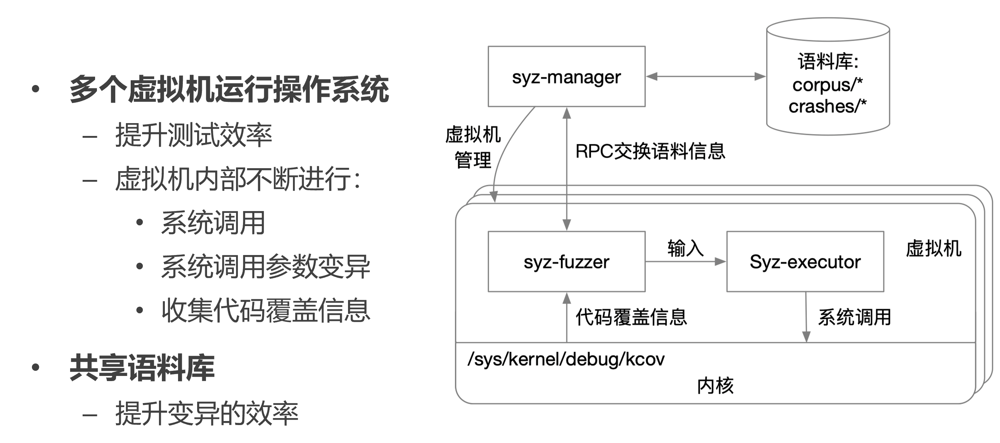

# OS Debug

[TOC]

# 调试器 GDB

## 调试器的基本原理

定位和修复BUG，帮助程序员理解程序行为

**基本功能**

- 中断程序运行读取内部状态
- 获取程序异常退出原因
- 动态修改软件状态
- 控制流追踪

### 建立调试关系

Linux的调试支持：ptrace系统调用

GDB建立调试控制关系

1. 子进程通过 PTRACE_TRACEME 将调试权交给父进程
2. 通过 PTRACE_ATTACH 调试指定pid的进程

### GDB捕捉异常信号流程

## 配置断点

需求：停止进程运行，用以观察进程状态

- 发送SIGINT至进程
- 或断点：在执行到特定指令地址时停止运行

### 断点的硬件支持

- 断点异常指令
  - 在执行到特定指令时，触发断点异常陷入内核
  - x86的int 3指令，AArch64的BKP指令
- 单步调试
  - 程序在用户态执行一条指令后立即陷入内核
  - 通过特殊寄存器配置：x86的Trap Flag，AArch64的Software Step

### GDB配置断点及断点触发

- 本来这段代码（包括断点位置原本代码）是只读的，OS需要将其变为可写的
- 将原本代码保存下来，并将对应位置替换为断点指令（如 int 3）

### GDB断点恢复运行

执行到这行代码时会将断点指令替换回原本代码；之后等执行完代码后，再替换回断点指令

## 配置内存断点

需求：变量遭到异常修改时中断运行

方案：内存断点（watch 监控某个变量的值）

### 内存断点的硬件支持

**断点寄存器**

当访存地址为寄存器中的值时，触发断点异常

把变量地址写到断点寄存器中，每次访问（读/写）任何内存地址时，CPU硬件都会去判断这个地址和断点寄存器中存的地址是否一样，一样就判断访存条件，看是否需要通知

## 远程调试

- GDB客户端负责指令发送
  - GDB远端串行协议（GDB Remote Serial Protocol，RSP）
  - 通过串口线、网络等连接传输控制指令
- GDB stub 负责实际调试

# 操作系统的调试器支持

**调试操作系统调试支持的难点**

- 缺乏操作系统提供给用户态的调试功能支持（在调OS本身，没人来帮忙做平常OS做的事情）
- 硬件相关问题，如外部设备、页表等

**模拟器**

- 虚拟机：完整模拟底层硬件，在模拟器中提供GDB stub
- 用户态模拟：例如 User-mode Linux，忽略硬件相关的实现，使Linux内核以普通进程的方式运行

**内核自身实现的调试器**

- 操作系统内部实现GDB stub，如Linux的KGDB

## 案例：QEMU的GDB支持

把 linux 跑在 QEMU 里面，其实就基本相当于把 linux 跑在用户态

- 与调试普通进程对比
  - 不再有进程抽象相关的支持（如signal和系统调用跟踪）
  - ptrace相关接口替换为虚拟机管理接口
    - 如内存读写由PTRACE_POKETEXT替换为直接读写虚拟机内存（假设hypervisor能直接访问虚拟机内存）
- 挑战
  - 不能干扰客户机操作系统内部使用调试功能（外面在调试，里面也在）
  - 断点指令失效
    - 动态代码装载覆写断点指令使断点失效

### QEMU GDB的断点支持

步骤4：QEMU判断是本身虚拟机内部跑了GDB改的int3（这种情况会向虚拟机内部注入中断，让虚拟机自己处理），还是QEMU自己换的int3

**断点指令相关问题**

跑在QEMU里面的OS重加载代码片段（kexec），把QEMU之前替换代码断点中写的int 3覆盖掉了，断点失效

解决方法：硬件断点

- 指令地址等于断点寄存器即触发中断
- 缺点：影响虚拟机内部使用硬件断点

# 性能调试

程序功能性正确，但性能未达到理想情况

**分析程序性能瓶颈**

- 程序运行时哪部分代码耗时较长
- 哪部分内存发生较多缓存缺失
- 跳转指令是否发生大量错误预测

## 实际性能调试样例

- 分析 hackbench 测试用例执行时的性能瓶颈
  - Hackbench: Linux Test Project 中的调度测试之一
  - 多个进程相互使用socket读写进行同步

**步骤一：确定内核执行中耗时较长的函数**（采样）

- 在可能的代码路径上插桩获取时间，统计时间占比最长的部分
- 缺点：大量修改内核代码，统计复杂，通用性极低

**解决：硬件计数器**

- 监控程序执行过程中处理器发生某些事件的次数

  - E.g., 执行指令数量，各级缓存缺失（cache miss）次数

- 使用方法1: 获取事件发生次数

  - 设置事件类型，打开计数器
  - 一段时间后读取计数器
    - 用户态通过特定指令或系统调用读取
  - 使用该方法分析 hackbench 性能瓶颈仍需大量插桩，意义不大
  - 直接读取计数缺点：可能涉及对原有代码修改（插桩）

- 使用方法2: 采样

  思想：在时间段上均匀“打孔”，最后看每个函数上孔多少，依据此判断各个函数执行时间比例

  - 设置事件类型，打开计数器
  - 当计数器溢出时，产生中断
    - 在中断处理中获取地址信息
    - 清空计数器，等待下一次中断
  - 分析 hackbench 性能瓶颈：每经过一定cycle数触发一次中断，统计中断时指令地址，观察这些地址属于哪些函数
  - 中断时收集信息的缺陷
    - 采样获取的指令地址不准确
      - 中断发送需要时间，CPU收到中断时的指令地址，与产生采样点指令地址可能存在偏移 （skid）
      - 乱序执行
    - 中断时无法收集完整的采样信息
      - E.g., 缓存缺失时，对应的内存地址未知
  
- 精确采样硬件支持

  - 例如x86的PEBS (Processor/Precise Event Based Sampling)：计数器溢出时，立即记录相关信息至内存

**步骤二：确定是如何执行到该函数的？**（控制流追踪）

- 控制流追踪
  - 基于软件的控制流追踪
    - backtrace：根据调用栈递归获取上层调用者
    - 只能处理函数调用，无法应对jmp、中断等导致的控制流变化
  - 基于硬件的控制流追踪
    - 记录jmp、call、中断等导致跳转的前后位置，构建完整控制流
    - e.g., Last Branch Record (Intel)：两组寄存器分别构成栈，记录最近N次跳转的信息

**步骤三：理解程序行为，为什么会产生这种调用关系**

- 静态追踪方法

  - 在常用的函数中预置静态的跟踪函数（打印），提供打开或关闭选项，关闭时应几乎不产生性能开销

- 动态追踪方法

  - 程序运行时，在不确定的代码位置插入一段动态指定的追踪函数

  - e.g., Linux kprobe，实现方式类似于断点调试

    

# 操作系统测试的基本原则和方法

- 如何快速使错误暴露？

  - 测试规模由小至大：小规模测试中暴露的错误更方便定位
    - 先对各函数/功能模块做独立测试：单元测试
    - 单元测试完成后，整合各个功能模块进行集成测试：如完整部署内核并运行用户态应用，对网络、文件系统、同步原语等测试
  - 代码迭代中，尽早确认新修改是否引入BUG：回归测试

- 如何确保操作系统能够运行在不同硬件平台，支持各类不同应用？

  - 兼容性测试：测试不同硬件环境下兼容性，各类测试在虚拟化的x86，虚拟化的AArch64，真实的AArch64硬件均部署运行；测试向上能否兼容应用

- 如何验证操作系统的可靠性？

  - 压力测试：基本功能正常前提下，需要确保极端状况下操作系统的正常运行

    - 案例： syzkaller模糊测试（fuzzing）：为操作系统构造大量随机系统调用并执行，系统调用参数随机变化，期望能覆盖更多代码；基于变异（mutation）的参数生成，部分随机变化会引入新的代码覆盖，收集产生新代码覆盖的输入，作为新的等价类，在新输入基础上继续变异

      

- 如何定量比较不同软硬件配置下性能表现？

  - 性能测试
    - 选择合适的测试程序：明确测试的性能指标（如吞吐量，延迟等），明确测试的场景（如文件系统读写测试使用顺序还是随机），已有测试不满足需求时可以自己实现测试程序，但必须确保测试符合真实场景，有代表性
    - 控制无关变量：
      - 软件配置：文件系统类型，配置（日志级别，缓存）
      - 硬件配置：硬盘种类和型号
      - 其他无关因素：内核版本，时钟中断频率，无其它占用大量资源的应用
    - 减少随机不稳定因素：考虑预热一段时间再测试，绑核心运行

- 如何有效地进行和管理测试？

  - 持续集成 ( CI, Continuous Integration )
    - 开发者较频繁地将代码合并入主线，使用自动化测试保障代码正确性，自动化部署和回归测试
    - 代码在push到远端分支时，自动开始进行如下流程：各个平台版本内核的编译，静态检查工具分析，各模块单元测试和整体集成测试，针对IPC和系统调用的性能测试

# Linux 安全漏洞修复流程

- 阶段1：发现bug（知情范围：自己）

  - 调研是否已被发现、是否已有解决方案
  - 简化复现过程
  - 严重性评估，若属于安全漏洞，可以提供exploit
  - 若有解决方案，可以提供patch

- 阶段2：汇报（知情范围：邮件列表订阅者+自己）

  - 非安全漏洞：kernel邮件列表，bugzilla
  - 安全漏洞：security@kernel.org
  - 申请CVE id (Common Vulnerability and Exposures List)
    - 意味着公开？ 此时CVE处于RESERVED状态，信息不公开

- 阶段3：处理漏洞（知情范围：相关开发者+邮件列表订阅者+自己）

  - 相关子系统开发、维护人员加入讨论

  - Patch提议与讨论

  - 测试与patch review

  - Embargo Period（冷却期）：各大发行版加入讨论，准备修复

    为什么不能直接修复？

    在公开的邮件列表发patch、往主线push都属于公开

    预防各发行版未及时修复已公开的漏洞

    决定是否需要该阶段：评估危害

- 阶段4：公开

  - 并入主线
  - Backport受影响的stable版本
  - 公布至公开的邮件列表、安全话题社区，比如oss-security@lists.openwall.com
  - 更新CVE状态至公开