[TOC]

# 设备管理与I/O子系统

## 操作系统的I/O层次

注意，上面的横线不是用户态和内核态的划分，而操作系统和应用程序的分界线

## 硬件设备

**不同的响应速度需求**（块设备，网络设备，字符设备）

- PS/2 键盘控制器：按下键盘之后，把对应按键的 scan code 存储在某个寄存器中，等待 CPU 读走
  - CPU 读的频率如果比按的频率慢？按下一个键不放？
- UART（串口）通用异步收发传输器 Universal Asynchronous Receiver/Transmitter：半双工，每次只能传输一个字符
- Flash 闪存：按照页/块的粒度进行读写/擦除，支持页/块随机访问
- Ethernet 网卡：每次传输一帧数据（以太网帧）

## 设备与CPU的连接（硬件视角）

### 硬件总线：以AMBA为例

- AHB: Advanced High-performance Bus（高速总线）
- APB: Advanced Peripheral（外设） Bus（低速总线）

<u>**物理地址本质上是总线地址！内存占的比较多，其它部分占用的比较少**</u>

- 硬件设备都在一个地址空间之内！这样才能够交互
- 每个设备都有自己的地址区域

#### 硬件总线的特点

- **一组电线**
  - 将各个I/O模块连接到一起，包含了地址总线、数据总线和控制总线
- **使用广播**（广播意味着同时只有一个人能在发消息，一个人在收有用的消息）
  - 每个模块都能收到消息
  - 总线**地址**：标识了预期的接收方
- **仲裁协议**
  - 决定哪个模块可以在什么时间收发消息
  - 总线仲裁器：用于选择哪些模块可以使用该总线

#### 数据传输的同步与异步

- **同步数据传输**
  - 源（Source）和目标（destination）借助**共享时钟**进行协作
  - 例子：DDR内存访问（对表，看电平，每一个cycle收一个数据）
- **异步数据传输**
  - 源（Source）和目标（destination）借助**显式信号**进行协作
  - 例子：对信号的确认（ack）（有一根显式的信号线告诉什么时候可以收数据，什么时候不行）

#### 总线事务

1. 源（发送方）获取总线的使用权（具有排他性）（仲裁器决定）
2. 源（发送方）将目标（接收方）的地址写到总线上
3. 源（发送方）发出 READY 信号，提醒其他模块（广播）
4. 目标（接收方）在拷贝完数据后，发出 ACKNOWLEDGE 信号
   - 同步模式下，无需 READY 和 ACKNOWLEDGE，只要在每个时钟周期进行检查即可
5. 源（发送方）释放总线

### 中断线

- 中断线：CPU上的**一个**针脚/金属触点；这个线上的电平高低变化，表示有无中断
- 中断控制器：连接到不同的硬件设备，将不同硬件设备发来的中断转发给CPU处理器的那一个线上，中断控制器也会告诉CPU是谁给它发的中断，方便OS运行相应驱动

## 设备与CPU的交互（驱动/软件视角）

在软件看来，**设备就是一组寄存器**

### 硬件设备的接口：设备寄存器

- CPU 与内存交互：把内存的地址直接映射到总线地址上（也即物理地址），CPU 想读任何一个字节都可以直接从总线上读；CPU 读内存的流程即为：CPU 给要读的地址到总线上，内存拿到地址，把对应地址位置的数据放到总线上，之后 CPU 读走数据
- CPU 与硬盘交互（只在几个寄存器）：不会把硬盘的地址直接映射到总线地址上；如写磁盘，处理器将地址（block id）传给磁盘（第一个寄存器），写到内存的什么地址位置（第二个寄存器），表示是否开始做（第三个寄存器）等，硬盘就把对应的数据写到内存（DMA，数据不直接与 CPU 交互），之后再发中断给 CPU 说写完了

### 数据交互方式

#### 可编程I/O（Programmable I/O）：一点一点传数据，慢

- 通过CPU in/out 或 load/store 指令

- 消耗CPU时钟周期和数据量成正比

- 适合于简单小型的设备

##### <u>内存映射 I/O MMIO (Memory-mapped I/O)</u>

- 将设备映射到连续物理内存中

- 使用内存访问指令（load/store）

- 行为与内存不完全一样，**读写有副作用（需要volatile）**

- 在Arm、RISC-V等架构中使用

使用控制内存的接口控制设备寄存器：虚拟地址翻译成物理地址来控制对应寄存器；要写一个寄存器只需要写对应虚拟地址（背后是某个设备寄存器），但是暴露给软件层面仍旧是使用 `load` 与 `store`

**案例**

**<u>MMIO地址应使用Volatile关键字</u>**

否则可能会不把对应的设备寄存器当成“内存”用，而把值放到CPU通用寄存器里；这样即使设备寄存器被修改，上层的CPU通用寄存器值不会变！同时也可能从缓存里面拿，但是最新的数据在物理地址对应位置上（设备寄存器中）

- 编译器：优化，多次使用存储在通用寄存器中，而不重新去内存中取
- OS：可能从缓存中拿取对应“设备寄存器”，要设置为non-cacheable

##### PIO (Port I/O)

- IO设备具有独立的地址空间

- 使用专门的PIO指令（ in/out ）

- 在x86架构中使用

在总线的物理地址空间之外有额外的一块地址空间，用 in/out 来读写

#### 直接内存访问（Direct Memory Access, DMA）：硬盘与内存直接传数据，不用经过CPU

- 设备可直接访问总线
- DMA与内存互相传输数据，传输不需要CPU参与
- 适合于高吞吐量I/O

> 核心：绕过CPU去做事情，给CPU核心的任务留下更多时间

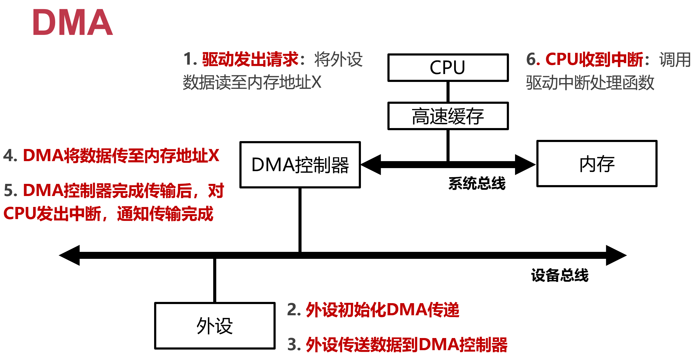

**如何保证设备访存（使用物理地址）的安全性？**

- MMU在CPU里，因此DMA访存使用的是物理地址而不是虚拟地址（否则还得去MMU翻译一下）
- 使用物理地址访存，不受虚拟地址权限的管控
- 添加IOMMU

**DMA的内存一致性**

- 现代处理器通常带有高速缓存（CPU Cache）

- 当DMA发生时，DMA缓冲区的数据仍在cache中怎么办？

- **解决方法：**

  方案1：将DMA区域映射为non-cacheable

  方案2：由软件负责维护一致性，软件主动刷缓存

  部分架构在硬件上保证了DMA一致性，如总线监视技术

### IOMMU

**避免设备直接使用物理地址访问内存**

在主板/总线上，而不是每个设备有一个（这样对于接入总线的任意设备，都有了虚拟地址）

- 设备所使用的地址，由IOMMU翻译为实际的物理地址
- 广泛应用于虚拟机场景中（允许虚拟机独占某个设备）

### CPU访问设备方式小结

- **MMIO** ：将设备寄存器映射到物理地址空间，CPU通过读写设备寄存器操作设备
- **DMA**：设备使用物理地址访问内存

## 中断与中断响应：设备通知CPU的方式

之所以要引入中断，是因为CPU太快了，设备太慢了，希望CPU不用等设备

> 当设备比CPU要快的时候，比如网卡（现在高速万兆网卡可以达到1000个cycle就来一个包），那么CPU绝大部分时间都在被网卡中断，之后保存/恢复上下文，以及处理对应包。此时中断就不是好的方式！

<u>中断只适合慢速设备！</u>

**高频中断的问题：活锁**

- 网络场景下的中断使用（网卡设备）
  - 当每个网络包到来时都发送中断请求时，OS可能进入活锁
  - 活锁：CPU只顾着响应中断，无法调度用户进程和处理中断发来的数据
- 解决方案：合二为一（中断+轮询），兼顾各方优势
  - 默认使用中断
  - 网络中断发生后，使用轮询处理后续达到的网络包
  - 如果没有更多中断，或轮询中断超过时间限制，则回到中断模式
  - 该方案在Linux网络驱动中称为 NAPI (New API)

### CPU中断处理流程

> 真机上：CPU每一行指令之后检查一下中断电平
>
> QEMU中：每一个逻辑代码basic block之后检查中断电平，因此有很多bug可能不会出现（中断粒度太粗）

### AArch64的中断分类

IRQ，FIQ连接CPU的不同针脚，可在中断控制器（Interrupt Controller）中配置

- IRQ（Interrupt Request）
  - 普通中断，优先级低，处理慢
- FIQ（Fast Interrupt Request）
  - 一次只能有一个FIQ
  - 快速中断，优先级高，处理快
  - 常为可信任的中断源预留
- SError（System Error）
  - 原因难以定位、较难处理的异常，多由异步中止（Abort）导致
  - 如从缓存行（Cacheline）写回至内存时发生的异常

**多核CPU如何处理中断？如何避免中断一次性打断所有核呢？**

### ARM 中断控制器——GIC（Generic Interrupt Controller）

接受硬件中断信号，并进行简单处理，通过一定的设置策略，分给对应的CPU进行处理

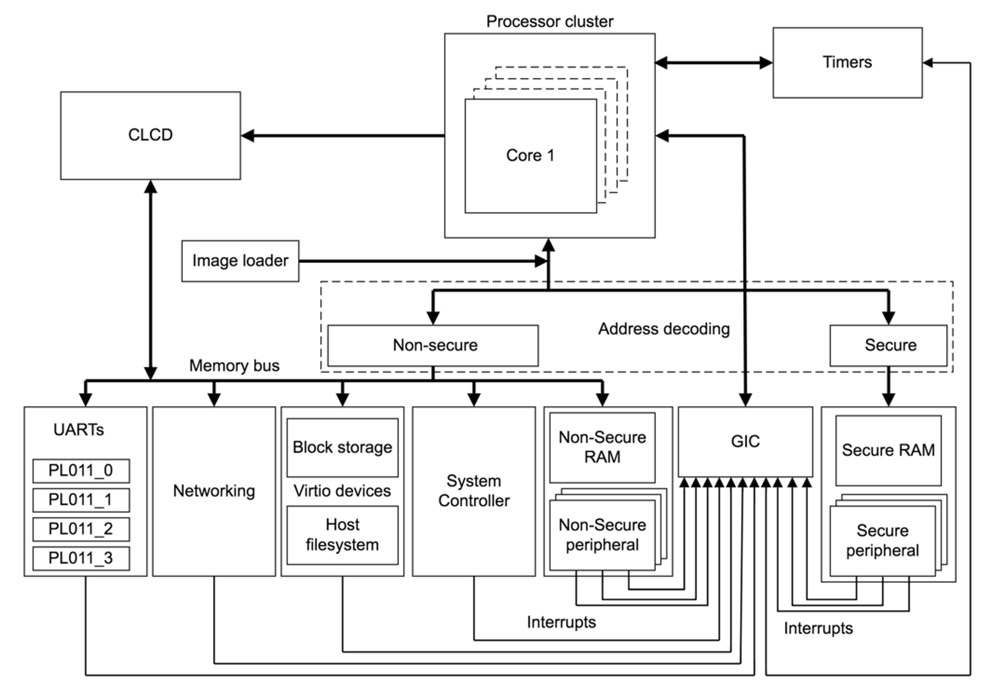

连接不同的CPU核心和不同的设备（单点，可能成为瓶颈）

- 组件1：Distributor
  - 负责全局中断的分发和管理
- 组件2：CPU Interface
  - 类似“门卫”，判断中断是否要发给CPU处理

#### GIC Distributor

- 中断分发器：将当前最高优先级中断转发给对应CPU Interface
- 寄存器：GICD
- 作用：中断使能，确定中断优先级，中断分组，中断触发方式，中断的目的core

#### CPU Interface

将中断发给具体的CPU

- CPU接口：将GICD发送的中断，通过IRQ中断线发给连接到 interface 的核心
- 寄存器：GICC
- 作用：将中断请求发给CPU，配置中断屏蔽，中断确认（acknowledging an interrupt），中断完成（indicating completion of an interrupt），核间中断（Inter-Processor Interrupt，IPI）以用于核间通信（为了让 OS 通知所有 CPU 核心去 flush TLB cache）

### ARM中断的生命周期

1. Generate：外设发起一个中断
2. Distribute：Distributor对收到的中断源进行仲裁，然后发送给对应CPU Interface（可配置）
3. Deliver：CPU Interface将中断传给core
4. Activate：core读 GICC_IAR 寄存器，对中断进行确认
5. Priority drop：core写 GICC_EOIR 寄存器，实现优先级重置
6. Deactivate：core写 GICC_DIR 寄存器，来无效该中断

### 多个中断同时发生怎么办？

中断优先级：当多个中断同时发生时（NMI、软中断、异常），CPU首先响应高优先级的中断

ARM Cortex-M 处理器的中断优先级如下所示：

| **类型**                        | **优先级（值越低，优先级越高）** |
| ------------------------------- | -------------------------------- |
| 复位（reset）                   | -3                               |
| 不可屏蔽中断（NMI）             | -2                               |
| 硬件故障（Hard  Fault）         | -1                               |
| 系统服务调用（SVcall）          | 可配置                           |
| 调试监控（debug  monitor）      | 可配置                           |
| 系统定时器（SysTick）           | 可配置                           |
| 外部中断（External  Interrupt） | 可配置                           |

### 中断嵌套

- 中断也可能被“中断”
- 在处理当前中断（ISR）时：更高优先级的中断产生；或者相同优先级的中断产生
- 如何响应：
  - 允许高优先级抢占
  - 同级中断无法抢占
- ARM的FIQ能抢占任意IRQ，FIQ本身不可抢占

#### 如何禁止中断被抢占？（软件保证而不是硬件）

- 中断屏蔽：
  - 屏蔽全局中断：不再响应任何外设请求
  - 屏蔽对应中断：只停止对应IRQ的响应
- 屏蔽策略：
  - 屏蔽全局中断：
    - 系统关键步骤（原子性）
    - 保证任务响应的实时性
  - 屏蔽对应中断：通常都是这种情况，对系统的整体影响最小

### 中断合并（Interrupt Coalescing）

与合二为一（中断+轮询）不同的对于高频中断的解决方案，压制发送端，多个设备中断合并变成一个

- 中断合并：设备在发送中断前，需要等待一小段时间。在等待期间，其他中断可能也会马上到来，因此将多个中断合并为同一个中断，进而降低频繁中断带来的开销（之后需要分开来处理）
- 注意：等待过长时间会导致中断响应时延增加，这是系统中常见的“折衷”（trade-off）

### 案例：Linux的上下半部（中断子系统）

面临问题：

- 中断处理过程中若运行复杂逻辑，会导致系统失去响应更久
- 中断处理时不能调用会导致系统block的函数

将中断处理分为两部分：

- 上半部（Top Half）：尽量快，提高对外设的响应能力（<u>尽量不能block，不做耗时操作</u>，马上做）
  - 最小化公共例程：
    - 保存寄存器、屏蔽中断
    - 恢复寄存器，返回现场
  - Top half 要做的事情：把硬件产生的数据放到安全的地方
    - 将请求放入队列（或设置flag）（注意避免被相隔很近的下一个请求覆盖，类似于收多个signal当成一个），将其他处理推迟到bottom half
      - 现代处理器中，多个I/O设备共享一个IRQ和中断向量（IRQ少，不够用）
      - 多个ISR (interrupt service routines)可以绑定同一向量上
    - 调用每个设备对应的IRQ的ISR 
    - 不允许做耗时操作，如不允许内核访问用户态内存（因为有可能会swap页，耗时）
- 下半部（Bottom Half）：将中断的处理推迟完成（绝大多数工作，延迟做）
  - 提供可以推迟完成任务的机制：softirqs，tasklets (建立在softirqs之上)，工作队列，内核线程
    - 内核线程（Kernel Threads）：始终运行在内核态，进行处理中断的剩余工作
      1. 没有用户空间上下文
      2. 和用户进程一样被调度器管理
  - 这些机制都**可以被中断**

| 特点                                  | ISR     | SoftIRQ | Tasklet | WorkQueue | KThread |
| ------------------------------------- | ------- | ------- | ------- | --------- | ------- |
| 禁用所有中断？                        | Briefly | No      | No      | No        | No      |
| 禁用相同优先级的中断？                | Yes     | Yes     | No      | No        | No      |
| 比常规任务优先级更高？                | Yes     | Yes*    | Yes*    | No        | No      |
| 在相同处理器上运行？                  | N/A     | Yes     | Yes     | Yes       | Maybe   |
| 允许在同一CPU上有多个实例同时运行？   | No      | No      | No      | Yes       | Yes     |
| 允许在多个CPU上运行同时多个相同实例？ | Yes     | Yes     | No      | Yes       | Yes     |
| 完整的模式切换？                      | No      | No      | No      | Yes       | Yes     |
| 能否睡眠（拥有自己的内核栈）？        | No      | No      | No      | Yes       | Yes     |
| 能否访问用户空间？                    | No      | No      | No      | No        | No      |

## 设备驱动（设备相关的I/O软件）

一般而言一个硬件对应一个驱动

设备驱动：

- 专门用于操作硬件设备的代码集合
- 通常由硬件制造商负责提供
- 驱动程序**包含中断处理程序**

驱动特点：

- 和设备功能高度相关
- 不同设备间的驱动复杂度差异巨大
- 是操作系统 bugs 的主要来源

### 宏内核I/O架构（Linux、BSD、Windows）

- 设备驱动在内核态
- 优势：通常性能更好
- 劣势：容错性差
- 中断形式为内核ISR

### 微内核I/O架构（谷歌Fuchsia手机系统）

驱动与I/O子系统分别为两个进程，通过IPC调

- 设备驱动主体在用户态
- 优势：可靠性和容错性更好
- 劣势：IPC性能开销
- 中断为用户态驱动线程

### 混合I/O架构（谷歌安卓系统：硬件抽象层（HAL））

- 设备驱动分解为用户态和内核态
- 优势1：驱动开发和Linux内核解耦
- 优势2：允许驱动以闭源形式存在，保护硬件厂商的知识产权（放linux内核里面的东西必须要开源）

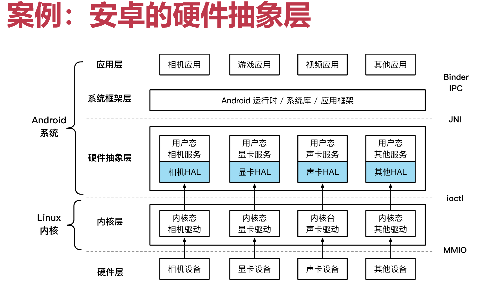

### Linux 驱动模型 Linux Device Driver Model (LDDM)

设备驱动的复杂性在提高，希望标准化的数据结构和接口，将驱动开发简化为对数据结构的填充和实现

**驱动模型的好处**

- 电源管理：
  - 描述设备在系统中的拓扑结构（树形结构）
  - 保证能正确控制设备的电源，先关闭设备和再关闭总线
- 驱动开发者：
  - 允许同系列设备的驱动代码之间的复用
  - 将设备和驱动联系起来，方便相互索引
- 系统管理员：
  - 帮助用户枚举系统设备，观察设备间拓扑和设备的工作状态

**提供驱动的统一抽象，具体驱动实现对应接口即可**

- 支持电源管理与设备的热拔插
- 利用sysfs向用户空间提供系统信息
- 维护内核对象的依赖关系与生命周期，简化开发工作
  - 驱动人员只需告诉内核对象间的依赖关系
  - 启动设备时会自动初始化依赖的对象，直到启动条件满足为止

## I/O子系统（设备无关的I/O软件）

进一步收敛复杂性，不同设备驱动还是不一样，需要统一管理

目标：提供统一接口，涵盖不同设备；满足I/O硬件管理的共同需求，提供统一抽象

### 设备文件：统一抽象

- 为应用程序提供的相同的设备抽象：设备文件
- 操作系统将外设细节和协议封装在文件接口的内部
- 复用文件系统接口：open(), read(), write(), close, etc.

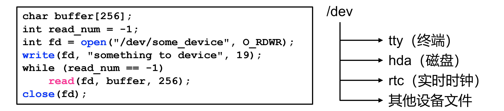

**设备操作的专用接口：`ioctl`**

- 需要应用程序和驱动程序事先协商好“操作码”和对应语义，驱动自己解释操作码
- 通用接口，第一个参数为 `fd`，之后参数任意

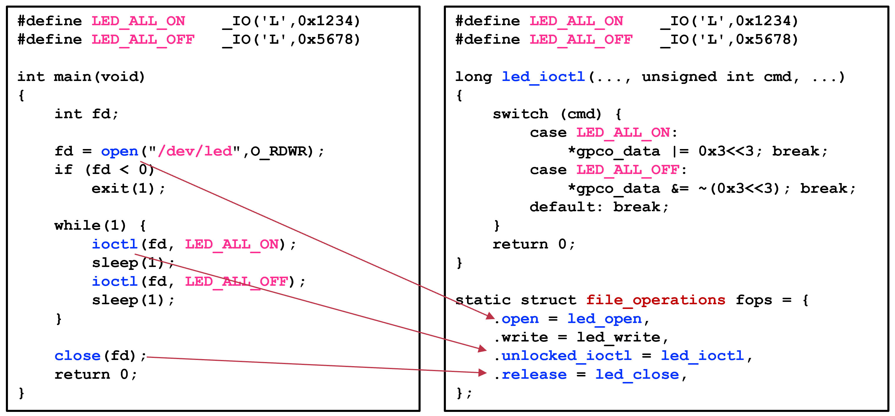

### 设备文件操作与设备驱动函数的对接

通过函数指针

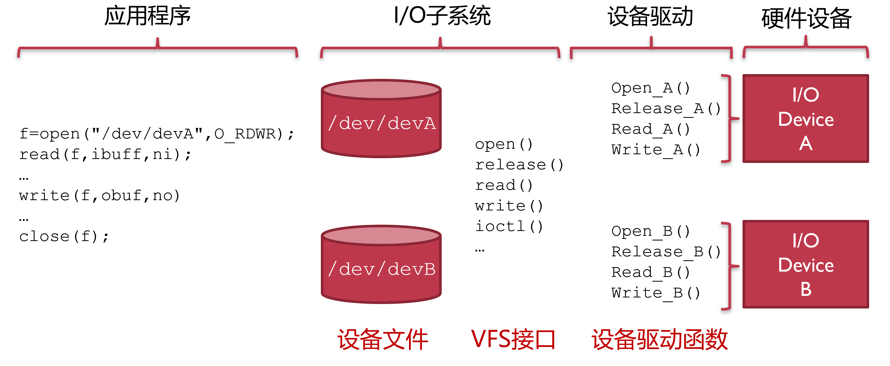

### 设备的逻辑分类

Linux设备分类

- 字符设备：如键盘，串口；数据一次来一个，就处理一个
- 块设备：如磁盘，SSD；数据可以随机访问
- 网络设备

#### 字符设备（cdev）

- 键盘、鼠标、串口、打印机等
- 大多数伪设备：`/dev/null`, `/dev/zero`, `/dev/random`

访问模式：

- **顺序访问**，每次读取一个字符
- 调用驱动程序和设备直接交互

**文件抽象**：open(), read(), write(), close()

#### 块设备（blkdev）

磁盘、U盘、闪存等（以存储设备为主）

访问模式：

- **随机访问**，以块为单位进行寻址（如512B、4KB不等）
- 通常为块设备增加一层缓冲，避免频繁读写I/O导致的慢速

通常使用**内存抽象**：

- 内存映射文件(Memory-Mapped File)：`mmap()` 访问块设备

  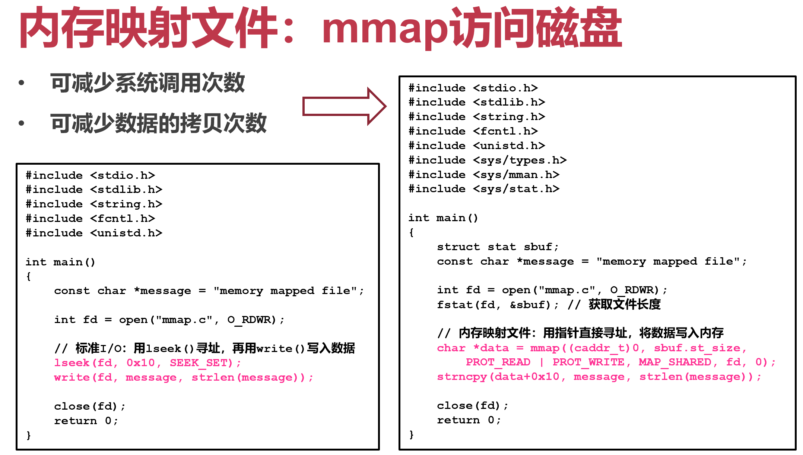

- 提供文件形式接口和原始I/O接口（绕过缓冲）

#### 网络设备（netdev）

以太网、WiFi、蓝牙等（以通信设备为主）

访问模式：

- 面向**格式化报文**的收发
- 在驱动层之上维护多种协议，支持不同策略

**套接字抽象：**socket(), send(), recv(), close(), etc.

#### 设备逻辑分类小结

总体而言都是文件

**设备分类：**

- 字符设备（cdev）：键盘、鼠标、串口、打印机等
- 块设备（blkdev）：磁盘、U盘、闪存等存储设备
- 网络设备（netdev）：以太网、WiFi、蓝牙等通信设备

**设备接口：**

- 字符设备： read(), write()
- 块设备： read(), write(), lseek(), mmap()
- 网络设备：socket(), send(), recv()
  - 同时兼容文件接口（也可以用read(), write()读写socket）

### 设备的缓冲管理

#### 单缓冲区

问题：

- 读写性能不匹配：慢速的存储设备 vs. 高速的CPU
- 读写粒度不匹配：小数据的访问存在读写放大的问题

解决方法：

- 开辟内存缓冲区，避免频繁读写I/O

单缓冲区例子：Linux的page cache（读的时候当cache，写的时候当buffer）

#### 双缓冲区

- 维护两个缓冲区，轮流使用（读写错开）
- 第一个缓冲区被填满但没被读取前，使用第二个缓冲区填充数据
- 双缓冲区例子：显存刷新，防止屏幕内容出现闪烁或撕裂
  - 前置缓冲区被读取后，通过“交换”（swap）将前置和后置身份互换
- 游戏中甚至启用三重缓冲

之后交换缓冲区（前置后置交换），GPU从前置缓冲区（原后置）读，游戏进程写入后置缓冲区

#### 环形缓冲区

- 容许更多缓冲区存在，提高I/O带宽
- 组成：一段连续内存区域+两个指针，读写时自动推进指针
  - 读指针：指向有效数据区域的开始地址
  - 写指针：指向下一个空闲区域的开始地址
- 环形缓冲区例子：网卡DMA缓冲区、NVMe存储的命令队列

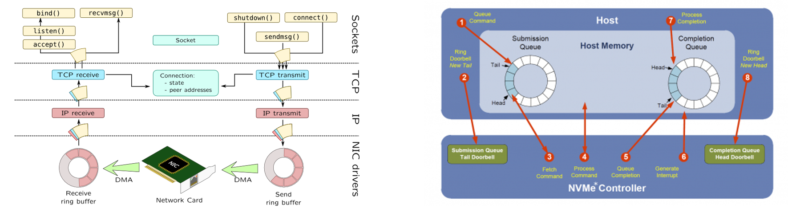

#### 设备的缓冲区管理小结

- 单缓冲区：块设备的缓冲区
- 双缓冲区：常用于游戏或流媒体的显存同步
- 环形缓冲区：网卡的数据交互和NVMe存储的命令交互

**缓冲区是否总能提高性能？**

缓冲区意味着数据的多次拷贝，使用过多反而损伤性能

### I/O模型：如何同时监听多个设备？

- 如果要支持多个fd怎么办？
  - 阻塞I/O：一旦一个阻塞，则其余无法响应
- 改成非阻塞可以么？
  - 非阻塞I/O：需要程序不断轮询设备情况：浪费CPU
- 能否采用异步通知机制？让内核主动来通知？
  - 异步I/O：允许程序先做其他事，等设备数据就绪再接收通知
  - 多路复用I/O：仍为阻塞，但一旦设备数据就绪就收到通知

#### 阻塞I/O模型

一旦一个阻塞，则其余无法响应

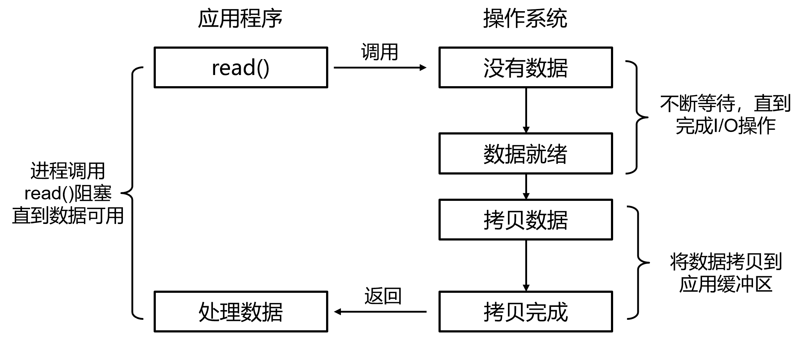

#### 非阻塞I/O模型

不断轮询设备情况，浪费CPU

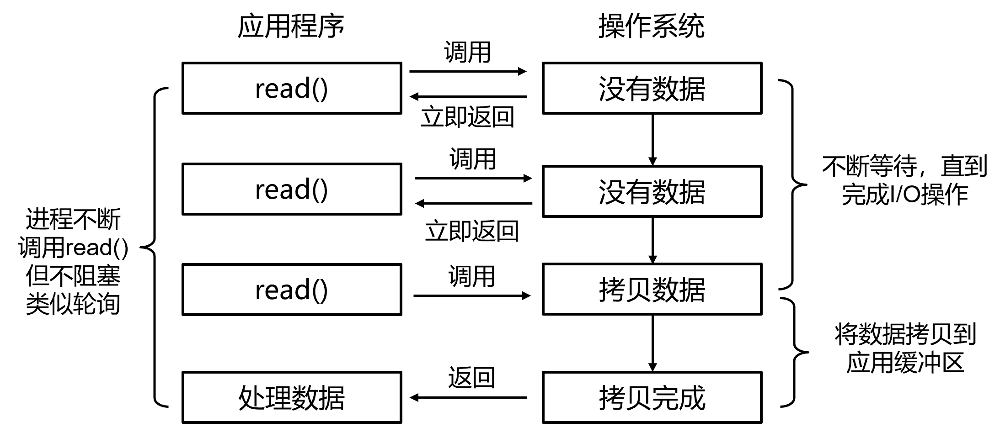

#### 异步I/O模型

立即返回，允许程序先做其他事，等设备数据就绪再接收通知

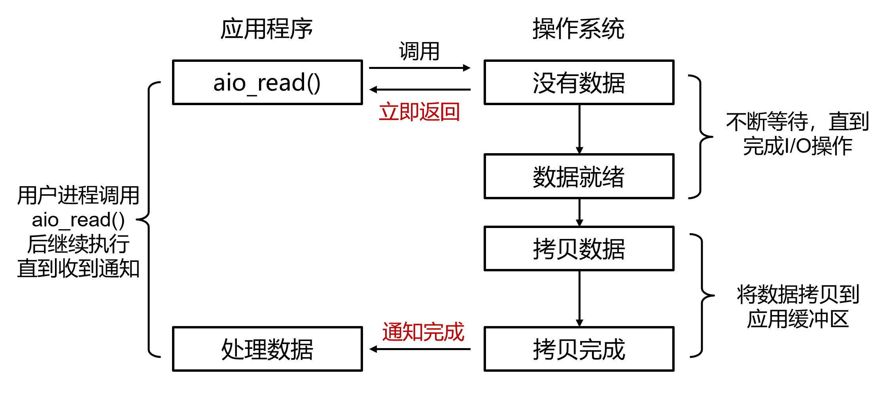

#### I/O多路复用模型

同时等待多个fd，直到其中有一个可用就用

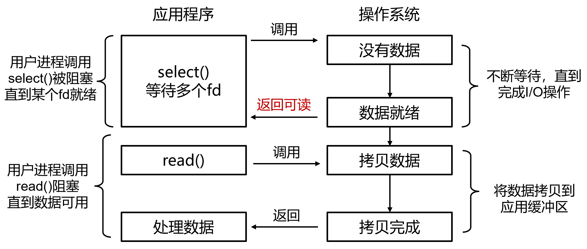

#### I/O模型小结

- 阻塞I/O：一直等待
  - 进程请求<u>读数据</u>不得，将其挂起，直到<u>数据来了</u>再将其唤醒
  - 进程请求<u>写数据</u>不得，将其挂起，直到<u>设备准备好了</u>再将其唤醒
- 非阻塞I/O：不等待
  - 读写请求后直接返回（可能读不到数据或者写失败）
- 异步I/O：稍后再来
  - 等读写请求成功后再通知用户
  - 用户执行并不停滞（类似DMA之于CPU）
- I/O多路复用：同时监听多个请求，只要有一个就绪就不再等待

## I/O库（应用程序员视角）

- 以共享库的形式，和应用程序直接链接
- 简化应用程序I/O开发的复杂度
- 提供更好的性能和更灵活的I/O管理能力
- 例子：glibc：提供用户态I/O缓冲区管理，Linux AIO和io_uring：支持异步I/O

### 案例：glibc的buffer I/O

- fread()/fwrite()和read()/write() 有何区别？
  - 前者是I/O库接口（函数调用），后者是VFS接口（系统调用）
  - 使用用户态缓冲区，减少模式切换次数
- 缓冲模式配置：
  - 全缓冲（_IOFBF）：缓冲区满了才flush缓冲区
  - 行缓冲（_IOLBF）：遇到换行符就flush缓冲区
  - 无缓冲（_IONBF）：和直接调用read()/write()效果一样

## 设备管理的三种方式

- 内核直管：静态I/O资源分配+向上提供文件接口
  - 代表设备：Console（CGA+键盘）
  - 特征：中断号等固定，内核直接提供文件接口（无需外部驱动，嵌在内核中，简单的设备）
- 设备驱动：动态I/O资源分配+向上提供文件接口
  - 代表设备：PCI、USB，如硬盘、网卡等
  - 特征：中断号等动态分配，内核提供驱动框架，设备制造商提供驱动模块
- 用户态库：动态I/O资源分配+向上提供内存接口
  - 代表设备：智能网卡、智能SSD
  - 特征：内核直接将设备（寄存器）暴露给用户态，设备制造商提供用户态库（绕过内核；内存接口load与store）

### OS的设备管理：对上与对下

- 向下对接设备：分配必要的I/O资源
  - 中断号 + 虚拟地址映射空间
    - 静态绑定：由硬件规范确定
    - 动态分配：动态扫描后再分配
- 对上提供接口：应用使用设备的方式
  - 文件接口：通过系统调用
    - open、read、write、close、ioctl等
  - 内存接口：寄存器直接映射到用户态虚拟内存空间
    - 无需系统调用，应用可直接访问设备

#### 内核直管

- 以Console为例
  - 包含设备：显示器（CGA）+键盘
- I/O资源静态绑定
  - 中断号（即异常向量表）
  - 寄存器所映射的虚拟内存地址
- 文件接口
  - read：读取键盘输入，通常以行为单位
  - write：向显示器输出字符并显示

#### 设备驱动

- 操作系统的设备驱动框架
  - 提供标准化的数据结构和接口
  - 将驱动开发简化为对数据结构的填充和实现
  - 方便操作系统统一组织和管理设备
- 操作系统为驱动提供的辅助功能
  - VFS（对上提供文件接口，可复用权限检查等逻辑）
  - 与设备类型相关的框架（如：块设备层、网络协议栈等）
  - 模块动态插入框架（如：Linux的module插入）
  - 中断处理框架（如：Linux的 top half + bottom half）

#### 用户态库

- 操作系统内核负责：
  - 将设备寄存器映射到用户可访问的虚拟地址空间
  - 通常只允许某一个应用访问该设备，防止发生冲突
- 用户态库负责：
  - 100%控制硬件设备，并向上或对外提供服务
  - 通过轮询访问设备（问：为何不用中断？有中断就会进内核）
    - 通常需要独占一个CPU
  - 典型例子：Intel DPDK（网卡）、SPDK（存储）
  - 通常用于高性能场景（问：为什么性能高？）

