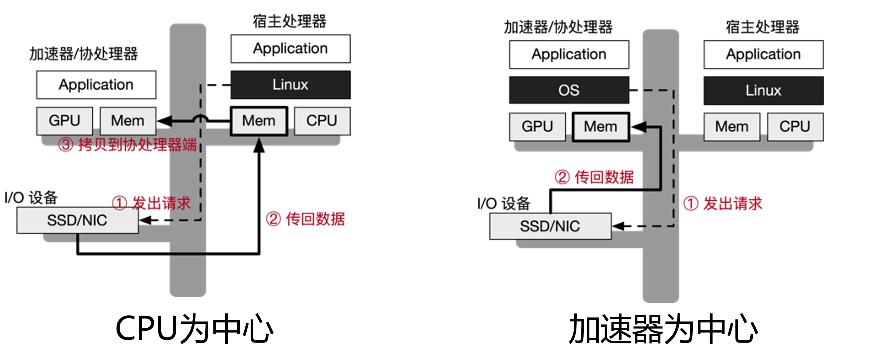
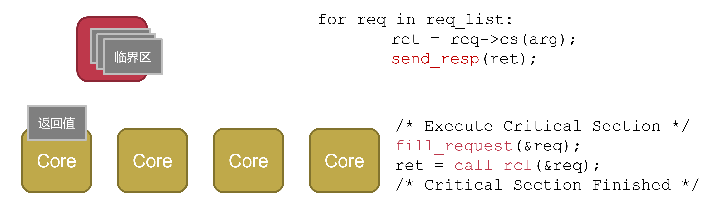
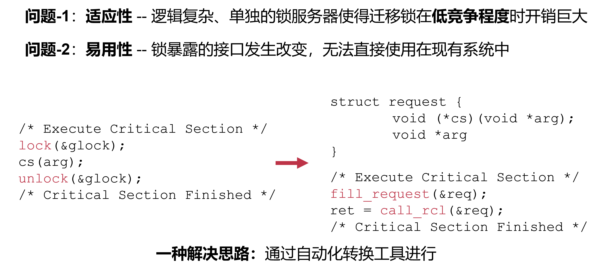
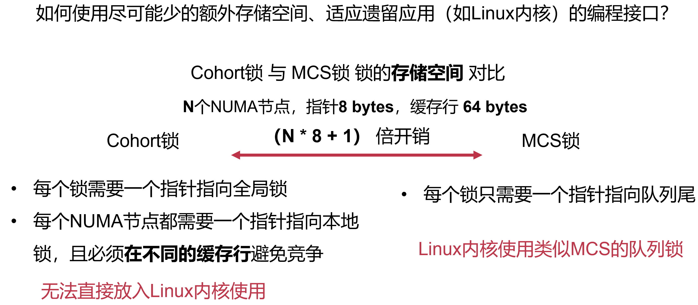
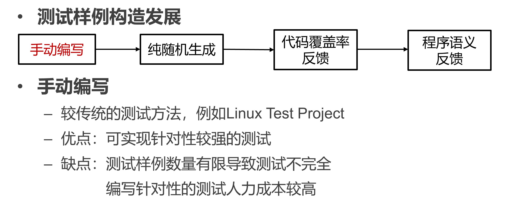
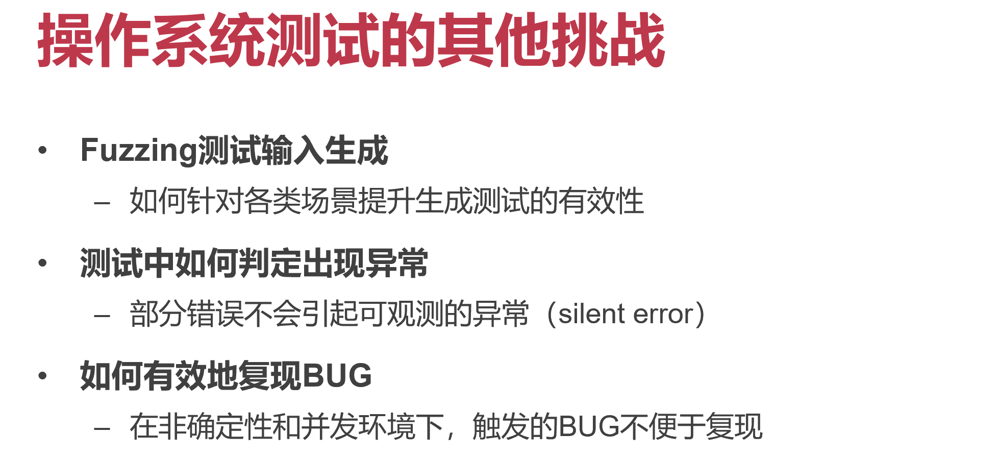
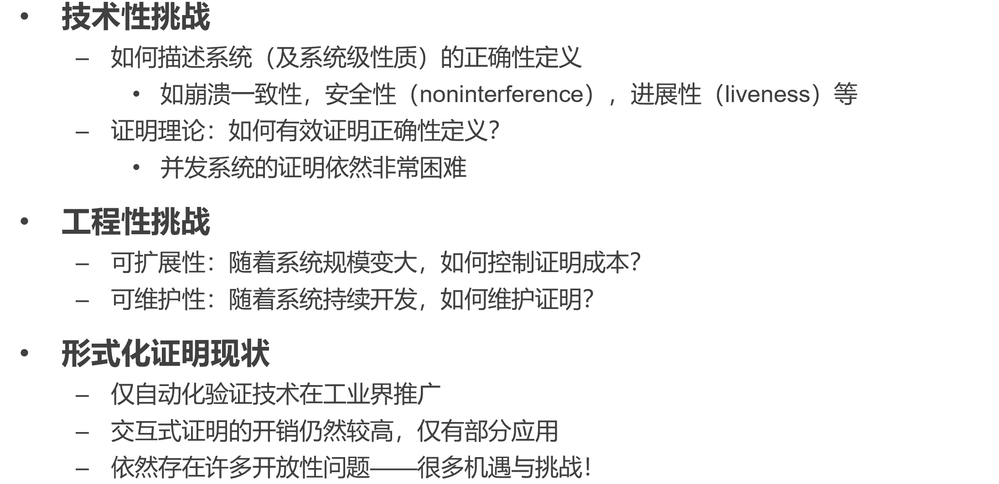

[TOC]

# 操作系统研究前沿

**操作系统研究受到上层应用和底层硬件双重驱动**

- 互联网、网络搜索、大数据、人工智能、智能驾驶、云计算等
- 持久性内存、GPU、智能网卡、AI芯片、硬件Enclave等

**两个核心问题**

- 如何为上层应用提供更快、更安全、更易用的接口？
- 如何为底层硬件建立高效、安全、高利用率的抽象？

# 异构操作系统 Heterogeneous OS

硬件发展的趋势：多样化与异构化

- 异构计算：CPU、GPU、FPGA、AI加速器等
- 异构存储：DRAM、NVRAM、PIM等
- 异构I/O：智能网卡、智能SSD等

**为什么需要异构硬件？**

- 硬件能力很难再提升单个CPU核性能（摩尔定律的结束）
- 上层应用对架构的性能提出了更高的要求
- CPU无法满足AI计算、图形处理等场景的计算需求
  - AI加速器、GPU等异构计算和CPU并存
- DRAM容量受限 → NVM可以提供更大的内存容量
  - DRAM和NVM等多种内存并存
- 数据中心和云需要更大的IO带宽和更低的时延
  - RDMA、以太网卡、智能I/O设备等并存

## 挑战-1：需要同时支持多种指令集 (ISA)

不同的计算单元可能使用不同的指令集

需要支持异构 ISA，OS的编译中会生成特定的架构的代码（一旦编译完成），怎么支持其他平台

**思路：两阶段编译解决异构ISA问题**

- 阶段1：从源码编译得到一个中间表示 (IR)，分发IR给使用者
- 阶段2：当决定在具体的平台上运行时，将IR生成binary
  - 根据具体部署的计算节点编译出不同指令集的二进制

## 挑战-2：内核/应用在跨总线的环境下的同步和通信

异构硬件间通过多种总线连接，无共享内存和缓存一致性

**思路：多内核抽象——每个设备运行一个monitor**

OS也被拆分到不同设备上的monitor中，类似Multikernel

- CPU上负责OS进程管理
- Memory monitor上负责OS内存管理
- 通过RDMA等快速网络通信（无缓存一致性）

## 挑战-3：CPU提供OS服务容易成为系统性能瓶颈

各种加速器等异构计算单元依赖于CPU提供OS服务

- 以CPU为中心的OS服务：需要两次拷贝，性能开销大
- 以加速器为中心的OS服务：加速器不适合执行如网络协议栈等OS服务

原本：SSD/网卡数据 → CPU 内存 → GPU 内存

希望：SSD/网卡数据 → GPU 内存

**思路：CPU负责控制流，加速器负责数据流**

- 解耦数据流和控制流
  - 控制流由CPU负责
  - 数据流由异构加速器负责
  - 避免OS成为性能瓶颈

**挑战：OS如何使用智能网卡优化网络应用？**

- 思路-1：卸载部分应用逻辑至网卡
- 思路-2：卸载部分微内核服务至网卡
- 思路-3：卸载部分网络协议栈至网卡

# 新的应用接口 New OS Interface for Applications

**放权**

- 将内核从应用的关键路径上移除，绕开臃肿的软件栈
- 将更多功能（如调度）交由应用完成，减少进入内核的次数

**裁剪**

- 只保留内核抽象的必需功能，最小化抽象带来的开销

## 极低时延应用对操作系统的新要求

应用时延需求从秒级走向微秒级

随着网络时延的降低，操作系统提供的服务和抽象成为了瓶颈

## 挑战-1：内核软件栈臃肿

内核软件栈涉及系统调用、内存管理、命名管理等开销，成为了性能瓶颈

- 思路-1：通过内核旁路解决软件栈臃肿问题

  - 机遇：新型硬件设备具备虚拟化能力，如一张网卡（NIC）可以虚拟为多张虚拟网卡（vNIC）
  - 核心思想：操作系统将虚拟设备直接交给应用使用，应用可以直接访问设备，无需经过内核软件栈，大幅降低时延
  - 潜在问题
    - 设备映射过于死板，可能出现负载不均衡／资源浪费
    - 应用直接访问设备，可能存在安全问题
    - 生态碎片化

  

## 挑战-2：内核抽象过于笨重

- 思路-2：通过轻量级与定制化内核提高性能

  - 核心思想：只保留与应用相关的功能

  - Unikernel: 专为应用定制的特化内核

    LightVM：移除VM启动过程中不需要的部分，实现微秒级启动

## 挑战-3：应用缺乏对于调度的控制

- 调度一定会进入内核，造成微秒级开销：进程调度的开销是用户态线程调度开销的2倍
- 内核缺乏应用语义，可能无法做出最好的调度决策

思路-3：让应用做更多决策，如自主调度

- 例如：将物理CPU核直接交给应用

  应用使用核与内核交互，而不是线程

  避免内核调度器与应用调度策略冲突造成的“双调度问题”

# 多核同步原语 Synchronization

## 挑战-1：CPU核越来越多，锁的可扩展性遇到瓶颈

**思考：**多核环境下锁的**理想性能上限**在哪？

- 在**一个**核心上，**连续执行临界区**能达到的吞吐率
- 没有由于**其他核心竞争、数据迁移**导致的性能开销

**思路：将所有竞争者的临界区集中到一个核上处理**

既然临界区代码不能并行，为什么还要把临界区代码放到不同核上运行？干脆临界区放同一个核上跑

**迁移锁**

## 挑战-2：如何在提升性能的同时，维持锁的易用性？

## 除了性能可扩展性与易用性之外的挑战

# 持久性内存 Persistent Memory

新型的内存/存储设备：又称非易失性内存（NVM）

比内存慢，比硬盘存储快

## 挑战-1：操作系统该如何为持久内存提供抽象？

## 挑战-2：如何避免内核带来的开销？

- 发现：持久性内存可以在用户态访问
  - 硬盘是I/O设备，必须由内核统一管理
  - 内存则本来就是用户态可以访问的
- 思路：将 FS 功能移到用户态，从而避免进入内核
  - 即 kernel bypassing
- 新挑战：如何保障数据安全性和隔离性？
  - 例如：若inode可以由用户直接访问，会发生什么？
  - 想法：需要用户态和内核态进行分工

### 思路-1：用户FS记录日志，内核FS整理日志

**写操作**

- 用户态 FS 只能（只需）在 Per-process 的 NVM 空间中记录日志
- 内核 FS 定期查看日志，并将数据更新到全局位置
- 在应用写完后，内核整理前，新的内容全局不可见

**读操作**

- 经过内核 FS 检查后，用户态 FS 可以直接读取 NVM 部分区域

### 思路-2：用户FS处理数据，内核FS管理元数据

元数据安全是安全与隔离的关键问题

- 用户 FS 将文件 mmap 到用户态后，直接在用户态处理数据请求
- 内核 FS 只负责处理文件的元数据操作

### 思路-3：用户FS处理请求，内核FS提供隔离

隔离内存的方法隔离文件

# 系统安全隔离 System Security

在互不信任的多用户云计算环境中，系统软件的安全性显得尤为重要

系统隔离的演变：层次化到“九宫格”，**只相信自己**

**性能问题**

- SGX安全内存大小受限，大内存访问性能差
- 启动性能、系统调用性能 …
- 研究思路：避免触发硬件安全内存换页，flexSC …

**安全问题**

- 攻击者使用硬件可执行环境保护恶意软件
- 恶意硬件与硬件漏洞
- 层出不穷的侧信道攻击

# 操作系统新型测试方法 Bug Finding in OS

操作系统代码规模庞大，难以避免BUG和漏洞，但是操作系统正确性直接影响上层应用

**测试的方法**

- 静态：在不运行代码前提下，通过语法、控制流等分析代码异常
- 动态：运行测试程序，判断执行是否符合预期

## 挑战-1：如何构造测试样例

# 形式化证明 Formal Verification

> “形式化证明是已知唯一一个保证软件没有编程错误的手段”

基于数学证明，完全覆盖软件所有可能执行情况

## 形式化证明的组成

- 形式化规约：精确描述期待的软件行为——用户视角的软件（表达出什么是对的）
- 实现：软件系统的一个实现——实现视角的软件
- 正确性条件：定义实现与规约相一致的含义
- 一致性证明：表明实现与规约相一致的数学证明

## 形式化证明成功案例

## 形式化证明的挑战与现状

# 大语言模型 LLM

Microsoft 365 Copilot

大语言模型和OS的共性：通用性