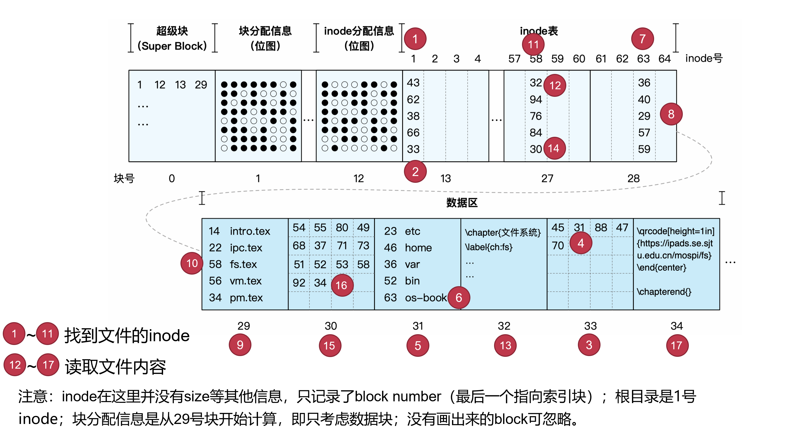
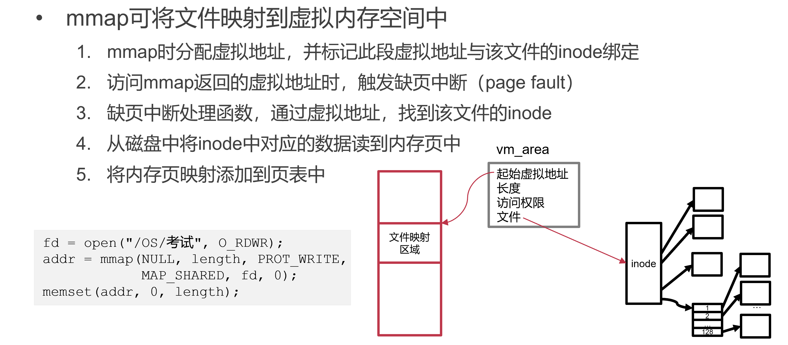
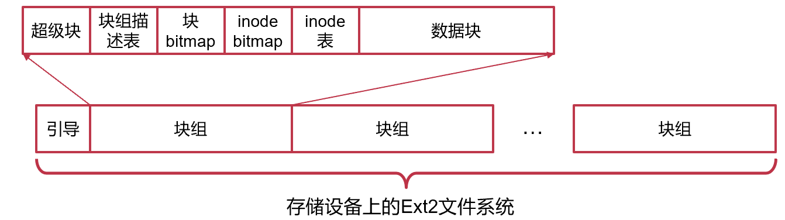
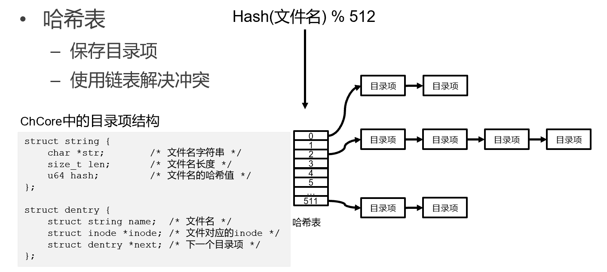
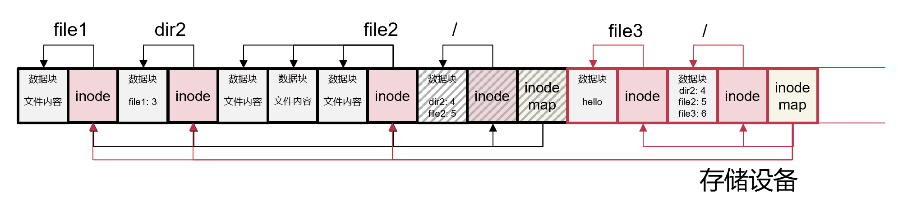
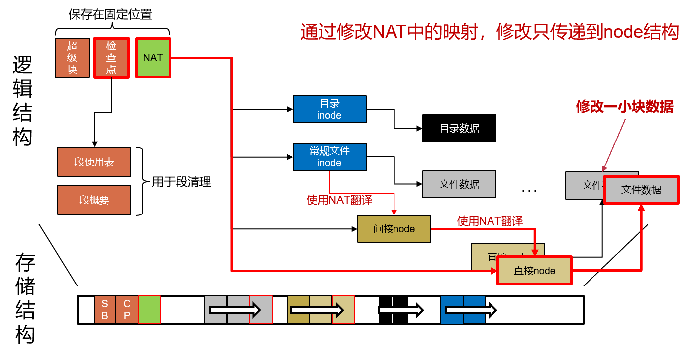
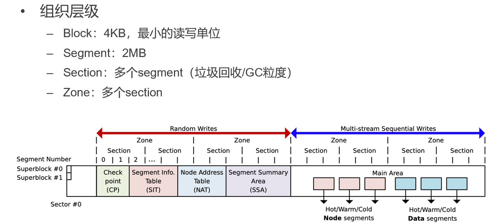

[TOC]

# 文件系统

空间的统一管理

## 理解一个文件系统的11个问题

1. 文件系统使用磁盘块的基本单位是什么？（一般磁盘块大小是4K，需要管理数以亿记的block）
2. 一个文件的组织方式？（文件并不是个必要的抽象！其它抽象如KV-store）
3. 空闲空间的组织方式？（bitmap/linklist/buddy system）
4. 目录的结构是什么？
5. 是否支持硬链接？
6. 是否支持软链接？
7. 磁盘存储的整体布局是什么？（元数据在头部/尾部/很多地方）
8. 如何根据文件名查找到一个文件？
9. 如何读取一个文件？
10. 如何为一个文件分配新的磁盘空间？
11. 如何挂载一个文件系统？

## UNIX v6 文件系统（inode 文件系统）

### inode：记录文件多个磁盘块的位置

- 为了支持多个磁盘块构成的文件，总得有一个地方记录这些磁盘块在哪里（inode）
- 每个块号指向一个数据块，inode 中放很多块号组织成文件


### inode 文件系统的存储布局


- inode表：记录所有inode
  - 可以看成inode的大数组
  - 每个inode使用作为索引
  - 此时，inode号即为文件名
- inode分配信息（位图）
  - 记录哪些inode已分配，哪些空闲
- 超级块：Super Block
  - 记录磁盘块的大小、其他信息的起始磁盘块位置，等等
  - 是整个文件系统的元数据

**inode表的假设**

- 一个inode记录的所有块指针在磁盘上的空间是连续的
- 多个inode在磁盘上的空间是连续的

### inode文件系统的基本操作

- 加载文件系统
  - 首先读取超级块（super block），然后找到其他信息
- 创建新文件
  - 根据inode分配信息找到空闲inode，将inode对应的bit设置为1
  - 返回inode在inode表中的索引，作为文件名
- 查找文件（根据inode号）
  - 在inode表中根据inode号定位该inode
- 删除文件
  - 在inode分配表中，将该inode对应的bit设置为0

### 多级inode

问题：单级inode过大

**一个4GB的文件，对应inode有多大？**

- 假设磁盘块号（块指针）为8-Byte（64-bit）
- inode大小：4GB/4KB * 8 = 8MB
- 若文件大小为4TB，则inode大小为8GB！
- 如果要支持4TB，预留inode时每个大小都得分8GB！


**一个多级inode占用的空间很少**

- 一共只有15个指针（即记录磁盘块），这些指针占用120-Byte
- 包含12个直接指针（小文件直接快速访问），3个间接指针，1个二级间接指针
- 文件最大为：4K x 12 + 4K x 512 x 3 + 4K x 512 x 512 = 48K + 6M + 1G

**多级inode和多级页表有什么关系？**

- 都是要把**一个命名空间翻译到另一个命名空间**
  - 多级inode：文件的offset（内偏移）翻译成磁盘块号
  - 多级页表：虚拟地址翻译成物理地址
- 都是时间换空间
- 如果单级页表，那么其大小必须覆盖VA范围（单级页表索引，如 page table 不管用了多少，那就需要 0 到 4G 都要有预留页表项），但是大部分应用程序不会用完虚拟地址空间，中间会有很多空洞！多级页表中的索引VA不一定每个都对应有值，省空间，但是查找时更耗时

**为什么不用inode的方式设计页表？**

- VA中间是有很多空洞的，但是文件中间是不会有空洞的；inode中直接指针如果第四个指向的block有数据，那么第三个一定指向的也有数据
- MMU是硬件实现，相对不灵活，需要有一个固定的规范化流程规范；但是inode是软件控制，可以更灵活，比如 12 个直接指针，数是可以改的

**格式化**

- 格式化后一个文件系统能存放的文件数量上限是有限的！（格式化之后的inode table大小限制）
  - 后面添加一个动态大小的inode表

### 目录文件与目录项（为了用字符串文件名而不是 inode number 指代文件）


### 文件的查找过程

/os-book/fs.tex



底下 block 30 和 33 里面是二级 block，数字指代的是 block 号

### 打开和读写文件


### mmap()：用内存接口来访问文件



**文件内存映射的优势**

- 对于随机访问，不用频繁lseek
- 减少系统调用次数
- 可以减少数据copy，如拷贝文件，数据无需经过中间buffer
- 访问的局部性更好
- 可以用madvice为内核提供访问提示，提高性能

## Ext2 文件系统

- 将磁盘分为多个块组，每个块组中都有超级块，互为备份（不会把所有东西都放在头部，而是分而治之，每一个组都是一个小硬盘）
- 超级块（Super Block）记录了整个文件系统的元数据
- 块组描述表记录了块组中各个区域的位置和大小



### Ext2 的常规文件


### <u>区段（Extent）：减少要存的元数据信息</u>

思想：如果数据块物理上连续（比如视频文件，就很常见），只需要保存**起始块地址和长度**即可！

区段（Extent）是由**物理上连续的多个数据块**组成

- 一个区段内的数据可以连续访问，无需按4KB数据块访问
- 可以减少元数据的数量

### Ext4 文件存储 **–** 区段树（Extent）


本来连续的要记录多个块号，现在变成一个起始块号和长度

**trade off**

- 如果过于碎片化，inode（元数据）的大小反而会变大
- 由于每一个 extent 大小不一致，无法像之前那样直接通过偏移量找到目标，查找变慢
  - 叶子节点记录偏移量，可以类似二分查找（偏移量到偏移量+长度就知道范围）
  - 同时实际上瓶颈还是在读磁盘（读数据块进内存），查找时间多一点没关系（但是近些年硬件已经变快，查找逐渐成为瓶颈）
- 时间换空间

### Ext2 的目录文件


### 其他常见的文件类型


设备文件，如 `/dev/ttys0`

## ChCore 的文件系统（内存模拟文件系统）

### ChCore 的常规文件


基数树 (Radix Tree)

### ChCore 的目录文件



## FAT 文件系统：基于 Table 的文件系统（类似链表串起来）

### FAT32存储布局

cluster（类似于 inode 的 block）大小可变


### FAT：文件分配表（链表的方式，串起来）


数据块和FAT表存在着一一映射的关系。


- 0003：文件的第一个cluster是0003号数据块上，直接从数据区的0003处拿
- 依据0003号位置对应的FAT表里面的0005，去找0005位置的数据；之后看0005位置的FAT表里面，找到0006对应的数据块，再看0006对应的FAT表中是FFFF（EOF），文件结束

### FAT32中的目录项

- 目录同样是一种（特殊的）文件 —— 与基于inode的文件系统一样

- 目录文件包含若干个目录项，每个目录项记录32个字节

- 四种目录项：

  短文件名目录项、长文件名目录项、卷标目录项、"."和".."目录项


- 上图是一个目录文件，文件名（文件名形式 8.3 即文件名八个字符，后缀三个字符）大小不能修改

- 文件名如果长度超过 8.3 的形式，会生成短文件名：如 "The quick brown.fox" -> "Thequi~1.fox"

  - 如果后一个文件已经存在，怎么办？

    尝试THEQUI~2FOX，若还冲突，则尝试：THEQUI~3FOX；若还冲突，则尝试： …；若还冲突，则尝试：T~999999FOX；若还冲突，则报错

  - 使用短文件名打开文件也可以打开（实际上文件）

- 将好几个目录项拼起来（标志位处不能动，不能变成文件名的一部分）来表示长文件名

**FAT32最大支持多大的单个文件？为什么？**

4G，因为目录项中 file size 字段只有 32 bit

**应该如何扩展FAT，使其能支持更大的文件？**

file size 字段用更多字节保存

**为什么U盘一般用FAT？**

- 兼容性问题（win 与 mac 都能兼容，如 NTFS 就不行）
- 日志问题，没有日志，减少写
- 简单

**为什么FAT不支持link（硬链接）？**

无法统计link count；FAT32 目录项中记录了文件名及文件很多的元数据，inode 目录项中只记录文件名以及inode number！这导致如果FAT支持link（硬链接），同一个文件的多个目录项在文件被修改时，类似file size，modify time等都需要consistent的修改，很困难

**为什么有时候会出现图片等下半部分变为乱七八糟的色块这样的错误？**

一串中一旦有一个FAT表地方出问题，整一条链就出问题（可以依据此判定用的是FAT）

**为什么FAT会有大量的随机读写？**

linklist中跳来跳去，目录项对比和顺序存储

### 应用

数码相机 SD 卡等

## 磁盘碎片

- 磁盘碎片是如何产生的？
  - 思考场景：增大一个文件
  - 表现形式：磁盘使用块不连续
  - 磁盘碎片会导致什么问题？
- 如何避免磁盘碎片？
  - 做好磁盘的预留（预留空间，文件增长的时候尽量用其预留的空间）
  - 利用内存缓存延迟写入磁盘
    - 写入时尽可能整合在一起

## exFAT Highlights


- 允许4GB以上文件（新的目录项格式、文件大小用8个字节）
  - 因而与FAT32并不兼容（目录项字段如filesize大小都不一样）

## NTFS 文件系统：基于数据库的文件系统

### NTFS 存储布局


### NTFS 主文件表 MFT

- MFT是一个**关系型数据库**
  - MFT中的每一行对应着一个文件
  - 每一列为这个文件的某个元数据
  - NTFS 中所有的文件均在 MFT 中有记录
  - 一般会预留整个文件系统存储空间的12.5%，专门保存MFT
- 一切皆文件
  - NTFS 中的所有被分配使用的空间均被某个文件所使用
  - 用于存放文件系统元数据的空间，也会属于某个保留的元数据文件
  - 如：MFT本身，也是一个文件，其元数据保存在MFT中（递归）


#### 主文件表包含的文件（保留文件）


#### 主文件表记录


- 属性是可以新添加的
- 一行文件记录大致有1K
  - 优化：把很小的文件直接放在文件记录对应的位置上的特定字段

### NTFS 数据保存位置和目录项

- 非常驻文件（大文件/目录）
  - 数据区的B+树和区段
- 常驻文件（小文件/目录）
  - 大小不超过MFT记录的最大值（1KB）
  - 内嵌在MFT中保存（在"数据"属性中）
- 目录项与硬链接
  - 包含文件名、文件ID（在MFT中的序号）
  - 支持硬链接：每个硬链接拥有一个单独的目录项

**为什么NTFS查找所有有某字段的文件（如 Everything）这么快？**

- linux 文件系统（inode）中的目录可能保存在磁盘的任意地方，需要从根目录遍历所有的目录，之后把目录条目抽出来做索引（同时要保证修改后的 consistency），对磁盘也是随机读写
- windows 将所有文件名放在数据库中，每次只需要读取MFT并生成索引（文件名在MFT中记录），即可找到所有文件名

**虽然NTFS中文件名是文件元数据的一部分，但是还是支持hardlink**

**NTFS 中的 ls 实现也很快？**

文件名在MFT中记录，目录项中也会有相关信息

## 文件系统高级功能

### 文件复制/克隆（Clone）

秒级复制：COW实现


### 快照（Snapshot）

对文件做快照，之后过一段时间，可以将文件回滚到当前快照

- 同样使用CoW
- 对于基于inode表的文件系统
  - 将inode表拷贝一份作为快照保存
  - 标记已用数据区为CoW
  - 结束之后想要恢复，可以把快照之后CoW的部分删掉
- 对于树状结构的文件系统
  - 将树根拷贝一份作为快照保存
  - 树根以下的节点标记为CoW

### 稀疏文件

一个文件大部分数据为0，则为稀疏文件（如虚拟机镜像文件），浪费存储空间


全0对应的索引节点对应段的偏移量和子节点全0

## 文件系统的多种形式

### Git：内容寻址文件系统

- 表面上GIT是一个版本控制软件
- 但实际上GIT可以被看做是一个**内容寻址**的文件系统（根据内容找数据在哪儿）
- 其核心是一个键值存储（KV Store）
  - 值：加入GIT的数据
  - 键：通过数据内容算出的40个字符SHA-1校验和
    - 前2个字符作为子目录名，后38个字符作为文件名
  - 所有对象均保存在 `.git/objects` 目录中（文件内容会被压缩）
- 是一个“文件系统之上的文件系统”


两个文件内容是一样的，那hash就一样，在git中就会被视作是一样的：天生可以做same data merge

#### Git 的提交


### SQLite：文件系统的竞争者（适合小文件存储）

自己的大文件（底层文件系统inode提供的文件抽象）里面包含多个小文件（SQLite提供的文件抽象）

- 核心还是一个数据库
  - 在关系型数据库的表中，记录文件名和BLOB类型文件数据
  - 通过查找文件名，获取对应文件数据
  - 存储大量小文件

**对于小文件，为何一般文件系统不如SQLite效率高？**

打开时间慢=>查找时间慢=>目录结构效率不高、目录太深

**文件系统如何针对小文件进行改进？**

优化目录结构、用db做fs的索引、或者在fs中内置一个db专门存小文件

**还有哪些针对小文件特殊处理的场景？**

- HTML里面小图片都是拼在一起，用css切图（页面加载速度、网络传输）
- 传文件到远端或优盘，先打包再传输
- Git的push/pull是先打包再传输

### FUSE：用户态文件系统框架


对接到VFS层即可，把用户请求重定向到上层在用户态的FUSE文件系统

#### FUSE 基本流程

1. FUSE文件系统向FUSE驱动注册（挂载）
2. 应用程序发起文件请求
3. 根据挂载点，VFS将请求转发给FUSE驱动
4. FUSE驱动通过中断、共享内存等方式将请求发给FUSE文件系统
5. FUSE文件系统处理请求
6. FUSE文件系统通知FUSE驱动请求结果
7. FUSE驱动通过VFS返回结果给应用程序

**从这个流程中可以看出FUSE有什么问题？**

内核反向依赖用户态！万一用户态这部分卡住了，内核就一直在等待（如考虑copy个10G的文件）。

#### FUSE API

- 底层API
  - 直接与内核交互
  - 需要负责处理inode和查找等操作
  - 需要处理内核版本等差异
- 高层API
  - 构建于底层API之上
  - 以路径名为参数
  - 无需关注inode、路径和查找

#### FUSE 能用来做什么

> Since *everything* *is* *a* *file,* can everything be done with a filesystem?

SSHFS（用ssh挂载远端目录到本地），Android Sandbox，GMailFs（以文件接口收发邮件），WikipediaFS（用文件查看和编辑Wikipedia），网盘同步，分布式文件系统（Lustre、GlusterFS等）

# 虚拟文件系统（VFS）

增加一层抽象来解决问题

**如何在一个系统中同时支持多个文件系统？**

- 计算机中的异构文件系统
  - Linux和Windows双启动，两个分区有各自的文件系统
  - Mac用APFS，U盘一般用FAT/exFAT，移动硬盘用NTFS
- 如何对用户屏蔽文件系统的异构性？
  - VFS：Virtual File System
  - 中间层，对上提供POSIX API，对下对接不同的文件系统驱动

## Linux 中的虚拟文件系统 VFS（抽象为 inode 文件系统）

> Windows的类似机制：Installable File System

Linux的VFS定义了一些系列接口，具体的文件系统实现这些接口


如在读取一个inode的文件时

- VFS先找到该inode所属文件系统
- 再调用该文件系统的读取接口


- VFS维护一个统一的文件系统树
- 操作系统内核启动时会挂载一个根文件系统
- 挂载在逻辑上覆盖挂载点原有的结构，挂载后挂载点在旧文件系统中对应的位置无法访问（如上图中文件系统2中4的左子树）。挂载点下的数据在卸载后依然可以访问
- 其他文件系统可以**挂载**在文件系统树的目录上（内存中的操作）
- 查找文件时的每一步，检查当前目录是否为挂载点。若是，则使用被挂载的文件系统继续进行访问

- VFS是内存中维护的（in-memory-only），不会对磁盘做任何变化，断电即失去
  - inode 抽象：on-disk
  - vnode 抽象：in-memory

## VFS对接FAT32


**FAT没有inode，如何挂载到VFS？**

- VFS层对上提供的接口，每个文件都有一个inode。FAT的inode从哪里来？
- VFS的适配层把FAT的信息构造成inode（vnode）往上传

**FAT的驱动需要提供inode**

- 磁盘上的FAT并没有inode：硬盘上的数据结构
- 内存中的VFS需要inode：只在内存中的数据结构

# 存储结构与缓存

## 宏内核(Linux)中的存储栈


虚拟文件系统统一实现缓存，底下的具体文件系统就不需要自己实现缓存的部分

## 内存与存储结构

存储中的每个数据结构，在内存中均有对应的结构

- 存储的数据页：page cache页缓存中的内存页
- 存储中的inode：icache中的inode（打开文件时，通过inode造vnode，即需要缓存inode方便再次打开）
- 存储中的目录项：dcache中的目录项（缓存目录行dentry，这样不需要每次都在磁盘中递归找目录条目）
- 存储中的超级块：内存中的超级块结构
- 存储中的分配表：内存中的分配器

**为什么要为每个结构设计单独的缓存？能否只使用页缓存？**

inode及dentry相较page明显更小。不同结构的大小和使用方式不同，单独的能够更加高效（在内存利用率和性能上）。比如 inode 小于 4K，一个页面里有多个 inode，如果其中只有一个 inode 被使用，整个页面都存在内存，浪费了。比如分配器，一些文件系统可以在内存中通过链表等方式，加速分配，而在磁盘上保存 bitmap。


## 有缓存情况下的文件查找

- 由于内存大小限制，内存中缓存的数据是存储中数据的子集
- 当要访问的数据不在内存中时，会从存储中读取并构造内存中相应的对象


## 页缓存（Page Cache）

- 存储访问非常耗时
- 文件访问具有时间局部性（一些目录/文件的数据块会被频繁的读取或写入）

通过**缓存**提升文件系统性能

- 在一个块被读入内存并被访问完成后，并不立即回收内存
  - 将块数据暂时缓存在内存中，下一次被访问时可以避免磁盘读取
- 在一个块被修改后，并不立即将其写回设备
  - 将块数据暂时留在内存中，此后对于该数据块的写可直接修改在此内存中
- 定期或在用户要求时才将数据写回设备


**数据不及时写回，会造成什么问题？**

断电就丢了

## 微内核中的文件与存储结构


# 文件系统崩溃一致性

- 文件系统中保存了多种数据结构
- 各种数据结构之间存在依赖关系与一致性要求
  - inode中保存的文件大小，应该与其索引中保存的数据块个数相匹配
  - inode中保存的链接数，应与指向其的目录项个数相同
  - 超级块中保存的文件系统大小，应该与文件系统所管理的空间大小相同
  - 所有inode分配表中标记为空闲的inode应当均未被使用；标记为已用的inode均可以通过文件系统操作访问
- 突发状况（崩溃）可能会造成这些一致性被打破！（更新时总会有先后顺序，在之间崩溃）

## 创建文件时崩溃，有几种情况？


- 3与2之间crash：inode可能是格式合法，但是被人删除掉的文件（删除之后不会清空）；crash恢复之后，就读到了一个被删除的文件
- 2与1之间crash：之后再创建文件，如果恰好使用到这个inode，导致两个文件名指向同一个inode（已经被人指向，但是还是标记为free）

> 此处的创建文件还未考虑修改时间戳、写入新目录项需要分配新的数据块、修改超级块中的统计信息等情况。考虑后情况会更复杂！

**考虑存在缓存，共存在哪些崩溃情况？**

8种情况；{}（没有操作被持久化），{1}，{2}，{3}，{1, 2} （与{2,1}相同），{1, 3}，{2, 3}，{1, 2, 3}


- inode位图：标记inode是被占用还是未使用
- inode结构：写inode的具体内容
- 目录项：在目录中增添对应目录项

## 崩溃一致性：用户期望

重启并恢复后…

1. 维护文件系统数据结构的内部的不变量 

   例如, 没有磁盘块既在free list中也在一个文件中

2. 仅有最近的一些操作没有被保存到磁盘中

   用户只需要关心最近的几次修改还在不在 

3. 没有顺序的异常 

   `$ echo 99 > result ; echo done > status` 

## 文件系统操作所要求的三个属性

`create(“a”); fd = creat(“b”); write(fd,…); crash`

- 持久化/Durable: 哪些操作可见（a和b都可以）
- 原子性/Atomic: 要不所有操作都可见，要不都不可见（要么a和b都可见，要么都不可见）
- 有序性/Ordered: 按照前缀序(Prefix)的方式可见（如果b可见，那么a也应该可见）

## 崩溃一致性保障方法

- 同步元数据写+fsck
- 日志（原子更新技术）
- 写时复制（原子更新技术）
- Soft updates

### 同步元数据写+fsck：元数据直接同步写穿（直达磁盘），重启后判断元数据如何恢复

思想：元数据直接写到磁盘，不要cache（元数据错更可能导致恶性错误）；同时元数据相较于数据小很多，同步性能开销小

**同步元数据写**

每次元数据写入后，运行 `sync()` 保证更新后的元数据入盘

**若非正常重启，则运行fsck检查磁盘，具体步骤：**

1. 检查superblock
   - 例：保证文件系统大小大于已分配的磁盘块总和
   - 如果出错，则尝试使用superblock的备份
2. 检查空闲的block
   - 扫描所有inode的所有包含的磁盘块（从inode table遍历inode）
   - 用扫描结果来检验磁盘块的bitmap
   - 对inode bitmap也用类似方法
3. 检查inode的状态
   - 检查类型：如普通文件、目录、符号链接等
   - 若类型错误，则清除掉inode以及对应的bitmap
4. 检查inode链接
   - 扫描整个文件系统树，核对文件链接的数量（如果指向 inode 的目录项的数量与 inode 中记录的 refcount 不一致，改 refcount；如果改目录项不知道应该删除哪一个！）
   - 如果某个inode存在但不在任何一个目录（没有任何的目录项指向该文件inode），则放到/lost+found
5. 检查重复磁盘块
   - 如：两个inode指向同一个磁盘块
   - 如果一个inode明显有问题（格式错误等）则删掉，否则复制磁盘块一边给一个
6. 检查坏的磁盘块ID
   - 如：指向超出磁盘空间的ID
   - 问：这种情况下，fsck能做什么呢？仅仅是移除这个指针么？
     - 把指针指向全0的区域（比如中间指向某个block的指针出问题，但是周边的没问题）
     - 或者丢掉对应指针，把后面的都往前移动
7. 检查目录
   - 这是fsck对数据有更多语义的唯一的一种文件
   - 保证 `.` 和 `..` 是位于头部的目录项（发现没有 `.` 和 `..` ：创建目录时，目录文件的具体数据还没来得及写，只写了元数据）
   - 保证目录的链接数只能是1个
   - 保证同一个目录中不会有相同的文件名

#### fsck 的问题：太慢，要扫盘

- fsck需要用多长时间：对于服务器70GB磁盘（2百万个inode），需要10分钟
- 同步元数据写导致创建文件等操作非常慢

### 日志（原子更新技术：Journaling）

- 在进行修改之前，先将修改记录到日志中
- 所有要进行的修改都记录完毕后，提交日志
- 此后再进行修改
- 修改之后，删除日志

这样不会出现数据丢失的问题（不去写只有一份的数据）


**日志提交的触发条件**

- 定期触发
  - 每一段时间（如5s）触发一次
  - 日志达到一定量（如500MB）时触发一次
- 用户触发
  - 应用调用fsync()时触发

#### Linux中的日志系统JBD2（Journal Block Device 2）

通用的日志记录模块，日志可以以文件形式保存，日志也可以直接写入存储设备块

- Journal：日志，由文件或设备中某区域组成
- Handle：原子操作，由需要原子完成的多个修改组成（如一个syscall中的各种操作，如写操作）
- Transaction：事务，多个批量在一起的原子操作（如一个syscall）

一个Transaction中包括多个Handle，等到Transaction结束commit，此时这一条Transaction就记录在了日志中。此后等到日志提交触发条件达到，把当前已经写好的Transaction都执行落盘，并清空对应日志。

##### JBD2事务的状态


#### Ext4的三种日志模式


- **Writeback Mode：**日志只记录元数据（数据不写入日志）；最快，但是一致性最差，有可能元数据指向了错误的数据
- **Journal Mode（Full Mode）：**元数据和数据均使用日志记录；最保险，一致性最好，但是所有写入都需要写两遍，对大文件比较差
- **Ordered Mode：**日志只记录元数据+数据块在元数据日志前写入磁盘：**先把数据写到数据应该在的位置，之后等数据写完，再把metadata写到日志里**，写完就是all，没有就是nothing；默认模式，一种平衡的模式。能保证元数据不会指错，但是数据部分可能会出现不一致。（比如写了一个write操作只持久化了一半；一个操作的数据写完了，但是元数据没有修改。考虑将密码写入一个文件，却未来得及将文件权限进行相应修改）

##### Ordered Mode：两次Flush保证顺序

1. 应用程序产生数据，数据写到文件系统

2. 文件系统根据数据，在文件系统中产生对应元数据以及元数据的journal，写完之后生成 J_cmt

3. 文件系统把数据发给缓存，把元数据的journal发给缓存，之后缓存处进行Flush

4. 第一个Flush返回，表示数据和元数据的journal从缓存落到盘片

   

5. 文件系统把 J_cmt 发给缓存（此时如果看到 J_cmt，表明数据和元数据的 journal 都一定在磁盘上）

6. 缓存处进行Flush

7. 第二个Flush返回，表示 J_cmt 从缓存落到盘片

   

8. 最后将元数据从文件系统写到缓存，再写到磁盘盘片

**Flush 为了保证顺序**

- 第一个flush：没有这个flush，可能 J_cmt 写了，但是数据和元数据的journal没有写完，但是以为数据和元数据的journal合法
  - 去掉该flush：在 J_cmt 中增加数据和元数据的journal的hash，检查hash是否一致
- 第二个flush：区分commit与真正元数据的order；如果无此Flush，可能先写元数据，J_cmt 没有写，此时新的元数据可能把旧的元数据覆盖掉，但是此时没有commit，无法回滚到原本状态（旧元数据丢失，无法回滚为nothing）
  - 发现其实这部分的元数据不需要立即写到盘片：内存里是新数据，log里也是新数据，只是没有落盘，不会影响正常执行（读的时候会读缓存，也即能读到最新元数据）；等元数据积累很多，再落盘
  - 修改硬件：本质上只需要保证order；但是现在把order和持久化耦合了；让把一些数据从缓存写到磁盘之后，发一个中断，OS就知道前面已经落盘，就可以放心些元数据到磁盘，比flush开销低

##### Ordered Mode 问题

- 权衡一致性和性能
  - 数据的数量大，只需要写入一次
  - 元数据的数量少，写入两次相对可接受
- 可能出现的问题
  - **数据只有一份，若出现问题无法回退（all-or-nothing）**
  - 部分情况下，一致性还是可以保证的（如新增数据时）
  - 部分情况下，数据会丢失，但元数据依然可以保证一致性

### 写时复制（原子更新技术：Copy-on-Write）

在修改多个数据时，**不直接修改数据，而是将数据复制一份，在复制上进行修改**，并通过递归的方法将修改变成原子操作（All-or-nothing commit point：换树状结构的根）

- 不会有对旧数据的覆盖
- 新的数据只要写一遍就行，但是可能会递归向上层修改导致复制很多页/块


#### 文件中的写时复制

- 文件数据散落在多个数据块内

- 使用日志：数据需要写两遍

- 写时复制保证多个数据块原子更新

  - 将要修改的数据块进行复制（分配新的块）

    

  - 在新的数据块上修改数据

    

  - 向上递归复制和修改，直到所有修改能原子完成

    

  - 进行原子修改

    

  - 回收资源

    

**对于文件的修改，写时复制一定比日志更高效吗？**

不一定，写时复制对于大量的小修改很低效（至少需要copy一个页）

**写时复制和日志各自的优缺点有哪些？**

写时复制CoW的小修改需要复制的东西比较多；日志要redo，要写两遍

**能否只用写时复制来实现一个文件系统？**

Btrfs (B-tree FS)


做snapshot：只需要记录根节点即可

- Chunk树: 维护了logical chunk到physical chunk的映射
- 区段树：管理磁盘空间分配（extent）
- 设备树：管理多设备
- FS：文件系统
- 校验码树：管理校验码
- 数据移动树：data relocation tree，记录extent的移动，支持online的磁盘碎片整理

### Soft updates

一些不一致情况是良性的（不会造成恶劣影响），合理安排修改写入磁盘的次序（order），可避免恶性不一致情况的发生

```sh
# 良性情况
某inode被标记为占用，却从文件系统中无法遍历到该inode
如创建文件：
1. 标记inode为占用
2. 初始化inode
3. 将目录项写入目录中
```

**相对其它方法的优势**（时间和空间上都能获得好处）

- 无需恢复便可挂载使用
- 无需在磁盘上记录额外信息（log 和 COW 都需要额外空间）

**Soft Updates的总体思想**

- 最新的元数据在内存中
  - 在DRAM中更新，跟踪dependency
    - DRAM 性能更好
    - 无需同步的磁盘写
- 磁盘中的元数据总是一致的（不影响正常使用）
  - 在遵循dependency的前提下写入磁盘
    - 一直能保证一致性
    - 发生崩溃后，重启立即可用（有可能该写的没写进去，但是内部元数据与数据自恰）


#### <u>Soft Updates的三个次序规则</u>

1. **不要指向一个未初始化的结构**
   - 如：目录项指向一个inode之前，该inode结构应该先被初始化
2. **一个结构被指针指向时，不要重用该结构**
   - 如：当一个inode指向了一个数据块时，这个数据块不应该被重新分配给其他结构
3. **不要修改最后一个指向有用结构的指针**
   - 如：Rename文件时，在写入新的目录项前，不应删除旧的目录项


- **对于每个文件系统请求，将其拆解成对多个结构的操作**
  - 记录对每个结构的修改内容（旧值、新值）
  - 记录这个修改依赖于那些修改（应在哪些修改之后持久化）
  - 如创建文件：
    1. 标记inode为占用（对bitmap的修改）
    2. 初始化inode（对inode的修改，依赖于1）
    3. 将目录项写入目录中（对目录文件的内容修改，依赖于1和2）

**案例**


#### 依赖追踪

- Soft Update原理
  - 使用内存结构表示还未写回到存储设备的修改，并异步地将这些修改写入存储设备中
  - 问题：如何保证这些修改的持久化顺序呢？
- 依赖追踪
  - 根据3条规则，对修改之间需要遵守的顺序进行记录
    - 如果修改 A需要在修改B之前写入到存储，则称B依赖于A
  - Soft update会将这些修改之间的依赖关系记录下来

**矛盾：写磁盘最小的粒度为 block，但是修改的最小粒度是数据结构，多个修改可能发生在同一个 block 上**

> 写时磁盘块粒度的原子性可以由硬件提供

1. 问题1：环形依赖（修改的多个数据结构恰好在相同磁盘块上，并且写顺序发生冲突）

   - 一个块通常包含多个文件系统结构

   - 环形依赖：块 A 需要在块 B 前写回，同时块 B 需要在块 A 前写回

     

   **解决：撤销和重做**

   记录每个结构上的修改记录

   - 当需要将某个结构写回到存储设备时，检测是否有环形依赖
   - 当出现环形依赖时，其先将部分操作撤销
     - 即将内存中的结构还原到此操作执行前的状态
   - 撤销之后环形依赖被打破，根据打破后的依赖将修改按照顺序持久化
   - 持久化完毕之后，将此前被撤销的操作恢复，即重做
   - 在重做完成后，将最新的内存中的结构按照新的依赖关系再次持久化

   

   问题：为了自己的实现方便，做的事情太上层，比如把用户的一个“删除”操作滞后掉

   再解决：加锁

2. 问题2：写回迟滞

   - 当一个结构中的数据被频繁修改时，该结构很可能由于一直产生新的依赖导致长时间无法被写回到存储设备之中

   **解决：撤销和重做**

   若某个结构被频繁修改，导致不断有新的依赖产生时，可将部分新的修改撤销，在快速完成持久化后将修改重做，避免新依赖不断推迟该结构上修改的持久化

# 日志文件系统 Log-Structured File System

> 思想：依据内存与磁盘优劣
>
> - 写：磁盘上顺序写
> - 读：内存中随机读

- 假设：文件被缓存在内存中，文件读请求可以被很好的处理；于是，文件写成为瓶颈
- 块存储设备的顺序写比随机写速度很块（磁盘寻道时间）
- 将文件系统的修改以日志的方式**顺序写入**存储设备


> 先写数据，再写指向其的指针

inode map：用来索引所有 inode，记录他们的位置（不断往后写时把inode map不断更新，并放在最后）

## Sprite LFS 的数据结构

- 固定位置的结构
  - 超级块、检查点（checkpoint）区域
- 以Log形式保存的结构
  - inode、间接块（索引块）、数据块
  - inode map：记录每个inode的当前位置
  - 段概要（Segment Summary）：记录段中的有效块
  - 段使用表：记录段中有效字节数、段的最后修改时间
  - 目录修改日志

**案例**


`echo hello > /file3`：需要创建文件，修改文件数据



## 空间回收管理方法

**空间回收利用**

前面阴影部分的空间被浪费掉了：如何复用？


- 串联：所有空闲空间用链表串起来
  - 磁盘空间会越来越碎，影响到LFS的大块顺序写的性能
- 拷贝：将所有的有效空间整理拷贝到新的存储设备
  - 整理与拷贝需要时间
    - 多个机械硬盘一起（把这个整理时间错开）
    - 机械硬盘组中加上一块 SSD 用于随机读写的操作

### 段（Segment）

- 一个设备被拆分为定长的区域，称为段（把整个磁盘看成是一个一个段）
  - 段大小需要足以发挥出顺序写的优势，512KB、1MB等
- **每段内只能顺序写入**
  - 只有当段内全都是无效数据之后，才能被重新使用
- 干净段用链表维护（对应串联方法）（只会在空闲段之间跳，段内仍旧保有顺序写性能）

**段使用表**

- 记录每个段中有效字节数
  - 归零时变为干净段，放进空闲链表
- 记录了每个段最近写入时间（意味着段本身新还是旧）
  - 将非干净段按时间顺序连在一起，形成逻辑上的连续空间
- 一个物理磁盘变成逻辑上的两个磁盘（非干净段连成的链表和空闲干净段连成的链表）


#### <u>段清理</u>

1. 将一些段读入内存中准备清理

2. 识别出有效数据

3. 将有效数据整理后写入到干净段中（对应拷贝方法）

   

4. 标记被清理的段为干净

   

**识别有效数据**

- 每个段头中保存有**段概要（Segment Summary）**
  - 记录每个块被哪个文件的哪个位置所使用（从物理磁盘块反向回到inode的指针）
    - 如：数据块可使用inode号和第几个数据块来表示位置
  - 数据块的有效性可通过对比该位置上的现有指针来判断（找到8号inode中第2个数据块，若不指向
    此位置，则表示该数据块为无效块）


**清理策略**

- 什么时候执行清理？后台持续清理？晚上清理？磁盘要满的时候清理？
- 一次清理多少段？清理哪些段？
- 有效数据应该以什么顺序排序写入新的段？维持原顺序？相同目录放一起？相近修改时间放一起？

## 挂载和恢复

- 方法-1：扫描整个磁盘所有日志，重建出整个文件系统的内存结构
  - 缺点：大量无效数据也被扫描
- 方法-2：定期写入检查点（checkpoint）
  - 写入前的有效数据，可以通过检查点找到
  - 只需扫描检查点之后写入的日志
  - 减少挂载/恢复时间

### 检查点（Checkpoint）

**检查点（有两个）内容**

- 最新inode map的位置（可找到所有文件的内容）
- 段使用表
- 当前时间
- 最后写入的段的指针

**为什么需要两个检查点区域**

万一写 checkpoint 的时候断电（防止写入检查点时崩溃）

### 恢复：前滚（roll-forward）

- 尽量恢复检查点后写入的数据

- 通过段概要里面的新inode，恢复新的inode
  - 其inode中的数据块会被自动恢复
- 未被inode"认领"的数据块会被删除


- 段概要无法保证inode的链接数一致性
  - 如：inode被持久化，但是指向其的目录项未被持久化
- 解决方案：目录修改日志
  - 整个文件系统是一个日志，为了目录单独加一个特殊的日志

### 恢复：目录修改日志

- 目录修改日志
  - 记录了每个目录操作的信息
    - create、link、rename、unlink
  - 以及操作的具体信息
    - 目录项位置、内容、inode的链接数
- 目录修改日志的持久化在目录修改之前
  - 恢复时根据目录修改日志保证inode的链接数是一致的

**LFS读性能如何**

比较差，虽然之前假设大多数读请求可以通过内存缓存处理；但一旦去磁盘上读，会非常慢，因为文件会非常分散（如一个文件在创建文件系统的时候写的，之后过了十年再去读）


# 新型存储设备的文件系统

## 磁盘结构与性能特性


- 顺序读写的速度远远大于随机读写（差距100倍左右）

## 瓦式磁盘 Shingled Magnetic Recording (SMR) Disk

观察：读写磁头宽度要求不同（写的宽，读的窄）

思想：通过重叠压缩磁道宽度

- 传统磁盘密度难以提升：写磁头的宽度难以减小
- 瓦式磁盘将磁道重叠，提升存储密度：减小读磁头的宽度

问题：随机写会覆盖后面磁道的数据，只能顺序写入；修改已经写过的数据很麻烦

- 避免整个磁盘只能顺序写入

  - 磁盘划分成多个Band，Band间增大距离，不同Band可随机写（间隔宽度正常）
  - 每个Band内必须顺序写入

  

**Band内随机写怎么办？**

- 方法一：多次拷贝

  - 修改Band X中的4KB数据
    1. 找到空闲Band Y
    2. 从Band X的数据拷贝到Band Y，拷贝时将4KB修改写入
    3. 将Band Y中的数据拷贝回Band X
  - 很少的随机写会导致很多的拷贝与访问

- 方法二：缓存+动态映射

  修改时随机写放到磁盘大容量持久缓存中并标记；等空闲时候统一顺序写回瓦式磁盘

  - 大容量持久缓存（结构同传统磁盘）
    - 在磁盘头部预留的区域，磁道不重叠，可随机写入
    - 给固件（STL）单独使用，外部不可见
  - 动态映射：Shingle Translation Layer (STL)
    - 从外部（逻辑）地址（OS给的地址）到内部（物理）地址的映射
  - 修改Band X中的4KB数据
    1. 将修改写入缓存，标记Band X为dirty
    2. 修改STL映射（让原位置指向持久化缓存）
    3. 空闲时，根据缓存内容，清理 dirty Band
  - 4KB随机写 → 修改4KB缓存

**瓦式磁盘种类**

| SMR磁盘种类                  | 接口           | 随机写处理方法               |
| ---------------------------- | -------------- | ---------------------------- |
| Drive-managed  SMR  (DM-SMR) | 普通块设备接口 | 固件进行缓存和清理           |
| Host-aware  SMR  (HA-SMR)    | 特殊指令接口   | 固件进行缓存和清理           |
| Host-managed  SMR  (HM-SMR)  | 特殊指令接口   | 必须顺序写，随机写请求被拒绝 |

### 如何改进Ext4来适应瓦式磁盘？

**DM-SMR上使用Ext4**

当随机写入时，Ext4吞吐量非常低！

（刚开始的时候非常快（比传统的还快），因为写的是缓存部分（传统磁盘），同时是顺序写）

**观察：持久缓存对吞吐量的影响**


- 随机写的跨度小→ 脏band数量少 → 清理时的工作量少 → 吞吐量高
- Ext4的元数据非常分散（在各个块组中），分散在很多band上

**Ext4上的元数据写回**


- 频繁的元数据写回，造成大量的分散随机写，降低吞吐量
- 不修改磁盘布局，**引入Indirection（加一层）**：以LFS形式增加一个元数据缓存（把日志变成LFS，内存中维护journal map，将本来要写回到内存的位置重新映射回journal所在的位置；读S的时候不会读到S的区域，而会读到journal）


**断电后内存中的jmap没了？**

通过扫描日志，恢复还原jmap即可（恢复存储的所有S到J到映射）

**日志满了怎么办？**

- 日志空间清理
  - 无效的元数据（被新修改覆盖过的元数据）可以直接被回收
  - 对于冷的元数据，可将其写回到Ext4中其原本的位置*S*
  - 热的元数据继续保留在日志中


## 闪存盘的文件系统（Flash Disk）：NAND


- 闪存盘：层次化的方式一层一层嵌套组织


- 多个channel可以同时执行读/写请求

**闪存盘的性质**

为了写一个page，需要把这个page所在的block全部擦掉（只能在**空的**block上写页）

- 非对称的读写与擦除操作
  - 页 (page) 是读写单元 (8-16KB)
  - 块 (block) 是擦除单元 (4-8MB)
- Program/Erase cycles
  - 写入前需要先擦除
  - 每个块被擦除的次数是有限的
- 随机访问性能
  - 没有寻道时间
  - 随机访问的速度提升，但仍与顺序访问有一定差距
- 磨损均衡
  - 频繁写入同一个块会造成写穿问题
    - 如果EXT4直接用，元数据块肯定先磨损
  - 将写入操作均匀的分摊在整个设备
- 多通道：多通道同时写，高并行性
- 异质Cell：存储1到4个比特：SLC 、MLC、TLC、 QLC（single， multiple，triple...）
  - SLC最贵，但是最快，耐磨度也最好

### Flash Translation Layer (FTL)

- **逻辑地址到物理地址的转换**
  - 对外使用逻辑地址
  - 内部使用物理地址
  - 可软件实现，也可以固件实现
  - 用于垃圾回收、数据迁移、磨损均衡（wear-levelling）等


### F2FS文件系统： Flash Friendly File System

**LFS 问题**

- LFS的问题1：递归更新问题

  修改数据之后，之后要修改所有直接间接指向这块数据的块

  

- LFS的问题2：对于单一log顺序写入，无法利用到现代Flash设备的高并行性（无法同时写）

解决：逻辑块号上面加了一层indirection

- F2FS的改进1：NAT（Node Address Table）

  

  

  

  node：inode中的间接多级的部分

- F2FS的改进2：多log并行写入

  需要对数据进行分类，不同类并行写

  **闪存友好的磁盘布局**

  

  

## 非易失性内存 Non-volatile Memory (NVM)

重启后，内存里面的数据还在

**NVDIMM**

- 在内存条上加上Flash和超级电容（足够把DRAM中的数据转移到Flash中的电量）
  - 平时数据在DRAM中；断电后转移到Flash中持久保存
- 容量很难再提升

**Intel Optane DC Persistent Memory**

内存接口；字节寻址；持久保存数据；高密度 (单条512GB/DIMM)；需要磨损均衡，但耐磨度比NAND好10倍；比DRAM慢十倍以内，比NAND快1000倍

### 非易失性内存带来的新问题

断电之后NVM里面的数据没有丢，但是CPU缓存里面的数据丢了


#### 内存写入顺序

Writeback模式的CPU缓存：虽然能提升性能，但会打乱数据写入内存的顺序


考虑持久性和一致性，写入顺序很重要


读到valid以为D都已经成功写入，但是实际上是因为cache的策略导致V在两个D之前写入NVM，并且cache断电后里面的数据丢失

**解决**

- 关闭CPU缓存？
- 使用Write-through模式的缓存？
- 每次写入后刷除整个缓存？

**使用CLFLUSH保证顺序**（cacheline flush）


**Intel x86 拓展指令集**


CLWB不会把缓存清掉

**案例：NVM上的写时复制**


- SFENCE：保证写入顺序
- CLWB R' 为 commit point


### 非易失性内存文件系统 Non-volatile Memory File System

何必要用文件接口来访问非易失性内存？可以把对应的存储层干掉


**PMFS**


**PMFS中的一致性保证**

- 现有方法
  - 写时复制 (Shadow Paging)：用于文件数据更新
  - 日志：用于元数据更新，如inode
  - Log-structured updates
- NVM专有的方法
  - 原子指令更新：用于小修改

**拓展的原子指令更新**

- 8字节更新
  - CPU原本就支持8字节的原子更新
  - 更新inode的访问时间
- 16字节更新 
  - 使用 *cmpxchg16b* 指令
  - 同时更新inode中的文件大小和修改时间
- 64字节更新
  - 使用硬件事务内存（HTM）
  - 更新inode中的多个数据

**让应用直接访问NVM**


底层内存接口通过NVMFS变成文件系统接口，再通过memory map变成内存接口

**如何防止NVM上的wild writes？**


### 不同NVM文件系统的层次


