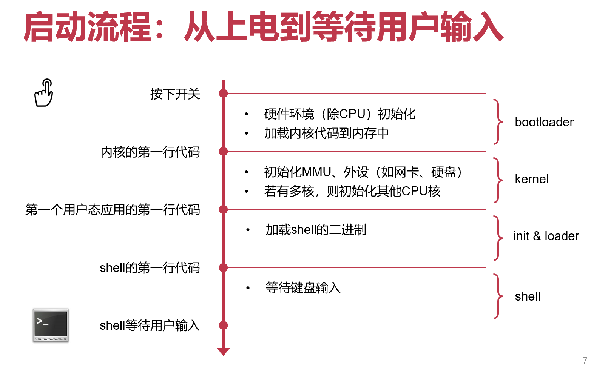

[TOC]

# 系统初始化

syscall 的本质：应用程序想要完成一些事情但是没有权限，需要**请求操作系统帮助**才能完成

## 计算机启动

## 内核启动的2个主要任务

- 任务-1：配置页表并开启虚拟内存机制，允许使用虚拟地址
  - 页表究竟改如何具体配置？
  - 难点：开启地址翻译的前一行指令使用物理地址，开启后立即使用虚拟地址，前后如何衔接？

- 任务2：配置异常向量表并打开中断，允许双循环
  - 异常向量表如何配置？
  - 打开后，异常处理的指令流如何流动？

## 内核代码的加载和运行

**需要用一段代码去初始化CPU，CPU在初始化之前运行不了代码**

树莓派上使用GPU（不需要自己初始化自己，开机后自己设置好，不需要软件代码初始化）先去运行第一行代码（GPU是树莓派自己做的，所以可以自己定义一套初始化流程；CPU是使用别人厂商的，那就需要用代码初始化）

### 入口函数位置

CPU从预定义的**RAM地址**读取第一行代码，由硬件厂商决定（树莓派：32位为0x8000，64位为0x80000，x86：0x7C00）

## ChCore 启动代码

- 设置CPU异常级别为EL1
- 设置初始化时的简单页表，并开启虚拟内存机制
  - TTBR0_EL1：虚拟地址 = 物理地址
  - TTBR1_EL1：虚拟地址 = 物理地址 + OFFSET
- 设置异常向量表
  - 每一个异常向量表项跳转到对应的异常处理函数
  - 处理异常前保存进程上下文、返回进程前恢复其上下文

**两个涉及到的目录：boot和kernel**

- boot目录：编译后放在 .init 段（可读可执行，只运行一次，可以在启动后被抛掉，节省一点点内存），低地址范围（有时也叫bootloader，再次注意不要混淆）
- kernel目录：编译后放在 .text 段（可读可执行），高地址范围

**PPT相关代码注解**

.lds.in 中的 . 表示当前“位置”地址，随着代码往里面添加，. 的值不断增大

寄存器名字中包含 _ELx 对应寄存器只能够在ELx的权限级下被访问

**初始化栈之前怎么bl和eret？**

- **ARM中只调用一层函数不需要栈（返回地址存寄存器LR，link register x30）**，当然多层调用中前面寄存器里放不下的函数返回地址进栈即可

**为什么调用C函数之前要设置栈**

- C不管这个函数是初始化还是在跑内核，因此函数调用时候会正常进行压栈（调用者被调用者保存寄存器等），为了调用C必须先初始化栈，也即在此之后就可以抛弃汇编

**start_kernel物理内存中实际上紧邻init（低地址），为什么可以跳到高地址段执行它？**

因为这之间完成了MMU物理地址到虚拟地址的转换（页表初始化）；物理空间中实际上离得很近，只是虚拟内存空间中两者地址相差比较大

### 页表初始化

- 对于ARM来说，整个虚拟地址空间中间是不用的（其实只用到了48-bit的地址，即16个0开头的地址和16个1开头的地址）
- TTBR1_EL1（16个1开头的地址的翻译）和TTBR0_EL1（16个0开头的地址的翻译）（页表基地址，显然只有内核能够访问页表基地址寄存器，故都是EL1）

**PPT相关代码注解**

boot_ttbr0_l0（l0代表第0级页表）

初始化部分：零级页表指向一级，一级指向二级

2M页的for循环：设置二级页表（2M大页，初始化时把所有内存都映射进来再说，之后再变成4K；也因此不需要初始化L3页表）

**映射设备地址时，为什么要设置DEVICE_MEMORY位（使其变为non-cachable）？**

- non-cachable：CPU访问内存时候不过cache，直接访问内存（对于volatile关键词）
- 设备内存：对应的memory不是真的memory，而是设备上的寄存器（在X86中有两个地址，一种是IO总线地址，另一种就是在物理内存上的地址），只不过是把这块的物理地址空间映射过去
- 这部分物理内存上的地址（对应设备上的寄存器）自己会变化（设备修改），如访问设备的时候需要轮询一个bit看其是否ready，那这个bit是设备修改，肯定不能存在缓存里，存在缓存就没有人改了

**设备内存和物理内存的区别？**

物理地址空间：设备地址（最顶部）和物理内存（从0开始）都会用到物理地址；也即即使你自己加内存条，也很可能因为原本物理地址空间顶上（再往上走）有设备地址，而无法扩展内存

设置TTBR1页表（高地址使用）：把TTBR1设置成和TTBR0一样的位置（映射到同样的物理地址区域），用不同的虚拟地址可以访问同一块物理地址

最终物理地址空间从0开始到物理内存区域结束，映射到低地址，映射到高地址（一块内存映射到两个地址）

页表设置后，开始翻译（enable 页表）

**尚未使用页表到打开页表后地址经过MMU翻译，为什么开启地址翻译的前一行指令使用物理地址，开启后立即使用虚拟地址，前后如何衔接？**

因为最底下这部分蓝色的物理内存地址和虚拟内存地址是一样的；PC的值加4之后，不管翻译还是不翻译，出来的地址结果都是一样的

### 异常向量表的初始化

el1_vector 异常向量表 中 调 syscall_table

## 内核启动前：BIOS（Basic Input/Output System）

BIOS负责计算机上电到内核开始运行（小芯片；许多PC都有这个硬件；嵌入式设备基本没有），通常保存在主板的只读内存（ROM）中，CPU负责执行BIOS（x86 CPU在reset后，PC固定指向0xFFFF0，0xFFFF0就是BIOS的物理地址，也就知道了BIOS在哪里）

- 上电后，开始执行BIOS ROM中的代码
  - 找到第一个可启动设备（如第一块磁盘），将可启动设备的第一个块（512字节，即MBR）加载到内存0x7c00中，跳转到bootloader的内存地址（物理地址0x7c00）并继续执行
- bootloader 开始执行
  - 将内核的二进制文件从启动设备加载到内存中（若内核文件是压缩包，则对其进行解压），跳转到（解压后的）内核加载地址（物理地址）并继续执行
- 内核代码开始执行

上电自检（POST，Power-On Self-Test）：BIOS程序首先检查，计算机硬件能否满足运行的基本条件；如果硬件出现问题，主板会发出不同含义的蜂鸣，启动中止。

主引导记录（MBR，Master Boot Record）：磁盘的0柱面0磁头0扇区称为主引导扇区（磁盘的第一块）；一个磁盘只能分四个主分区；包括三部分（主引导程序，硬盘分区表DPT，硬盘有效标志）

EFI / UEFI：Intel提出取代BIOS interface（为CPU提供软件配套）

## 两种启动的对比

- 定制化的主板（常见的ARM开发板，通常不再扩展其他设备）：树莓派等；初始化时有哪些硬件设备等都是知道的，一般厂商提供私有固件BSP（board support package）完成

- 通用的主板（常见如PC，通常需要再插入其他设备）：系统配置情况在开机的时候是不知道的，需要在启动的时候加入探测看看有哪些设备
