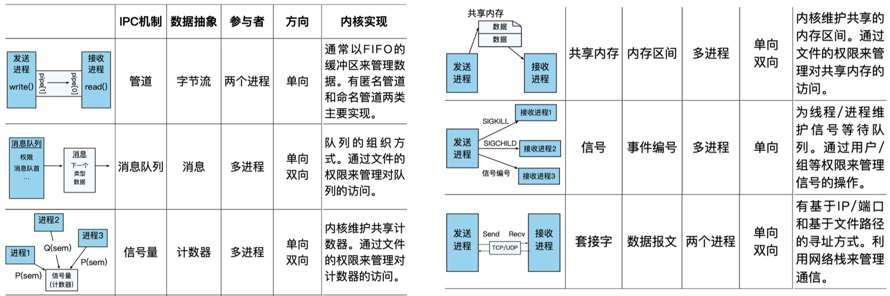

[TOC]

# 进程间通信 Inter-Process Communication（IPC）

一些应用程序选择使用不同进程来运行不同模块（把原本同一个地址空间的代码拆到两个地址空间）

- 优势-1：功能模块化，避免重复造轮子（如数据库、界面绘制）
- 优势-2：增强模块间隔离，增强安全保障（敏感数据的隔离）
- 优势-3：提高应用容错能力，限制故障在模块间的传播

**不同进程拥有不同的内存地址空间，进程与进程之间无法直接进行通信和交互，需要一种进程间通信的方式**

## 常见 IPC 的类型

| IPC 机制 | 数据抽象 | 参与者   | 方向      |
| -------- | -------- | -------- | --------- |
| 管道     | 文件接口 | 两个进程 | 单向      |
| 共享内存 | 内存接口 | 多进程   | 单向/双向 |
| 消息队列 | 消息接口 | 多进程   | 单向/双向 |
| 信号     | 信号接口 | 多进程   | 单向      |
| 套接字   | 文件接口 | 两个进程 | 单向/双向 |

### IPC 的接口类型

- 已有接口
  - 内存接口：共享内存；文件接口：管道（Pipe）、套接字（Socket）
- 新的接口
  - 消息接口、信号接口等
- 简单IPC的消息接口
  - 发送消息：`Send(message)`
  - 接收消息：`Recv(message)`
  - 远程方法调用：`RPC(req_message, resp_message)`
  - 回复消息：`Reply(resp_message)`

## 简单 IPC 的设计与实现

### 消息接口

- 最基本的消息接口
  - 发送消息：`Send(message)`
  - 接收消息：`Recv(message)`
- 远程方法调用与返回（RPC）
  - 远程方法调用：`RPC(req_message, resp_message)`
  - 回复消息：`Reply(resp_message)`

### 设计与实现

- 发送者和消费者需要依赖于一个通信连接chan（即channel），作为媒介进行消息传输

### 简单 IPC 的两个阶段

- 阶段-1：准备阶段
  - **建立通信连接**，即进程间的信道
    - 假设内核已经为两个进程映射了一段共享内存
- 阶段-2：通信阶段
  - 数据传递
    - "消息"抽象：通常包含头部（含魔数）和数据内容（500字节）【数据一般**不包含指针**，因为两边的虚拟地址空间不一样，指针内的地址无意义】
  - 通信机制
    - 两个消息保存在共享内存中：发送者消息、接收者消息
    - 发送者和接收者通过**轮询**消息的状态作为通知机制

### 简单 IPC 数据传递的两种方法

- 方法-1：基于共享内存的数据传递
  - **操作系统在通信过程中不干预数据传输**
  - 操作系统仅负责准备阶段的映射
  - 一次拷贝（one-copy）
- 方法-2：基于操作系统辅助的数据传递
  - 操作系统提供接口**（系统调用）**：Send、Recv
  - **通过内核态内存来传递数据**，无需在用户态建立共享内存
  - 两次拷贝（two-copy）， sender 到 OS内存 到 receiver

**两种数据传递方法的对比**

- 基于共享内存的优势
  - **用户态无需切换到内核态即可完成IPC**（多核场景下）
  - 完全由用户态程序控制，定制能力更强
  - 可实现零内存拷贝（无需内核介入）
- 基于系统调用的优势
  - 抽象更简单，用户态直接调用接口，使用更方便
  - 安全性保证更强，发送者在消息被接收时通常无法修改消息
  - 多方（多进程）通信时更灵活、更安全

### 简单 IPC 的通知机制

数据发完之后，通知对方说我已经发完了

- 方法-1：基于轮询（消息头部的状态信息）【时延更低】
  - 缺点：大量CPU计算资源的浪费
- 方法-2：基于控制流转移【时延更高，写消息的通知后不一定马上调度到读消息的进程】
  - 由内核控制进程的运行状态
  - 优点：进程只有在条件满足的情况（对方通知后）下才运行，避免CPU浪费

## IPC 控制流：同步和异步

- 同步 IPC
  - IPC操作会阻塞进程直到操作完成
  - 线性的控制流
  - 调用者继续运行时，返回结果已经ready
- 异步 IPC（不等待，直接继续往下走）
  - 进程发起IPC操作后即可返回而不需要等待其完成
  - 通过轮询或回调函数（需内核支持）来获取返回结果

## IPC 的超时机制（实际上一般还是完全同步/异步，而不会设置超时时间超参数）

- **一种新的错误：超时**
  - 传统的函数调用不存在超时问题
  - IPC涉及两个进程，分别有独立的控制流
- **超时可能的原因**
  - 被调用者是恶意的：故意不返回
  - 被调用者不是恶意的：运行时间过长、调度时间过长、请求丢失等
- **超时机制**
  - 应用可自行设置超时的阈值，但如何选择合适的阈值却很难
  - 特殊的超时机制：阻塞、立即返回（要求被调用者处于可立即响应的状态）

## IPC 的两种通信连接抽象

- 方法-1：直接通信
  - 通信的一方需要显示地标识另一方，每一方都拥有唯一标识
  - 如：`Send(P, message)`, `Recv(Q, message)`
  - 连接的建立是自动完成的（由内核完成）
- 方法-2：间接通信（建立一个信箱，一些进程往里面发，一些在里面收）
  - 通信双方通过**"信箱"的抽象**来完成通信
  - 每个信箱有自己唯一的标识符
  - **通信双方并不直接知道在与谁通信**
  - 进程间连接的建立发生在共享一个信箱时

## IPC 的权限检查

- **宏内核**
  - 通常基于权限检查的机制实现
  - 如：Linux中与文件的权限检查结合在一起（如 pipe，有权限打开对应文件的进程就有权限使用这个文件和其它进程通信）
- **微内核**（Capability 可以转让，类似于进程可以把带权限的 fd 转让给别的进程）
  - 通常基于Capability安全检查机制实现
  - 如seL4将通信连接抽象为内核对象，不同进程对于内核对象的访问权限与操作有Capability来刻画
  - Capability保存在内核中，与进程绑定
  - 进程发起IPC时，内核检查其是否拥有对应的Capability

## IPC 的命名服务

一个进程跟别的进程想要建立信道，需要先知道有这个进程，这就需要这个进程通过通信告诉它自己存在，也就需要信道，循环！

需要有一个全部进程都知道的人（well-known）——命名服务（单独的进程），它知道所有进程

所有进程启动时连接命名服务

- **命名服务：一个单独的进程**
  - 类似一个全局的看板，协调服务端与客户端之间的信息
  - 服务端可以将自己提供的服务注册到命名服务中
  - 客户端可以通过命名服务进程获取当前可用的服务
- **命名服务的功能：分发权限**
  - 例如：文件系统进程允许命名服务将连接文件系统的权限任意分发，因此所有进程都可以访问全局的文件系统
  - 例如：数据库进程只允许拥有特定证书的客户端连接

## 管道：文件接口的 IPC

管道(Pipe): 两个进程间的一根通信通道

- 一端向里投递，另一端接收 
- 管道是间接消息传递方式，通过共享一个管道来建立连接

### 匿名管道与命名管道

- **匿名管道：传统的管道缺乏名字，只能在有亲缘关系的进程间使用**
  - 也称为“匿名管道”
  - 通常通过fork，在父子进程间传递fd
- **命名管道（FIFO）：具有文件名**
  - 在Linux中也称为fifo，可通过 `mkfifo()` 来创建
  - 可以在没有亲缘关系的进程之间实现IPC
  - 允许一个写端，多个读端；或多个写端，一个读端

### 优点与问题

优点：设计和实现简单

- 针对简单通信场景十分有效

问题：

- 缺少消息的类型（就是文件的数据流），接收者需要对消息内容进行解析
- 缓冲区大小预先分配且固定
- 只能支持单向通信（buffer 写进去之后，另外一个人收取，只能单向）
- 只能支持最多两个进程间通信

## 共享内存（内存接口的IPC）

### 生产者消费者问题实现

### 共享内存的问题

- **缺少通知机制**
  - 若轮询检查，则导致CPU资源浪费
  - 若周期性检查，则可能导致较长的等待时延
  - **根本原因：**共享内存的抽象过于底层；缺少OS更多支持
- TOCTTOU （Time-of-check to Time-of-use）问题
  - 当接收者直接用共享内存上的数据时，可能存在被发送者恶意篡改的情况**（发生在接收者检查完数据之后，使用数据之前）**【如果拷贝到内核再拷贝回读进程就不会有这种情况】
  - 这可能导致buffer overflow等问题

## 消息队列（Message Passing）：一种带类型的消息传递机制

- 消息队列: 以链表的方式组织消息
  - 任何有权限的进程都可以访问队列，写入或者读取
  - 支持异步通信 (非阻塞)
- 消息的格式: 类型 + 数据
  - 类型：由一个整型表示，具体的意义由用户决定
- 消息队列是间接消息传递方式
  - 不同进程通过共享一个队列来建立连接

### 案例

file to key：`ftok();`

- 消息队列的组织
  - 基本遵循FIFO (First-In-First-Out)先进先出原则
  - 消息队列的写入：增加在队列尾部
  - 消息队列的读取：默认从队首获取消息
- 允许按照类型查询: `Recv(A, type, message)`
  - 类型为0时返回第一个消息 (FIFO)
  - 类型有值时按照类型查询消息
    - 如type为正数，则返回第一个类型为type的消息

## 消息队列 VS. 管道

- 缓存区设计:
  - 消息队列: 链表的组织方式，动态分配资源，可以设置很大的上限
  - 管道: 固定的缓冲区间，分配过大资源容易造成浪费
- 消息格式:
  - 消息队列: 带类型的数据
  - 管道: 数据 (字节流)
- 连接上的通信进程:
  - 消息队列: 可以有多个发送者和接收者
  - 管道: 两个端口，最多对应两个进程
- 消息的管理:
  - 消息队列: FIFO + 基于类型的查询
  - 管道: FIFO

## 轻量级远程方法调用 Lightweight Remote Procedure Call (LRPC)

“一个线程有很多的进程”

线程A调用另一个进程的线程B某个特定函数，之后执行流切换到该进程的线程B（不用经过调度器！），等执行完再切回原本线程A

<u>**线程的本质就是一个栈**</u>，A把自己的栈给到B，B使用并运行，之后再还给A（期间不经过调度器！）

内核的角度看，自始至终只有一个线程

**IPC 通常会带来较大的性能损失**

- 传统的进程间通信机制通常会结合以下机制：
  - 通知：告诉目标进程事件的发生
  - 调度：修改进程的运行状态以及系统的调度队列
  - 传输：传输一个消息的数据过去
- 缺少一个轻量的远程调用机制
  - **客户端进程切换到服务端进程，执行特定的函数 (Handler)**
  - 参数的传递和结果的返回

**解决两个主要问题**

- 控制流转换: Client进程快速通知Server进程（Client 尽快切换到 Server）
- 数据传输: 将栈和寄存器参数传递给Server进程

### 控制流转换: 调度导致不确定时延

- 控制流转换需要下陷到内核
- 内核系统为了保证公平等，会在内核中根据情况进行调度
  - 期望Client到内核直接到Server，但是实际上Client和Server之间可能会执行多个不相关进程

### 迁移线程: 将Client运行在Server的上下文

为什么需要做控制流转换?

- 使用Server的代码和数据
- 使用Server的权限 (如访问某些系统资源)

**只切换地址空间、权限表等状态，<u>不做调度和线程切换</u>**

### 数据传输: 减少数据拷贝的性能损失

#### 共享参数栈和寄存器

**参数栈 (Argument stack，简称A-stack）：**要传的参数放在 A stack

- 系统内核为每一对LRPC连接预先分配好一个A-stack
- <u>A-stack共享内存，被同时映射在Client进程和Server进程地址空间</u>
- Client进程只需要将参数准备到A-stack即可
  - 不需要内核额外拷贝

**执行栈（Execution stack，简称E-stack）：**Server 提前准备好，从 buffer pool 里面挑一个 stack 执行 A-stack 里面的参数

**共享寄存器**

- 普通的上下文切换: 保存当前寄存器状态 → 恢复切换到的进程寄存器状态
- LRPC迁移进程: 直接使用当前的通用寄存器
  - 类似函数调用中用寄存器传递参数

### 轻量远程调用：通信连接建立

- Server进程通过内核注册一个服务描述符
  - 对应Server进程内部的一个处理函数(Handler)
- 内核为服务描述符预先分配好参数栈（A stack，共享）
- 内核为服务描述符分配好调用记录 (Linkage record)
  - 用于从Server进程处返回（类似栈）
- 内核将参数栈交给Client进程，作为一个绑定成功的标志
  - 在通信过程中，通过检查A-stack来判断Client是否正确发起通信

**栈的作用**

- 传参（A stack，client 与 server 都可以访问）
- 记录函数调用流（E stack，server 内部的调用与返回，只有server能访问）
- return（Linkage record，跨进程的返回地址，即从 server 返回 client 应该返回到哪里）

### 轻量远程调用：一次调用过程

1. 内核验证绑定对象的正确性，并找到正确的服务描述符
2. 内核验证参数栈和连接记录
3. 检查是否有并发调用 (可能导致A-stack等异常)
4. 将Client的返回地址和栈指针放到连接记录中
5. 将连接记录放到线程控制结构体中的栈上 (支持嵌套LRPC调用)
6. 找到Server进程的*E-stack* *(*执行代码所使用的栈)
7. 将当前线程的栈指针设置为Server进程的运行栈地址
8. 将地址空间切换到Server进程中
9. 执行Server地址空间中的处理函数

**为什么需要将栈分成参数栈（A stack）和运行栈（E stack）？**

参数栈是为了共享传递参数，而执行栈是为了执行代码已经处理局部变量等使用的，只有 server 能访问

**LRPC中控制流转换的主要开销是什么？**

无 schedule，调度开销为0；主要开销来自于TLB flush，即地址空间的切换（来自硬件限制）是最主要的性能开销

**在不考虑多线程的情况下，共享参数栈是否安全？**

安全的。因为是同步IPC，所以在被调用者上下文执行的时候，其实没有其他人可以去读写A-stack

## ChCore 进程间通信

**建立通信连接**

1. 服务端进程在内核中注册服务
2. 客户端进程向内核申请连接目标服务端进程的服务
   - 可选: 设置共享内存
3. 内核将客户端请求请求转发给服务端
4. 服务端告诉内核同意连接 (或拒绝)
   - 可选: 设置共享内存
5. 内核建立连接，并把连接的Capability返回给客户端
   - 或返回拒绝

**通信过程 (发起通信)**

1. 客户端进程通过连接的Capability发起进程间通信请求
2. 内核检查权限，若通过则继续步骤3，否则返回错误
3. 内核直接切换到服务端进程执行 (不经过调度器)
   - 将通信请求的参数设置给服务端进程的寄存器中
4. 服务端处理完毕后，通过与步骤3相反的过程将返回值传回客户端

## IPC 小结

