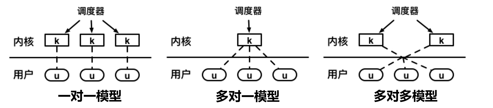

[TOC]

# 进程、线程与纤程（协程）

## 进程

**进程是计算机程序运行时的抽象**

- 静态部分：程序运行需要的代码和数据
- 动态部分：程序运行期间的状态（程序计数器、堆、栈……）
- **进程具有独立的虚拟地址空间**，每个进程都具有“独占全部内存”的假象
- 内核中同样包含内核栈和内核代码、数据

### 进程控制块（PCB，process control block）：户口本

如何表示进程（元数据），包括：

- 独立的虚拟地址空间（进程的标志性特征）
- 独立的执行上下文（表明进程具有独立的执行能力）

> 进程控制块存储在内核态，因为它由内核管理，不应被用户态的程序访问

### 进程管理（管理进程生命周期）

- 预备：随时可以被调度运行的状态
- 调度：调度器从预备的list中挑选进程来运行，对应进程转为运行状态
- exit：运行中的进程调用exit，变为zombie（僵尸态）
- wait：进程想要一些资源，但是此刻尚不能满足，进入阻塞状态等一段时间，直到有资源了再恢复为预备状态
- 时间片到：来了一个时钟中断，内核态看当前进程运行的时间是否用完，用完了就从预备队列list里面出一个进程出来执行

**预备队列会不会有空的情况？**

不会，会在队列中放一个 idle 进程。没有可调用的预备进程时，会调用到 idle process（第一个进程启动之前也调用该process），其只运行一行代码 hlt（让CPU进入低功耗，之后CPU什么都不干，直到下一个中断到来）

### 进程创建：fork()

语义：为调用进程创建一个一模一样的新进程（调用进程为**父进程**，新进程为**子进程**）

fork后的两个进程均为独立进程（拥有不同的进程id；可以并行执行，互不干扰（除非使用特定的接口）；父进程和子进程会共享部分数据结构（内存、文件等））

#### 进程树与进程组

进程树：任何进程来自于其父进程（fork出来） → 进程之间的关系构成树状结构

进程组：一个进程和它的所有子进程（子进程默认与父进程属于同一个进程组）

一个进程父进程被kill，子进程还在，其会被挂到第一个进程（init）上

#### fork实现的优化：写时拷贝（Copy-On-Write）

基本思路：**只拷贝内存映射，不拷贝实际内存**

**早期fork直接将父进程拷贝一份**

- 性能差：时间随占用内存增加而增加
- 无用功：fork之后如果调用exec，拷贝的内存就作废了

#### 优缺点

- fork的优点
  - 接口非常简洁
  - 将进程“创建”和“执行”（exec）解耦，提高了灵活度
  - 刻画了进程之间的内在关系（进程树、进程组）
- fork的缺点
  - 完全拷贝过于粗暴（不如clone）【fork后直接exec，很多操作会白做，如创建新进程会复制页表，复制内存等】
  - 性能差、可扩展性差（不如vfork和spawn）
  - 不可组合性 (例如：fork() + pthread())

Win上创建进程的实现：`create_process(...)`

#### fork 的替代接口

思路：把常见的和 fork 一起用的调用组合在一起（只用调一次syscall）；减少 fork 冗余，重复，不必要的工作

- vfork：类似于fork，但让父子进程共享同一地址空间。连映射都不需要拷贝，性能更好，但是只能用在”fork + exec”的场景中
- posix_spawn：相当于fork + exec
- clone：fork的“进阶版”，可以选择性地不拷贝内存

### 进程的执行：exec

通常在fork之后调用（exec在载入可执行文件后会重置地址空间）

## 线程：更加轻量级的运行时抽象

希望一个应用能够去用多核！

**为什么需要线程？**

- 创建进程的开销太大
  - 包括了数据、代码、堆、栈等
- 进程的隔离性过强
  - 进程间交互：可以通过进程间通信（IPC），但开销较大
- 进程内部无法支持并行

**线程只包含运行时的状态**

- 静态部分由**进程**提供
- 包括了执行所需的**最小**状态（主要是寄存器和栈）

**一个进程可以包含多个线程**

- 每个线程共享同一地址空间（方便数据共享和交互）
- 允许进程内并行

<u>进程是资源分配的单位，线程是调度的单位</u>

**一个进程的多线程可以在不同处理器核上同时执行**

### 多线程进程的地址空间（标准认知）

- 每个线程拥有自己的栈
- 内核中也有为线程准备的内核栈（每个线程有自己的内核栈）
- 其它区域各个线程共享（数据、代码、堆……）

### 用户态线程与内核态线程

- 根据线程是否受内核管理，可以将线程分为两类
  - 内核态线程：内核可见，受内核管理（每一个线程对应一个内核栈）
  - 用户态线程：内核不可见，不受内核直接管理
- 内核态线程
  - 由内核创建，线程相关信息存放在内核中
- 用户态线程（纤程/协程）
  - 在应用态创建，线程相关信息主要存放在应用数据中

### 线程模型

**线程模型表示了用户态线程与内核态线程之间的联系**

- 一对一模型：一个用户态线程对应一个内核态线程（99%是此种）
- 多对一模型：多个用户态线程对应一个内核态线程（为了模仿内核提供的线程的调度模式造出来的概念）
- 多对多模型：多个用户态线程对应多个内核态线程

### 线程的相关数据结构：TCB（thread control block），户口本

一对一模型的TCB可以分为两部分

- 内核态：与PCB结构类似
  - Linux中进程与线程使用的是同一种数据结构（task_struct）
  - 上下文切换中会使用
- 应用态：可以由线程库定义
  - Linux：pthread结构体
  - Windows：TIB（Thread Information Block）
  - 可以认为是内核TCB的扩展

### 线程本地存储（TLS，Thread Local Storage）

**不同线程可能会执行相同的代码**

线程不具有独立的地址空间，多线程共享代码段

**问题：对于全局变量，不同线程可能需要不同的拷贝**

举例：用于标明系统调用错误的errno

**线程独立的数据（不希望被其它线程访问）**

- 考虑放到自己的栈上？
- 使用 TLS

#### TLS 细节

- **线程库允许定义每个线程独有的数据**
  - __thread int id; 会为每个线程定义一个独有的id变量
- **每个线程的TLS结构相似**
  - 可通过TCB索引
- **TLS寻址模式：基地址＋偏移量（编译器实现）**
  - 对于某一个特定的数据，偏移量对于所有的 thread 都是一样的；但是每一个 thread TLS这一部分的基地址是不一样的，也因此会访问到不一样的地方！！（和虚函数有点类似）
  - X86: 段页式 (基地址在fs寄存器) 
  - AArch64: 特殊寄存器tpidr_el0

**在多线程的进程里面调用 fork，出来的进程是多线程的还是单线程的？如一个进程有三个线程，<u>其中一个线程</u>调用了 fork（不可能这些线程同时调 fork）**

调用fork的这个线程会进入内核态，内核会COW出一个页表，新fork出来的进程PC值指向fork的下一行，继续往下执行；此过程中另外两个线程原来的线程栈还在当前新进程的地址空间里，但是没有人用！新进程的内核栈只有一个！也即只 fork 了一个线程！

**多线程进程，希望fork出来也是一个多线程的进程，应该怎么办？**

- 把三个线程先整合为一个线程（用户态），调用fork（内核态）得到一个进程中的一个线程，之后再从一个线程变为三个线程（用户态）
- 三合一：三个 thread 的状态保存在内存里，让其中两个 thread join 和 exit
- 一变三：新线程调用 pthread_create 并恢复其状态

### 线程的基本操作：以pthreads为例

- 创建：`pthread_create`
  - 内核态：创建相应的内核态线程及内核栈
  - 应用态：创建TCB、应用栈和TLS（和原来进程共享一个地址空间）
- 合并：`pthread_join`
  - 等待另一线程执行完成，并获取其执行结果
  - 可以认为是fork的“逆向操作”
- 退出：`pthread_exit`
  - 可设置返回值（会被pthread_join获取）
- 暂停：`pthread_yield`
  - 立即暂停执行，出让CPU资源给其它线程
  - 好处：可以帮助调度器做出更优的决策

## 上下文切换

### 进程上下文的组成（AArch64）

**进程上下文需要包含哪些内容？**

- 常规寄存器：X0-X30
- 程序计数器（PC）： 保存在ELR_EL1（用户态进入内核态时保存PC）
- 栈指针：SP_EL0
- CPU状态（如条件码）：保存在SPSR_EL1

**为什么进程上下文只需要保存寄存器信息，而不用保存内存？**

因为内存的数据不会因为切换而消失（不主动覆盖它就不会消失），但寄存器只有一组

### 进程的内核态执行：切换到内核态（1）

AArch64提供了**硬件支持**，使进程切换到内核态执行

- 状态（PSTATE）写入SPSR_EL1
- 栈指针寄存器切换到SP_EL1
- PC移动到内核异常向量表中（将PC修改为异常向量表中对应的系统调用代码位置，之后执行对应代码）
- PC值写入ELR_EL1
- 运行状态切换到内核态EL1

### 用户态/内核态切换时的处理器状态变化

### 处理器在切换过程中的任务

1. 将发生异常事件的指令地址保存在ELR_EL1中

2. 将异常事件的原因保存在ESR_EL1

   例如，是执行svc指令导致的，还是访存缺页导致的

3. 将处理器的当前状态（即PSTATE）保存在SPSR_EL1

4. 将引发缺页异常的内存地址保存在FAR_EL1

5. 栈寄存器不再使用SP_EL0（用户态栈寄存器），开始使用SP_EL1

   内核态栈寄存器，需要由操作系统提前设置

6. 修改PSTATE寄存器中的特权级标志位，设置为内核态

7. 找到异常处理函数的入口地址，并将该地址写入PC，开始运行操作系统

   根据VBAR_EL1寄存器中保存的异常向量表基地址，以及发生异常事件的类型确定

### 进程的内核态执行：内核栈

应用程序调用syscall到内核的时候，内核栈是空的；syscall即将返回用户态之前，内核栈也是空的！（栈里面之所以要存东西，是因为执行的时候被切走，切回来的时候要恢复状态）

**为什么内核自己需要有一个栈？**

- 进程在内核中依然执行代码，有读写临时数据的需求
- 进程在用户态和内核态的数据应该相互隔离，增强安全性

安全性问题举例：

某一个线程的内核正在用（写）一块栈所在的内存区域（包括返回地址），之后同一个进程的不同的另一个线程（有权限访问上述内存区域，rw），可以修改那个内存区域的内容（比如返回地址）。而此时在内核态的线程执行流就会被控制！

- x86下用户态到内核，需要保存栈寄存器内容（存内存中），并把栈寄存器中改为内核栈顶
- AArch64中则因为有两个栈指针寄存器，在内核/用户态切换间不需要另外保存栈寄存器，节省了内存写！

### 进程的内核态执行：返回用户态（5）

进入内核态的“逆过程”，AArch64同样提供了硬件支持（直接重设PC，少了对原来PC值的保存，原因见下）

- SPSR_EL1重设到CPU PSTATE
- 栈指针寄存器切换到SP_EL0
- ELR_EL1重设到PC寄存器中
- 运行状态切换到用户态EL0

**调用syscall进到内核，内核栈是空的，PC的值和进来的异常原因相关（exception，page fault，中断......），回去时内核栈也空了，PC的值也不重要（不需要保存，下次进来肯定是依据触发异常的原因决定进到哪个位置，和上次出内核的位置无关！）**

> 内核的状态都保存在内核自己 `kalloc` 出的内存里面；内核上下文（内核栈指针，PC等）不需要保存

### 内核/用户态切换与上下文切换（2，4）

- 不同进程地址空间不同，使用的寄存器值也不同（如PC）
- 但是**寄存器只有一个！**直接恢复会导致错误
- 解决方法：保存**上下文**（寄存器）到内存，用于之后恢复

### 上下文与其他内核数据结构

- 与进程相关的三种内核数据结构：PCB、上下文、内核栈
- PCB保存指向上下文的引用（process_ctx）
- 上下文的位置**固定**在内核栈底部

#### 上下文保存（ChCore为例）

- 进入内核后调用exception_enter完成（将各寄存器逐一放入内核栈中）
- 上下文保存的“逆过程”：调用exception_exit完成（从内核栈读取出各寄存器，并清空内核栈，最后调用eret）

### 切换过程（3）

- 关键1:如何切换到p1的地址空间？
- 关键2:如何切换到已经存储的p1上下文并进行恢复？

#### 步骤1：地址空间的切换

AArch64的地址空间管理

- 内核与用户态地址空间分开管理（使用两个寄存器）
- 用户地址空间独有，内核地址空间共享
- 因此，只需要实现用户地址空间切换即可

virt to phys：减偏移量即可

tlbi：刷掉TLB

#### 步骤2：如何切换到p1的上下文？

SP_EL1内核栈指针从原本的上下文（刚刚存对应的寄存器）变为要切换到的上下文（要 restore 对应的寄存器）

### 总结：上下文切换栈变化全过程

- **共涉及两次权限等级切换、三次栈切换**
- **内核栈的切换是线程切换执行的“分界点”**

## 纤程（协程，用户态线程）

**一对一线程模型的局限：**性能不够，开销大

- **复杂应用：对调度存在更多需求**
  - 生产者消费者模型：生产者完成后，消费者最好马上被调度
  - 内核调度器的信息不足，无法完成及时调度
- **“短命”线程：执行时间亚毫秒级（如处理web请求）**
  - 内核线程初始化时间较长，造成执行开销
  - 线程上下文切换频繁，开销较大

### 纤程好处

**比线程更加轻量级的运行时抽象**（内核看不到纤程的切换）

- 不单独对应内核线程
- 一个内核线程可以对应多个纤程（多对一）

**纤程的优点**

- 不需要创建内核线程，开销小
- 上下文切换快（不需要进入内核）
- 允许用户态自主调度，有助于做出更优的调度决策

### Linux对于纤程的支持：ucontext

每个ucontext可以看作一个用户态线程

- makecontext：创建新的ucontext
- setcontext：纤程上下文切换
- getcontext：保存当前的ucontext

#### 案例

**和直接 `produce()` 与 `consume()` 函数互相调用有什么区别**

函数调用是一层一层在栈里面嵌套，而纤程是模拟上下文切换（直接改栈）

### 纤程优势

- **纤程切换及时**
  - 当生产者完成任务后，可直接用户态切换到消费者
  - 对该线程来说是最优调度（内核调度器和难做到）
- **高效上下文切换**
  - 切换不进入内核态，开销小
  - 即时频繁切换也不会造成过大开销

