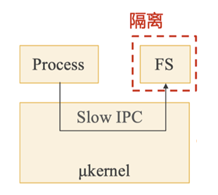
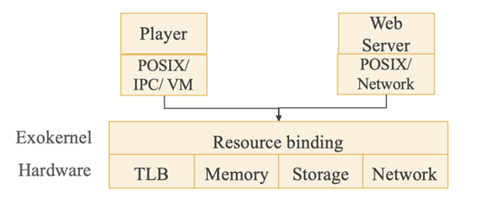

[TOC]

# 操作系统 OS

硬件和应用之间的软件层

## 操作系统为应用提供的一些服务

## 操作系统对应用的管理

# 操作系统结构

**设计原则：策略与机制的分离**

- 策略（Policy）：要做什么 —— 相对动态

- 机制（Mechanism）：该怎么做 —— 相对静态

操作系统可仅通过调整策略来适应不同应用的需求

## 宏内核（Monolithic Kernel）：如 UNIX/Linux、Free BSD

整个系统分为内核与应用两层

- 内核：运行在特权级，集中控制所有计算资源
- 应用：运行在非特权级，受内核管理，使用内核服务
- 其间通过系统调用交互

## 微内核（Micro-Kernel）：如 Mach、L4、seL4、QNX、Google Fuchsia

**设计原则：最小化内核功能**

- 将单个功能从内核拆分出来，移到用户态，称为"服务"（Server）
- 内核仅保留极少功能，为这些服务提供通信（如进程间通信 IPC）等基础能力
- 在用户模块之间，使用消息传递机制通信

**性能较差：内核中的模块交互由函数调用变成了进程间通信**

## 混合内核架构：如 macOS / iOS、Windows NT

宏内核与微内核的结合

- 将需要性能的模块重新放回内核态
- macOS / iOS：Mach微内核 + BSD 4.3 + 系统框架
- Windows NT：微内核 + 内核态的系统服务 + 系统框架

## 外核+库OS（Exokernel **+** LibOS）

- 过度的硬件资源抽象会带来较大的性能损失
- 操作系统提供的硬件资源抽象是针对所有应用的通用抽象，对于一些具体的应用而言这些抽象往往不是最优的选择

**由应用来尽可能控制对硬件资源的抽象（应用可以选择最合适的库OS）。**

内核态：Exokernel（管理应用）【只负责实现硬件资源在多个库OS之间的多路复用，并管理这些库OS实例的生命周期】

用户态：libOS（服务应用）【封装了硬件的抽象，并与应用直接连接；开发者可以选择已有的适合的库OS，或选择自己开发】

- OS无抽象，能在理论上提供最优性能

### 外核架构（Exokernel）

**设计原则：将管理与保护分离**

- 不提供硬件抽象
- 不管理资源，只管理应用（负责将计算资源与应用的绑定，以及资源的回收；保证多个应用之间的隔离）

> 功能：
>
> 追踪计算资源的拥有权：安全绑定（Secure binding）
>
> ​	允许某个LibOS访问某些计算资源（如物理内存），并防止这些计算资源被其他LibOS访问
>
> 保证资源的保护：显式回收（Visible revocation）
>
> ​	显式告知应用资源的分配情况，应用在租期结束之前主动归还资源
>
> 回收对资源的访问权：中止协议（Abort protocol）
>
> ​	若应用不归还资源，则强制中止

### 库OS（LibOS）

- 策略与机制分离：将对硬件的抽象以库的形式提供
- 高度定制化：不同应用可使用不同的LibOS，或完全自定义
- 更高性能：LibOS与应用其他代码之间通过函数调用直接交互

## 单内核（Unikernel）

- 可以看做虚拟化环境下的LibOS
  - 每个虚拟机只使用内核态
  - 内核态中只运行一个应用+LibOS
  - 通过虚拟化层实现不同实例间的隔离

- 适合容器应用场景
  - 每个容器就是一个虚拟机
  - 每个容器运行定制的LibOS以提高性能

## 多内核/复内核（Multikernel）

将一个众核系统看成是由多个独立处理器核通过网络互联而成的分布式系统

思路

- 默认的状态是划分而不是共享
- 维持多份状态的copy而不是共享一份状态
- 显式的核间通信机制（提供一层基于进程间通信的抽象，从而避免处理器核之间通过共享内存进行隐式共享）

设计

- 在每个core上运行一个小内核（包括CPU、GPU等）
- OS整体是一个分布式系统
- 应用程序依然运行在OS之上

## 不同操作系统架构的对比

性能：外核＞宏内核＞微内核

**微内核与外核区别**

微内核：服务各个应用共享；内核中模块的交互由函数调用变为IPC

外核：一个库OS管理并直接服务于一个应用；系统调用又变回函数调用
