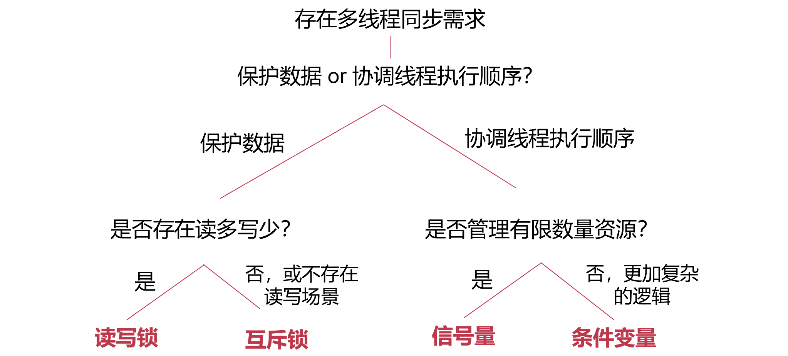

[TOC]

# 同步原语（Synchronization Primitives）

> **同步原语**（Synchronization Primitives）是一个平台（如**操作系统**）提供的用于帮助开发者实现线程之间**同步**的**软件工具**

**另一种划分思路：**

- 同步（order 相关）：强调先后顺序（如 producer 和 consumer 不同情况下谁先做谁后做）
- 互斥（exclusive 相关）：不在乎顺序（一个 critical section 同时只能有一个人跑，核心在于两个人同时跑，不关心谁先谁后）

**多处理器与多核**

- 单核性能提升遇到瓶颈
- 不能通过一味提升频率来获得更好的性能
- 通过增加CPU核数来提升软件的性能

**多核的问题**

- 正确性问题
  - 对共享资源的竞争导致错误，操作系统提供同步原语供开发者使用
- 性能可扩展问题
  - 大部分核无事可干

## 临界区（Critical Section）

任意时刻，有且只有一个线程可以进入临界区执行

**实现临界区抽象的三个要求**

1. 互斥访问：在同一时刻，**有且仅有一个进程**可以进入临界区
2. 有限等待：当一个进程申请进入临界区之后，必须在**有限的时间**内获得许可进入临界区而不能无限等待
3. 空闲让进：当没有进程在临界区中时，必须在申请进入临界区的进程中选择一个进入临界区，保证执行临界区的**进展**  

**可以考虑关闭中断来解决临界区问题吗？**

可以解决单个CPU核上的临界区问题，如果在多个核心中，关闭中断不能阻塞其他进程执行（进程的所有线程都在一个核上跑，是可以的）

## 软件解决方案：皮特森算法


## 四种同步原语

| 同步原语 | 描述                             | 适用场景                           |
| -------- | -------------------------------- | ---------------------------------- |
| 互斥锁   | 保证对共享资源的**互斥访问**     | 共享资源互斥访问                   |
| 读写锁   | 允许读者线程**并发读取**共享资源 | 读写场景并发读取                   |
| 条件变量 | 提供线程**睡眠**与**唤醒**机制   | 条件等待与唤醒                     |
| 信号量   | 协调**有限数量**资源的消耗与释放 | 多资源协调管理（ring buffer 实现） |

- 互斥锁——共享资源的互斥访问：多个线程需要同时访问同一共享数据，应用程序需要保证**互斥访问**避免数据竞争
  - 读写锁——读写场景并发读取：多个线程**只会读取**共享数据，允许读者线程**并发执行**
- 条件变量——条件等待与唤醒：线程等待某条件时**睡眠**，达成该条件后**唤醒**
- 信号量——多资源协调管理：多个资源可以被多个线程**消耗或释放**，正确协同线程获取资源或等待


### 互斥锁（Mutual Exclusive Lock）

共享资源的**互斥访问**

#### 接口

- `Lock(lock)`：尝试拿到锁
  - 若当前没有其他线程拿着lock，则拿到lock，并继续往下执行
  - 若lock被其他线程拿着，则不断循环等待放锁（busy loop）
- `Unlock(lock)`：释放锁
- 保证同时只有一个线程能够拿到锁

> `pthread` 库提供的互斥锁实现
>
> `pthread_mutex_lock(&lock);`
>
> `pthread_mutex_unlock(&lock);`


### 条件变量（Conditional Variable）

线程等待某条件时**睡眠**，条件满足后**唤醒**（避免无意义等待，操作系统的调度器调度其他进程/线程执行）


#### 接口

- `void cond_wait(struct cond *cond, struct lock *mutex)`：等待
  - 放入条件变量的**等待队列**
  - 阻塞自己同时释放锁：即调度器可以调度到其他线程
  - 被唤醒后重新**获取锁**
- `void cond_signal(struct cond *cond)`：唤醒
  - 检查**等待队列**
  - 如果有等待者则**移出等待队列并唤醒**

`cond`：标记等待队列（唯一标记在哪个队列中等待，因而实际上可以只用很少的bit来实现）

#### 使用案例


### 信号量（Semaphore）

> 条件变量使用复杂，通过信号量抽象包装与简化：使用**互斥锁**搭配**条件变量**完成资源的等待与消耗，需要单独创建互斥锁与条件变量，并手动通过计数器来管理资源数量。为何不提出一种新的同步原语，便于在多个线程之间**管理资源**？

多个**资源**可以被多个线程消耗或释放（资源管理）

信号量协调（阻塞/放行）多个线程共享有限数量的资源

#### PV 原语

语义上：信号量的值cnt记录了**当前可用资源的数量**

- P 操作（pass）：消耗资源
- V 操作（increment）：增加资源

```c++
// P操作：消耗资源
void sem_wait(sem_t *sem) {
	while(sem->cnt <= 0)	// cnt代表剩余资源数量
		/* Waiting */;
	sem->cnt--; 
}
// V操作：增加资源
void sem_signal(sem_t *sem) {
	sem->cnt++;
}
// 注意：此处代码只展示语义，并非真实实现
```

#### 使用案例


**生产者消费者问题中的使用**


#### 二元信号量与计数信号量

- 二元信号量：初始化资源数量为1
  - 其计数器（counter）只有可能为0、1两个值，同一时刻**只有一个**线程能够拿到资源
- 计数信号量：初始化资源数量大于1
  - 同一时刻**可能有多个**线程能够拿到资源


### 读写锁

读写场景的并发读取（允许读者并发读取）

- 区分读者与写者，**允许读者之间并行，读者与写者之间互斥**
  - 读者在临界区时，读者可以进入临界区，写者不能进入临界区
  - 写者在临界区时，读者不能进入临界区，写者不能进入临界区

#### 使用案例


#### 偏向性

读者在临界区，有新的写者在等待，之后另一个读者到来，是读者还是写者先进入临界区

- 偏向写者的读写锁
  - 后序读者必须等待写者进入后才进入
  - 更加公平，数据更新更及时
- 偏向读者的读写锁
  - 后序读者可以直接进入临界区
  - 更好的并行性


## 同步原语对比

互斥锁/条件变量/信号量：

- **互斥锁**与**二元信号量**（只允许0与1的信号量：只有一个资源，即互斥锁）功能类似，但**抽象不同**：
  - 互斥锁有**拥有者**的概念，一般同一个线程拿锁/放锁
  - 信号量为资源协调，一般一个线程signal，另一个线程wait
- **条件变量**用于解决不同问题（睡眠/唤醒），需要搭配**互斥锁**使用
- 条件变量搭配互斥锁+计数器可以实现与信号量相同的功能


## 同步原语带来的问题

**死锁产生的原因：**互斥访问（同一时刻只有一个线程能够访问），持有并等待（一直持有一部分资源并等待另一部分不会中途释放），资源非抢占（即proc_B不会抢proc_A已经持有的锁A），循环等待（A等B，B等A）

**死锁的解决：**死锁的检测与恢复（出问题再处理）、预防（设计时避免）和避免（运行时避免）

### 死锁检测与恢复（出问题再处理）

资源分配图中检测持有/等待锁的环，kill 环中的一个/多个进程

### 死锁的预防（设计时避免）

- 避免互斥访问：通过其他手段（如代理执行，只有代理线程能够访问共享资源，线程发送修改请求给代理线程，由代理线程统一执行，代理锁实现该功能）
- 不允许持有并等待：一次性申请所有资源（`trylock(lck)`，非阻塞，立即返回成功/失败）
  - 注意要避免死锁带来的活锁 Live Lock
- 资源允许抢占：需要考虑如何恢复到被抢占的拿锁前状态（直接抢占锁）
- 打破循环等待：按照特定顺序获取资源（对锁编号，按顺序拿锁）

### 死锁避免（运行时避免）

#### <u>银行家算法</u>

- 所有进程获取资源需要通过**管理者**同意
- 管理者**预演**会不会造成死锁
  - 如果会造成：阻塞进程，下次再给
  - 如果不会造成：给进程该资源  

<u>**分配给能满足其全部资源需求的进程**</u>

对于一组线程 `{P1, P2, ... , Pn}`：

- 安全状态：能找出至少一个执行序列，如 `P2->P1->P5...` 让所有线程需求得到满足
- 非安全状态：不能找出这个序列，必定会导致死锁
- 银行家算法：保证系统一直处于**安全状态**，且按照这个序列执行

##### 算法细节

M个资源 N个线程

- 全局可利用资源：`Available[M]`
  - 代表某一时刻系统中每一类元素的可用个数。这个向量初始化时设置为系统中拥有的第M类资源的总量
- 每线程最大需求量：`Max[N][M]`
  - 该矩阵包含所有线程N对第M类资源的最大需求量
- 已分配资源：`Allocation[N][M]`
  - 该矩阵包含已经分配给所有线程N的M种资源的数量
- 还需要的资源：`Need[N][M]`
  - 该矩阵包含所有线程N对第M类资源还需要的资源数量

##### 案例


安全序列： `P2 -> P1 -> P3`，通过安全性检查，处于安全状态！（先一次性给P2分配其需要的所有，执行完P2释放之后，Available 变成 A 3 B 2，可以满足P1的需求，一次性给P1分配其需要的所有，执行完P1释放之后，Available 变成 A 5 B 10，可以满足P3的需求）

新来请求：P1请求资源，需要A资源2份，B资源1份


- 假设分配给它，运行安全检查：无法通过（由于此时P1的所有need没有被完全满足，其无法执行完，因此不会释放拿到的资源，看下一个时不能把available加上P1的allocation；此时available不能满足任何一个线程的need）
- 采取行动：阻塞P1，保证系统维持在安全状态


## 同步原语的应用

### 多线程执行屏障：所有线程都要到对应执行点，才能都继续执行（条件变量）


```c++
lock(&thread_cnt_lock);
thread_cnt--;
if (thread_cnt == 0)
  cond_broadcast(cond);	// 唤醒所有等待的线程
while(thread_cnt != 0)
  cond_wait(&cond, &thread_cnt_lock); 
unlock(&thread_cnt_lock);
```

### 等待队列工作窃取：做得快的从做得慢的等待队列中窃取任务帮忙做（互斥锁）

`lock(ready_queue_lock[0]);`

### MapReduce：Wordcount任务（条件变量，信号量）

- Mapper：统计一部分文本自述
- Reducer：一旦其中<u>任意数量</u>的Mapper结束，就累加其结果

```c++
// 条件变量
// Mapper
lock(&finished_cnt_lock);
finished_cnt++;
cond_signal(&cond);
unlock(&thread_cnt_lock);

// Reducer
lock(&finished_cnt_lock);
while(finished_cnt == 0)
  cond_wait(&cond, &finished_cnt_lock);
/* collect result */	// Reducer起来后，可能发现多个mapper finish
finished_cnt = 0;	// 一次性拿走所有的finished的Mapper的结果
unlock(&thread_cnt_lock);

// 信号量，将Mapper的结果视为资源
// Mapper
signal(&finish_sem);

// Reducer
while(finished_cnt != mapper_cnt) {
  wait(&finish_sem);
  /* collect result */
  finished_cnt ++;
}
```

两种方式的不同：

- cv可以多个结果一起collect，sem这种只能一次collect一个
- sem的语义，就是一次只能拿走一个（counter每次只能减一）
- 但cv更复杂

### 网页渲染：等待<u>所有的请求均完成</u>之后再进行渲染（条件变量，信号量）

```c++
// 条件变量
// Request_cb 请求线程
lock(&glock);
finished_cnt ++；
if (finished_cnt == req_cnt)
  cond_signal(&gcond);
unlock(&glock);

// 渲染线程
lock(&glock);
while (finished_cnt != req_cnt)
  cond_wait(&gcond, &glock);
unlock(&glock);

// 信号量
// Request_cb 请求线程
signal(&gsem);

// 渲染线程
while(remain_req != 0) {
  wait(&gsem);
  remain_req --;
}
```

- 必须所有结束，渲染才能继续（渲染线程处于阻塞状态）

两种方式的不同：

- 信号量的案例中渲染线程会被唤醒多次，条件变量案例中渲染线程只会被调用一次
- 与barrier场景的区别：barrier不适合用sem，没有什么适合抽象成等待的资源

### 线程池并发控制：控制同一时刻可以执行的线程数量（信号量）

控制同一时刻可以执行的线程数量

原因：有的线程阻塞时可以允许新的线程替上

```c++
// 信号量，视剩余可并行执行线程数量为有限资源
thread_routine () {
  wait(&thread_cnt_sem);
  /* doing something */
  signal(&thread_cnt_sem);
}
```

### 网页服务器：client向server获取网页，后端更新存在server的网页（读写锁）

- 处理响应客户端获取静态网页需求
- 处理后端更新静态网页需求
- 不允许读取更新到一半的页面

client 读锁，后端写锁


## 同步原语选择依据

- 存在多线程同步需求
  - 保护数据（data）
    - 存在读多写少
      - 是：读写锁
      - 否（或不存在读写场景）：互斥锁
  - 协调线程执行顺序（order）
    - 管理有限数量的资源
      - 是：信号量
      - 否（复杂逻辑）：条件变量




## 同步原语的实现

### <u>原子指令</u>（硬件提供）

保证执行期间不会被打断

- Test-and-set：Intel
- Compare-and-swap：Intel（悲观）
- Load-linked & Store-conditional：ARM（乐观）
- Fetch-and-add：Intel

#### Test-and-set（TAS）

#### Compare-and-swap（CAS）

老的CAS实现会把整个总线都锁住，相当于整个系统中同时能够进行CAS的代码只有一处

#### Load-linked & Store-conditional（LL & SC）

先load一下，读的时候把对应地址的状态记下来，但是如果在后续的执行中有别人修改了，那么在store的时候就会出错，无法成功store进去

> if no one has updated *ptr since the LoadLinked to this address, then change the value of the pointer

```assembly
retry:	ldxr	x0, addr	# LL 读的时候监视addr
	cmp	x0, expected
	bne	out
	stxr	x1, new_value, addr	# SC 修改的时候看addr是否被其他人修改
	cbnz	x1, retry	# 没人修改就写成功，否则回到retry
out:	
```

系统中可以很多地方同时 LL & SC

#### Fetch-and-add（FAA）

### 锁的实现

#### 自旋锁（Spin Lock）


`atomic_CAS(lock,0,1)`：比较 lock 是否等于0，如果是就把lock修改为1

`*lock = 0`：只有一个人可能同时拿到锁，因此不需要在放锁的时候使用原子指令

**实现**

```c++
void lock(int *lock) {
    while(atomic_CAS(lock, 0, 1) 
	!= 0)
	/* Busy-looping */ ;
}

void unlock(int *lock) {
    *lock = 0;
}
```

**问题**

- 有限等待：有的“运气差”的进程可能永远也不能成功CAS => 出现饥饿
- 空闲让进：依赖于硬件 => 当多个核同时对一个地址执行原子操作时，能否保证至少有一个能够成功（这里我们认为硬件能够确保原子操作make progress）

#### 排号锁（Ticket Lock）：实现有限等待

保证竞争者公平性，按照竞争者到达**顺序**来传递锁

**实现**

```c++
// owner：当前拿着锁的
// next：表示目前放号的最新值
void lock(int *lock) {
    volatile unsigned my_ticket =
        atomic_FAA(&lock->next, 1);	// 原子拿号，并递增目前放号的最新值
    while(lock->owner != my_ticket)	// 等待叫号
	/* busy waiting */;
}

void unlock(int *lock) {
    lock->owner ++;	// 叫下一个号
}
```

- 有限等待：按照顺序，在前序竞争者保证有限时间释放时，可以达到有限等待

优化：精准的叫持有对应号的线程来

#### 读写锁

##### <u>偏向读者</u>读写锁实现案例


- Reader计数器：表示有多少读者
- 第一个/最后一个reader负责获取/释放写锁
- 只有当完全没有读者时，写者才能进入临界区

**步骤**

读者拿锁：1.获取读者锁，增加读计数器 2.如果没有读者在，拿写锁避免写者进入；有读者在，无需再次获取写锁 3.释放读者锁

读者放锁：1.获取读者锁，减少计数器 2.还有其他读者在，无需释放写锁；无其他读者在，释放写锁，写者可进入临界区 3.释放读者锁

> 注意：读者锁还有阻塞其他读者的语义，因此不能用原子操作来替代

### 条件变量的实现

`yield()`：阻塞自己的线程的系统调用


### 信号量的实现

> 为什么信号量没有lost notification的问题呢？因为counter会记录下notification

```c++
// 错误实现
void wait(int S) {
	while(S <= 0)	// 多个线程都在某线程signal之后，进入对应while，导致资源过度消耗
		/* Waiting */;
	atomic_add(&S, -1); 
} 

void signal(int S) {
	atomic_add(&S, 1); 
}

```

```c++
// 实现-1：忙等
void wait(sem_t *S) {
	lock(S->sem_lock);
	while(S->value == 0) {	// Busy looping，无意义等待
		unlock(S->sem_lock);
		lock(S->sem_lock); 	
	}
 	S->value --;	// 此时已经取得sem_lock，防止同时-1
	unlock(S->sem_lock);
} 

void signal(sem_t *S) {
	lock(S->sem_lock);
	S->value ++;
	unlock(S->sem_lock);
}

// 信号量的实现-2：条件变量
void wait(sem_t *S) {
	lock(S->sem_lock );
	while(S->value == 0) {	// 使用条件变量避免无意义等待
		cond_wait(S->sem_cond, S->sem_lock);
	}
 	S->value --; 
	unlock(S->sem_lock);
} 

void signal(sem_t *S) {
	lock(S->sem_lock);
	S->value ++;
	cond_signal(s->sem_cond);	// 每次都要signal，很可能无人等待
	unlock(S->sem_lock);
}

// 实现-3：减少signal次数
void wait(sem_t *S) {
	lock(S->sem_lock );
 	S->value --; 
	while(S->value < 0) {	// value减到负数代表有人等待
        // 但是比如S->value = -3，signal 后S->value = -2，还是不满足上面while的条件
	  cond_wait(S->sem_cond, S->sem_lock);
	}
 	unlock(S->sem_lock);
} 

void signal(sem_t *S) {
	lock(S->sem_lock);
	S->value ++;
	if (S->value < 0)	// 需要额外的计数器用于单独记录有多少可以唤醒的，加入条件判断是否需要wake
	  cond_signal(s->sem_cond);
	unlock(S->sem_lock);
}

// 实现-4：条件变量 + 互斥锁 + 计数器 = 信号量
// 新增一个变量 wakeup：等待时可以唤醒的数量
// value：正数为信号量，负数为有人等待
// 某一时刻真实的资源数：value < 0 ? wakeup : value + wakeup
void wait(sem_t *S) {
     lock(S->sem_lock);
     S->value --;
	 if (S->value < 0) {
                do {
                        cond_wait(S->sem_cond, S->sem_lock);
                } while (S->wakeup == 0);
                S->wakeup --;
        }
        unlock(S->sem_lock);
}

void signal(sem_t *S) {
        lock(S->sem_lock);
        S->value ++;
        if (S->value <= 0) {
            	// 有人等待
                S->wakeup ++;
                cond_signal(S->sem_cond);                
        }
        unlock(S->sem_lock);
}
// 为何要do while? 有限等待
// 线程0挂起等待，线程1发signal，之后线程1 wait拿到资源，线程0被唤醒，发现没有可用的资源
```

## Read Copy Update（RCU）：更高效的读写互斥

对于读写锁的改进，希望让读者即使在有写者写的时候随意读（这样就不一定读到最新的；同时旧值被改写为新的是原子操作，中间状态不会被读到）

思路：写者另拷贝一份数据来进行修改，修改完成之后把指向原本数据的**指针**改为指向拷贝（修改过程是原子性的）（需要将数据抽象为指针，由于硬件对于原子操作修改的大小支持有限）

需要一种能够**类似之前硬件原子操作**的方式，让读者要么看到旧的值，要么看到新的值，不会读到任何中间结果。

#### 单拷贝原子性（Single-copy atomicity）

> 单拷贝原子性（Single-copy atomicity）：处理器任意一个操作的是否能够原子的可见，如更新一个指针

此处原子性的操作是指针更新，而不是具体内容

#### RCU 订阅发布机制


对于update C可以依据C新创建C'，修改需要更新的字段后，之后更新A的next指向C'

**局限性**

1. 无法使用在复杂场景下如双向链表
2. 需要在**合适**的时间，**回收**无用的旧拷贝


问题：无用的旧拷贝（**更新**完指针时，还有读者在被修改前的数据上读，此时不能回收。需要知道读之前旧拷贝的读者什么时候读完）

#### RCU 宽限期

需要知道读临界区什么时候开始，什么时候结束

**最后一个可能看到旧拷贝的读者离开临界区，才能够回收旧拷贝**

```c++
void rcu_reader() {
	RCU_READ_START();	// 通知RCU，读者进临界区了

	/* Reader Critical Section */

	RCU_READ_STOP();	// 通知RCU，读者出临界区了
}
// 可以使用计数器实现，有多少 reader 还在临界区内
```

## RCU 与 读写锁 对比

相同点：允许读者并行

不同点：

- 读写锁
  - 读者也需要上读者锁
  - 关键路径上有额外开销
  - 方便使用
  - 可以选择对写者开销不大的读写锁
- RCU
  - 读者无需上锁
  - 使用较繁琐
  - 写者开销大


## 同步原语与多核

多核心带来的**可扩展与性能**问题

### 并行计算的理论加速比（理论上限）

**Amdahl’s Law**


### 自旋锁带来的性能断崖


单核心，访存时数据在 L1 cache，然而多核并不共用 L1 cache！因此会从一个核的缓存搬运到另一个核，从而导致性能下降！

### 多核环境中的缓存结构

如果简单的将多核当成一个核心，共享缓存设计（所有核心共用L1到L3缓存），将会有高速缓存成为瓶颈（单点竞争），硬件物理分布离核心远，速度减慢等问题

#### 多级缓存

- 每个核心有自己的**私有**高速缓存（L1 Cache）
- 多个核心共享一个**二级**高速缓存（L2 Cache）
- 所有核心共享一个**最末级**高速缓存（LLC）


- 非一致缓存访问（NUCA）
- 数据一致性问题（如CPU0把addr地址的数据赋值1，CPU2把addr地址的数据赋值为2，那么CPU3应该看到1还是2？）

#### 缓存一致性

- 保证不同核心对同一地址的值达成共识

- 多种缓存一致性协议：窥探式/目录式缓存一致性协议  


##### 窥探式缓存一致性协议

使用者在开始使用/结束使用的时候显式通知别人

##### 目录式缓存一致性协议

###### MSI状态迁移

**缓存行（cache line）**处于不同状态（MSI状态）


- 独占修改 （**M**odified）：该核心独占拥有缓存行，本地可**读**可**写**。其他核**读**需要迁移到**共享**，其他核**写**需要迁移到**失效**。
- 共享（**S**hared）：可能多个核同时有缓存行的拷贝，本地可**读**。本地**写**需要迁移到**独占修改**，并使其他核该缓存行**失效**，其他核**写**需要迁移到**失效**。
- 失效（**I**nvalid）：本地缓存行失效，**本地不能读/写**缓存行；本地**读**需要迁移到**共享**，并使其他核该缓存行迁移到**共享**，本地**写**需要迁移到**独占修改**，并使其他核心该缓存行**失效**。

共享状态可以优化性能（类似于只读并行）

###### 全局目录项

通知其他核心需要迁移缓存行状态

全局目录项：记录缓存行在不同核上的状态，通过总线通讯


###### 案例


Bit Vector：指代拥有者

### 可扩展性断崖的原因

对**单一缓存行**的竞争导致严重的性能开销


所有都在同一个lock字段竞争

### MCS锁（解决可扩展性问题）

核心思路：在**关键路径上**避免对单一缓存行的高度竞争（完全解决竞争不现实：将其移到关键路径之外）


- 每个锁的节点使用的是不同的缓存行
- 新的竞争者加入等待队列：新竞争者出现后，先填写自己结点的内容，通过**原子操作**更新MCS锁的尾指针，最后链接入等待队列
- 锁持有者的传递：头结点放锁，传递给下一个等待者

#### 实现


#### 性能分析（不再会高频竞争<u>全局</u>缓存行）

- 放锁时只是修改了下一个节点的状态（写一个私有缓存行），只invalid了一个CPU的数据

#### 问题

- 内存开销（每一个锁的竞争者都需要申请一个节点）
- 过程复杂，对于非竞争状态额外开销较大（MCS在竞争程度低时，锁性能差）


### QSpinlock（Linux 中的同步原语）

- 竞争程度低：快速路径，使用类似自旋锁设计，加锁/放锁流程简单
- 竞争程度高：慢速路径，使用类似MCS锁设计，竞争者多时可扩展性好

```c++
void lock(lock_t lock) {
    /* fast path */
    /* 快速路径，只需要一次原子操作 */
    if (spin_trylock(&lock->spin) == SUCC)
	return;

    /* slow path */
    /* 失败则加入mcs队列并等待 */
	mcs_lock(&lock->mcs);
    spin_lock(&lock->spin);
    mcs_unlock(&lock->mcs);
}
```

先尝试拿spin_lock，拿不到再加入mcs队列并等待

**好处**

- 不用修改原来的接口
- 竞争程度低的时候性能好，高的时候可扩展性好

### 非一致内存访问（NUMA）


- 避免单内存控制器成为瓶颈，减少内存访问距离
- 一个内存控制器 放中间，内存访问都慢；放两个，局部都快
- 常见于多处理器（多插槽）机器（单处理器众核系统也有可能使用，如Intel Xeon Phi）

**跨结点的缓存一致性协议开销巨大**

Challenge: 锁**不知道**临界区中需要访问的内容！

#### Cohort 锁

核心思路：在一段时间内将访存**限制在本地**（同一个时间内访存尽量在同一个节点，节点内竞争者都处理完之后，再去到下一个节点；全局锁尽量减少跨节点传递）


但是还是会涉及跨NUMA的内存访问，性能最终稳定在理想情况之下

#### 代理锁：通过代理执行避免跨节点访问

- 与其让缓存行在不同的NUMA节点之间移动，不如一直将其**限定**在一个**核心上**
- 都找代理锁 lock server 来做，所有缓存都在 lock server 那儿（临界区转换为可以远程执行的闭包；进临界区都向 lock server 发请求）

#### 性能对比


### 非对称多核的可扩展性（如 Apple M1 大小核）

而当目标缓存行竞争程度较高时，自旋锁将展现**小核倾向性，**即小核更容易获取锁此时，**非公平锁**（TAS）**吞吐率与时延**均出现可扩展性**断崖**

**传统同步原语无法适应异构场景**

1. 不同核处理性能各异，通过获取公平性不再适用：对于保证**获取公平性**的同步原语（如Ticket Lock，MCS Lock等），小核执行临界区时间更长，阻塞大核执行，导致**吞吐率**受到影响
2. 不同核原子操作成功率不同，带来性能问题：对于不保证获取公平性的同步原语（如TAS spinlock等），当大核成功率高**（大核倾向性）**，小核的**锁延迟**受到较大影响，甚至会出现**饥饿**；当小核成功率高**（小核倾向性）** ，**吞吐率**会大幅下降，且大核拥有较长**锁延迟**

**如何在非对称多核中扩展**

1. 遵循获取公平性的锁传递顺序无法适用AMP，需要设计适合AMP的锁传递顺序。
2. （针对获取锁的时间顺序）允许大核乱序到小核之前拿锁可以有效提升吞吐率，但乱序程度必须可控，避免违背应用时延需求。

#### 非对称多核感知锁 LibASL

根据**时延需求指导的锁传递顺序**


效率优先，兼顾公平；按照获取锁的时间顺序上（FIFO），在**不违背小核时延需求的前提**下，

**尽可能让大核乱序**到小核之前，达到更高的吞吐率


## 读写锁的可扩展性

性能问题：读者需要抢一把全局互斥锁，并对一个全局计数器自增

### 大读者锁


写者开销巨大
