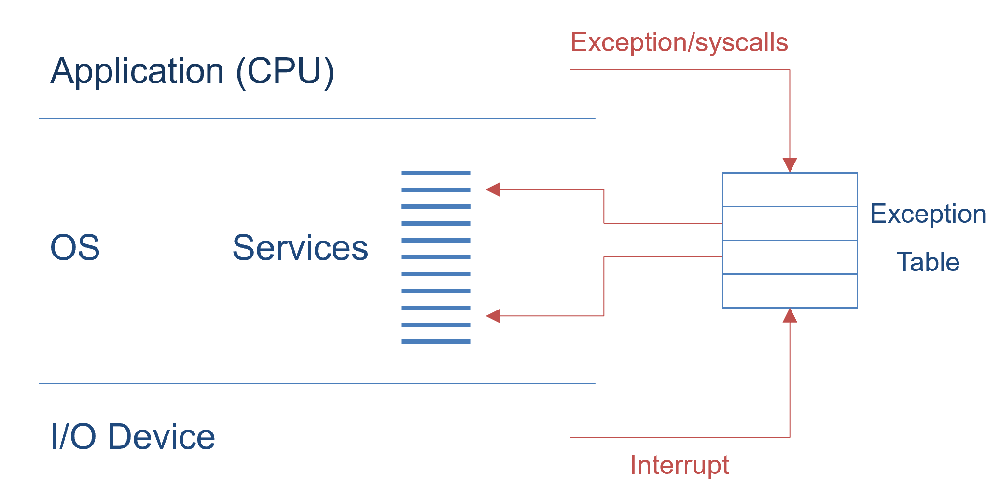
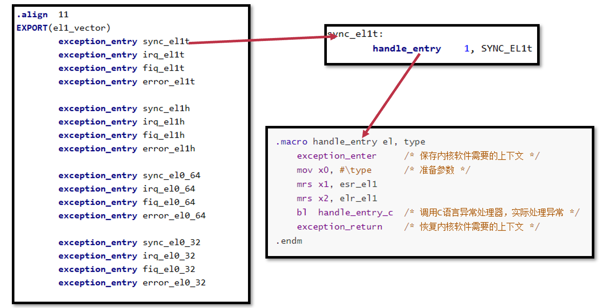
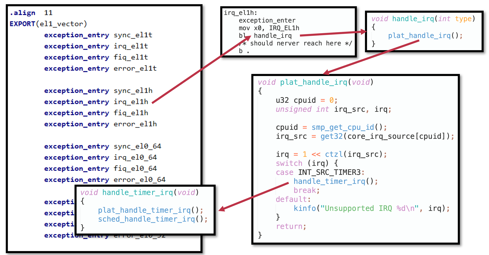

[TOC]

# 中断、异常与系统调用

CPU执行逻辑：以PC值位地址从内存中获取一条指令并执行；但是执行过程中可能发生“异常”情况

希望尽量减少的切换：进程切换，用户态和内核态的切换......（对用户态而言这些切换并没有收益！只有开销）

## ARM的异常

- 同步异常：指令执行出现错误，比如除零或缺页
- 异步异常：外部设备触发中断

在ARM中这两种情况都叫做异常（与x86区分），都会导致CPU陷入内核态，并根据异常向量表找到对应的处理函数来执行；处理函数执行完后，执行流需要恢复到之前被打断的地方继续运行

## 操作系统对异常的处理

1. 对异常向量表的设置（CPU上电后立即执行，是系统初始化的主要工作之一；在开启中断和启动第一个应用之前）
2. 实现对不同异常（中断）的处理函数
   - 处理应用程序出错的情况（如除零、缺页）
   - 特殊的同步异常：系统调用（应用主动触发）
   - 外部设备的中断（收取网络包、获取键盘输入）

**内核自己运行出错怎么办？**

可恢复的：直接处理；不可恢复的：crush dump（留下遗言之后崩溃）

### 异常向量表

操作系统预先在一张表中准备好不同类型的异常处理函数（基地址存储在VBAR_EL1寄存器；处理器在异常发生时自动跳转到对应位置）

### 异常处理函数

- 运行在内核态：不受限制访问所有资源
- 处理器将异常类型存储在指定寄存器中（ESR_EL1），表明发生了哪种异常
- 异常处理函数根据异常类型执行不同逻辑
- 完成异常处理后
  - 回到发生异常时正在执行/下一条指令
  - 结束当前进程

### AArch64中断处理

### ChCore异常处理

**ChCore异常向量表配置**

**ChCore异常处理**

**ChCore的中断处理与时钟响应**

## 内核态与用户态的切换

### 处理器在切换过程中的任务

1. 将发生异常事件的指令地址保存在ELR_EL1中
2. 将异常事件的原因保存在ESR_EL1
   - 例如，是执行svc指令导致的，还是访存缺页导致的
3. 将处理器的当前状态（即PSTATE）保存在SPSR_EL1
4. 将引发缺页异常的内存地址保存在FAR_EL1
5. 栈寄存器不再使用SP_EL0（用户态栈寄存器），开始使用SP_EL1
   - 内核态栈寄存器，需要由操作系统提前设置
6. 修改PSTATE寄存器中的特权级标志位，设置为内核态
7. 找到异常处理函数的入口地址，并将该地址写入PC，开始运行操作系统
   - 根据VBAR_EL1寄存器中保存的异常向量表基地址，以及发生异常事件的类型确定

**操作系统为何不能直接使用应用程序在用户态的栈？**

用户态不可信，避免用户态在栈中恶意插入代码等，导致内核态出现问题

### 操作系统在切换过程中的任务

- 主要任务：将属于应用程序的 CPU 状态保存到内存中
  - 用于之后恢复应用程序继续运行
- 应用程序需要保存的运行状态称为处理器上下文
  - 处理器上下文（Processor Context）：应用程序在完成切换后恢复执行所需的最小处理器状态集合
  - 处理器上下文中的寄存器具体包括：通用寄存器 X0-X30；特殊寄存器，主要包括PC、SP和PSTATE；系统寄存器，包括页表基地址寄存器等

## 系统调用

`svc`（supervisor call）：从用户态进入内核态

`eret`：从内核态返回到用户态

参数传递：最多允许8个参数（x0-x7寄存器），x8用于存放系统调用编号，调用者保存的寄存器在用户态保存

返回值：存放在x0寄存器中

**内核自己能够调用 syscall 吗？**

可以，不需要换栈，直接调对应的处理函数就行

**为什么还要存放系统调用的编号，而不直接放到异常向量表里面？**

硬件无关：操作系统具体实现多少个系统调用与处理器无关，处理器只负责提供对应机制

额外开销：通过编号获取系统调用基地址，进行跳转

**寄存器参数放不下怎么办？**

内存传参：将参数放在内存中，将指针放在寄存器中传给内核，内核通过指针访问相关参数

- 指针指向内核区域，不安全
- 指针指向的区域被swap-out，导致内核访问的时候出现page fault
- 指针指向未映射区域，导致segmentation fault

**如何验证传过来指针的合法性（用户态恶意攻击）？**

检查判断是否在最大的VMA（通过mmap创建的虚拟内存空间）

### 优化：syscall 能否不要下陷（Trap）

#### vDSO（virtual dynamic shared object）

系统调用的时延不可忽略（尤其是在频繁调用的部分，比如 `gettimeofday()` ）；想要降低时延，希望不要用户态到内核态的模式切换（没有这种切换就不需要保存和恢复状态）

- 内核定义：在编译时作为内核的一部分
- 用户态运行：共享内存（将对应函数代码加载到一块与应用共享的内存页，这个页称为vDSO），用户态可读（只读），内核态可写（更新对应值）【类似生产者-消费者模式】

#### Flex-SC（flexible system call scheduling with exception-less system calls）

目的：进一步降低系统调用的时延（同时切换后内核态也污染了用户态本来用的cache），希望在不切换状态的情况下实现系统调用

思想：syscall的时候并不直接切换到内核，而是把所有syscall的参数放到一个和内核共享的页里面；内核通过共享页上的参数执行对应syscall，并把返回结果写在共享页上返回给用户

方式：新的syscall机制

- 引入 system call page，用户和内核共享
- 用户线程可以将系统调用请求参数 push 到 system call page（用户写）
- 内核态线程到 system call page pull 系统调用请求（内核读，内核写返回值）
- Exception-less syscall：将系统调用的调用和执行解耦，可以分不到不同的CPU核并行处理
- 一次性可以等很多系统调用堆积之后，再一次性让内核态线程 pull，实现批处理
- 用户和内核线程可以运行在不同CPU核上，没有切换带来的开销

适合的应用：如Apache服务器适合；同步调用变成异步调用，适合系统调用多的情况，可以提升吞吐量，不适合对时延敏感的应用

缺点：优化之后用户和内核线程在两个核（原本在同一个核，相互切换），内存访问时**对于 L1 L2 cache（cpu private）的利用变差**（本来 page 中参数刚放进缓存就被取出来，现在必须在page的level，因为cache不共用）；甚至如果在不同CPU的不同核上，就更大的读写内存开销，很难利用cache